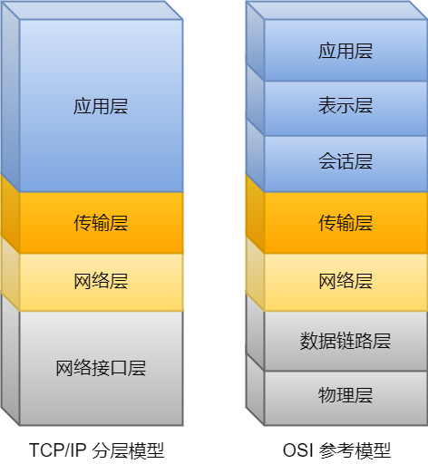
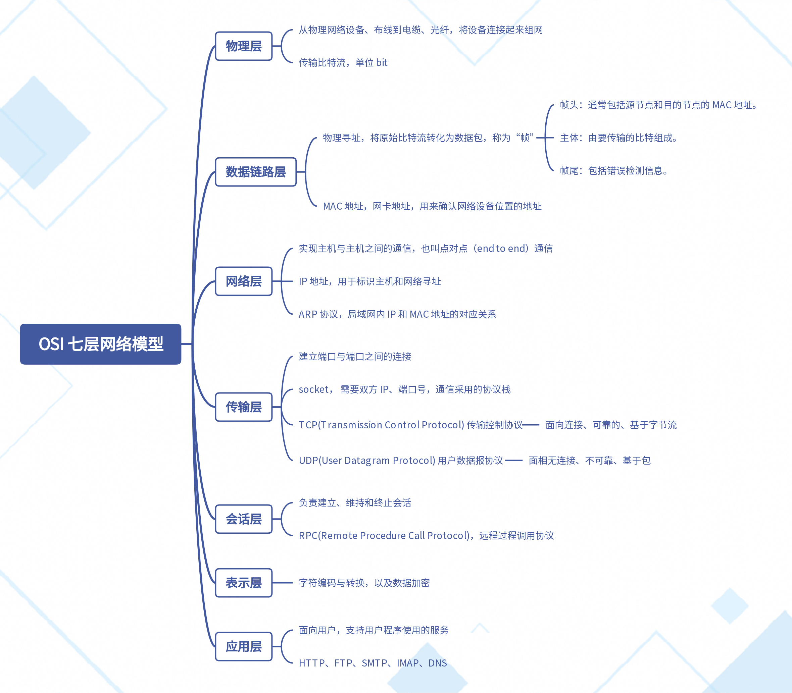
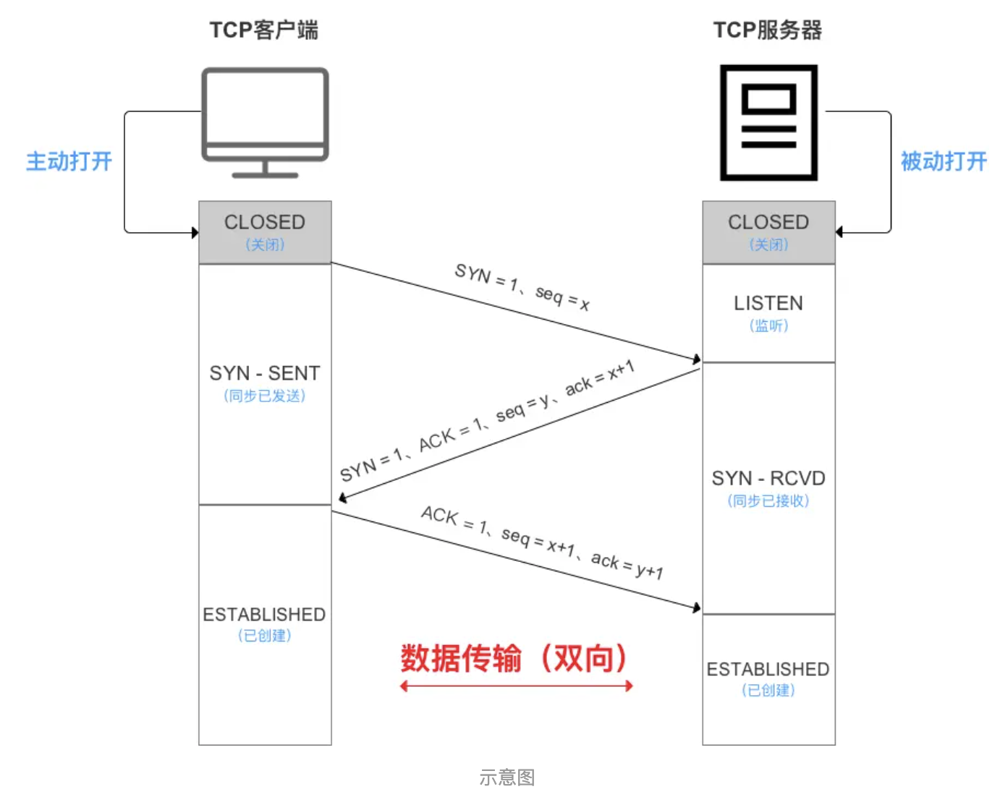
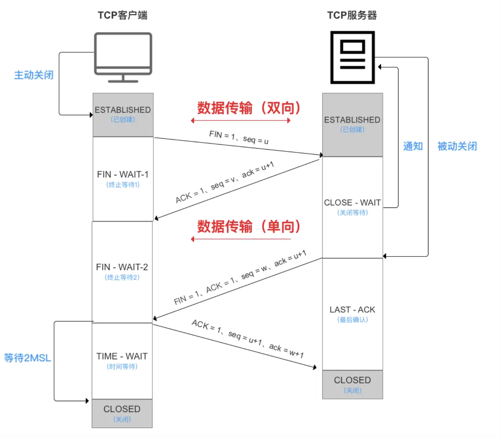

# TCP 基础

## 网络模型




### OSI 七层网络模型



## TCP 协议

TCP 是**面向连接的、可靠的、基于字节流**的传输层通信协议。

- **面向连接**：一定是「一对一」才能连接，不能像 UDP 协议可以一个主机同时向多个主机发送消息，也就是一对多是无法做到的；
- **可靠的**：无论的网络链路中出现了怎样的链路变化，TCP 都可以保证一个报文一定能够到达接收端；
- **字节流**：用户消息通过 TCP 协议传输时，消息可能会被操作系统「分组」成多个的 TCP 报文，如果接收方的程序如果不知道「消息的边界」，是无法读出一个有效的用户消息的。并且 TCP 报文是「有序的」，当「前一个」TCP 报文没有收到的时候，即使它先收到了后面的 TCP 报文，那么也不能扔给应用层去处理，同时对「重复」的 TCP 报文会自动丢弃。

### 三次握手



- 从最开始双方都处于`CLOSED`状态。然后服务端开始监听某个端口，进入了`LISTEN`状态。
- 然后客户端主动发起连接，发送 SYN , 自己变成了`SYN-SENT`状态。
- 服务端接收到，返回`SYN`和`ACK`(对应客户端发来的SYN)，自己变成了`SYN-REVD`。
- 之后客户端再发送`ACK`给服务端，自己变成了`ESTABLISHED`状态；服务端收到`ACK`之后，也变成了`ESTABLISHED`状态。

#### 为什么不是两次或四次？

两次：无法确认客户端的接收能力。

分析如下:

如果是两次，你现在发了 SYN 报文想握手，但是这个包**滞留**在了当前的网络中迟迟没有到达，TCP 以为这是丢了包，于是重传，两次握手建立好了连接。

看似没有问题，但是连接关闭后，如果这个**滞留**在网路中的包到达了服务端呢？这时候由于是两次握手，服务端只要接收到然后发送相应的数据包，就默认**建立连接**，但是现在客户端已经断开了。

四次：三次就已经足够能确定客户端和服务端的发送接收能力，不需要更多次。

### 四次挥手



- 刚开始双方处于`ESTABLISHED`状态。
- 客户端要断开了，向服务器发送 `FIN` 报文，发送后客户端变成了`FIN-WAIT-1`状态。注意, 这时候客户端同时也变成了`half-close(半关闭)`状态，即无法向服务端发送报文，只能接收。
- 服务端接收后向客户端确认，变成了`CLOSED-WAIT`状态。
- 客户端接收到了服务端的确认，变成了`FIN-WAIT2`状态。
- 随后，服务端向客户端发送`FIN`，自己进入`LAST-ACK`状态，
- 客户端收到服务端发来的`FIN`后，自己变成了`TIME-WAIT`状态，然后发送 ACK 给服务端。

注意了，这个时候，客户端需要等待足够长的时间，具体来说，是 2 个 `MSL`(`Maximum Segment Lifetime，报文最大生存时间`), 在这段时间内如果客户端没有收到服务端的重发请求，那么表示 ACK 成功到达，挥手结束，否则客户端重发 ACK。

### 等待2MSL的意义

如果不等待会怎样？

如果不等待，客户端直接跑路，当服务端还有很多数据包要给客户端发，且还在路上的时候，若客户端的端口此时刚好被新的应用占用，那么就接收到了无用数据包，造成数据包混乱。所以，最保险的做法是等服务器发来的数据包都死翘翘再启动新的应用。

那，照这样说一个 MSL 不就不够了吗，为什么要等待 2 MSL?

- 确保四次挥手中主动关闭方最后的 ACK 报文最终能达到对端。因为这最后一个 ACK 确认包可能会丢失，然后服务器就会超时重传第三次挥手的 FIN 包，然后客户端再重传一次第四次挥手的 ACK 报文，**从发送 ACK，到超时重传，到再次接收 FIN，最长不会超过 2MSL**， 如果等待 2MSL 之后没有收到超时重传的 FIN，则证明服务器正常收到 ACK 并关闭连接了。如果没有这 2MSL，客户端发送完最后一个 ACK 数据包后直接关闭连接，那么就接收不到服务器超时重传的 FIN 信息包，那么服务器就不能按正常步骤进入close状态。那么就会耗费服务器的资源。当网络中存在大量的 timewait 状态，那么服务器的压力可想而知。
- 确保对端没有收到 ACK 重传的 FIN 报文可以到达。在第四次挥手后，经过 2MSL 的时间足以让本次连接产生的所有报文段都从网络中消失，这样下一次新的连接中就肯定不会出现旧连接的报文段了。

这就是等待 2MSL 的意义。

### 服务器出现大量 TIME_WAIT 状态的原因有哪些？

如果服务器出现大量的 TIME_WAIT 状态的 TCP 连接，就是说明服务器主动断开了很多 TCP 连接。

可能有三个原因：

1. HTTP 没有使用长连接。

在 HTTP/1.0 中默认是关闭的，如果浏览器要开启 Keep-Alive，它必须在请求的 header 中添加：

```http
Connection: Keep-Alive
```

但是现在大部分浏览器默认的都是 HTTP/1.1，默认是开启的 Keep-Alive，所以 Keep-Alive 都是默认打开的。一旦客户端和服务端达成协议，那么长连接就建立好了。

如果要关闭 HTTP Keep-Alive，需要在 HTTP 请求或者响应的 header 里添加 `Connection:close` 信息，也就是说，**只要客户端和服务端任意一方的 HTTP header 中有 `Connection:close` 信息，那么就无法使用 HTTP 长连接的机制**。

**当服务端出现大量的 TIME_WAIT 状态连接的时候，可以排查下是否客户端和服务端都开启了 HTTP Keep-Alive**，因为任意一方没有开启 HTTP Keep-Alive，都会导致服务端在处理完一个 HTTP 请求后，就主动关闭连接，此时服务端上就会出现大量的 TIME_WAIT 状态的连接。

2. HTTP 长连接超时。

HTTP 长连接的特点是，只要任意一端没有明确提出断开连接，则保持 TCP 连接状态。HTTP 长连接可以在同一个 TCP 连接上接收和发送多个 HTTP 请求/应答，避免了连接建立和释放的开销。但是有可能客户端建立连接之后只请求一次就再也不请求了，为了避免资源浪费，web 服务软件一般都会提供一个参数，用来指定 HTTP 长连接的超时时间，比如 nginx 提供的 keepalive_timeout 参数。

假设设置了 HTTP 长连接的超时时间是 60 秒，nginx 就会启动一个「定时器」，**如果客户端在完后一个 HTTP 请求后，在 60 秒内都没有再发起新的请求，定时器的时间一到，nginx 就会触发回调函数来关闭该连接，那么此时服务端上就会出现 TIME_WAIT 状态的连接**。

3. HTTP 长连接的请求数量达到上限。

Web 服务端通常会有个参数，来定义一条 HTTP 长连接上最大能处理的请求数量，当超过最大限制时，就会主动关闭连接。

比如 nginx 的 `keepalive_requests` 这个参数，这个参数是指一个 HTTP 长连接建立之后，nginx 就会为这个连接设置一个计数器，记录这个 HTTP 长连接上已经接收并处理的客户端请求的数量。**如果达到这个参数设置的最大值时，则 nginx 会主动关闭这个长连接**，那么此时服务端上就会出现 TIME_WAIT 状态的连接。

keepalive_requests 参数的默认值是 100 ，意味着每个 HTTP 长连接最多只能跑 100 次请求，**对于一些 QPS 比较高的场景，比如超过 10000 QPS，甚至达到 30000 , 50000 甚至更高，如果 keepalive_requests 参数值是 100，这时候就 nginx 就会很频繁地关闭连接，那么此时服务端上就会出大量的 TIME_WAIT 状态**。

针对这个场景下，解决的方式也很简单，调大 nginx 的 keepalive_requests 参数就行。


## UDP 协议

UDP 不提供复杂的控制机制，利用 IP 提供面向「无连接」的通信服务。

**TCP 和 UDP 区别：**

*1. 连接*

- TCP 是面向连接的传输层协议，传输数据前先要建立连接。
- UDP 是不需要连接，即刻传输数据。

*2. 服务对象*

- TCP 是一对一的两点服务，即一条连接只有两个端点。
- UDP 支持一对一、一对多、多对多的交互通信

*3. 可靠性*

- TCP 是可靠交付数据的，数据可以无差错、不丢失、不重复、按序到达。
- UDP 是尽最大努力交付，不保证可靠交付数据。但是我们可以基于 UDP 传输协议实现一个可靠的传输协议，比如 QUIC 协议，具体可以参见这篇文章：[如何基于 UDP 协议实现可靠传输？(opens new window)](https://xiaolincoding.com/network/3_tcp/quic.html)

*4. 拥塞控制、流量控制*

- TCP 有拥塞控制和流量控制机制，保证数据传输的安全性。
- UDP 则没有，即使网络非常拥堵了，也不会影响 UDP 的发送速率。

*5. 首部开销*

- TCP 首部长度较长，会有一定的开销，首部在没有使用「选项」字段时是 `20` 个字节，如果使用了「选项」字段则会变长的。
- UDP 首部只有 8 个字节，并且是固定不变的，开销较小。

*6. 传输方式*

- TCP 是流式传输，没有边界，但保证顺序和可靠。
- UDP 是一个包一个包的发送，是有边界的，但可能会丢包和乱序。

*7. 分片不同*

- TCP 的数据大小如果大于 MSS 大小，则会在传输层进行分片，目标主机收到后，也同样在传输层组装 TCP 数据包，如果中途丢失了一个分片，只需要传输丢失的这个分片。
- UDP 的数据大小如果大于 MTU 大小，则会在 IP 层进行分片，目标主机收到后，在 IP 层组装完数据，接着再传给传输层。

**TCP 和 UDP 应用场景：**

由于 TCP 是面向连接，能保证数据的可靠性交付，因此经常用于：

- `FTP` 文件传输；
- HTTP / HTTPS；

由于 UDP 面向无连接，它可以随时发送数据，再加上 UDP 本身的处理既简单又高效，因此经常用于：

- 包总量较少的通信，如 `DNS` 、`SNMP` 等；
- 视频、音频等多媒体通信；
- 广播通信；