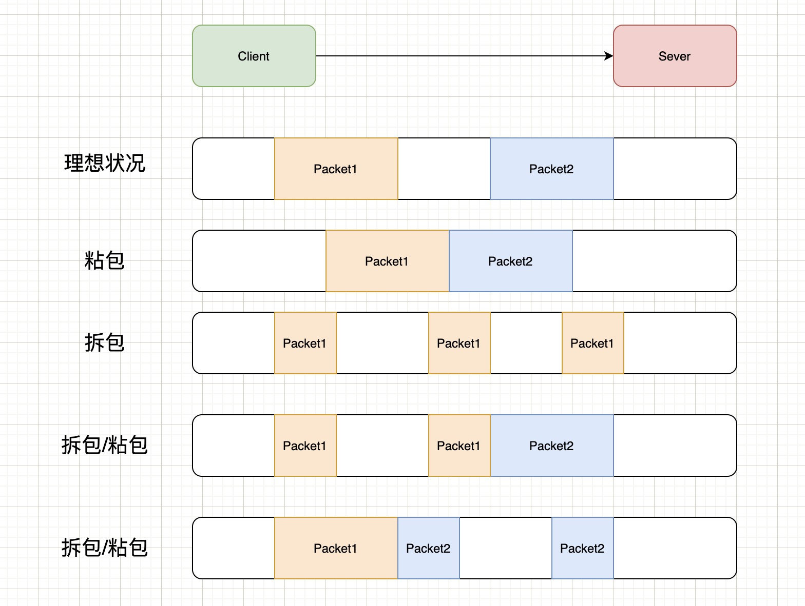

# TCP 协议之粘包拆包

## TCP 粘包拆包的原因

TCP 是一个面向「流」的协议，所谓流就是没有界限的一长串二进制数据。TCP 作为传输层协议并不了解上层业务数据的具体含义，它会根据TCP缓冲区的实际情况进行数据包的划分，所以在业务上认为是一个完整的包，可能会被 TCP 拆分成多个包进行发送，也有可能把多个小的包封装成一个大的数据包发送，这就会出现粘包拆包的问题。

例如，TCP缓冲区是1024个字节大小，如果应用一次请求发送的数据量比较小，没达到缓冲区大小，TCP则会将多个请求合并为同一个请求进行发送，站在业务上来看这就是「粘包」;

如果应用一次请求发送的数据量比较大，超过了缓冲区大小，TCP就会将其拆分为多次发送，这就是「拆包」，也就是将一个大的包拆分为多个小包进行发送。





- 正常的理想情况，两个包恰好满足TCP缓冲区的大小或达到TCP等待时长，分别发送两个包；
- 粘包：两个包较小，间隔时间短，发生粘包，合并成一个包发送；
- 拆包：一个包过大，超过缓冲区大小，拆分成两个或多个包发送；
- 拆包和粘包：Packet1过大，进行了拆包处理，而拆出去的一部分又与Packet2进行粘包处理。


## 粘包拆包的解决方法

粘包的问题出现是因为不知道一个用户消息的边界在哪，如果知道了边界在哪，接收方就可以通过边界来划分出有效的用户消息。

一般有三种方式分包的方式：

- 固定长度的消息；
- 特殊字符作为边界；
- 自定义消息结构。

### 固定长度的消息

这种是最简单方法，即每个用户消息都是固定长度的，比如规定一个消息的长度是 64 个字节，当接收方接满 64 个字节，就认为这个内容是一个完整且有效的消息。

但是这种方式灵活性不高，实际中很少用。

### 特殊字符作为边界

我们可以在两个用户消息之间插入一个特殊的字符串，这样接收方在接收数据时，读到了这个特殊字符，就把认为已经读完一个完整的消息。

### 自定义消息结构

可以定义一个通用的数据结构，比如：数据包头长度+数据包头数据（包含包数据长度）+ 数据。

```go 
package packet

import (
	"bytes"
	"encoding/binary"
	"fmt"
	"io"
	"net"
)

type Header struct {
	HeaderLength  uint16 // 头长度
	MessageLength uint16 // 消息长度
	MessageType   uint16
}

func NewHeader(headerLength uint16, msgLength uint16, messageType uint16) Header {
	h := Header{
		HeaderLength:  headerLength,
		MessageLength: msgLength,
		MessageType:   messageType,
	}
	return h
}

func (h *Header) GetHeaderLength() uint16 {
	return h.HeaderLength
}

func (h *Header) GetMessageLength() uint16 {
	return h.MessageLength
}

// Pack 协议头封包
func (h *Header) Pack() ([]byte, error) {
	var buf bytes.Buffer
	err := binary.Write(&buf, binary.LittleEndian, h)
	return buf.Bytes(), err
}

func (h *Header) UnPack(d []byte) error {
	buf := bytes.NewBuffer(d)
	return binary.Read(buf, binary.LittleEndian, h)
}

type Packet struct {
	Header       Header
	Data         []byte
	PacketLength uint32
}

func NewPacket(header Header, d []byte) Packet {
	return Packet{
		Header: header,
		Data:   d,
	}
}

// Encode 将消息编码为字节数组
func (p *Packet) Encode() ([]byte, error) {
	buffer := new(bytes.Buffer)

	// 写入HeaderLength
	if err := binary.Write(buffer, binary.LittleEndian, p.Header.HeaderLength); err != nil {
		return nil, err
	}

	// 写入Header
	if err := binary.Write(buffer, binary.LittleEndian, p.Header); err != nil {
		return nil, err
	}

	// 写入Data
	if err := binary.Write(buffer, binary.LittleEndian, p.Data); err != nil {
		return nil, err
	}

	return buffer.Bytes(), nil
}

// DecodePacket 从字节数组解码消息
func DecodePacket(conn net.Conn) (*Packet, error) {
	p := &Packet{}

	var headerLength uint16
	// 读取 HeaderLength，可以根据该长度读取 header，uint16 自动转换成 2 个字节的大小
	if err := binary.Read(conn, binary.LittleEndian, &headerLength); err != nil {
		if err == io.EOF {
			return nil, nil // 连接已关闭，返回 nil 表示正常情况
		}
		return nil, fmt.Errorf("read HeaderLength error:%v", err)
	}

	fmt.Printf("DecodePacket headerLength:%v\n", headerLength)

	h := Header{HeaderLength: headerLength}

	buf := bytes.NewBuffer(make([]byte, headerLength))

	// 读取 headerLength 长度的 bytes
	if _, err := io.ReadFull(conn, buf.Bytes()); err != nil {
		return nil, fmt.Errorf("read Header error: %v", err)
	}
	// 解析到 header 结构体
	if err := binary.Read(buf, binary.LittleEndian, &h); err != nil {
		return nil, fmt.Errorf("unPack header error: %v", err)
	}

	p.Header = h
	// 读取包数据，根据 header 中的数据长度读取
	p.Data = make([]byte, p.Header.GetMessageLength())
	fmt.Printf("DecodePacket messageLength:%v\n", p.Header.GetMessageLength())

	// 读取包数据
	if err := binary.Read(conn, binary.LittleEndian, &p.Data); err != nil {
		return nil, fmt.Errorf("read packet data error: %v", err)
	}
	return p, nil
}

```

DecodePacket 函数里，先解包出 header 的长度，再根据 header 的长度获取到 header，最后根据 header 字段里的 message 长度获取 message 的数据。**这样 header 的数据结构是可变的，增加字段可以兼容老版本（减少字段则不行），只需要传入特定的 headerLength 即可。**

服务端：

```go
package main

import (
	"fmt"
	"net"
	"test/code/test/packet/p"
)

func handleConnection(conn net.Conn) {
	defer conn.Close()

	for {
		message, err := packet.DecodePacket(conn)
		if err != nil {
			fmt.Println("Failed to decode message:", err)
			return
		}
		if message != nil {
			fmt.Printf("Received message: %s messageType: %v headerLength:%v \n", message.Data, message.Header.MessageType, message.Header.HeaderLength)
		}
	}
}

func main() {
	listener, err := net.Listen("tcp", ":8080")
	if err != nil {
		fmt.Println("Failed to start server:", err)
		return
	}
	defer listener.Close()

	fmt.Println("Server is listening on port 8080")

	for {
		conn, err := listener.Accept()
		if err != nil {
			fmt.Println("Failed to accept connection:", err)
			continue
		}

		go handleConnection(conn)
	}
}
```

客户端：

```go
package main

import (
	"fmt"
	"net"
	packet "test/code/test/packet/p"
	"unsafe"
)

func main() {
	conn, err := net.Dial("tcp", "localhost:8080")
	if err != nil {
		fmt.Println("Failed to connect to server:", err)
		return
	}
	defer conn.Close()

	data := "Hello, Server!"
	headerLength := unsafe.Sizeof(packet.Header{})

	fmt.Printf("client headerLength:%v\n", headerLength)
	h := packet.NewHeader(uint16(headerLength), uint16(len(data)), 1)
	p := packet.NewPacket(h, []byte(data))

	encodedMessage, err := p.Encode()
	if err != nil {
		fmt.Println("Failed to encode message:", err)
		return
	}

	_, err = conn.Write(encodedMessage)
	if err != nil {
		fmt.Println("Failed to send message:", err)
		return
	}

	fmt.Println("Message sent:", data)
}
```


