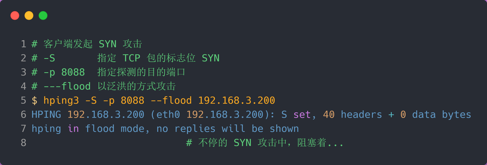

# TCP 半连接队列和全连接队列

参考 [TCP 半连接队列和全连接队列](https://www.xiaolincoding.com/network/3_tcp/tcp_queue.html#%E4%BB%80%E4%B9%88%E6%98%AF-tcp-%E5%8D%8A%E8%BF%9E%E6%8E%A5%E9%98%9F%E5%88%97%E5%92%8C%E5%85%A8%E8%BF%9E%E6%8E%A5%E9%98%9F%E5%88%97)

## 什么是半连接队列和全连接队列

- 半连接队列，也称 SYN 队列；
- 全连接队列，也称 accept 队列；

服务端收到客户端发起的 SYN 请求后，**内核会把该连接存储到半连接队列**，并向客户端响应 SYN+ACK，接着客户端会返回 ACK，服务端收到第三次握手的 ACK 后，**内核会把连接从半连接队列移除，然后创建新的完全的连接，并将其添加到 accept 队列，等待进程调用 accept 函数时把连接取出来。**

## TCP 全连接队列

在服务端可以使用 `ss` 命令，来查看 TCP 全连接队列的情况

**当服务端并发处理大量请求时，如果 TCP 全连接队列过小，就容易溢出。发生 TCP 全连接队溢出的时候，后续的请求就会被丢弃，这样就会出现服务端请求数量上不去的现象。**

tcp_abort_on_overflow 共有两个值分别是 0 和 1，其分别表示：

- 0 ：如果全连接队列满了，那么 server 扔掉 client 发过来的 ack ；
- 1 ：如果全连接队列满了，server 发送一个 `reset` 包给 client，表示废掉这个握手过程和这个连接；

**TCP 全连接队列的最大值取决于 somaxconn 和 backlog 之间的最小值，也就是 min(somaxconn, backlog)**

- `somaxconn` 是 Linux 内核的参数，默认值是 128，可以通过 `/proc/sys/net/core/somaxconn` 来设置其值；
- `backlog` 是 `listen(int sockfd, int backlog)` 函数中的 backlog 大小，Nginx 默认值是 511，可以通过修改配置文件设置其长度；

**如果持续不断地有连接因为 TCP 全连接队列溢出被丢弃，就应该调大 backlog 以及 somaxconn 参数。**

## TCP 半连接队列溢出

模拟 TCP 半连接溢出场景不难，实际上就是对服务端一直发送 TCP SYN 包，但是不回第三次握手 ACK，这样就会使得服务端有大量的处于 `SYN_RECV` 状态的 TCP 连接。

这其实也就是所谓的 SYN 洪泛、SYN 攻击、DDos 攻击。

- 当 max_syn_backlog > min(somaxconn, backlog) 时， 半连接队列最大值 max_qlen_log = min(somaxconn, backlog) * 2;
- 当 max_syn_backlog < min(somaxconn, backlog) 时， 半连接队列最大值 max_qlen_log = max_syn_backlog * 2;

**开启 syncookies 功能就可以在不使用 SYN 半连接队列的情况下成功建立连接**

syncookies 是这么做的：服务器根据当前状态计算出一个值，放在己方发出的 SYN+ACK 报文中发出，当客户端返回 ACK 报文时，取出该值验证，如果合法，就认为连接建立成功，如下图所示。

syncookies 参数主要有以下三个值：

- 0 值，表示关闭该功能；
- 1 值，表示仅当 SYN 半连接队列放不下时，再启用它；
- 2 值，表示无条件开启功能；

### 几种防御 SYN 攻击的方法

- 增大半连接队列；
- 开启 tcp_syncookies 功能
- 减少 SYN+ACK 重传次数

**要想增大半连接队列，不能只单纯增大 tcp_max_syn_backlog 的值，还需一同增大 somaxconn 和 backlog，也就是增大全连接队列**

