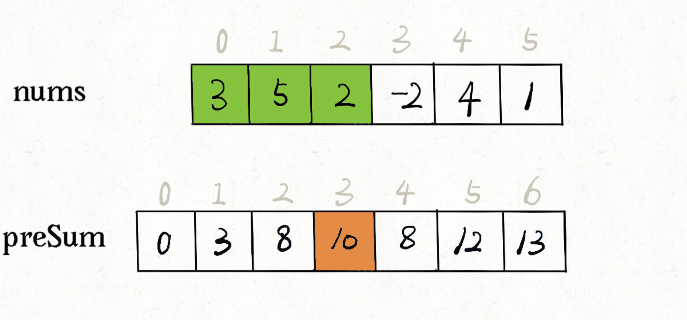
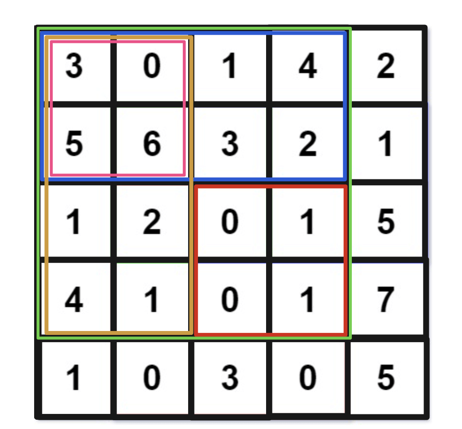
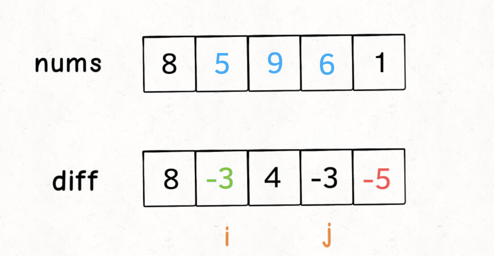

# 前缀和&差分数组

参考

[小而美的算法技巧：前缀和数组](https://labuladong.gitee.io/algo/2/21/56/)

[小而美的算法技巧：差分数组](https://labuladong.gitee.io/algo/2/21/57/)

## 前缀和

### 简介

前缀和技巧适用于快速、频繁地计算一个索引区间内的元素之和。

先看一题：

[303. 区域和检索 - 数组不可变（简单）](https://leetcode-cn.com/problems/range-sum-query-immutable/)

> 给定一个整数数组  nums，求出数组从索引 i 到 j（i ≤ j）范围内元素的总和，包含 i、j 两点。
>
> 实现 NumArray 类：
>
> NumArray(int[] nums) 使用数组 nums 初始化对象
> int sumRange(int i, int j) 返回数组 nums 从索引 i 到 j（i ≤ j）范围内元素的总和，包含 i、j 两点（也就是 sum(nums[i], nums[i + 1], ... , nums[j])）

`sumRange` 函数需要计算并返回一个索引区间之内的元素和，可以使用前缀和方法来计算：

```go
type NumArray struct {
    // 前缀和数组
    PrefixSum []int
}


func Constructor(nums []int) NumArray {
    prefixSum := make([]int, len(nums)+1)
    // preSum[0] = 0，便于计算累加和
    prefixSum[0] = 0
    // 计算 nums 的累加和
    for i := 1; i < len(nums)+1; i++ {
        prefixSum[i] = prefixSum[i-1] + nums[i-1]
    }
    return NumArray{PrefixSum: prefixSum}
}

/* 查询闭区间 [left, right] 的累加和 */
func (this *NumArray) SumRange(left int, right int) int {
    return this.PrefixSum[right+1]-this.PrefixSum[left]
}
```

应该比较好理解。核心思路是我们 new 一个新的数组 `preSum` 出来，`preSum[i]` 记录 `nums[0..i-1]` 的累加和，看图 10 = 3 + 5 + 2：



看这个 `preSum` 数组，如果我想求索引区间 `[1, 4]` 内的所有元素之和，就可以通过 `preSum[5] - preSum[1]` 得出。

这样，`sumRange` 函数仅仅需要做一次减法运算，避免了每次进行 for 循环调用，最坏时间复杂度为常数 `O(1)`。

前缀和系列要介绍的题：

[304. 二维区域和检索 - 矩阵不可变（中等）](https://leetcode-cn.com/problems/range-sum-query-2d-immutable)

[560. 和为K的子数组（中等）](https://leetcode-cn.com/problems/subarray-sum-equals-k)


### 题目解析

#### 二维区域和检索 - 矩阵不可变

> 给定一个二维矩阵 matrix，以下类型的多个请求：
>
> 计算其子矩形范围内元素的总和，该子矩阵的 左上角 为 (row1, col1) ，右下角 为 (row2, col2) 。
> 实现 NumMatrix 类：
>
> NumMatrix(int[][] matrix) 给定整数矩阵 matrix 进行初始化
> int sumRegion(int row1, int col1, int row2, int col2) 返回 左上角 (row1, col1) 、右下角 (row2, col2) 所描述的子矩阵的元素 总和 。

解析：



如果我想计算红色的这个子矩阵的元素之和，可以用绿色矩阵减去蓝色矩阵减去橙色矩阵最后加上粉色矩阵，而绿蓝橙粉这四个矩阵有一个共同的特点，就是左上角就是 `(0, 0)` 原点。

那么我们可以维护一个二维数组 ，专门记录以原点为顶点的矩阵的元素之和，就可以用几次加减运算算出任何一个子矩阵的元素和。

而上图中最大的绿色矩阵 `[0,0,3,3]` 的面积就等于 `[0,0,3,2] + [0,0,2,3] - [0,0,2,2] + matrix[3,3]`，即左边矩形面积 + 上面矩形面积 - 左上角矩形面积 + 当前元素。


#### 和为 K 的子数组

> 给你一个整数数组 `nums` 和一个整数 `k` ，请你统计并返回该数组中和为 `k` 的连续子数组的个数。

解析：

这题也是先求前缀和，然后循环把每段子数组之后求出来（即前缀和数组循环相减），看有哪些符合条件。


### 代码

#### 二维区域和检索 - 矩阵不可变

```go
type NumMatrix struct {
    PrefixSum [][]int
}


func Constructor(matrix [][]int) NumMatrix {
    n, m := len(matrix), len(matrix[0])
    ps := make([][]int, n+1)
    for i := range ps {
        ps[i] = make([]int, m+1)
    }

    for i := 1; i < n+1; i++ {
        for j := 1; j < m+1; j++ {
            ps[i][j] = ps[i-1][j] + ps[i][j-1] - ps[i-1][j-1] + matrix[i-1][j-1]
        }
    }
    return NumMatrix{PrefixSum: ps}
}


func (this *NumMatrix) SumRegion(row1 int, col1 int, row2 int, col2 int) int {
    return this.PrefixSum[row2+1][col2+1] - this.PrefixSum[row2+1][col1] - this.PrefixSum[row1][col2+1]+ this.PrefixSum[row1][col1]

}
```


#### 和为 K 的子数组

```go
func subarraySum(nums []int, k int) int {
    ps := make([]int, len(nums)+1)

    for i := 1; i < len(nums)+1; i++ {
        ps[i] = ps[i-1] + nums[i-1]
    }
    var count int
    for i := len(ps)-1; i > 0; i-- {
        for j := i-1; j >= 0; j-- {
            if ps[i]-ps[j] == k {
                count++
            }
        }
    }
    return count
}
```


## 差分数组

### 简介

**前缀和主要适用的场景是原始数组不会被修改的情况下，频繁查询某个区间的累加和**。**而差分数组的主要适用场景是频繁对原始数组的某个区间的元素进行增减**。

差分数组：我们先对 `nums` 数组构造一个 `diff` 差分数组，**`diff[i]` 就是 `nums[i]` 和 `nums[i-1]` 之差**：

```go
diff[0] = nums[0]
for i := 1; i < len(nums); i++ {
  diff[i] = nums[i] - nums[i-1]
}
```

通过这个 `diff` 差分数组是可以反推出原始数组 `nums` 的，代码逻辑如下：

```go
res[0] = diff[0]
for i := 1; i < len(diff); i++) {
    res[i] = res[i - 1] + diff[i]
}
```

**这样构造差分数组 `diff`，就可以快速进行区间增减的操作**，如果你想对区间 `nums[i..j]` 的元素全部加 3，那么只需要让 `diff[i] += 3`，然后再让 `diff[j+1] -= 3` 即可。



**原理很简单，回想 `diff` 数组反推 `nums` 数组的过程，`diff[i] += 3` 意味着给 `nums[i..]` 所有的元素都加了 3（比如 diff[1] += 3，那么 res[1] 也 +3，由于 res 后面的元素都要依赖前面，所以 1 后面的元素都 +3 了），然后 `diff[j+1] -= 3` 又意味着对于 `nums[j+1..]` 所有元素再减 3，那综合起来，是不是就是对 `nums[i..j]` 中的所有元素都加 3 了**？

只要花费 O(1) 的时间修改 `diff` 数组，就相当于给 `nums` 的整个区间做了修改。多次修改 `diff`，然后通过 `diff` 数组反推，即可得到 `nums` 修改后的结果。


差分数组系列要介绍的题：

[1109. 航班预订统计（中等）](https://leetcode-cn.com/problems/corporate-flight-bookings/)

[1094. 拼车（中等）](https://leetcode-cn.com/problems/car-pooling/)

### 题目解析

#### 航班预订统计

> 这里有 n 个航班，它们分别从 1 到 n 进行编号。
>
> 有一份航班预订表 bookings ，表中第 i 条预订记录 bookings[i] = [firsti, lasti, seatsi] 意味着在从 firsti 到 lasti （包含 firsti 和 lasti ）的 每个航班 上预订了 seatsi 个座位。
>
> 请你返回一个长度为 n 的数组 answer，里面的元素是每个航班预定的座位总数。
>
> 示例 1：
>
> 输入：bookings = [[1,2,10],[2,3,20],[2,5,25]], n = 5
> 输出：[10,55,45,25,25]
> 解释：
> 航班编号        1   2   3   4   5
> 预订记录 1 ：   10  10
> 预订记录 2 ：       20  20
> 预订记录 3 ：       25  25  25  25
> 总座位数：      10  55  45  25  25
> 因此，answer = [10,55,45,25,25]

解析：

题目意思也很明显，在哪些位置需要加上多少，直接用差分数组根据索引变化数字，比如 [1,2,10] 就是在索引 1 位置 +10， 在索引 3 位置 -10，即上面讲过的  diff[i] +=10 ， diff[j] -= 10。最后利用差分数组还原出原数组即可。


#### 拼车

> 假设你是一位顺风车司机，车上最初有 capacity 个空座位可以用来载客。由于道路的限制，车 只能 向一个方向行驶（也就是说，不允许掉头或改变方向，你可以将其想象为一个向量）。
>
> 这儿有一份乘客行程计划表 trips[][]，其中 trips[i] = [num_passengers, start_location, end_location] 包含了第 i 组乘客的行程信息：
>
> 必须接送的乘客数量；
> 乘客的上车地点；
> 以及乘客的下车地点。
> 这些给出的地点位置是从你的 初始 出发位置向前行驶到这些地点所需的距离（它们一定在你的行驶方向上）。
>
> 请你根据给出的行程计划表和车子的座位数，来判断你的车是否可以顺利完成接送所有乘客的任务（当且仅当你可以在所有给定的行程中接送所有乘客时，返回 true，否则请返回 false）。
>

解析：

与上题类似。每个数组就是在开始位置加上多少，结束位置就减掉多少，利用差分数组最后把在哪些站点车上需要的位置还原出来，res 索引就是站点，值就是当时需要的空位。要注意，如果数组里的需要乘坐的乘客就比总容量大那就直接返回 false。


### 代码

#### 航班预订统计

```go
func corpFlightBookings(bookings [][]int, n int) []int {
    // 原始差分数组为 [0,0...]
    diff := make([]int, n+1)
    for k := range bookings {
        i := bookings[k][0]
        j := bookings[k][1]
        v := bookings[k][2]
        diff[i] += v
        if j+1 < n+1 {
            diff[j+1] -= v
        } 
    }
    // 恢复数组
    res := make([]int, n)
    res[0] = diff[1]
    for i := 1; i < n; i++ {
        res[i] = res[i-1] + diff[i+1]
    } 
    return res
} 
```


#### 拼车

```go
func carPooling(trips [][]int, capacity int) bool {
    maxLocation := 0
    for i := range trips {
        for j := range trips[i] {
            if maxLocation < trips[i][j] {
                maxLocation = trips[i][j]
            }
        }
    }

    // 以最大站点作为差分数组的长度, diff 从 1 开始计算
    diff := make([]int, maxLocation)

    for k := range trips {
        i, j, v := trips[k][1], trips[k][2], trips[k][0]

        if v > capacity {
            return false
        }
        diff[i] += v
        if j+1 < maxLocation {
            diff[j] -= v
        }
    }

    res := make([]int, maxLocation-1)
    res[0] = diff[1]
    for i := 0; i < maxLocation-1; i++ {
        if i > 0 {
            res[i] = res[i-1] + diff[i+1]
        }
        if res[i] > capacity {
            return false
        }
    }
    return true
}
```

