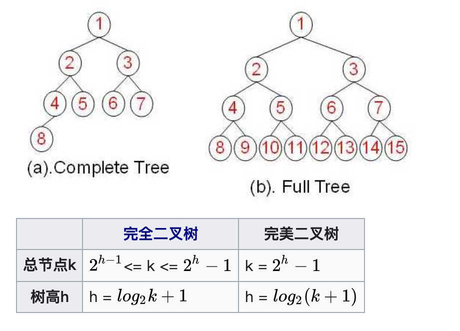
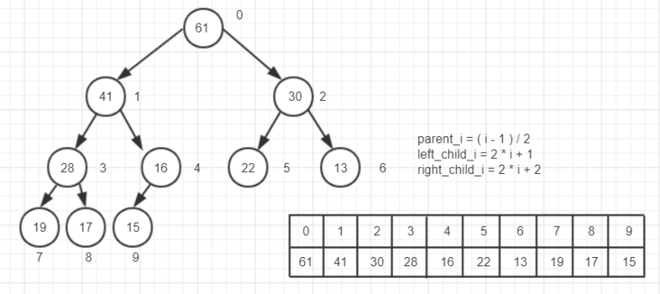

# 堆（优先队列）初阶

最近的每日一题里都是利用堆数据结构来解的类型，之前没刷过，导致做得磕磕绊绊，这次总结一下，有哪些类型的题。一起学习一下。

## 什么是堆

堆其实也是二叉树的一种，叫**完全二叉树**。

在一颗二叉树中，若除最后一层外的其余层都是满的，并且最后一层要么是满的，要么在右边缺少连续若干节点，则此二叉树为**完全二叉树（Complete Binary Tree）**。

一棵深度为k，且有 2^k-1 个节点的二叉树，称为**完美二叉树（Perfect Binary Tree）**。这种树的特点是每一层上的节点数都是最大节点数。

看定义可能不太直观，直接看图。



来自[维基百科](https://zh.wikipedia.org/wiki/%E4%BA%8C%E5%8F%89%E6%A0%91#%E5%AE%8C%E5%85%A8%E4%BA%8C%E5%8F%89%E6%A0%91)。其实完全二叉树就是一种从左到右排开的二叉树，而完美二叉树（又叫满二叉树）就是每个根节点都有 2 个左右子节点，即字面意义“完美二叉树”。

堆有如下特性：

* 任意节点小于（或大于）它的所有子节点，最小元（或最大元）在堆的根上（**堆序性**）。
* 堆总是一棵完全二叉树。即除了最底层，其他层的节点都被元素填满，且最底层尽可能地从左到右填入。

将根节点最大的堆叫做**最大堆**或**大根堆**，根节点最小的堆叫做**最小堆**或**小根堆**。如上图的就是最小堆。

## 堆和普通树的区别

堆并不能取代二叉搜索树，它们之间有相似之处也有一些不同。我们来看一下两者的主要差别：

* **节点的顺序。**在二叉搜索树中，左子节点必须比父节点小，右子节点必须必比父节点大。但是在堆中并非如此。在最大堆中两个子节点都必须比父节点小，而在最小堆中，它们都必须比父节点大。
* **内存占用。普通树占用的内存空间比它们存储的数据要多。你必须为节点对象以及左/右子节点指针分配内存。堆仅仅使用一个数据来存储数组，且不使用指针**。
* **平衡。二叉搜索树必须是“平衡”的情况下，其大部分操作的复杂度才能达到O(log n)**。你可以按任意顺序位置插入/删除数据，或者使用 AVL 树或者红黑树，但是在堆中实际上不需要整棵树都是有序的。我们只需要满足堆属性即可，所以在堆中平衡不是问题。因为堆中数据的组织方式可以保证**O(log n)** 的性能。
* **搜索。**在二叉树中搜索会很快，但是在堆中搜索会很慢。在堆中搜索不是第一优先级，因为使用堆的目的是将最大（或者最小）的节点放在最前面，从而快速的进行相关插入、删除操作。

## 来自数组的树

用数组来实现树相关的数据结构也许看起来有点古怪，但是它在时间和空间上都是很高效的。

我们准备将上面例子中的树这样存储：

```javascript
[ 10, 7, 2, 5, 1 ]
```

就这么多！我们除了一个简单的数组以外，不需要任何额外的空间。

如果我们不允许使用指针，那么我们怎么知道哪一个节点是父节点，哪一个节点是它的子节点呢？问得好！节点在数组中的位置index 和它的父节点以及子节点的索引之间有一个映射关系。

如果 `i` 是节点的索引，那么下面的公式就给出了它的父节点和子节点在数组中的位置：

```go
parent(i) = floor((i - 1)/2)
left(i)   = 2i + 1
right(i)  = 2i + 2
```

注意 `right(i)` 就是简单的 `left(i) + 1`。左右节点总是处于相邻的位置。

看下图对堆的存储更清晰：



而在堆中，为了维护最大堆或最小堆的特性，在增加或删除元素的时候都需要重新堆结构，来维持堆的特性，在 go 的源码里分别是 `up` 和 `down` 两个函数来处理。

```go
func up(h Interface, j int) {
    for {
        i := (j - 1) / 2 // parent
        if i == j || !h.Less(j, i) {
            break
        }
        h.Swap(i, j)
        j = i
    }
}

func down(h Interface, i0, n int) bool {
    i := i0
    for {
        j1 := 2*i + 1
        if j1 >= n || j1 < 0 { // j1 < 0 after int overflow
            break
        }
        j := j1 // left child
        if j2 := j1 + 1; j2 < n && h.Less(j2, j1) {
            j = j2 // = 2*i + 2  // right child
        }
        if !h.Less(j, i) {
            break
        }
        h.Swap(i, j)
        i = j
    }
    return i > i0
}
```

具体细节可以自己看看。我们主要是了解怎么利用已有的数据结构。

而堆其实就是一种**优先队列**。

普通队列一般就是 FIFO， 先进先出。而优先队列出队顺序和入队顺序无关，只和优先级有关。一般就是用最大堆或最小堆来实现，根据优先级建立一个堆，每次取出堆顶的元素，堆会自动调节堆内的元素，之后继续取出堆顶的元素即可。

Go 的标准库文档里对堆和优先队列有详细的例子解释，通俗易懂，可以看看。之后做题也需要用这部分的代码。

[container/heap - 示例：优先队列](http://cngolib.com/container-heap.html)

这篇先了解一下堆的基础，下篇文章开始练习 LeetCode 上的一些题目。
