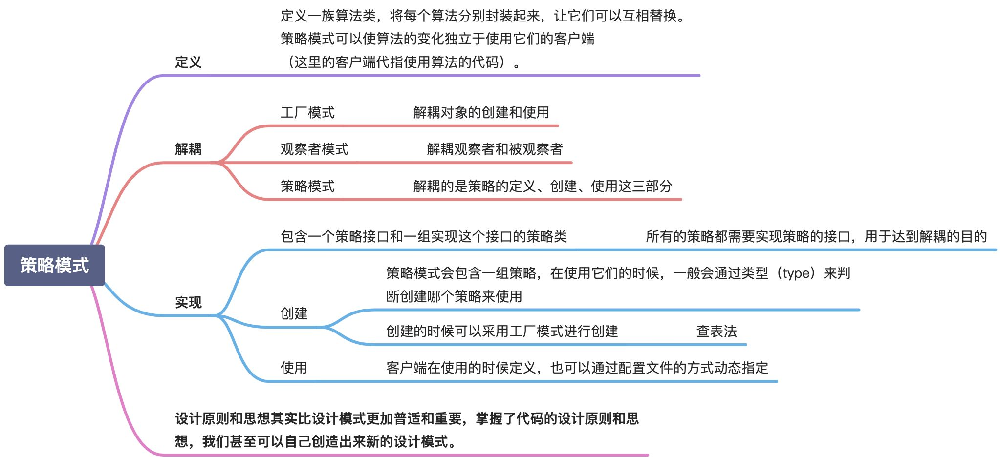

# 设计模式

## 常用设计模式

### 单例模式

一个类只允许创建一个对象。饿汉式和懒汉式。

```go
// Singleton 饿汉式单例
type Singleton struct{}

var singleton *Singleton

func init() {
	singleton = &Singleton{}
}

// GetInstance 获取实例
func GetInstance() *Singleton {
	return singleton
}

// 懒汉式
var (
	lazySingleton *Singleton
	once          = &sync.Once{}
)

// GetLazyInstance 懒汉式
func GetLazyInstance() *Singleton {
	if lazySingleton == nil {
		once.Do(func() {
			lazySingleton = &Singleton{}
		})
	}
	return lazySingleton
}
```


### 工厂模式

用于创造类型相关的不同对象。

```go
package factory

// IRuleConfigParser IRuleConfigParser
type IRuleConfigParser interface {
	Parse(data []byte)
}

// jsonRuleConfigParser jsonRuleConfigParser
type jsonRuleConfigParser struct {
}

// Parse Parse
func (J jsonRuleConfigParser) Parse(data []byte) {
	panic("implement me")
}

// yamlRuleConfigParser yamlRuleConfigParser
type yamlRuleConfigParser struct {
}

// Parse Parse
func (Y yamlRuleConfigParser) Parse(data []byte) {
	panic("implement me")
}

// NewIRuleConfigParser NewIRuleConfigParser
func NewIRuleConfigParser(t string) IRuleConfigParser {
	switch t {
	case "json":
		return jsonRuleConfigParser{}
	case "yaml":
		return yamlRuleConfigParser{}
	}
	return nil
}
```

单元测试

```go
package factory

import (
	"reflect"
	"testing"
)

func TestNewIRuleConfigParser(t *testing.T) {
	type args struct {
		t string
	}
	tests := []struct {
		name string
		args args
		want IRuleConfigParser
	}{
		{
			name: "json",
			args: args{t: "json"},
			want: jsonRuleConfigParser{},
		},
		{
			name: "yaml",
			args: args{t: "yaml"},
			want: yamlRuleConfigParser{},
		},
	}
	for _, tt := range tests {
		t.Run(tt.name, func(t *testing.T) {
			if got := NewIRuleConfigParser(tt.args.t); !reflect.DeepEqual(got, tt.want) {
				t.Errorf("NewIRuleConfigParser() = %v, want %v", got, tt.want)
			}
		})
	}
}
```


### 建造者模式

用于创建参数复杂的对象。

```go
func NewResourcePoolConfig(name string, opts ...ResourcePoolConfigOptFunc) (*ResourcePoolConfig, error) {
	if name == "" {
		return nil, fmt.Errorf("name can not be empty")
	}

	option := &ResourcePoolConfigOption{
		maxTotal: 10,
		maxIdle:  9,
		minIdle:  1,
	}

	for _, opt := range opts {
		opt(option)
	}

	if option.maxTotal < 0 || option.maxIdle < 0 || option.minIdle < 0 {
		return nil, fmt.Errorf("args err, option: %v", option)
	}

	if option.maxTotal < option.maxIdle || option.minIdle > option.maxIdle {
		return nil, fmt.Errorf("args err, option: %v", option)
	}

	return &ResourcePoolConfig{
		name:     name,
		maxTotal: option.maxTotal,
		maxIdle:  option.maxIdle,
		minIdle:  option.minIdle,
	}, nil
}
```


### 代理模式

在不改变原始类（被代理类）的情况下，通过引入代理类给原始类附加原始功能。

```go
package proxy

import (
	"log"
	"time"
)

// IUser IUser
type IUser interface {
	Login(username, password string) error
}

// User 用户
type User struct {
}

// Login 用户登录
func (u *User) Login(username, password string) error {
	// 不实现细节
	return nil
}

// UserProxy 代理类
type UserProxy struct {
	user *User
}

// NewUserProxy NewUserProxy
func NewUserProxy(user *User) *UserProxy {
	return &UserProxy{
		user: user,
	}
}

// Login 登录，和 user 实现相同的接口
func (p *UserProxy) Login(username, password string) error {
	// before 这里可能会有一些统计的逻辑
	start := time.Now()

	// 这里是原有的业务逻辑
	if err := p.user.Login(username, password); err != nil {
		return err
	}

	// after 这里可能也有一些监控统计的逻辑
	log.Printf("user login cost time: %s", time.Now().Sub(start))

	return nil
}
```


### 装饰器模式

给原始类增强功能，添加有关系的功能。代理模式则是添加无关的功能。

```go
package decorator

// IDraw IDraw
type IDraw interface {
	Draw() string
}

// Square 正方形
type Square struct{}

// Draw Draw
func (s Square) Draw() string {
	return "this is a square"
}

// ColorSquare 有颜色的正方形
type ColorSquare struct {
	square IDraw
	color  string
}

// NewColorSquare NewColorSquare
func NewColorSquare(square IDraw, color string) ColorSquare {
	return ColorSquare{color: color, square: square}
}

// Draw Draw
func (c ColorSquare) Draw() string {
	return c.square.Draw() + ", color is " + c.color
}
```

单元测试

```go
func TestColorSquare_Draw(t *testing.T) {
	sq := Square{}
	csq := NewColorSquare(sq, "red")
	got := csq.Draw()
	assert.Equal(t, "this is a square, color is red", got)
}
```


### 适配器模式

将不兼容的接口转换为可兼容的接口，提供跟原始类不同的接口。


```go
package adapter

import "fmt"

// ICreateServer 创建云主机
type ICreateServer interface {
	CreateServer(cpu, mem float64) error
}

// AWSClient aws sdk
type AWSClient struct{}

// RunInstance 启动实例
func (c *AWSClient) RunInstance(cpu, mem float64) error {
	fmt.Printf("aws client run success, cpu： %f, mem: %f", cpu, mem)
	return nil
}

// AwsClientAdapter 适配器
type AwsClientAdapter struct {
	Client AWSClient
}

// CreateServer 启动实例
func (a *AwsClientAdapter) CreateServer(cpu, mem float64) error {
	a.Client.RunInstance(cpu, mem)
	return nil
}

// AliyunClient aliyun sdk
type AliyunClient struct{}

// CreateServer 启动实例
func (c *AliyunClient) CreateServer(cpu, mem int) error {
	fmt.Printf("aws client run success, cpu： %d, mem: %d", cpu, mem)
	return nil
}

// AliyunClientAdapter 适配器
type AliyunClientAdapter struct {
	Client AliyunClient
}

// CreateServer 启动实例
func (a *AliyunClientAdapter) CreateServer(cpu, mem float64) error {
	a.Client.CreateServer(int(cpu), int(mem))
	return nil
}
```

单元测试

```go
package adapter

import (
	"testing"
)

func TestAliyunClientAdapter_CreateServer(t *testing.T) {
	// 确保 adapter 实现了目标接口
	var a ICreateServer = &AliyunClientAdapter{
		Client: AliyunClient{},
	}

	a.CreateServer(1.0, 2.0)
}

func TestAwsClientAdapter_CreateServer(t *testing.T) {
	// 确保 adapter 实现了目标接口
	var a ICreateServer = &AwsClientAdapter{
		Client: AWSClient{},
	}

	a.CreateServer(1.0, 2.0)
}
```


### 模板模式

在模版模式中，一个抽象类公开定义了执行它的方法的方式、模版。它的子类可以按需要重写方法实现，但调用将以抽象类中定义的方式进行。这种类型的设计模式属于行为型模式。

可参考[Golang 模版设计模式（二十三）](https://wangjiayu.blog.csdn.net/article/details/91128627)


### 策略模式

策略模式会包含一组策略，一般会通过类型来判断创建哪个策略来使用。



```go
package strategy

import (
	"fmt"
	"io/ioutil"
	"os"
)

// StorageStrategy 存储策略
type StorageStrategy interface {
	Save(name string, data []byte) error
}

var strategys = map[string]StorageStrategy{
	"file":         &fileStorage{},
	"encrypt_file": &encryptFileStorage{},
}

// NewStorageStrategy NewStorageStrategy
func NewStorageStrategy(t string) (StorageStrategy, error) {
	s, ok := strategys[t]
	if !ok {
		return nil, fmt.Errorf("not found StorageStrategy: %s", t)
	}

	return s, nil
}

// FileStorage 保存到文件
type fileStorage struct{}

// Save Save
func (s *fileStorage) Save(name string, data []byte) error {
	return ioutil.WriteFile(name, data, os.ModeAppend)
}

// encryptFileStorage 加密保存到文件
type encryptFileStorage struct{}

// Save Save
func (s *encryptFileStorage) Save(name string, data []byte) error {
	// 加密
	data, err := encrypt(data)
	if err != nil {
		return err
	}

	return ioutil.WriteFile(name, data, os.ModeAppend)
}

func encrypt(data []byte) ([]byte, error) {
	// 这里实现加密算法
	return data, nil
}
```

单元测试

```go
package strategy

import (
	"testing"

	"github.com/stretchr/testify/assert"
)

func Test_demo(t *testing.T) {
	// 假设这里获取数据，以及数据是否敏感
	data, sensitive := getData()
	strategyType := "file"
	if sensitive {
		strategyType = "encrypt_file"
	}

	storage, err := NewStorageStrategy(strategyType)
	assert.NoError(t, err)
	assert.NoError(t, storage.Save("./test.txt", data))
}

// getData 获取数据的方法
// 返回数据，以及数据是否敏感
func getData() ([]byte, bool) {
	return []byte("test data"), false
}
```


### 职责链模式

一种行为设计模式， 允许你将请求沿着处理者链进行发送。 收到请求后， 每个处理者均可对请求进行处理， 或将其传递给链上的下个处理者。


```go
// Package chain 职责链模式
// 🌰 假设我们现在有个校园论坛，由于社区规章制度、广告、法律法规的原因需要对用户的发言进行敏感词过滤
//    如果被判定为敏感词，那么这篇帖子将会被封禁
package chain

// SensitiveWordFilter 敏感词过滤器，判定是否是敏感词
type SensitiveWordFilter interface {
	Filter(content string) bool
}

// SensitiveWordFilterChain 职责链
type SensitiveWordFilterChain struct {
	filters []SensitiveWordFilter
}

// AddFilter 添加一个过滤器
func (c *SensitiveWordFilterChain) AddFilter(filter SensitiveWordFilter) {
	c.filters = append(c.filters, filter)
}

// Filter 执行过滤
func (c *SensitiveWordFilterChain) Filter(content string) bool {
	for _, filter := range c.filters {
		// 如果发现敏感直接返回结果
		if filter.Filter(content) {
			return true
		}
	}
	return false
}

// AdSensitiveWordFilter 广告
type AdSensitiveWordFilter struct{}

// Filter 实现过滤算法
func (f *AdSensitiveWordFilter) Filter(content string) bool {
	// TODO: 实现算法
	return false
}

// PoliticalWordFilter 政治敏感
type PoliticalWordFilter struct{}

// Filter 实现过滤算法
func (f *PoliticalWordFilter) Filter(content string) bool {
	// TODO: 实现算法
	return true
}
```

单元测试

```go
package chain

import (
	"testing"

	"github.com/stretchr/testify/assert"
)

func TestSensitiveWordFilterChain_Filter(t *testing.T) {
	chain := &SensitiveWordFilterChain{}
	chain.AddFilter(&AdSensitiveWordFilter{})
	assert.Equal(t, false, chain.Filter("test"))

	chain.AddFilter(&PoliticalWordFilter{})
	assert.Equal(t, true, chain.Filter("test"))
}
```

#### Gin 的中间件实现

我们直接看一下 `gin Context` 的实现，其中 `Next()` 方法就是主要的执行方法，这里其实就是我们最上面说到的职责链模式的变体，因为它会在每一个处理函数中进行处理，而不是第一个接收到就停止了

```go
type Context struct {
    // ...

    // handlers 是一个包含执行函数的数组
    // type HandlersChain []HandlerFunc
	handlers HandlersChain
    // index 表示当前执行到哪个位置了
	index    int8

    // ...
}

// Next 会按照顺序将一个个中间件执行完毕
// 并且 Next 也可以在中间件中进行调用，达到请求前以及请求后的处理
// Next should be used only inside middleware.
// It executes the pending handlers in the chain inside the calling handler.
// See example in GitHub.
func (c *Context) Next() {
	c.index++
	for c.index < int8(len(c.handlers)) {
		c.handlers[c.index](c)
		c.index++
	}
}
```

