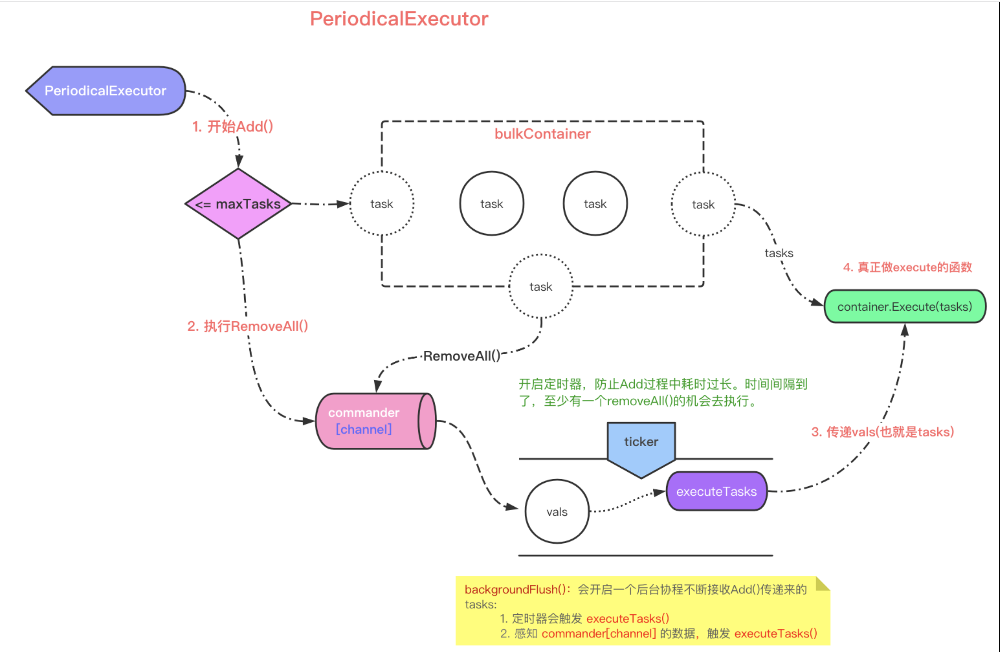

# executors

选项模式：https://halls-of-valhalla.org/beta/articles/functional-options-pattern-in-go,54/

```go
var defaultStuffClientOptions = StuffClientOptions{
    Retries: 3,
    Timeout: 2,
}
type StuffClientOption func(*StuffClientOptions)
type StuffClientOptions struct {
    Retries int //number of times to retry the request before giving up
    Timeout int //connection timeout in seconds
}

// 通过返回闭包函数的形式来修改参数配置
func WithRetries(r int) StuffClientOption {
    return func(o *StuffClientOptions) {
        o.Retries = r
    }
}
func WithTimeout(t int) StuffClientOption {
    return func(o *StuffClientOptions) {
        o.Timeout = t
    }
}
type StuffClient interface {
    DoStuff() error
}
type stuffClient struct {
    conn    Connection
    timeout int
    retries int
}
type Connection struct {}
func NewStuffClient(conn Connection, opts ...StuffClientOption) StuffClient {
    options := defaultStuffClientOptions
    for _, o := range opts {
        o(&options)
    }
        return &stuffClient{
            conn:    conn,
            timeout: options.Timeout,
            retries: options.Retries,
        }
}
func (c stuffClient) DoStuff() error {
    return nil
}
```


在 `go-zero` 中，`executors` 充当任务池，做多任务缓冲，适用于做批量处理的任务。如：`clickhouse` 大批量 `insert`，`sql batch insert`。同时也可以在 `go-queue` 中看到 `executors` 【在 `queue` 里面使用的是 `ChunkExecutor` ，限定任务提交字节大小】。

所以当你存在以下需求，都可以使用这个组件：

- 批量提交任务
- 缓冲一部分任务，惰性提交
- 延迟任务提交

具体解释之前，先给一个大致的概览图：



