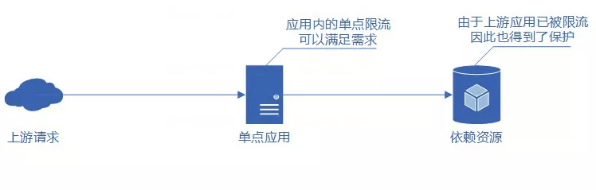
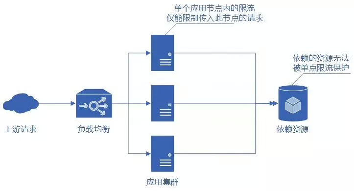
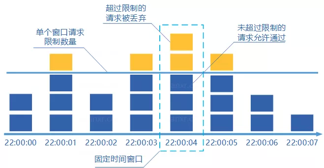
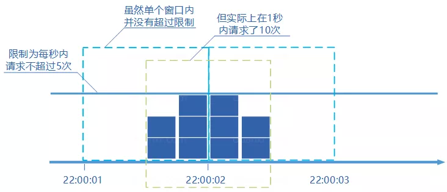
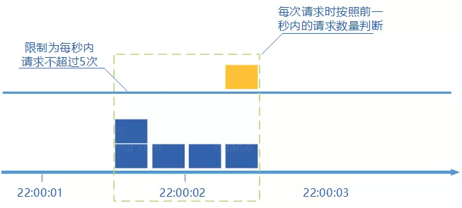
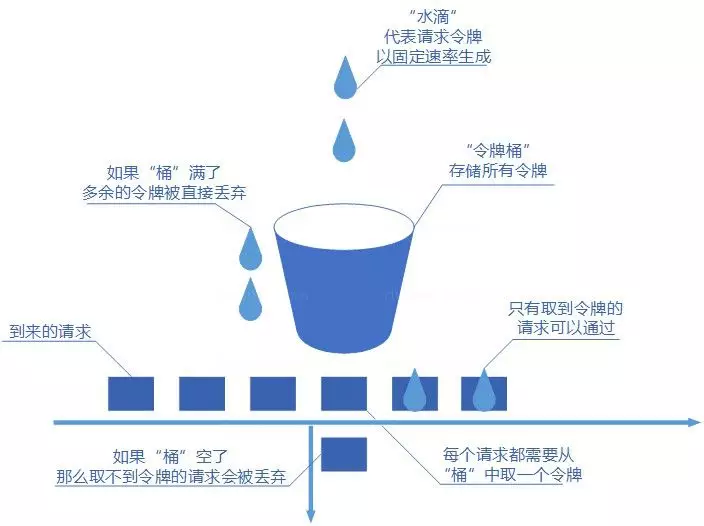

# 限流

以下内容转载自：[分布式服务限流实战，已经为你排好坑了](https://www.infoq.cn/article/Qg2tX8fyw5Vt-f3HH673)

## 一、限流的作用

由于 API 接口无法控制调用方的行为，因此当遇到瞬时请求量激增时，会导致接口占用过多服务器资源，使得其他请求响应速度降低或是超时，更有甚者可能导致服务器宕机。

限流(Ratelimiting)指对应用服务的请求进行限制，例如某一接口的请求限制为 100 个每秒,对超过限制的请求则进行快速失败或丢弃。

限流可以应对：

- 热点业务带来的突发请求；
- 调用方 bug 导致的突发请求；
- 恶意攻击请求。

因此，对于公开的接口最好采取限流措施。

## 二、为什么要分布式限流




当应用为单点应用时，只要应用进行了限流，那么应用所依赖的各种服务也都得到了保护。





但线上业务出于各种原因考虑，多是分布式系统，单节点的限流仅能保护自身节点，但无法保护应用依赖的各种服务，并且在进行节点扩容、缩容时也无法准确控制整个服务的请求限制。

而如果实现了分布式限流，那么就可以方便地控制整个服务集群的请求限制，且由于整个集群的请求数量得到了限制，因此服务依赖的各种资源也得到了限流的保护。

## 三、限流的算法

实现限流有很多办法，在程序中时通常是根据每秒处理的事务数(Transactionpersecond)来衡量接口的流量。

本文介绍几种最常用的限流算法：

- 固定窗口计数器；
- 滑动窗口计数器；
- 漏桶；
- 令牌桶。


### 1、固定窗口计数器算法




固定窗口计数器算法概念如下：

- 将时间划分为多个窗口；
- 在每个窗口内每有一次请求就将计数器加一；
- 如果计数器超过了限制数量，则本窗口内所有的请求都被丢弃当时间到达下一个窗口时，计数器重置。

固定窗口计数器是最为简单的算法，但这个算法有时会让通过请求量允许为限制的两倍。考虑如下情况：限制 1 秒内最多通过 5 个请求，在第一个窗口的最后半秒内通过了 5 个请求，第二个窗口的前半秒内又通过了 5 个请求。这样看来就是在 1 秒内通过了 10 个请求。





### 2、滑动窗口计数器算法




滑动窗口计数器算法概念如下：

- 将时间划分为多个区间；
- 在每个区间内每有一次请求就将计数器加一维持一个时间窗口，占据多个区间；
- 每经过一个区间的时间，则抛弃最老的一个区间，并纳入最新的一个区间；
- 如果当前窗口内区间的请求计数总和超过了限制数量，则本窗口内所有的请求都被丢弃。

滑动窗口计数器是通过将窗口再细分，并且按照时间"滑动"，这种算法避免了固定窗口计数器带来的双倍突发请求，但时间区间的精度越高，算法所需的空间容量就越大。


### 3、漏桶算法


漏桶算法概念如下：

- 将每个请求视作"水滴"放入"漏桶"进行存储；
- “漏桶"以固定速率向外"漏"出请求来执行如果"漏桶"空了则停止"漏水”；
- 如果"漏桶"满了则多余的"水滴"会被直接丢弃。

漏桶算法多使用队列实现，服务的请求会存到队列中，服务的提供方则按照固定的速率从队列中取出请求并执行，过多的请求则放在队列中排队或直接拒绝。

漏桶算法的缺陷也很明显，当短时间内有大量的突发请求时，即便此时服务器没有任何负载，每个请求也都得在队列中等待一段时间才能被响应。


### 4、令牌桶算法




令牌桶算法概念如下：

- 令牌以固定速率生成；
- 生成的令牌放入令牌桶中存放，如果令牌桶满了则多余的令牌会直接丢弃，当请求到达时，会尝试从令牌桶中取令牌，取到了令牌的请求可以执行；
- 如果桶空了，那么尝试取令牌的请求会被直接丢弃。

令牌桶算法既能够将所有的请求平均分布到时间区间内，又能接受服务器能够承受范围内的突发请求，因此是目前使用较为广泛的一种限流算法。

## 四、go-zero 令牌桶

### 使用

```go
const (
    burst   = 100
    rate    = 100
    seconds = 5
)

store := redis.NewRedis("localhost:6379", "node", "")
fmt.Println(store.Ping())
// New tokenLimiter
limiter := limit.NewTokenLimiter(rate, burst, store, "rate-test")
timer := time.NewTimer(time.Second * seconds)
quit := make(chan struct{})
defer timer.Stop()
go func() {
  <-timer.C
  close(quit)
}()

var allowed, denied int32
var wait sync.WaitGroup
for i := 0; i < runtime.NumCPU(); i++ {
  wait.Add(1)
  go func() {
    for {
      select {
        case <-quit:
          wait.Done()
          return
        default:
          if limiter.Allow() {
            atomic.AddInt32(&allowed, 1)
          } else {
            atomic.AddInt32(&denied, 1)
          }
      }
    }
  }()
}

wait.Wait()
fmt.Printf("allowed: %d, denied: %d, qps: %d\n", allowed, denied, (allowed+denied)/seconds)
```

### tokenlimit

从整体上令牌桶生产token逻辑如下：

- 用户配置的平均发送速率为r，则每隔1/r秒一个令牌被加入到桶中；
- 假设桶中最多可以存放b个令牌。如果令牌到达时令牌桶已经满了，那么这个令牌会被丢弃；
- 当流量以速率v进入，从桶中以速率v取令牌，拿到令牌的流量通过，拿不到令牌流量不通过，执行熔断逻辑；

`go-zero` 在两类限流器下都采取 `lua script` 的方式，依赖redis可以做到分布式限流，`lua script`同时可以做到对 token 生产读取操作的原子性。

下面来看看 `lua script` 控制的几个关键属性：

| argument | mean                                       |
| -------- | ------------------------------------------ |
| ARGV[1]  | rate 「每秒生成几个令牌」                  |
| ARGV[2]  | burst 「令牌桶最大值」                     |
| ARGV[3]  | now_time「当前时间戳」                     |
| ARGV[4]  | get token nums 「开发者需要获取的token数」 |
| KEYS[1]  | 表示资源的tokenkey                         |
| KEYS[2]  | 表示刷新时间的key                          |

```lua
-- 返回是否可以活获得预期的token

local rate = tonumber(ARGV[1])
local capacity = tonumber(ARGV[2])
local now = tonumber(ARGV[3])
local requested = tonumber(ARGV[4])

-- fill_time：需要填满 token_bucket 需要多久
local fill_time = capacity/rate
-- 将填充时间向下取整
local ttl = math.floor(fill_time*2)

-- 获取目前 token_bucket 中剩余 token 数
-- 如果是第一次进入，则设置 token_bucket 数量为 令牌桶最大值
local last_tokens = tonumber(redis.call("get", KEYS[1]))
if last_tokens == nil then
    last_tokens = capacity
end

-- 上一次更新 token_bucket 的时间
local last_refreshed = tonumber(redis.call("get", KEYS[2]))
if last_refreshed == nil then
    last_refreshed = 0
end

local delta = math.max(0, now-last_refreshed)
-- 通过当前时间与上一次更新时间的跨度，以及生产token的速率，计算出新的token数
-- 如果超过 max_burst，多余生产的token会被丢弃
local filled_tokens = math.min(capacity, last_tokens+(delta*rate))
local allowed = filled_tokens >= requested
local new_tokens = filled_tokens
if allowed then
    new_tokens = filled_tokens - requested
end

-- 更新新的token数，以及更新时间
redis.call("setex", KEYS[1], ttl, new_tokens)
redis.call("setex", KEYS[2], ttl, now)

return allowed
```

上述可以看出 `lua script` ：只涉及对 token 操作，保证 token 生产合理和读取合理。

### 总结

`go-zero` 中的 `tokenlimit` 限流方案适用于瞬时流量冲击，现实请求场景并不以恒定的速率。令牌桶相当预请求，当真实的请求到达不至于瞬间被打垮。当流量冲击到一定程度，则才会按照预定速率进行消费。

但是生产`token`上，不能按照当时的流量情况作出动态调整，不够灵活，还可以进行进一步优化。此外可以参考[Token bucket WIKI](https://en.wikipedia.org/wiki/Token_bucket) 中提到分层令牌桶，根据不同的流量带宽，分至不同排队中。

### 参考

- [go-zero tokenlimit](https://github.com/zeromicro/go-zero/blob/master/core/limit/tokenlimit.go)
- [Go-Redis 提供的分布式限流库](https://github.com/go-redis/redis_rate)

## 五、其他限流库

[hystrix-go](https://github.com/afex/hystrix-go)

[hystrix-go 使用与原理](https://learnku.com/articles/53019)

[sentinel-golang](https://github.com/alibaba/sentinel-golang)

[Sentinel-golang 文档](https://sentinelguard.io/zh-cn/docs/golang/basic-api-usage.html)

[Sentinel自适应限流](https://github.com/alibaba/Sentinel/wiki/系统自适应限流)

