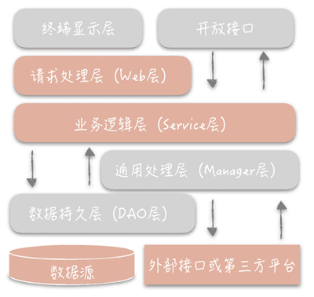
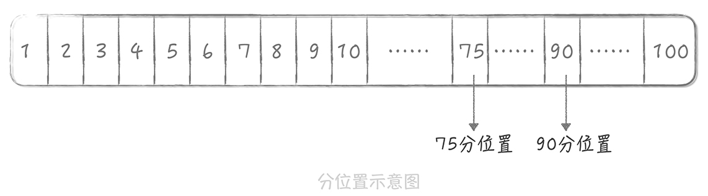
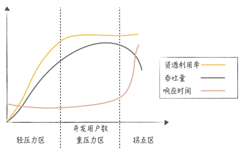
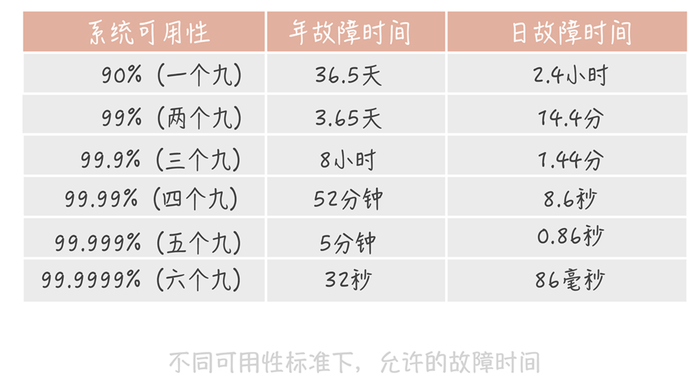

# 基础篇

问题

- 高并发系统：它的通用设计方法是什么？
- 架构分层：我们为什么一定要这么做？
- 系统设计目标（一）：如何提升系统性能？
- 系统设计目标（二）：系统怎样做到高可用？
- 系统设计目标（三）：如何让系统易于扩展？


## 一、归纳方案

- **Scale-out（横向扩展）**：分而治之是一种常见的高并发系统设计方法，采用分布式部署的方式把流量分流开，让每个服务器都承担一部分并发和流量。
- **缓存**：使用缓存来提高系统的性能，就好比用“拓宽河道”的方式抵抗高并发大流量的冲击。
- **异步**：在某些场景下，未处理完成之前，我们可以让请求先返回，在数据准备好之后再通知请求方，这样可以在单位时间内处理更多的请求。

> 高并发系统的演进应该是循序渐进，以解决系统中存在的问题为目的和驱动力的。

### Scale-up 和 Scale-out

- **Scale-up**：通过购买性能更好的硬件来提升系统的并发处理能力。
- **Scale-out**：通过将多个低性能的机器组成一个分布式集群来共同抵御高并发流量的冲击。

> 一般在系统设计初期会考虑使用 Scale-up 的方式，因为这种方案足够简单，所谓能用堆砌硬件解决的问题就用硬件来解决，但是当系统并发超过了单机的极限时，我们就要使用 Scale-out 的方式。

### 缓存的意义

数据是放在持久化存储中的，一般的持久化存储都是使用磁盘作为存储介质的，普通磁盘的寻道时间是 10ms 左右，而相比于磁盘寻道花费的时间，CPU 执行指令和内存寻址的时间都在是 ns（纳秒）级别，从千兆网卡上读取数据的时间是在 μs（微秒）级别。所以在整个计算机体系中，磁盘是最慢的一环。

> 缓存的语义已经丰富了很多，我们可以将任何降低响应时间的中间存储都称为缓存。

## 二、分层架构

将整体系统拆分成 N 个层次，每个层次有独立的职责，多个层次协同提供完整的功能。

典型的分层设计：系统的 MVC 设计；OSI 网络模型，TCP/IP 模型；Linux 文件系统等。以下是一个典型等系统分层设计规约：



### 分层的作用

- 1.分层的设计可以简化系统设计，让不同的人专注做某一层次的事情；
- 2.分层之后可以做到很高的复用；
- 3.分层架构可以让我们更容易做横向扩展。

### 分层的问题

- 1.增加了代码的复杂度；
- 2.多层架构的性能损耗

## 三、高并发

高并发系统设计的三大目标：**高性能**、**高可用**、**可扩展**。

是指运用设计手段让系统能够处理更多的用户并发请求，也就是承担更大的流量。而**性能**和**可用性**，是我们实现高并发系统设计必须考虑的因素。

### 性能优化原则

- 1.不能盲目，一定是问题导向的；
- 2.遵循“八二原则”；
- 3.也要有数据支撑；
- 4.过程是持续的。

### 性能的度量指标

一般度量性能的指标是系统接口的响应时间，但是单次的响应时间是没有意义的，你需要知道一段时间的性能情况是什么样的。所以，我们需要收集这段时间的响应时间数据，然后依据一些统计方法计算出特征值，这些特征值就能够代表这段时间的性能情况。我们常见的特征值有以下几类。

- **平均值**：平均值可以在一定程度上反应这段时间的性能，但它敏感度比较差，如果这段时间有少量慢请求时，在平均值上并不能如实的反应。

- **最大值**：过于敏感；

- **分位值**：最适合作为时间段内，响应时间统计值来使用的。

  

从用户使用体验的角度来看，**200ms** 是第一个分界点：接口的响应时间在 200ms 之内，用户是感觉不到延迟的，就像是瞬时发生的一样。而 **1s** 是另外一个分界点：接口的响应时间在 1s 之内时，虽然用户可以感受到一些延迟，但却是可以接受的，超过 1s 之后用户就会有明显等待的感觉，等待时间越长，用户的使用体验就越差。

> 健康系统的 99 分位值的响应时间通常需要控制在 200ms 之内，而不超过 1s 的请求占比要在 99.99% 以上。

### 高并发下的性能优化

主要有两种思路：

- **提高系统的处理核心数**。增加系统的并行处理能力；

[阿姆达尔定律（Amdahl’s law）](http://blog.michealwayne.cn/2020/03/03/tools/【转】【工具】开发中有用的定律、理论、原则和模式/)是吉恩·阿姆达尔在 1967 年提出的。它描述了并发进程数与响应时间之间的关系，含义是在固定负载下，并行计算的加速比，也就是并行化之后效率提升情况。可以用下面公式来表示：

```
(Ws + Wp) / (Ws + Wp/s)
```

其中，Ws 表示任务中的串行计算量，Wp 表示任务中的并行计算量，s 表示并行进程数。从这个公式我们可以推导出另外一个公式：

```
1/(1-p+p/s)
```

其中，s 还是表示并行进程数，p 表示任务中并行部分的占比。当 p 为 1 时，也就是完全并行时，加速比与并行进程数相等；当 p 为 0 时，即完全串行时，加速比为 1，也就是说完全无加速；当 s 趋近于无穷大的时候，加速比就等于 1/(1-p)，你可以看到它完全和 p 成正比。特别是，当 p 为 1 时，加速比趋近于无穷大。

但是实际上随着并发进程数的增加，并行的任务对于系统资源的争抢也会愈发严重。在某一个临界点上继续增加并发进程数，反而会造成系统性能的下降，这就是性能测试中的**拐点模型**。



所以我们在评估系统性能时通常需要做**压力测试**，目的就是找到系统的“拐点”，从而知道系统的承载能力，也便于找到系统的瓶颈，持续优化系统性能。

- **减少单次任务的响应时间**。

想要减少任务的响应时间，首先要看你的系统是 CPU 密集型还是 IO 密集型的，因为不同类型的系统性能优化方式不尽相同。

CPU 密集型系统中，需要处理大量的 CPU 运算，那么选用更高效的算法或者减少运算次数就是这类系统重要的优化手段。比方说，如果系统的主要任务是计算 Hash 值，那么这时选用更高性能的 Hash 算法就可以大大提升系统的性能。发现这类问题的主要方式，是通过一些 Profile 工具来找到消耗 CPU 时间最多的方法或者模块，比如 Linux 的 perf、eBPF 等。

IO 密集型系统指的是系统的大部分操作是在等待 IO 完成，这里 IO 指的是磁盘 IO 和网络 IO。我们熟知的系统大部分都属于 IO 密集型，比如数据库系统、缓存系统、Web 系统。这类系统的性能瓶颈可能出在系统内部，也可能是依赖的其他系统，而发现这类性能瓶颈的手段主要有两类。 - 第一类是采用工具，Linux 的工具集很丰富，完全可以满足你的优化需要，比如网络协议栈、网卡、磁盘、文件系统、内存，等等。这些工具的用法很多，你可以在排查问题的过程中逐渐积累。除此之外呢，一些开发语言还有针对语言特性的分析工具，比如说 Java 语言就有其专属的内存分析工具。 - 另外一类手段就是可以通过监控来发现性能问题。在监控中我们可以对任务的每一个步骤做分时的统计，从而找到任务的哪一步消耗了更多的时间。这一部分在演进篇中会有专门的介绍，这里就不再展开了。


## 四、高可用

可用性（High Availability，HA）则表示系统可以正常服务用户的时间。

### 可用性的度量

- **MTBF**（Mean Time Between Failure）是平均故障间隔的意思，代表两次故障的间隔时间，也就是系统正常运转的平均时间。这个时间越长，系统稳定性越高。
- **MTTR**（Mean Time To Repair）表示故障的平均恢复时间，也可以理解为平均故障时间。这个值越小，故障对于用户的影响越小。

它们之间的关系：

```
Availability = MTBF / (MTBF + MTTR)
```

这个公式计算出的结果是一个比例，而这个比例代表着系统的可用性。一般来说，我们会使用几个九来描述系统的可用性。



一般来说，我们的核心业务系统的可用性，需要达到四个九，非核心系统的可用性最多容忍到三个九。

###  1. 系统设计

**Design for failure**：**failover（故障转移）、超时控制以及降级和限流。**

#### failover（故障转移）

一般来说，发生 failover 的节点可能有两种情况：

1. 是在 **完全对等** 的节点之间做 failover。
2. 是在 **不对等** 的节点之间，即系统中存在主节点也存在备节点。

完全对等的节点情况下，如果访问某一个节点失败，那么简单地随机访问另一个节点就好了。

**针对不对等节点的 failover 机制会复杂很多**。比方说我们有一个主节点，有多台备用节点，这些备用节点可以是热备（同样在线提供服务的备用节点），也可以是冷备（只作为备份使用），那么我们就需要在代码中控制如何检测主备机器是否故障，以及如何做主备切换。

使用最广泛的故障检测机制是「心跳」。你可以在客户端上定期地向主节点发送心跳包，也可以从备份节点上定期发送心跳包。当一段时间内未收到心跳包，就可以认为主节点已经发生故障，可以触发选主的操作。

选主的结果需要在多个备份节点上达成一致，所以会使用某一种分布式一致性算法，比方说 Paxos，Raft。

####  调用超时控制

**通过收集系统之间的调用日志，统计比如说 99% 的响应时间是怎样的，然后依据这个时间来指定超时时间。** 如果没有调用的日志，那么你只能按照经验值来指定超时时间。不过，无论你使用哪种方式，超时时间都不是一成不变的，需要在后面的系统维护过程中不断地修改。

#### 降级

降级是为了保证核心服务的稳定而牺牲非核心服务的做法。比如在大流量场景下可以暂时关闭反垃圾服务检测，这样就可以保证主体的流程更加稳定。

#### 限流

限流完全是另外一种思路，  它通过对并发的请求进行限速来保护系统。

比如对于 Web 应用，我限制单机只能处理每秒 1000 次的请求，超过的部分直接返回错误给客户端。虽然这种做法损害了用户的使用体验，但是它是在极端并发下的无奈之举，是短暂的行为，因此是可以接受的。


### 2. 系统运维

#### 灰度发布

灰度发布指的是系统的变更不是一次性地推到线上的，而是按照一定比例逐步推进的。一般情况下，**灰度发布是以机器维度进行的**。比方说，我们先在 10% 的机器上进行变更，同时观察 Dashboard 上的系统性能指标以及错误日志。如果运行了一段时间之后系统指标比较平稳并且没有出现大量的错误日志，那么再推动全量变更。

#### 演练

故障演练指的是对系统进行一些破坏性的手段，观察在出现局部故障时，整体的系统表现是怎样的，从而发现系统中存在的，潜在的可用性问题。

**故障演练和时下比较流行的“混沌工程”的思路如出一辙，** 作为混沌工程的鼻祖，Netfix 在 2010 年推出的 Chaos Monkey 工具就是故障演练绝佳的工具。它通过在线上系统上随机地关闭线上节点来模拟故障，让工程师可以了解，在出现此类故障时会有什么样的影响。

### 拓展阅读

- 针对于操作系统，网络或磁盘这种应该怎么故障注入，故障模拟应该怎么模拟呢？

一般使用 tc 来模拟网络慢的情况，磁盘故障可以使用 fiu-ctrl

## 五、可扩展

从架构设计上来说，高可扩展性是一个设计的指标，**它表示可以通过增加机器的方式来线性提高系统的处理能力，从而承担更高的流量和并发** 。

### 为什么提升扩展性会很复杂

在上一讲中，我提到可以在单机系统中通过增加处理核心的方式，来增加系统的并行处理能力，但这个方式并不总生效。因为当并行的任务数较多时，系统会因为争抢资源而达到性能上的拐点，系统处理能力不升反降。

而对于由多台机器组成的集群系统来说也是如此。集群系统中，不同的系统分层上可能存在一些 「瓶颈点」，这些瓶颈点制约着系统的横线扩展能力。这句话比较抽象，我举个例子你就明白了。

比方说，你系统的流量是每秒 1000 次请求，对数据库的请求量也是每秒 1000 次。如果流量增加 10 倍，虽然系统可以通过扩容正常服务，数据库却成了瓶颈。再比方说，单机网络带宽是 50Mbps，那么如果扩容到 30 台机器，前端负载均衡的带宽就超过了千兆带宽的限制，也会成为瓶颈点。那么，我们的系统中存在哪些服务会成为制约系统扩展的重要因素呢？

其实，**无状态的服务和组件更易于扩展**，而像 MySQL 这种存储服务是有状态的，就比较难以扩展。因为向存储集群中增加或者减少机器时，会涉及大量数据的迁移，而一般传统的关系型数据库都不支持。这就是为什么提升系统扩展性会很复杂的主要原因。

除此之外，从例子中你可以看到，我们需要站在整体架构的角度，而不仅仅是业务服务器的角度来考虑系统的扩展性 。 **所以说，数据库、缓存、依赖的第三方、负载均衡、交换机带宽等等** 都是系统扩展时需要考虑的因素。我们要知道系统并发到了某一个量级之后，哪一个因素会成为我们的瓶颈点，从而针对性地进行扩展。

### 高可扩展性的设计思路

**拆分** 是提升系统扩展性最重要的一个思路，它会把庞杂的系统拆分成独立的，有单一职责的模块。相对于大系统来说，考虑一个一个小模块的扩展性当然会简单一些。**将复杂的问题简单化，这就是我们的思路。**

#### 存储层的扩展性

可以将数据库按照业务拆分，比如一个社区系统可以分成用户库、内容库、评论库、点赞库和关系库，之后对每块业务数据库还能再做水平分库。

#### 业务层的扩展性

一般会从三个维度考虑业务层的拆分方案，它们分别是：**业务纬度** ，**重要性纬度** 和 **请求来源纬度**。

首先，**我们需要把相同业务的服务拆分成单独的业务池**，比方说上面的社区系统中，我们可以按照业务的维度拆分成用户池、内容池、关系池、评论池、点赞池和搜索池。

除此之外，**我们还可以根据业务接口的重要程度，把业务分为核心池和非核心池** （池子就是一组机器组成的集群） 。这样，我们可以优先保证核心池的性能，当整体流量上升时优先扩容核心池，降级部分非核心池的接口，从而保证整体系统的稳定性。