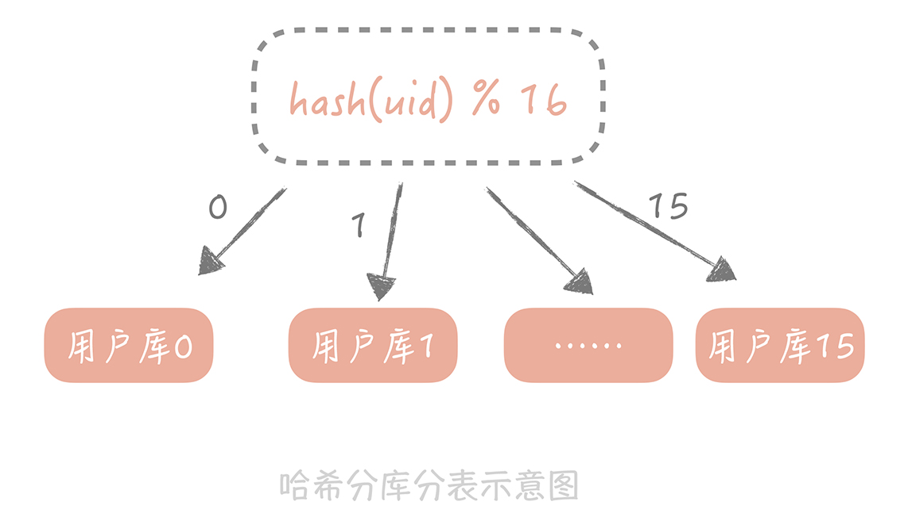

# 数据库

## 一、池化技术

数据库连接池。

go 协程池。

一个非常简单的协程池：

```go
package main

import (
	"fmt"
	"time"
)

type Pool struct {
	work chan func()   // 任务
	sem  chan struct{} // 数量
}
func New(size int) *Pool {
	return &Pool{
		work: make(chan func()),
		sem:  make(chan struct{}, size),
	}
}

func (p *Pool) NewTask(task func()) {
	select {
	case p.work <- task:
    // 这里会等待协程运行完任务后才会进入
		fmt.Println("task in queue")
	case p.sem <- struct{}{}:
    // 如果超过 channel 的 buffer 则会阻塞住，不会创建新的 channel
		go p.worker(task)
	}
}

func (p *Pool) worker(task func()) {
	defer func() { <-p.sem }()
	// 复用协程，不会退出
	for {
		fmt.Println("run task")
		task()
		task = <-p.work
	}
}

func main()  {
	pool := New(3)

	for i := 0; i < 4; i++{
		i := i
		pool.NewTask(func(){
			//time.Sleep(100 * time.Millisecond)
			fmt.Println(i)
		})
	}

	// 保证所有的协程都执行完毕
	time.Sleep(1 * time.Second)
}
```

可以参考

[如何手动实现一个协程池？](https://www.cnblogs.com/wongbingming/p/13091091.html)

[100 行写一个 go 的协程池 (任务池)](https://segmentfault.com/a/1190000021468353)

## 二、主从分离

### 主从读写分离

主要针对查询请求增加。

两个关键点：

1. 一个是数据的拷贝，我们称为主从复制；
2. 在主从分离的情况下，我们 **如何屏蔽主从分离带来的访问数据库方式的变化**，让开发同学像是在使用单一数据库一样。

#### 主从复制

MySQL 的主从复制是依赖于 binlog 的，也就是记录 MySQL 上的所有变化并以二进制形式保存在磁盘上二进制日志文件。主从复制就是将 binlog 中的数据从主库传输到从库上 ，一般这个过程是异步的，即主库上的操作不会等待 binlog 同步的完成。

主从复制的过程是这样的：

1. 首先从库在连接到主节点时会创建一个 IO 线程，用以请求主库更新的 binlog，并且把接收到的 binlog 信息写入一个叫做 relay log 的日志文件中
2. 而主库也会创建一个 log dump 线程来发送 binlog 给从库；
3. 同时，从库还会创建一个 SQL 线程读取 relay log 中的内容，并且在从库中做回放，最终实现主从的一致性。这是一种比较常见的主从复制方式。

在这个方案中，使用独立的 log dump 线程是一种异步的方式，可以避免对主库的主体更新流程产生影响，而从库在接收到信息后并不是写入从库的存储中，是写入一个 relay log，是避免写入从库实际存储会比较耗时，最终造成从库和主库延迟变长。


binlog，relaylog 可参考：[MySQL中的binlog和relay-log结构完全详解](https://www.51cto.com/article/626540.html)

**一般一个主库最多挂 3～5 个从库**。

主从数据库存在延迟，一般可以使用以下方法：

1.  **第一种方案是数据的冗余。**

    你可以在发送消息队列时不仅仅发送微博 ID，而是发送队列处理机需要的所有微博信息，借此避免从数据库中重新查询数据。
2.  **第二种方案是使用缓存。**

    我可以在同步写数据库的同时，也把微博的数据写入到 Memcached 缓存里面，这样队列处理机在获取微博信息的时候会优先查询缓存，这样也可以保证数据的一致性。
3.  **最后一种方案是查询主库。**

    我可以在队列处理机中不查询从库而改为查询主库。不过，这种方式使用起来要慎重，要明确查询的量级不会很大，是在主库的可承受范围之内，否则会对主库造成比较大的压力。

#### 如何访问数据库

可以借助一些公开库，比如：https://github.com/flike/kingshard

## 三、分库分表

主要针对写入数据量增加。

### 对数据库做垂直拆分

垂直拆分，顾名思义就是对数据库竖着拆分，也就是将数据库的 **表拆分到多个不同的数据库中**。

垂直拆分的原则一般是按照业务类型来拆分，核心思想是专库专用，将业务耦合度比较高的表拆分到单独的库中。

### 对数据库做水平拆分

和垂直拆分的关注点不同：

* 垂直拆分的关注点在于 **业务相关性**，
* 水平拆分指的是将单一数据表按照某一种规则拆分到多个数据库和多个数据表中，关注点在 **数据的特点**。

**拆分的规则有下面这两种：**

1.  按照某一个字段的 **哈希值** 做拆分。

    
2. 另一种比较常用的是按照某一个字段的 **区间** 来拆分，比较常用的是时间字段。 

分库分表后，**原先只需要根据查询条件到从库中查询数据即可，现在则需要先确认数据在哪一个库表中，再到那个库表中查询数据** 。这种复杂度也可以通过数据库中间件来解决。

### 解决分库分表引入的问题

分库分表引入的一个最大的问题就是 **引入了分库分表键，也叫做分区键，** 也就是我们对数据库做分库分表所依据的字段。

比如，在用户库中我们使用 ID 作为分区键，这时如果需要按照昵称来查询用户时，如果像上面说的要拆分成 16 个库和 64 张表，那么一次数据的查询会变成 `16*64=1024` 次查询，查询的性能肯定是极差的。这样我们可以建立一个昵称和 ID 的映射表，在查询的时候要先通过昵称查询到 ID，再通过 ID 查询完整的数据，这个表也可以是分库分表的，也需要占用一定的存储空间，但是因为表中只有两个字段，所以相比重新做一次拆分还是会节省不少的空间的。

再比如说在未分库分表之前查询数据总数时只需要在 SQL 中执行 `count()` 即可，现在数据被分散到多个库表中，我们可能要考虑其他的方案，比方说将计数的数据单独存储在一张表中或者记录在 Redis 里面。

## 四、保证分库分表后 ID 的全局唯一性

Snowflake 的核心思想是将 64bit 的二进制数字分成若干部分，每一部分都存储有特定含义的数据，比如说时间戳、机器 ID、序列号等等，最终生成**全局唯一的有序 ID**。它的标准算法是这样的：


**一种是嵌入到业务代码里，也就是分布在业务服务器中。** 这种方案的好处是业务代码在使用的时候不需要跨网络调用，性能上会好一些，但是就需要更多的机器 ID 位数来支持更多的业务服务器。另外，由于业务服务器的数量很多，我们很难保证机器 ID 的唯一性，所以就需要引入 ZooKeeper 等分布式一致性组件来保证每次机器重启时都能获得唯一的机器 ID。

**另外一个部署方式是作为独立的服务部署，这也就是我们常说的发号器服务。** 业务在使用发号器的时候就需要多一次的网络调用，但是内网的调用对于性能的损耗有限，却可以减少机器 ID 的位数。 **微博和美图都是使用独立服务的方式来部署发号器的，性能上单实例单 CPU 可以达到两万每秒。**

Snowflake 算法设计的非常简单且巧妙，性能上也足够高效，同时也能够生成 **具有全局唯一性、单调递增性和有业务含义的 ID** ，但是它也有一些缺点，**其中最大的缺点就是它依赖于系统的时间戳**，一旦系统时间不准，就有可能生成重复的 ID。所以如果我们发现系统时钟不准，就可以让发号器暂时拒绝发号，直到时钟准确为止。

另外，如果请求发号器的 QPS 不高，比如说发号器每毫秒只发一个 ID，就会造成生成 ID 的末位永远是 1，那么在分库分表时如果使用 ID 作为分区键就会造成库表分配的不均匀。解决办法主要有两个：

1. 时间戳不记录毫秒而是记录秒，这样在一个时间区间里可以多发出几个号，避免出现分库分表时数据分配不均。
2. 生成的序列号的起始号可以做一下随机，这一秒是 21，下一秒是 30，这样就会尽量的均衡了。

我在开头提到，自己的实际项目中采用的是变种的 Snowflake 算法，也就是说对 Snowflake 算法进行了一定的改造，从上面的内容中你可以看出，这些改造：

* 一是要让算法中的 ID 生成规则符合自己业务的特点；
* 二是为了解决诸如时间回拨等问题。

## 五、NoSQL

### 使用 NoSQL 提升写入性能

数据库系统大多使用的是传统的机械磁盘，对于机械磁盘的访问方式有两种：

*   一种是随机 IO

    随机 IO 就需要花费时间做昂贵的磁盘寻道，一般来说，它的读写效率要比顺序 IO 小两到三个数量级，所以我们想要提升写入的性能就要尽量减少随机 IO
* 另一种是顺序 IO

以 MySQL 的 InnoDB 存储引擎来说，更新 binlog、redolog、undolog **都是在做顺序 IO**，而更新 datafile 和索引文件则是在做随机 IO，而为了减少随机 IO 的发生，关系数据库已经做了很多的优化，比如说写入时先写入内存，然后批量刷新到磁盘上，但是随机 IO 还是会发生。

索引在 InnoDB 引擎中是以 B+ 树（上一节课提到了 B+ 树，你可以回顾一下）方式来组织的，而 MySQL 主键是聚簇索引（一种索引类型，数据与索引数据放在一起），既然数据和索引数据放在一起，那么在数据插入或者更新的时候，我们需要找到要插入的位置，再把数据写到特定的位置上，这就产生了随机的 IO。而且一旦发生了页分裂，就不可避免会做数据的移动，也会极大地损耗写入性能。

**NoSQL 数据库是怎么解决这个问题的呢？**

它们有多种的解决方式，这里我给你讲一种最常见的方案，就是很多 NoSQL 数据库都在使用的 **基于 LSM 树的存储引擎，** 这种算法使用最多，所以在这里着重剖析一下。

LSM 树（Log-Structured Merge Tree）牺牲了一定的读性能来换取写入数据的高性能，Hbase、Cassandra、LevelDB 都是用这种算法作为存储的引擎。

它的思想很简单，数据首先会写入到一个叫做 MemTable 的内存结构中，在 MemTable 中数据是按照写入的 Key 来排序的。为了防止 MemTable 里面的数据因为机器掉电或者重启而丢失，一般会通过写 Write Ahead Log 的方式将数据备份在磁盘上。

MemTable 在累积到一定规模时，它会被刷新生成一个新的文件，我们把这个文件叫做 SSTable（Sorted String Table）。当 SSTable 达到一定数量时，我们会将这些 SSTable 合并，减少文件的数量，因为 SSTable 都是有序的，所以合并的速度也很快。

当从 LSM 树里面读数据时，我们首先从 MemTable 中查找数据，如果数据没有找到，再从 SSTable 中查找数据。因为存储的数据都是有序的，所以查找的效率是很高的，只是因为数据被拆分成多个 SSTable，所以读取的效率会低于 B+ 树索引。


和 LSM 树类似的算法有很多，比如说 TokuDB 使用的名为 Fractal tree 的索引结构，它们的核心思想就是将随机 IO 变成顺序的 IO，从而提升写入的性能。

### 场景补充

在 mysql 中，模糊查询这类语句并不是都能使用到索引，只有后模糊匹配的语句才能使用索引。比如语句 `select * from product where name like ‘% 电冰箱’` 就没有使用到字段 `name` 上的索引，而 `select * from product where name like ‘索尼 %’` 就使用了 `name` 上的索引。而一旦没有使用索引就会扫描全表的数据，在性能上是无法接受的。

（主要是因为二叉查找树的查询原理，根据前缀匹配来查询，像 `’%xxx‘` 这样的是无法通过索引来查询的，只能全表扫，只有后模糊查询才能使用索引查询。）

一般使用开源组件 Elasticsearch 来支持搜索的请求，它本身是基于“倒排索引”来实现的，

倒排索引是指将记录中的某些列做分词，然后形成的分词与记录 ID 之间的映射关系。比如说，你的垂直电商项目里面有以下记录：


那么，我们将商品名称做简单的分词，然后建立起分词和商品 ID 的对应关系，就像下面展示的这样：


这样，如果用户搜索电冰箱，就可以给他展示商品 ID 为 1 和 3 的两件商品了。

而 Elasticsearch 作为一种常见的 NoSQL 数据库， **就以倒排索引作为核心技术原理，为你提供了分布式的全文搜索服务，这在传统的关系型数据库中使用 SQL 语句是很难实现的。**

### 提升扩展性

另外，在扩展性方面，很多 NoSQL 数据库也有着先天的优势。还是以你的垂直电商系统为例，你已经为你的电商系统增加了评论系统，开始你的评估比较乐观，觉得电商系统的评论量级不会增长很快，所以就为它分了 8 个库，每个库拆分成 16 张表。

但是评论系统上线之后，存储量级增长的异常迅猛，你不得不将数据库拆分成更多的库表，而数据也要重新迁移到新的库表中，过程非常痛苦，而且数据迁移的过程也非常容易出错。

这时，你考虑是否可以考虑使用 NoSQL 数据库来彻底解决扩展性的问题，经过调研你发现它们在设计之初就考虑到了分布式和大数据存储的场景， **比如像 MongoDB 就有三个扩展性方面的特性。**

* 其一是 Replica，也叫做副本集，你可以理解为主从分离，也就是通过将数据拷贝成多份来保证当主挂掉后数据不会丢失。同时呢，Replica 还可以分担读请求。Replica 中有主节点来承担写请求，并且把对数据变动记录到 oplog 里（类似于 binlog）；从节点接收到 oplog 后就会修改自身的数据以保持和主节点的一致。一旦主节点挂掉，MongoDB 会从从节点中选取一个节点成为主节点，可以继续提供写数据服务。
* 其二是 Shard，也叫做分片，你可以理解为分库分表，即将数据按照某种规则拆分成多份，存储在不同的机器上。MongoDB 的 Sharding 特性一般需要三个角色来支持，一个是 Shard Server，它是实际存储数据的节点，是一个独立的 Mongod 进程；二是 Config Server，也是一组 Mongod 进程，主要存储一些元信息，比如说哪些分片存储了哪些数据等；最后是 Route Server，它不实际存储数据，仅仅作为路由使用，它从 Config Server 中获取元信息后，将请求路由到正确的 Shard Server 中。 
* 其三是负载均衡，就是当 MongoDB 发现 Shard 之间数据分布不均匀，会启动 Balancer 进程对数据做重新的分配，最终让不同 Shard Server 的数据可以尽量的均衡。当我们的 Shard Server 存储空间不足需要扩容时，数据会自动被移动到新的 Shard Server 上，减少了数据迁移和验证的成本。

你可以看到，NoSQL 数据库中内置的扩展性方面的特性可以让我们不再需要对数据库做分库分表和主从分离，也是对传统数据库一个良好的补充。

你可能会觉得，NoSQL 已经成熟到可以代替关系型数据库了，但是就目前来看，NoSQL 只能作为传统关系型数据库的补充而存在，弥补关系型数据库在性能、扩展性和某些场景下的不足，所以你在使用或者选择时要结合自身的场景灵活地运用。
