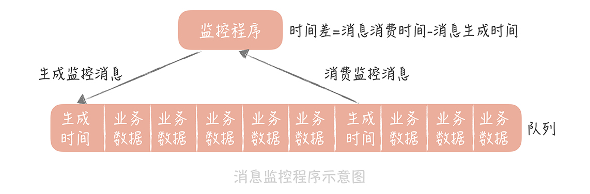

# 消息队列

## 秒杀时如何处理每秒上万次的下单请求

秒杀抢购就是最典型的高并发写请求的场景。

在秒杀开始之前大部分都是读请求，而且用户查询的是少量的商品数据，属于 **查询的热点数据** ，可以采用缓存策略，将请求尽量挡在上层的缓存中，能被静态化的数据，比如说商城里的图片和视频数据，**尽量做到静态化，这样就可以命中 CDN 节点缓存** ，减少 Web 服务器的查询量和带宽负担。Web 服务器比如 Nginx 可以直接访问分布式缓存节点，这样可以避免请求到达业务服务器。

当然，还可以加上一些限流的策略，比如，对于短时间之内来自某一个用户、某一个 IP 或者某一台设备的重复请求做丢弃处理。

通过这几种方式，就可以将请求尽量挡在数据库之外了。

秒杀开始之后，可以通过以下几种方式来应对高并发的写请求。

### 削去秒杀场景下的峰值写流量

将秒杀请求暂存在消息队列中，然后业务服务器会响应用户 「秒杀结果正在计算中」，释放了系统资源之后再处理其它用户的请求。

后台启动若干个队列处理程序，消费消息队列中的消息，再执行校验库存、下单等逻辑。**因为只有有限个队列处理线程在执行，所以落入后端数据库上的并发请求是有限的** 。而请求是可以在消息队列中被短暂地堆积， **当库存被消耗完之后，消息队列中堆积的请求就可以被丢弃了** 。


### 通过异步处理简化秒杀请求中的业务流程

将业务逻辑分成主要逻辑和次要逻辑，分开处理。比如下图先处理核心的订单业务逻辑，然后将消息继续放到消息队列里，等待其他的业务逻辑继续消费执行，不占用主要逻辑的时间。


### 解耦实现秒杀系统模块之间松耦合

将业务系统和数据系统解耦。比如下图中业务处理之后再把数据放到消息队列中供数据服务消费处理。


### 总结

* 削峰填谷是消息队列最主要的作用， **但是会造成请求处理的延迟** 。
* 异步处理是提升系统性能的神器，但是你需要分清同步流程和异步流程的边界，同时消息存在着丢失的风险，我们需要考虑如何确保消息一定到达。
  * 解耦合可以提升你的整体系统的鲁棒性。

## 消息消费

### 丢失消息

1. 消息生产的过程中丢失消息：消息重传。
2. 在消息队列中丢失消息：消息队列集群，kafka 设置 acks = all 或 acks = 1。
3. 消费过程中丢失消息：等到消息接收和处理完成后才能更新消费进度。

### 幂等

#### 常用的业务幂等性保证方法

> 1、利用数据库的唯一约束实现幂等

比如将订单表中的订单编号设置为唯一索引，创建订单时，根据订单编号就可以保证幂等。

> 2、消息表

这个方案本质也是根据数据库的唯一性约束来实现。其实现大体思路是：首先在消息表上建唯一索引，其次操作时把业务表和消息表放在同个本地事务中，消费完之后就往表里插入一条数据。如果出现重复消费，数据库会抛唯一约束异常，插入消息失败而视为已经消费过。

注：业务上，消息表的设计不应该以消息ID作为标识，而应该以业务的业务主键作为标识更为合理，以应对生产者的重发。阿里云上的消息去重只是RocketMQ的messageId，在生产者因为某些原因手动重发（例如上游针对一个交易重复请求了）的场景下起不到去重/幂等的效果（因消息id不同）。

> 3、多版本（乐观锁）控制

此方案多用于更新的场景下。其实现的大体思路是：给业务数据增加一个版本号属性，每次更新数据前，比较当前数据的版本号是否和消息中的版本一致，如果不一致则拒绝更新数据，更新数据的同时将版本号+1。

可参考 [阿里经典面试题：消息队列的消费幂等性如何保证？](https://objcoding.com/2021/07/27/message-dedup/)

## 消息延迟

### 监控消息延迟

#### kafka-consumer-groups.sh

首先，Kafka 提供了工具叫做 `kafka-consumer-groups.sh`（它在 Kafka 安装包的 bin 目录下）。

```
./bin/kafka-consumer-groups.sh --bootstrap-server localhost:9092 --describe --group test-consumer-group
```

* TOPIC、PARITION：话题名和分区名；
* CURRENT-OFFSET：当前消费者的消费进度；
* LOG-END-OFFSET：当前生产消息的总数；
* LAG：消费消息的堆积数（也就是 LOG-END-OFFSET - CURRENT-OFFSET）

通过这个命令你可以很方便地了解消费者的消费情况。

#### JMX

Kafka 通过 JMX 暴露了消息堆积的数据，我在本地启动了一个 console consumer，然后使用 jconsole 连接这个 consumer，你就可以看到这个 consumer 的堆积数据了

#### 生成监控消息

1. 你先定义一种特殊的消息。
2.  然后启动一个监控程序，将这个消息定时地循环写入到消息队列中。

    消息的内容可以是生成消息的时间戳，并且也会作为队列的消费者消费数据。
3. 业务处理程序消费到这个消息时直接丢弃掉，而监控程序在消费到这个消息时， **就可以和这个消息的生成时间做比较** ，如果时间差达到某一个阈值就可以向我们报警。



### 减少消息延迟

1. kafka 增加 partition。
2. 单 consumer 使用线程池去消费数据（需要注意消费线程空转的问题，拉取不到消息可以等待一段时间再来拉取，等待的时间不宜过长，否则会增加消息的延迟。一般建议固定的 10ms\~100ms，也可以按照一定步长递增，比如第一次拉取不到消息等待 10ms，第二次 20ms，最长可以到 100ms，直到拉取到消息再回到 10ms）。

#### kafka 为什么这么快

1. 消息在磁盘中顺序写入。
2. 利用partition并行消息处理，即使多个partition在同一个节点，也可以对应不同的磁盘，充分发挥多磁盘优势。
3. 利用了现代操作系统分页存储 Page Cache 来利用内存提高 I/O 效率。Page Cache 主要用来作为文件系统上的文件数据的缓存来用，尤其是针对当进程对文件有 read/write 操作的时候。当数据的请求到达时，如果在 Cache 中存在该数据且是最新的，则直接将数据传递给用户程序，免除了对底层磁盘的操作，提高了性能。 Buffer Cache 则主要是设计用来在系统对块设备进行读写的时候，对块进行数据缓存的系统来使用。在 Linux 的实现中，文件 Cache 分为两个层面，一是 Page Cache，另一个 Buffer Cache，每一个 Page Cache 包含若干 Buffer Cache。
4. 采用了零拷贝技术：Producer 生产的数据持久化到 Broker，采用 mmap 文件映射，实现顺序的快速写入;Customer 从 Broker 读取数据，采用 Sendfile，将磁盘文件读到 OS 内核缓冲区后，转到 NIO buffer进行网络发送，减少 CPU 消耗。
