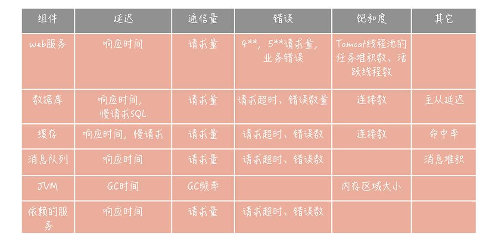
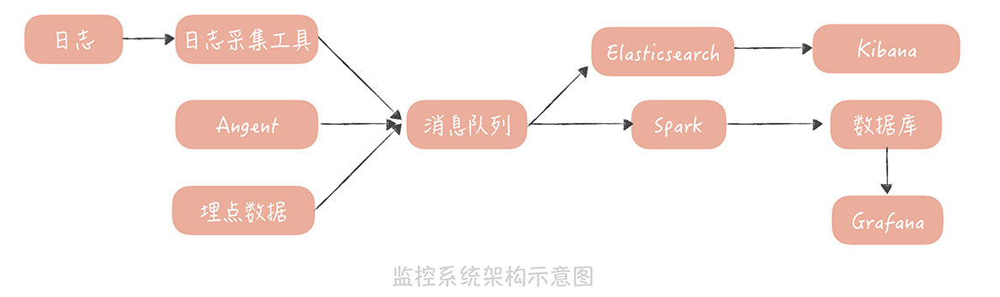
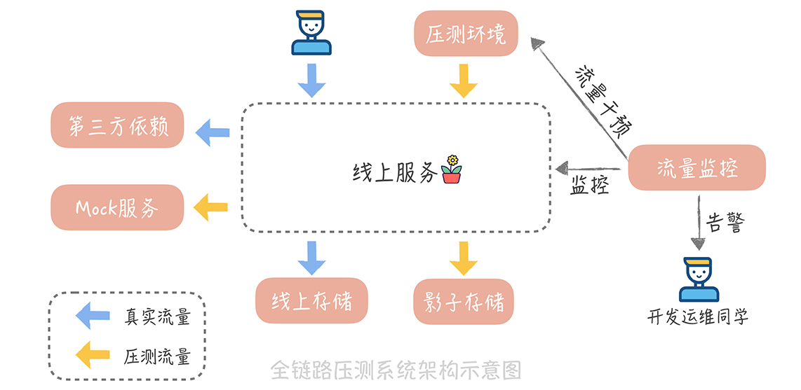
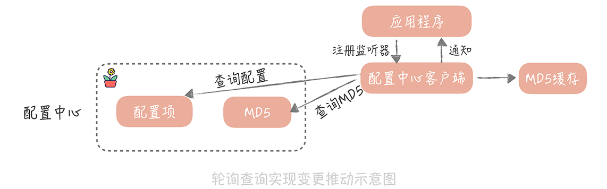
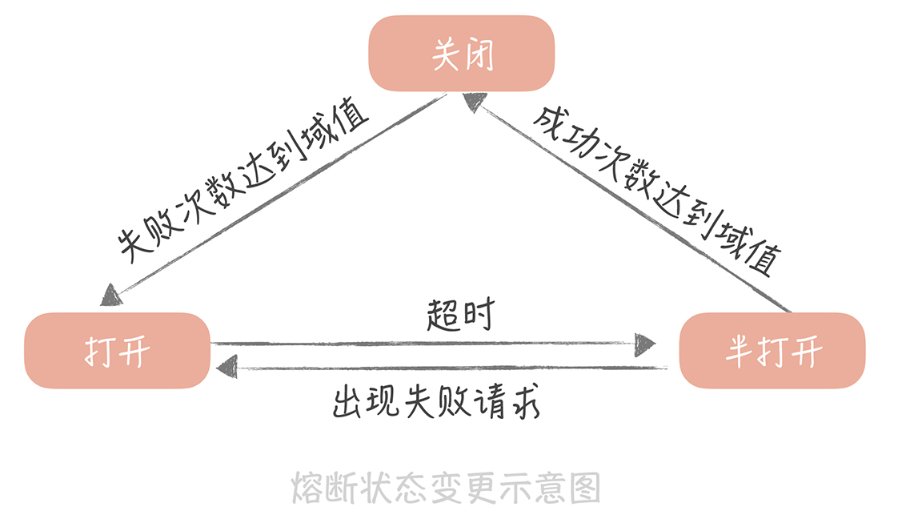
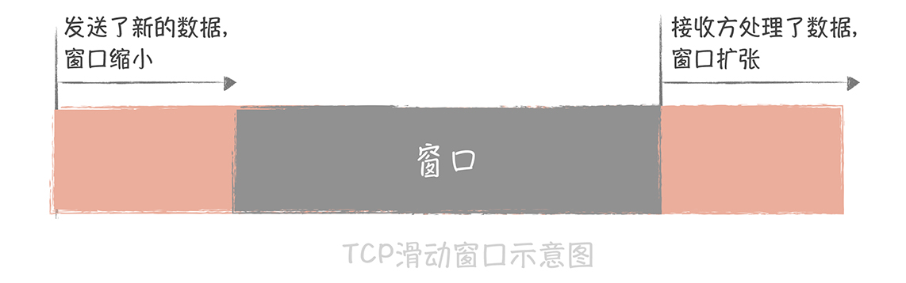
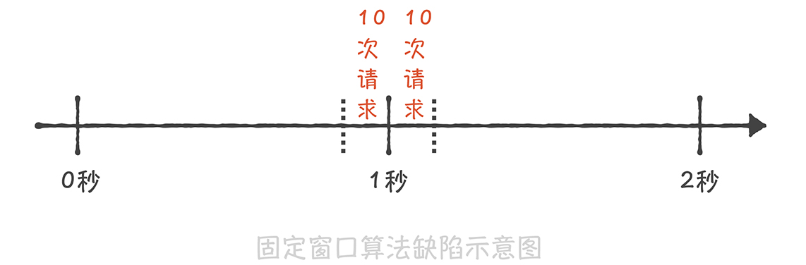
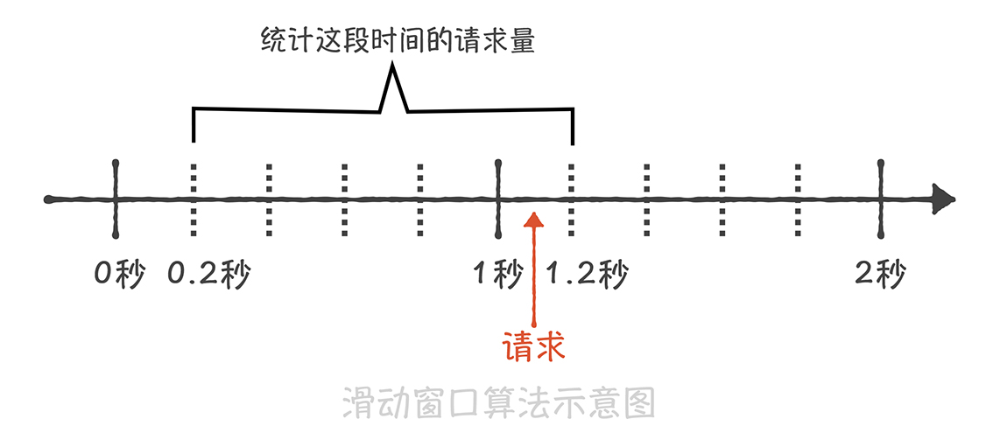
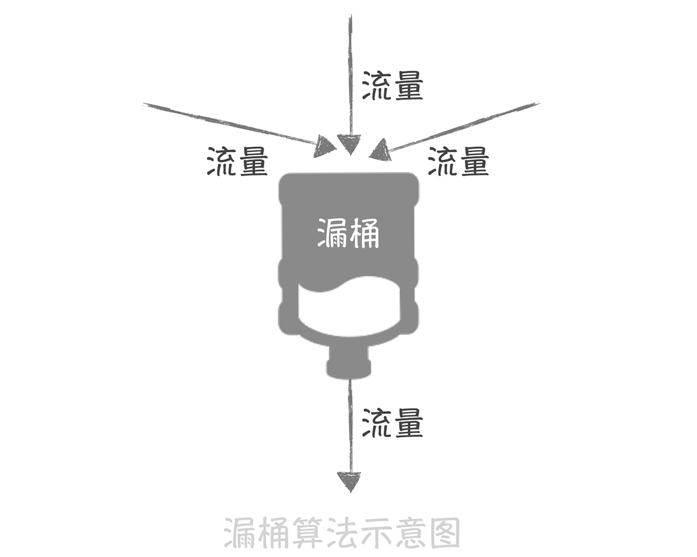
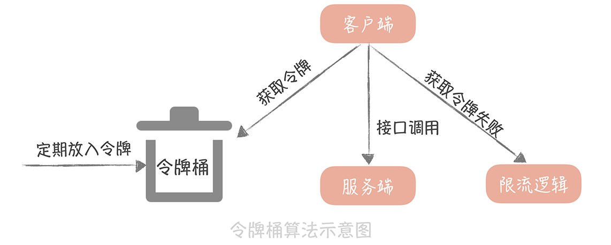

# 维护

## 服务端监控

### 监控指标

四个黄金信号（Four Golden Signals）：分别是延迟，通信量、错误和饱和度。

- 延迟指的是请求的响应时间。比如，接口的响应时间、访问数据库和缓存的响应时间。
- 通信量可以理解为吞吐量，也就是单位时间内，请求量的大小。比如，访问第三方服务的请求量，访问消息队列的请求量。
- 错误表示当前系统发生的错误数量。**这里需要注意的是，** 我们需要监控的错误既有显示的，比如在监控 Web 服务时，出现 `4xx` 和 `5xx` 的响应码；也有隐示的，比如，Web 服务虽然返回的响应码是 200，但是却发生了一些和业务相关的错误（出现了数组越界的异常或者空指针异常等），这些都是错误的范畴。
- 饱和度指的是服务或者资源到达上限的程度（也可以说是服务或者资源的利用率），比如说 CPU 的使用率，内存使用率，磁盘使用率，缓存数据库的连接数等等。

### 监控数据处理和存储

## 应用性能管理

应用性能管理（Application Performance Management，简称 APM）：对应用各个层面做全方位的监测，期望及时发现可能存在的问题，并加以解决，从而提升系统的性能和可用性。

服务端监控的核心关注点是后端服务的性能和可用性，而应用性能管理的核心关注点是终端用户的使用体验。

1. 从客户端采集到的数据可以用通用的消息格式，上传到 APM 服务端，服务端将数据存入到 Elasticsearch 中，以提供原始日志的查询，也可以依据这些数据形成客户端的监控报表；
2. 用户网络数据是我们排查客户端，和服务端交互过程的重要数据，你可以通过代码的植入，来获取到这些数据；
3. 无论是网络数据，还是异常数据，亦或是卡顿、崩溃、流量、耗电量等数据，你都可以通过把它们封装成 APM 消息格式，上传到 APM 服务端，这些用户在客户端上留下的踪迹可以帮助你更好地优化用户的使用体验。

具体可查看：[31丨应用性能管理：用户的使用体验应该如何监控？](https://zq99299.github.io/note-architect/hc/06/02.html)

## 压力测试

压力测试指的是，在高并发大流量下，进行的测试，测试人员可以通过观察系统在峰值负载下的表现，从而找到系统中存在的性能隐患。

与监控一样，压力测试是一种常见的，发现系统中存在问题的方式，也是保障系统可用性和稳定性的重要手段。而在压力测试的过程中，我们不能只针对某一个核心模块来做压测，而需要将接入层、所有后端服务、数据库、缓存、消息队列、中间件以及依赖的第三方服务系统及其资源，都纳入压力测试的目标之中。因为，一旦用户的访问行为增加，包含上述组件服务的整个链路都会受到不确定的大流量的冲击，因此，它们都需要依赖压力测试来发现可能存在的性能瓶颈， **这种针对整个调用链路执行的压力测试也称为「全链路压测」。**

### 全链路压测平台

- 流量构造和产生模块；
- 压测数据隔离模块；
- 系统健康度检查和压测流量干预模块。

#### 压测数据的产生

可以使用轻型的流量拷贝工具 GoReplay，它可以劫持本机某一个端口的流量，将它们记录在文件中，传送到流量数据工厂（HBase、MongoDB 这些 NoSQL 存储组件，或者亚马逊 S3 这些云存储服务中）中。这样可以将真实流量拷贝一份作为压测。

还需要对 **压测流量染色**：在 HTTP 的请求头中增加一个标记项，比如说叫做 is stress test。

#### 数据如何隔离

1. 如果数据存储在 MySQL 中，我们可以在同一个 MySQL 实例，不同的 Schema 中创建一套和线上相同的库表结构，并且把线上的数据也导入进来。
2. 而如果数据是放在 Redis 中，我们对压测流量产生的数据，增加一个统一的前缀，存储在同一份存储中。
3. 还有一些数据会存储在 Elasticsearch 中，针对这部分数据，我们可以放在另外一个单独的索引表中。

#### 压力测试如何实施

压测时先设定目标，再按照一定的步长（比如每次压测增加一万 QPS），逐渐地增加流量。在增加一次流量之后，让系统稳定运行一段时间，观察系统在性能上的表现。如果发现依赖的服务或者组件出现了瓶颈，可以先减少压测流量，比如，回退到上一次压测的 QPS，保证服务的稳定，再针对此服务或者组件进行扩容，然后再继续增加流量压测。

### 小结

1. 压力测试是一种发现系统性能隐患的重要手段，所以应该尽量使用正式的环境和数据；
2. 对压测的流量需要增加标记，这样就可以通过 Mock 第三方依赖服务和影子库的方式来实现压测数据和正式数据的隔离；
3. 压测时，应该实时地对系统性能指标做监控和告警，及时地对出现瓶颈的资源或者服务扩容，避免对正式环境产生影响。

这套全链路的压力测试系统对于我们来说有三方面的价值： 

- 其一，它可以帮助我们发现系统中可能出现的性能瓶颈，方便我们提前准备预案来应对；
- 其次，它也可以为我们做容量评估，提供数据上的支撑；
- 最后，我们也可以在压测的时候做预案演练，因为压测一般会安排在流量的低峰期进行，这样我们可以降级一些服务来验证预案效果，并且可以尽量减少对线上用户的影响。

## 配置管理

### 配置中心

携程开源的 Apollo，百度开源的 Disconf。

#### 配置信息如何存储

zk、etcd。

#### 变更推送如何实现

1. 轮询查询。
2. 长连推送。

轮询查询：可以定期（比如 1 分钟）查询所需要的配置是否有变化，如果有变化则通知触发监听器，让应用程序得到变更通知。可以在配置中心里存储一个根据配置项计算出来的 MD5 值，客户端轮询的时候只要每次查询 MD5 值查看是否变化，如果变化了则拉取最新的配置。

长连的方式，则是在配置中心服务端保存每个连接关注的配置项列表。这样，当配置中心感知到配置变化后，就可以通过这个连接，把变更的配置推送给客户端。这种方式需要保持长连，也需要保存连接和配置的对应关系，实现上要比轮询的方式复杂一些，但是相比轮询方式来说，能够更加实时地获取配置变更的消息。

大部分情况下可以使用轮询的方式。

#### 如何保证配置中心高可用

**需要让配置中心「旁路化」。** 也就是说，即使配置中心宕机，或者配置中心依赖的存储宕机，我们仍然能够保证应用程序是可以启动的。

一般会在配置中心的客户端上，增加两级缓存：第一级缓存是内存的缓存；另外一级缓存是文件的缓存。

配置中心客户端在获取到配置信息后，会同时把配置信息同步地写入到内存缓存，并且异步地写入到文件缓存中。内存缓存的作用是降低客户端和配置中心的交互频率，提升配置获取的性能；而文件的缓存的作用就是灾备，当应用程序重启时，一旦配置中心发生故障，那么应用程序就会优先使用文件中的配置，这样虽然无法得到配置的变更消息（因为配置中心已经宕机了），但是应用程序还是可以启动起来的，算是一种降级的方案。

## 降级熔断

在分布式环境下最怕的是服务或者组件慢，因为这样会导致调用者持有的资源无法释放，最终拖垮整体服务。

### 熔断

三种状态：关闭（调用远程服务）、半打开（尝试调用远程服务）和打开（返回错误）。

### 降级

开关降级：在代码中预先埋设一些 **开关**，用来控制服务调用的返回值。

只针对非核心服务来做降级处理，方案：

1. 读取数据的场景，直接返回降级数据（比如评论列表返回空）。
2. 轮询查询数据的场景，降低获取数据的频率。
3. 写数据的场景，同步写转换成异步写。

熔断和开关降级都是 **有损的处理方式**。

## 流量控制

### 限流

限流指的是通过限制到达系统的并发请求数量，保证系统能够正常响应部分用户请求，**而对于超过限制的流量，则只能通过拒绝服务的方式保证整体系统的可用性** 。限流策略一般部署在服务的入口层，比如 API 网关中，这样可以对系统整体流量做塑形。而在微服务架构中，你也可以在 RPC 客户端中引入限流的策略，来保证单个服务不会被过大的流量压垮。

#### tcp 滑动窗口限流

TCP 的滑动窗口：接收方所能提供的缓冲区的大小。

在接收方回复发送方的 ACK 消息中，会带上这个窗口的大小。这样，发送方就可以通过这个滑动窗口的大小决定发送数据的速率了。如果接收方处理了一些缓冲区的数据，那么这个滑动窗口就会变大，发送方发送数据的速率就会提升；反之，如果接收方接收了一些数据还没有来得及处理，那么这个滑动窗口就会减小，发送方发送数据的速率就会减慢。

### 限流算法

#### 固定窗口算法

如果这一分钟的请求量没有达到限制，那么在下一分钟到来的时候先重置请求量的计数，再统计这一分钟的请求量是否超过限制。

**这种算法虽然实现非常简单，但是却有一个很大的缺陷** ：无法限制短时间之内的集中流量。假如我们需要限制每秒钟只能处理 10 次请求，如果前一秒钟产生了 10 次请求，这 10 次请求全部集中在最后的 10 毫秒中，而下一秒钟的前 10 毫秒也产生了 10 次请求，那么在这 20 毫秒中就产生了 20 次请求，超过了限流的阈值。但是因为这 20 次请求分布在两个时间窗口内，所以没有触发限流，这就造成了限流的策略并没有生效。

#### 滑动窗口算法

这个算法的原理是将时间的窗口划分为多个小窗口，每个小窗口中都有单独的请求计数。比如下面这张图，我们将 1s 的时间窗口划分为 5 份，每一份就是 200ms；那么当在 1s 和 1.2s 之间来了一次新的请求时，我们就需要统计之前的一秒钟内的请求量，也就是 0.2s～1.2s 这个区间的总请求量，如果请求量超过了限流阈值那么就执行限流策略。

滑动窗口的算法解决了 **临界时间点上突发流量无法控制的问题**，但是却因为要存储每个小的时间窗口内的计数，所以空间复杂度有所增加。

### 漏桶算法

在流量产生端和接收端之间增加一个漏桶，流量会进入和暂存到漏桶里面，而漏桶的出口处会按照一个固定的速率将流量漏出到接收端（也就是服务接口）。

如果流入的流量在某一段时间内大增，超过了漏桶的承受极限，那么多余的流量就会触发限流策略，被拒绝服务。

在实现时，一般会使用消息队列作为漏桶的实现，流量首先被放入到消息队列中排队，由固定的几个队列处理程序来消费流量，如果消息队列中的流量溢出，那么后续的流量就会被拒绝。

### 令牌筒算法

- 如果我们需要在一秒内限制访问次数为 N 次，那么就每隔 1/N 的时间，往桶内放入一个令牌；
- 在处理请求之前先要从桶中获得一个令牌，如果桶中已经没有了令牌，那么就需要等待新的令牌或者直接拒绝服务；
- 桶中的令牌总数也要有一个限制，如果超过了限制就不能向桶中再增加新的令牌了。这样可以限制令牌的总数，一定程度上可以避免瞬时流量高峰的问题。

使用令牌桶算法就需要存储令牌的数量，如果是单机上实现限流的话，可以在进程中使用一个变量来存储；但是如果在分布式环境下，不同的机器之间无法共享进程中的变量，我们就一般会使用 Redis 来存储这个令牌的数量。这样的话，每次请求的时候都需要请求一次 Redis 来获取一个令牌，会增加几毫秒的延迟，性能上会有一些损耗。 **因此，一个折中的思路是：** 我们可以在每次取令牌的时候，不再只获取一个令牌，而是获取一批令牌，这样可以尽量减少请求 Redis 的次数。

