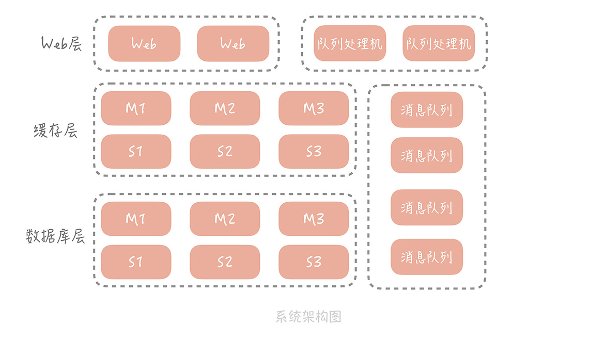
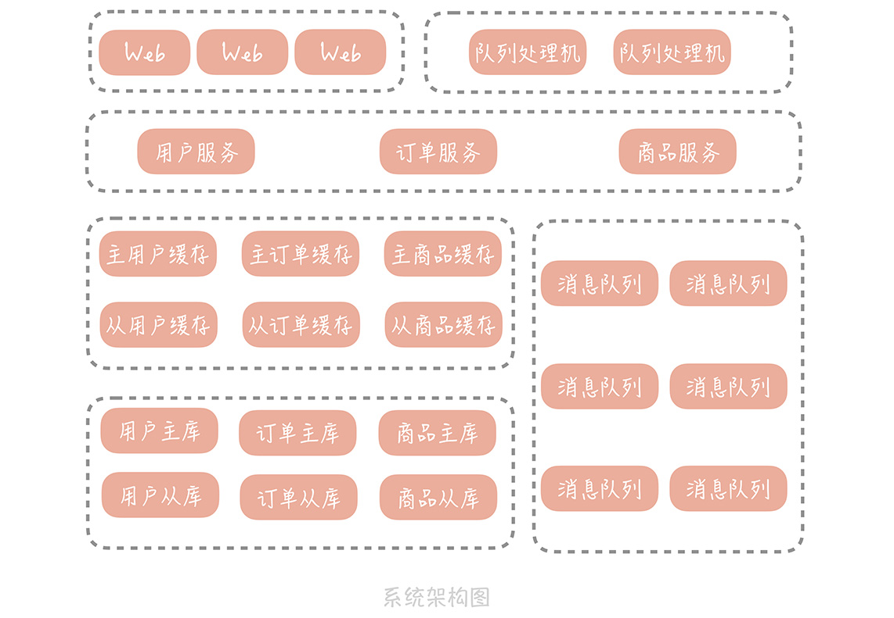
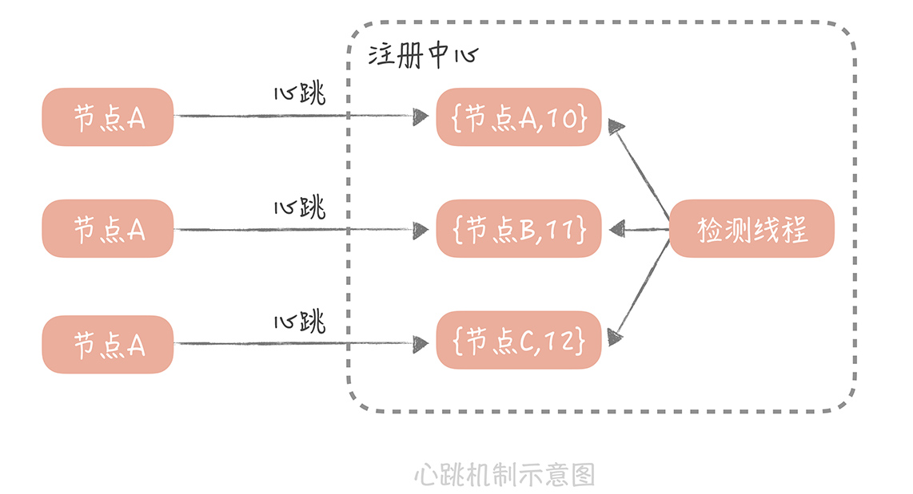
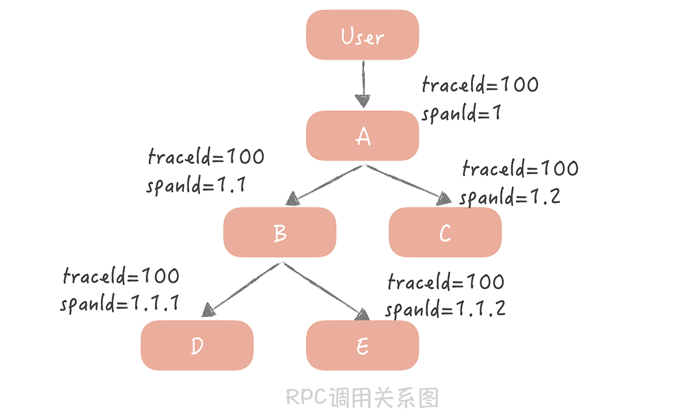
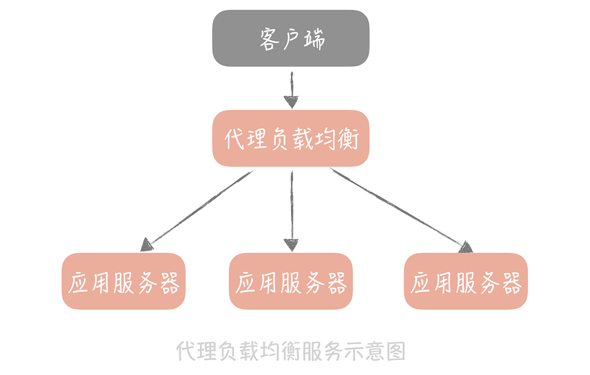
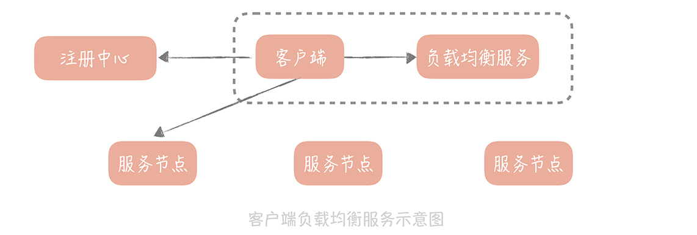
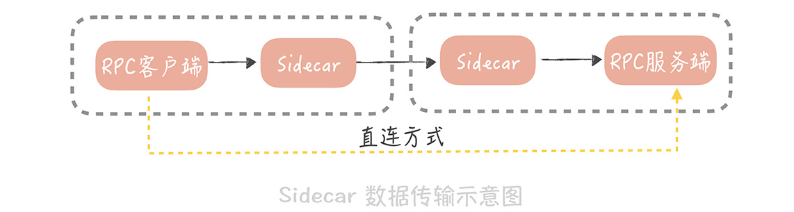
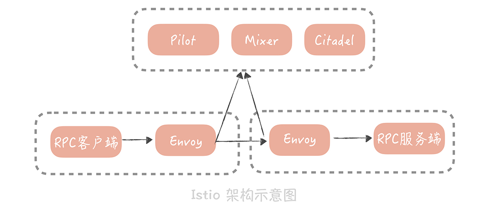
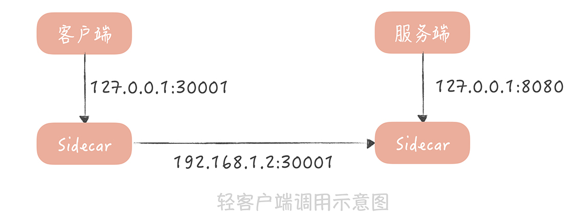

# 分布式服务

## 服务化拆分

DAU（（Daily Active User）。目前的系统架构：



### 一体化架构的痛点

1. 数据库连接数可能成为系统的瓶颈。连接 MySQL 的客户端数量有限制， **最多可以设置为 16384** 。
2. 一体化架构增加了研发的成本，抑制了研发效率的提升。功能之间耦合严重，可能你只是更改了很小的逻辑，却导致其它功能不可用，从而在测试时需要对整体功能回归。
3. 一体化架构对于系统的运维也会有很大的影响。一次构建的过程，包括编译、单元测试、打包和上传到正式环境，花费的时间可能达到十几分钟，并且，任何小的修改，都需要构建整个项目，上线变更的过程非常不灵活。

### 微服务拆分

1. 按照业务做横向拆分的方式，解决数据库层面的扩展性问题。
2. 可以将与业务无关的公用服务抽取出来，下沉成单独的服务。

## 系统架构改造

**微服务化之后，** 垂直电商系统的架构会将变成下面这样：



### 微服务拆分的原则

1. 做到单一服务内部功能的高内聚，和低耦合。
2. 服务拆分的粒度，先粗略拆分，再逐渐细化。
3. 拆分的过程，要尽量避免影响产品的日常功能迭代，也就是说，要一边做产品功能迭代，一边完成服务化拆分。
4. 服务接口的定义要具备可扩展性。

## RPC

RPC（Remote Procedure Call，远程过程调用），它指的是通过网络，调用另一台计算机上部署服务的技术。

**步骤如下：**

* 在 一次 RPC 调用过程中，客户端首先会将调用的类名、方法名、参数名、参数值等信息，序列化成二进制流；
* 然后客户端将二进制流，通过网络发送给服务端；
* 服务端接收到二进制流之后，将它反序列化，得到需要调用的类名、方法名、参数名和参数值，再通过动态代理的方式，调用对应的方法得到返回值；
* 服务端将返回值序列化，再通过网络发送给客户端；
* 客户端对结果反序列化之后，就可以得到调用的结果了。


如果要提升 RPC 框架的性能，需要从 **网络传输和序列化** 两方面来优化。

1. 选择高性能的 I/O 模型，同步多路 I/O 复用模型；
2. 调试网络参数，这里面有一些经验值的推荐。比如将 tcp\_nodelay 设置为 true，也有一些参数需要在运行中来调试，比如接受缓冲区和发送缓冲区的大小，客户端连接请求缓冲队列的大小（back log）等等；
3. 序列化协议依据具体业务来选择。如果对性能要求不高，可以选择 JSON，否则可以从 Thrift 和 Protobuf 中选择其一。

## 注册中心

注册中心可以实现不重启客户端，就能动态地变更服务节点，而且还可以实现优雅关闭的功能。

优雅关闭是你在系统研发过程中，必须要考虑的问题。对于 RPC 服务来说， 我们可以先将 RPC 服务从注册中心的服务列表中删除掉，然后观察 RPC 服务端没有流量之后，再将服务端停掉。有了优雅关闭之后，RPC 服务端再重启的时候，就会减少对客户端的影响。比如消息队列处理器就是要将所有已经从消息队列中读出的消息，处理完之后才能退出。

### 心跳模式

注册中心为每一个连接上来的 RPC 服务节点，**记录最近续约的时间** ，RPC 服务节点在启动注册到注册中心后，就按照一定的时间间隔（比如 30 秒），向注册中心发送心跳包。注册中心在接受到心跳包之后，会更新这个节点的最近续约时间。然后，注册中心会启动一个定时器，定期检测当前时间和节点，最近续约时间的差值，如果达到一个阈值（比如说 90 秒），那么认为这个服务节点不可用。



可以给注册中心增加保护策略：如果摘除的节点占到了服务集群节点数的 40%，就停止摘除服务节点，并且给服务的开发同学和运维同学报警处理（这个阈值百分比可以调整，保证了一定的灵活性）。这样可以避免服务节点被过度摘除，导致服务集群不足以承担流量的问题。

## 分布式 Trace

采用 `traceId + spanId` 这两个数据维度来记录服务之间的调用关系（这里 traceId 就是 requestId），也就是使用 traceId 串起单次请求，用 spanId 记录每一次 RPC 调用。



* 用户到 A 服务之后会初始化一个 traceId 为 100，spanId 为 1；
* A 服务调用 B 服务时，traceId 不变，而 spanId 用 1.1 标识，代表上一级的 spanId 是 1，这一级的调用次序是 1；
* A 调用 C 服务时，traceId 依然不变，spanId 则变为了 1.2，代表上一级的 spanId 还是 1，而调用次序则变成了 2，以此类推。

A 服务在发起 RPC 请求服务 B 前，先从线程上下文中获取当前的 traceId 和 spanId，然后，依据上面的逻辑生成本次 RPC 调用的 spanId，再将 spanId 和 traceId 序列化后，装配到请求体中，发送给服务方 B。

服务方 B 获取请求后，从请求体中反序列化出 spanId 和 traceId，同时设置到线程上下文中，以便给下次 RPC 调用使用。在服务 B 调用完成返回响应前，计算出服务 B 的执行时间发送给消息队列。

在服务 B 中，你依然可以使用**切面编程**的方式，得到所有调用的数据库、缓存、HTTP 服务的响应时间，只是在发送给消息队列的时候，要加上当前线程上下文中的 spanId 和 traceId。

这样，无论是数据库等资源的响应时间，还是 RPC 服务的响应时间就都汇总到了消息队列中，在经过一些处理之后，最终被写入到 Elasticsearch 中以便给开发和运维同学查询使用。

如果是自研的分布式 trace 中间件，那么一定要提供一个开关，方便在线上随时将日志打印关闭；如果使用开源的组件，可以开始设置一个较低的日志采样率，观察系统性能情况再调整到一个合适的数值。

### 小结

1. 对代码要无侵入，你可以使用切面编程的方式来解决；
2. 性能上要低损耗，我建议你采用**静态代理**和日志采样的方式，来尽量减少追踪日志对于系统性能的影响；
3. 无论是单体系统还是服务化架构，无论是服务追踪还是业务问题排查，你都需要在日志中增加 requestId，这样可以将你的日志串起来，给你呈现一个完整的问题场景。如果 requestId 可以在客户端上生成，在请求业务接口的时候传递给服务端，那么就可以把客户端的日志体系也整合进来，对于问题的排查帮助更大。

可以采用 Zipkin，Jaeger 这样的开源解决方案。

附：

**动态地将代码切入到类的指定方法、指定位置上的编程思想就是面向切面的编程**。

**一般来说，切面编程的实现分为两类：**

* 一类是静态代理，典型的代表是 AspectJ，它的特点是**在编译期**做切面代码注入；
* 另一类是动态代理，典型的代表是 Spring AOP，它的特点是在**运行期**做切面代码注入。

## 负载均衡

### 负载均衡服务器的种类

负载均衡服务大体上可以分为两大类：一类是 **代理类的负载均衡服务** ；另一类是 **客户端负载均衡服务** 。

#### 代理类的负载均衡服务

代理类的负载均衡服务，以单独的服务方式部署，所有的请求都要先经过负载均衡服务，在负载均衡服务中，选出一个合适的服务节点后，再由负载均衡服务，调用这个服务节点来实现流量的分发。



由于这类服务需要承担全量的请求，所以对于性能的要求极高。代理类的负载均衡服务有很多开源实现，比较著名的有 LVS，Nginx 等等。LVS 在 OSI 网络模型中的第四层，传输层工作，所以 LVS 又可以称为四层负载；而 Nginx 运行在 OSI 网络模型中的第七层，应用层，所以又可以称它为七层负载（你可以回顾一下02 讲的内容）。

在项目的架构中，我们一般会同时部署 LVS 和 Nginx 来做 HTTP 应用服务的负载均衡。也就是说，在入口处部署 LVS，将流量分发到多个 Nginx 服务器上，再由 Nginx 服务器分发到应用服务器上， **为什么这么做呢？**

主要和 LVS 和 Nginx 的特点有关，LVS 是在网络栈的四层做请求包的转发，请求包转发之后，由客户端和后端服务直接建立连接，后续的响应包不会再经过 LVS 服务器，所以相比 Nginx，性能会更高，也能够承担更高的并发。

可 LVS 缺陷是工作在四层，而请求的 URL 是七层的概念，不能针对 URL 做更细致地请求分发，而且 LVS 也没有提供探测后端服务是否存活的机制；而 Nginx 虽然比 LVS 的性能差很多，但也可以承担每秒几万次的请求，并且它在配置上更加灵活，还可以感知后端服务是否出现问题。

一般使用 Nginx 即可。

#### 客户端负载均衡服务

**客户端负载均衡服务，也就是把负载均衡的服务内嵌在 RPC 客户端中。**



负载均衡策略从大体上来看可以分为两类：

* 一类是静态策略，也就是说负载均衡服务器在选择服务节点时，不会参考后端服务的实际运行的状态。
* 一类是动态策略，也就是说负载均衡服务器会依据后端服务的一些负载特性，来决定要选择哪一个服务节点。

**静态策略**

轮询（RoundRobin，RR)：按照服务列表的顺序，请求下一个后端服务节点。

带权重的轮询：比如给 8 核 8G 的机器配置权重为 2，那么就会给它分配双倍的流量。

除了这两种策略之外，目前开源的负载均衡服务还提供了很多静态策略：

* Nginx 提供了 ip\_hash 和 url\_hash 算法；
* LVS 提供了按照请求的源地址，和目的地址做 hash 的策略；
* Dubbo 也提供了随机选取策略，以及一致性 hash 的策略。

Nginx 就会优先使用轮询的策略。

**动态策略**

在负载均衡服务器上会收集对后端服务的调用信息，比如从负载均衡端到后端服务的活跃连接数，或者是调用的响应时间，然后从中选择连接数最少的服务，或者响应时间最短的后端服务：

* Dubbo 提供的 LeastAcive 策略，就是优先选择活跃连接数最少的服务；
* Spring Cloud 全家桶中的 Ribbon 提供了 WeightedResponseTimeRule 是使用响应时间，给每个服务节点计算一个权重，然后依据这个权重，来给调用方分配服务节点。

### 检测节点是否故障

Nginx 模块 `nginx_upstream_check_module` ，这个模块可以让 Nginx 定期地探测后端服务的一个指定的接口，然后根据返回的状态码，来判断服务是否还存活。当探测不存活的次数达到一定阈值时，就自动将这个后端服务从负载均衡服务器中摘除。 它的配置样例如下：

```
upstream server {
        server 192.168.1.1:8080;
        server 192.168.1.2:8080;
        // 检测间隔为 3 秒，检测超时时间是 1 秒，使用 http 协议。如果连续失败次数达到 5 次就认为服务不可用；如果连续连续成功次数达到 2 次，则认为服务可用。后端服务刚启动时状态是不可用的
        check interval=3000 rise=2 fall=5 timeout=1000 type=http default_down=true;
        check_http_send "GET /health_check HTTP/1.0\r\n\r\n"; // 检测 URL
        check_http_expect_alive http_2xx; // 检测返回状态码为 200 时认为检测成功
}
```

Nginx 按照上面的方式配置之后，你的业务服务器也要实现一个 `/health_check` 的接口，在这个接口中返回的 HTTP 状态码，这个返回的状态码可以存储在配置中心中，这样在变更状态码时，就不需要重启服务了。

有了节点检测功能之后，服务是如何启动和关闭的：

**在服务刚刚启动时，** 可以初始化默认的 HTTP 状态码是 500，这样 Nginx 就不会很快将这个服务节点标记为可用，也就可以等待服务中，依赖的资源初始化完成，避免服务初始启动时的波动。

**在完全初始化之后，** 再将 HTTP 状态码变更为 200，Nginx 经过两次探测后，就会标记服务为可用。

**在服务关闭时**，也应该**先将** HTTP 状态码变更为 500，等待 Nginx 探测将服务标记为不可用后，前端的流量也就不会继续发往这个服务节点。在等待服务正在处理的请求全部处理完毕之后，再对服务做重启，可以避免直接重启导致正在处理的请求失败的问题。

### 拓展

*   对于普通 web 服务，nginx 有办法感知新增结点吗？

    有一种 consul + nginx 方案，就是把节点信息写在 consul 里面，这样当节点变化时，nginx 可以得到通知。
* 关闭服务之前，用 503 状态码响应健康检查语义更明确一些。

## API 网关

1. API 网关分为入口网关和出口网关两类，入口网关作用很多，可以隔离客户端和微服务，从中提供协议转换、安全策略、认证、限流、熔断等功能。出口网关主要是为调用第三方服务提供统一的出口，在其中可以对调用外部的 API 做统一的认证、授权，审计以及访问控制；
2. API 网关的实现重点在于性能和扩展性，你可以使用多路 I/O 复用模型和线程池并发处理，来提升网关性能，使用责任链模式来提升网关的扩展性；
3. API 网关中的线程池，可以针对不同的接口或者服务做隔离和保护，这样可以提升网关的可用性；
4. API 网关可以替代原本系统中的 Web 层，将 Web 层中的协议转换、认证、限流等功能挪入到 API 网关中，将服务聚合的逻辑下沉到服务层。

## 多机房部署

* 不同机房的数据传输延迟，是造成多机房部署困难的主要原因，你需要知道，同城多机房的延迟一般在 1ms\~3ms，异地机房的延迟在 50ms 以下，而跨国机房的延迟在 200ms 以下。
* 同城多机房方案可以允许有跨机房数据写入的发生，但是数据的读取，和服务的调用应该尽量保证在同一个机房中。
* 异地多活方案则应该避免跨机房同步的数据写入和读取，而是采取异步的方式，将数据从一个机房同步到另一个机房。

## ServiceMesh

Service Mesh 主要处理服务之间的通信，它的主要实现形式就是在应用程序同主机上部署一个代理程序，一般来讲，我们将这个代理程序称为 **Sidecar（边车）**，服务之间的通信也从之前的，客户端和服务端直连，变成了下面这种形式：



在这种形式下，RPC 客户端将数据包先发送给，与自身同主机部署的 Sidecar，在 Sidecar 中经过服务发现、负载均衡、服务路由、流量控制之后，再将数据发往指定服务节点的 Sidecar，在服务节点的 Sidecar 中，经过记录访问日志、记录分布式追踪日志、限流之后，再将数据发送给 RPC 服务端。

这种方式，可以把业务代码和服务治理的策略隔离开，将服务治理策略下沉，让它成为独立的基础模块。这样一来，不仅可以实现跨语言，服务治理策略的复用，还能对这些 Sidecar 做统一的管理。

istio:



将组件分为 **数据平面** 和 **控制平面**：

* 数据平面就是我提到的 Sidecar（Istio 使用 Envoy 作为 Sidecar 的实现）。
* 控制平面主要负责服务治理策略的执行，在 Istio 中，主要分为 Mixer、Pilot 和 Istio-auth 三部分。

在 Istio 中，每次请求都需要经过控制平面，也就是说，每次请求都需要跨网络的调用 Mixer，这会极大地影响性能。

因此，国内大厂开源出来的 Service Mesh 方案中，一般只借鉴 Istio 的数据平面和控制平面的思路，然后将服务治理策略做到了 Sidecar 中，控制平面只负责策略的下发，这样就不需要每次请求都经过控制平面，性能上会改善很多。

Sidecar 的植入方式目前主要有两种实现方式，一种是使用 iptables 实现流量的劫持；另一种是通过轻量级客户端来实现流量转发。

轻客户端方式下，RPC 客户端会通过配置的方式，知道 Sidecar 的部署端口，然后通过一个轻量级客户端，将调用服务的请求发送给 Sidecar，Sidecar 在转发请求之前，先执行一些服务治理的策略，比如说，从注册中心中，查询到服务节点信息并且缓存起来，然后从服务节点中，使用某种负载均衡的策略选出一个节点等等。

请求被发送到服务端的 Sidecar 上后，然后在服务端记录访问日志，和分布式追踪日志，再把请求转发到真正的服务节点上。当然，服务节点在启动时，会委托服务端 Sidecar，向注册中心注册节点，Sidecar 也就知道了真正服务节点部署的端口是多少。整个请求过程如图所示：



SOFAMesh 是蚂蚁金服开源的 Service Mesh 组件，在蚂蚁金服已经有大规模落地的经验。
