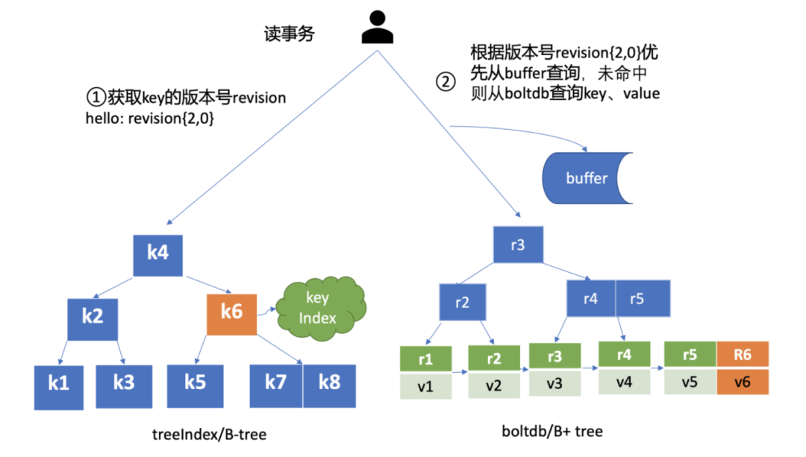

# etcd

一个高可用的分布式键值(key-value)数据库。etcd 内部采用 `raft` 协议作为一致性算法，etcd 基于 Go 语言实现。

## 架构图


etcd 主要分为四个部分：

- HTTP Server：用于处理用户发送的 API 请求以及其它 etcd 节点的同步与心跳信息请求。
- Store：用于处理 etcd 支持的各类功能的事务，包括数据索引、节点状态变更、监控与反馈、事件处理与执行等等，是 etcd 对用户提供的大多数 API 功能的具体实现。
- Raft：Raft 强一致性算法的具体实现，是 etcd 的核心。
- WAL：Write Ahead Log（预写式日志），是 etcd 的数据存储方式。除了在内存中存有所有数据的状态以及节点的索引以外，etcd 就通过 WAL 进行持久化存储。WAL 中，所有的数据提交前都会事先记录日志。
  - Snapshot 是为了防止数据过多而进行的状态快照；
  - Entry 表示存储的具体日志内容。

通常，一个用户的请求发送过来，会经由 HTTP Server 转发给 Store 进行具体的事务处理，如果涉及到节点的修改，则交给 Raft 模块进行状态的变更、日志的记录，然后再同步给别的节点以确认数据提交，最后进行数据的提交。


## 主要功能

### 服务发现


Provider 注册地址到注册中心，Consumer 就可以从注册中心读取和订阅 Provider 地址列表。同时也可以加入负载均衡器，比如 ELB（Elastic Load Balancer）。客户端通过负载均衡器向服务发出请求。负载均衡器查询服务注册中心并将每个请求路由到可用的服务实例。

- 强一致性、高可用的服务存储目录。 
- 一种注册服务和服务健康状况的机制。 用户可以在 etcd 中注册服务，并且对注册的服务配置 key TTL，定时保持服务的心跳以达到监控健康状态的效果。
- 一种查找和连接服务的机制。通过在 etcd 指定的主题下注册的服务也能在对应的主题下查找到。

### 消息发布与订阅


用在启动的时候主动从etcd获取一次配置信息，同时，在etcd节点上注册一个Watcher并等待，以后每次配置有更新的时候，etcd都会实时通知订阅者，以此达到获取最新配置信息的目的。

### 分布式锁

#### 机制

etcd 支持以下功能，正是依赖这些功能来实现分布式锁的：

- Lease 机制：即租约机制（TTL，Time To Live），Etcd 可以为存储的 KV 对设置租约，当租约到期，KV 将失效删除；同时也支持续约，即 KeepAlive。

- Revision 机制：每个 key 带有一个 Revision 属性值，etcd 每进行一次事务对应的全局 Revision 值都会加一，因此每个 key 对应的 Revision 属性值都是全局唯一的。通过比较 Revision 的大小就可以知道进行写操作的顺序。

  在实现分布式锁时，多个程序同时抢锁，根据 Revision 值大小依次获得锁，可以避免 “羊群效应” （也称 “惊群效应”），实现公平锁。

  > 羊群效应：羊群是一种很散乱的组织，平时在一起也是盲目地左冲右撞，但一旦有一只头羊动起来，其他的羊也会不假思索地一哄而上，全然不顾旁边可能有的狼和不远处更好的草。
  >
  > etcd的Revision机制，可以根据Revision号的大小顺序进行写操作，因而可以避免“羊群效应”。
  >
  > 这和zookeeper的临时顺序节点+监听机制可以避免羊群效应的原理是一致的。

- Prefix 机制：即前缀机制，也称目录机制。可以根据前缀（目录）获取该目录下所有的 key 及对应的属性（包括 key, value 以及 revision 等）。

- Watch 机制：即监听机制，Watch 机制支持 Watch 某个固定的 key，也支持 Watch 一个目录（前缀机制），当被 Watch 的 key 或目录发生变化，客户端将收到通知。

#### 过程


实现过程：

下面描述了使用 Etcd 实现分布式锁的业务流程，假设对某个共享资源设置的锁名为：`/lock/mylock`。

**步骤1：准备**

客户端连接 Etcd，以 `/lock/mylock` 为前缀创建全局唯一的 Key，假设第一个客户端对应的 `Key="/lock/mylock/UUID1"`，第二个为 `Key="/lock/mylock/UUID2"`；客户端分别为自己的 Key 创建租约 Lease，租约的长度根据业务耗时确定，假设为 15s。

**步骤2：创建定时任务作为租约的“心跳”**

在一个客户端持有锁期间，其它客户端只能等待，为了避免等待期间租约失效，客户端需创建一个定时任务作为“心跳”进行续约。此外，如果持有锁期间客户端崩溃，心跳停止，Key 将因租约到期而被删除，从而锁释放，避免死锁。

**步骤3：客户端将自己全局唯一的 Key 写入 Etcd**

进行 Put 操作，将步骤 1 中创建的 Key 绑定租约写入 Etcd，根据 Etcd 的 Revision 机制，假设两个客户端 Put 操作返回的 Revision 分别为1、2，客户端需记录 Revision 用以接下来判断自己是否获得锁。

**步骤4：客户端判断是否获得锁**

客户端以前缀 `/lock/mylock` 读取 Key-Value 列表（Key-Value 中带有 Key 对应的 Revision），判断自己 Key 的 Revision 是否为当前列表中最小的，如果是则认为获得锁；否则监听列表中前一个 Revision 比自己小的 Key 的删除事件，一旦监听到删除事件或者因租约失效而删除的事件，则自己获得锁。

**步骤5：执行业务**

获得锁后，操作共享资源，执行业务代码。

**步骤6：释放锁**

完成业务流程后，删除对应的 Key 释放锁。


## MVCC 与 boltdb

以下内容参考

 [MVCC 在 etcd 中的实现](https://blog.betacat.io/post/mvcc-implementation-in-etcd/) 

[深入理解etcd（二）：MVCC机制](http://www.jcxioo.com/2021/07/22/01_Kubernetes/etcd%20mvcc/)

[MVCC：如何实现多版本并发控制？](https://www.modb.pro/db/150570)

### MVCC

在数据库领域，面对高并发环境下数据冲突的问题，业界常用的解决方案有两种：

1. 想办法避免冲突。使用**悲观锁**来确保同一时刻只有一人能对数据进行更改，常见的实现有读写锁（Read/Write Locks）、两阶段锁（Two-Phase Locking）等。
2. 允许冲突，但发生冲突的时候，要有能力检测到。这种方法被称为**乐观锁**，即先乐观的认为冲突不会发生，除非被证明（检测到）当前确实产生冲突了。常见的实现有逻辑时钟（Logical Clock）、[MVCC](https://en.wikipedia.org/wiki/Multiversion_concurrency_control)（Multi-version Cocurrent Control）等。

MVCC（Multiversion Concurrency Control）多版本并发控制机制，**保存一个数据的多个历史版本**以解决事务管理中数据隔离的问题，被主流数据库采用，包括Oracle, MySQL等。

写一个数据项时，不是简单的用新值覆盖旧值，而是为这一项添加一个新版本的数据；

读一个数据项时，先确定版本，再根据版本找到对应的值；

这样保证了读写隔离，无需锁协调。读不会阻塞，适合“读多写少”的etcd。

etcd 的 mvcc 特点：

- 可以保存一个Key-Value数据的多个历史版本。
- 每修改（新增/删除）一次都会生成一个新的数据记录。
- 指定版本号读取数据时，实际访问的是版本号生成的那个时间点的快照。


其中 etcd 中有几个关键的数据结构需要了解：

#### revision

[revision](https://github.com/etcd-io/etcd/blob/v3.3.10/mvcc/revision.go) 即对应到MVCC中的版本，etcd 中的每一次`key-value`的操作都会有一个相应的 `revision`。

```go
// A revision indicates modification of the key-value space.
// The set of changes that share same main revision changes the key-value space atomically.
type revision struct {
    // main is the main revision of a set of changes that happen atomically.
    main int64

    // sub is the the sub revision of a change in a set of changes that happen
    // atomically. Each change has different increasing sub revision in that
    // set.
    sub int64
}
```

main 属性对应事务 ID，全局递增不重复，它在 etcd 中被当做一个逻辑时钟来使用。sub 代表一次事务中不同的修改操作（如put和delete）编号，从0开始依次递增。所以在一次事务中，每一个修改操作所绑定的`revision`依次为`{txID, 0}`, `{txID, 1}`, `{txID, 2}`…

比如启动一个空集群，全局版本号默认为 1，执行下面的 txn 事务，它包含两次 put、一次 get 操作，那么按照我们上面介绍的原理，全局版本号随读写事务自增，因此 main 为 2，sub 随事务内的 put/delete 操作递增，因此 key hello 的 revison 为{2,0}，key world 的 revision 为{2,1}。

#### keyIndex

[keyIndex](https://github.com/etcd-io/etcd/blob/v3.3.10/mvcc/key_index.go)用来记录一个key的生命周期中所涉及过的版本（revision）。

```go
type keyIndex struct {
    key         []byte
    modified    revision // the main rev of the last modification
    generations []generation
}
// generation contains multiple revisions of a key.
type generation struct {
    ver     int64
    created revision // when the generation is created (put in first revision).
    revs    []revision
}
```

它保存的是当前`key`的具体值（key），最近一次修改的版本号（modified），以及记录`key`生命周期的`generation`，一个`generation`代表了一个`key`从创建到被删除的过程。generations 代表在它这一代中，所经历过的版本变更。

keyIndex 作用：可以通过 key 来查询到这个 key 所有的版本。

#### treeIndex

[treeIndex](https://github.com/etcd-io/etcd/blob/v3.3.10/mvcc/index.go)顾名思义就是一个树状索引，它通过在内存中维护一个[B树](https://github.com/google/btree)，来达到加速查询 key 的功能。

这棵树的每一个节点都是上面的`keyIndex`，主要用于加速通过 key 查询到 keyIndex 的过程。


为什么用 b 树而不是 b+ 树？

因为 b 树非叶子节点也会存储数据，可以更快查询到数据。而 b+ 树必须得查到叶子节点。并且在目前的场景下不需要范围查询。

#### backend

作持久化 KV 操作，目前支持boltdb。

- ReadTx 读事务接口
- BatchTx 写事务接口
- Buffer 缓存

基于B+ Tree的支持事务的KV嵌入式数据库。

- K：revision
- V：{用户的kv，版本号，lease信息等}

#### 架构图


总的来说，**内存里的 treeIndex b 树 维护的是 key 到 keyIndex 的映射，keyIndex 内维护多版本的 revision 信息，而 revision 可以映射到磁盘 bolt中 具体的 value 。下面这个图很好的表示了这个过程**


#### MVCC 更新 key 原理


含义分别如下：

- create_revision 表示此 key 创建时的版本号。在我们的案例中，key hello 是第一次创建，那么值就是 2。当你再次修改 key hello 的时候，写事务会从 treeIndex 模块查询 hello 第一次创建的版本号，也就是 keyIndex.generations[i].created 字段，赋值给 create_revision 字段；
- mod_revision 表示 key 最后一次修改时的版本号，即 put 操作发生时的全局版本号加 1；
- version 表示此 key 的修改次数。每次修改的时候，写事务会从 treeIndex 模块查询 hello 已经历过的修改次数，也就是 keyIndex.generations[i].ver 字段，将 ver 字段值加 1 后，赋值给 version 字段。

填充好 boltdb 的 KeyValue 结构体后，这时就可以通过 Backend 的写事务 batchTx 接口将 key{2,0},value 为 mvccpb.KeyValue 保存到 boltdb 的缓存中，并同步更新 buffer，此时存储到 boltdb 中的 key、value 数据如下：


keyIndex 填充后的结果如下所示：

```go
key hello 的 keyIndex:
key:     "hello"
modified: <2,0>
generations:
[{ver:1,created:<2,0>,revisions: [<2,0>]} ]
```

- key 为 hello，modified 为最后一次修改版本号 <2,0>，key hello 是首次创建的，因此新增一个 generation 代跟踪它的生命周期、修改记录；
- generation 的 ver 表示修改次数，首次创建为 1，后续随着修改操作递增；
- generation.created 表示创建 generation 时的版本号为 <2,0>；
- revision 数组保存对此 key 修改的版本号列表，每次修改都会将相应的版本号追加到 revisions 数组中。

为了提升 etcd 的写吞吐量、性能，通过事务批量提交，定时将 boltdb 页缓存中的脏数据提交到持久化存储磁盘中。


#### MVCC 查询 key 原理

并发读特性的核心原理是创建读事务对象时，它会全量拷贝当前写事务未提交的 buffer 数据（相当于做一个快照，有点像 mysql 的快照读），并发的读写事务不再阻塞在一个 buffer 资源锁上，实现了全并发读。





首先需要根据 key 从 treeIndex 模块获取版本号，因我们未带版本号读，默认是读取最新的数据。treeIndex 模块从 B-tree 中，根据 key 查找到 keyIndex 对象后，匹配有效的 generation，返回 generation 的 revisions 数组中最后一个版本号{2,0}给读事务对象。

读事务对象根据此版本号为 key，通过 Backend 的并发读事务（ConcurrentReadTx）接口，优先从 buffer 中查询，命中则直接返回，否则从 boltdb 中查询此 key 的 value 信息。

**当你再次发起一个 put hello 为 world2 修改操作时**，key hello 对应的 keyIndex 的结果如下面所示，keyIndex.modified 字段更新为 <3,0>，generation 的 revision 数组追加最新的版本号 <3,0>，ver 修改为 2。

```go
key hello 的 keyIndex:
key:     "hello"
modified: <3,0>
generations:
[{ver:2,created:<2,0>,revisions: [<2,0>,<3,0>]}]
```

boltdb 插入一个新的 key revision{3,0}，此时存储到 boltdb 中的 key-value 数据如下：


这时你再发起一个指定历史版本号为 2 的读请求时，实际是读版本号为 2 的时间点的**快照数据**。treeIndex 模块会遍历 generation 内的历史版本号，返回小于等于 2 的最大历史版本号，在我们这个案例中，也就是 revision{2,0}，以它作为 boltdb 的 key，从 boltdb 中查询出 value 即可。

>  这就和 mysql 的 RR（可重复读） 隔离级别的快照读非常相似，A 事务开启时就会给当前数据做一个快照，然后查询数据只在这个快照里进行，B 事务更新提交了数据不会影响 A 事务对快照数据的读取，所以是可重复读，除非 A 事务发生了当前读。


#### MVCC 删除 key 原理

与更新 key 不一样之处在于，一方面，生成的 boltdb key 版本号{4,0,t}追加了删除标识（tombstone, 简写 t），boltdb value 变成只含用户 key 的 KeyValue 结构体。另一方面 treeIndex 模块也会给此 key hello 对应的 keyIndex 对象，追加一个空的 generation 对象，表示此索引对应的 key 被删除了。

当你再次查询 hello 的时候，treeIndex 模块根据 key hello 查找到 keyindex 对象后，若发现其存在空的 generation 对象，并且查询的版本号大于等于被删除时的版本号，则会返回空。

```go
key hello 的 keyIndex:
key:     "hello"
modified: <4,0>
generations:
[
{ver:3,created:<2,0>,revisions: [<2,0>,<3,0>,<4,0>(t)]}，             
{empty}
]
```

boltdb 此时会插入一个新的 key revision{4,0,t}，此时存储到 boltdb 中的 key-value 数据如下：


- 一方面删除 key 时会生成 events，Watch 模块根据 key 的删除标识，会生成对应的 Delete 事件。
- 另一方面，当你重启 etcd，遍历 boltdb 中的 key 构建 treeIndex 内存树时，你需要知道哪些 key 是已经被删除的，并为对应的 key 索引生成 tombstone 标识。而真正删除 treeIndex 中的索引对象、boltdb 中的 key 是通过压缩 (compactor) 组件异步完成。

正因为 etcd 的删除 key 操作是基于以上延期删除原理实现的，因此只要压缩组件未回收历史版本，我们就能从 etcd 中找回误删的数据。

### 小结

treeIndex 模块基于 Google 开源的 btree 库实现，它的核心数据结构 keyIndex，保存了用户 key 与版本号关系。每次修改 key 都会生成新的版本号，生成新的 boltdb key-value。boltdb 的 key 为版本号，value 包含用户 key-value、各种版本号、lease 的 mvccpb.KeyValue 结构体。

当你未带版本号查询 key 时，etcd 返回的是 key 最新版本数据。当你指定版本号读取数据时，etcd 实际上返回的是版本号生成那个时间点的快照数据。

删除一个数据时，etcd 并未真正删除它，而是基于 lazy delete 实现的异步删除。删除原理本质上与更新操作类似，只不过 boltdb 的 key 会打上删除标记，keyIndex 索引中追加空的 generation。真正删除 key 是通过 etcd 的压缩组件去异步实现的。

基于以上原理特性的实现，etcd 实现了保存 key 历史版本的功能，是高可靠 Watch 机制的基础。基于 key-value 中的各种版本号信息，etcd 可提供各种级别的简易事务隔离能力。基于 Backend/boltdb 提供的 MVCC 机制，etcd 可实现读写不冲突。


### boltdb

参考 [自底向上分析boltdb源码](https://www.bookstack.cn/read/jaydenwen123-boltdb_book/00fe39712cec954e.md)

**支持事务：** boltdb数据库支持两类事务：**读写事务**、**只读事务**。这一点就和其他kv数据库有很大区别。

**文件型：** boltdb所有的数据都是存储在磁盘上的，所以它属于文件型数据库。这里补充一下个人的理解，在某种维度来看，boltdb很像一个简陋版的innodb存储引擎。底层数据都存储在文件上，同时数据都涉及数据在内存和磁盘的转换。但不同的是，innodb在事务上的支持比较强大。

**单机：** boltdb不是分布式数据库，它是一款单机版的数据库。个人认为比较适合的场景是，用来做wal日志或者读多写少的存储场景。

**kv数据库：** boltdb不是sql类型的关系型数据库，它和其他的kv组件类似，对外暴露的是kv的接口，不过boltdb支持的数据类型key和value都是[]byte。

boltdb中比较有特色的几个feature。

**1. mmap**

在boltdb中所有的数据都是以page页为单位组织的，那这时候通常我们的理解是，当通过索引定位到具体存储数据在某一页时，然后就先在页缓存中找，如果页没有缓存，则打开数据库文件中开始读取那一页的数据就好了。 但这样的话性能会极低。boltdb中是通过mmap内存映射技术来解决这个问题。当数据库初始化时，就会进行内存映射，将文件中的数据映射到内存中的一段连续空间，后续再读取某一页的数据时，直接在内存中读取。性能大幅度提升。

**2. b+树**

在boltdb中，索引和数据时按照b+树来组织的。其中一个bucket对象对应一颗b+树，叶子节点存储具体的数据，非叶子节点只存储具体的索引信息，很类似mysql innodb中的主键索引结构。同时值得注意的是所有的bucket也构成了一颗树。但该树不是b+树。

**3. 嵌套bucket**

前面说到，在boltdb中，一个bucket对象是一颗b+树，它上面存储一批kv键值对。但同时它还有一个特性，一个bucket下面还可以有嵌套的subbucket。subbucket中还可以有subbucket。这个特性也很重要。


## CAP 保证

### etcd 是 CP 系统

etcd 使用 raft 算法保证一致性。

其中一致性又分为强一致性（线性一致性）和最终一致性。强一致性就是只能通过 leader 节点进行读写数据，那一致性肯定是最强的。最终一致性是指在 leader 节点读写，但也可以在 follower 节点读，这样如果 leader 没来得及将数据同步到 follower 会造成短暂的数据不一致，但是最终还是会同步过去，所以是最终一致性。

而使用 raft 算法保证节点数据必须是 >= 3 的奇数个节点，当发生网络分区时，假设之前有 5 个节点，分成 2 个和 3 个节点的分区，那么 3 个节点的分区还是能选举出一个 leader 来正常向外界提供服务。所以分区容错性也能保障。

但是如果有大于 50% 的节点宕机，那么 etcd 就不能正常提供服务了，因为 raft 算法必须要保证半数以上的节点是正常的才能运行，所以无法保证可用性。

同样的原理， zookeeper 也是 CP 系统。

redis 属于 AP 系统。通过自动分片和冗余数据，Redis 具有了真正的分布式能力，某个结点挂了的话，因为数据在其他结点上有备份，所以其他结点顶上来就可以继续提供服务，保证了Availability。然而，也正因为这一点，Redis无法保证强一致性了。往 redis 写数据，主服务器写入了就会直接返回，而不会去管副本服务器是否正常写入，包括主从同步（可参考 [redis 数据同步](https://segmentfault.com/a/1190000039670541)）里主服务器使用 bgsave 发送 rdb 文件或者将增量命令发给副本服务器，主服务器也不会管是否正常运行。所以 redis 不能保证一致性。而 etcd 的 raft 算法的选举过程以及需要大部分节点将日志复制成功之后，leader 才会返回数据写入成功，这就保证了一致性。

redis 分片可参考 [Redis Cluster数据分片实现原理、及请求路由实现](https://blog.csdn.net/Seky_fei/article/details/107611850)

kafka 的开发人员申明 kafka 是 CA 系统。原因是，Kafka设计是运行在一个数据中心，网络分区问题基本不会发生，所以是CA系统。但 kafka 也提供了 acks 的配置来使 kafka 满足 CP 或 AP 系统。acks = -1 (all) 表示 leader 收到数据后要等到 ISR 列表中的所有副本都同步数据完成后（强一致性），才向生产者返回成功消息。 acsk = 1 表示 producer 发送数据到 leader，leader 写本地日志成功，返回客户端成功。 acks = 0 表示 producer 不停向leader发送数据，而不需要 leader 反馈成功消息。