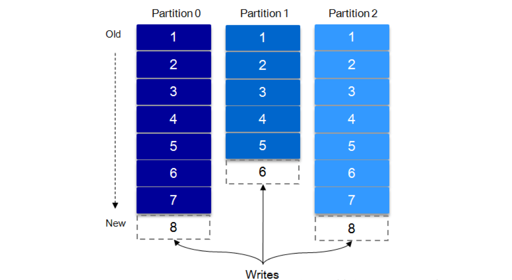

# Kafka 基础

## 基础

Kafka 是由 `Linkedin` 公司开发的，它是一个分布式的，支持多分区、多副本，基于 Zookeeper 的分布式消息流平台，它同时也是一款开源的**基于发布订阅模式的消息引擎系统**。

架构图：


如上图所示，一个典型的 Kafka 体系架构包括若干 Producer（消息生产者），若干 broker（作为 Kafka 节点的服务器），若干 Consumer（Group），以及一个 ZooKeeper 集群。

Kafka通过 ZooKeeper 管理集群配置、选举 Leader 以及在 consumer group 发生变化时进行 Rebalance（即消费者负载均衡）。Producer 使用 push（推）模式将消息发布到 broker，Consumer 使用 pull（拉）模式从 broker 订阅并消费消息。

### kafka 消息模型

采用的是发布-订阅模型：

.png>)

发布订阅模型（Pub-Sub） 使用**主题（Topic）** 作为消息通信载体，类似于**广播模式**；发布者发布一条消息，该消息通过主题传递给所有的订阅者，**在一条消息广播之后才订阅的用户则是收不到该条消息的**。

**在发布 - 订阅模型中，如果只有一个订阅者，那它和队列模型就基本是一样的了。所以说，发布 - 订阅模型在功能层面上是可以兼容队列模型的。**

### 角色

.png>)

.png>)

Kafka 比较重要的概念：

1. **Producer**：生产者，即消息发送者，push 消息到 Kafka 集群中的 broker（就是 server）中；
2. **Broker**：Kafka 集群由多个 Kafka 实例（server） 组成，每个实例构成一个 broker，说白了就是服务器；
3. **Topic**：producer 向 kafka 集群 push 的消息会被归于某一类别，即Topic，这本质上只是一个逻辑概念，面向的对象是 producer 和 consumer，producer 只需要关注将消息 push 到哪一个 Topic 中，而 consumer 只需要关心自己订阅了哪个 Topic；
4. **Partition**：每一个 Topic 又被分为多个 Partitions，即物理分区；出于负载均衡的考虑，同一个 Topic 的 Partitions 分别存储于 Kafka 集群的多个 broker 上；而为了提高可靠性，这些 Partitions 可以由 Kafka 机制中的 replicas 来设置备份的数量；如上面的框架图所示，topic1 有 2 个 partition， 每个 partition 都存在两个备份；
5. **Consumer**：消费者，从 Kafka 集群的 broker 中 pull 消息、消费消息；
6. **Consumer group**：high-level consumer API 中，每个 consumer 都属于一个 consumer-group，每条消息只能被 consumer-group 中的一个 Consumer 消费，但可以被多个 consumer-group 消费；
7. **replicas**：partition 的副本，保障 partition 的高可用；
8. **leader**：replicas 中的一个角色， producer 和 consumer 只跟 leader 交互；
9. **follower**：replicas 中的一个角色，从 leader 中复制数据，作为副本，一旦 leader 挂掉，会从它的 followers 中选举出一个新的 leader 继续提供服务；
10. **controller**：Kafka 集群中的其中一个服务器，用来进行 leader election 以及 各种 failover；
11. **ZooKeeper**：Kafka 通过 ZooKeeper 来存储集群的 meta 信息等。

#### Topic & Partition

一个 topic 可以认为是一类消息，每个 topic 将被分成多个 partition，每个 partition 在存储层面是 append log 文件。每条消息在文件中的位置称为 offset（偏移量），offset 为一个 long 型的数字，它**唯一标记**一条消息，表示消费者当前消费到的分区的位置。 Kafka 机制中，producer push 来的消息是追加（append）到 partition 中的，这是一种顺序写磁盘的机制，效率非常高。

如下图所示，分区中的数字号即为偏移量：



#### Kafka 为什么要将 Topic 进行分区？

负载均衡 + 水平扩展。当 producer 发布消息时，producer 客户端可以采用 `random`、`key-hash` 及 `轮询` 等算法选定目标 partition，若不指定，Kafka 也将根据一定算法将其置于某一分区上。Partiton 机制可以极大的提高吞吐量，并且使得系统具备良好的水平扩展能力。

#### Broker 集群

在Kafka中，集群里的每个实例叫做**Broker**，就像这样：每个partition不只有一个，而是有一个**leader**(红色)和多个**replica**(蓝色)，生产者根据消息的topic和key值，确定了消息要发往哪个partition之后，然后将消息发给leader，leader负责消息的写入，并与其余的replica进行同步。

一旦某一个partition的leader挂掉了，那么只需提拔一个replica出来，让它成为leader就ok了，系统依旧可以正常运行。

通过Broker集群的设计，我们不仅解决了系统高可用的问题，还进一步提升了系统的吞吐量，因为replica同样可以为消费者提供数据查找的功能。


### Kafka 高可靠性实现

#### Kafka 文件存储机制

**为什么不能以 partition 作为存储单位？**

当 Kafka producer 不断发送消息，必然会引起 partition 文件的无限扩张，将对消息文件的维护以及已消费的消息的清理带来严重的影响，因此，需以 segment 为单位将 partition 进一步细分。

每个 partition（目录）相当于一个巨型文件被平均分配到多个大小相等的 segment（段）数据文件中（每个 segment 文件中消息数量不一定相等）这种特性也方便 old segment 的删除，即方便已被消费的消息的清理，提高磁盘的利用率。每个 partition 只需要支持顺序读写就行，segment 的文件生命周期由服务端配置参数（log.segment.bytes，log.roll.{ms,hours} 等若干参数）决定。

**segment 的工作原理是怎样的？**

segment 文件由两部分组成，分别为 “.index” 文件和 “.log” 文件，分别表示为 segment 索引文件和数据文件。这两个文件的命名规则为：partition 全局的第一个 segment 从 0 开始，后续每个 segment 文件名为上一个 segment 文件最后一条消息的 offset 值，数值大小为 64 位，20 位数字字符长度，没有数字用 0 填充，如下：

```
00000000000000000000.index
00000000000000000000.log
00000000000000170410.index
00000000000000170410.log
00000000000000239430.index
00000000000000239430.log
```

以上面的 segment 文件为例，展示出 segment：00000000000000170410 的 “.index” 文件和 “.log” 文件的对应的关系，如下图：

.png>)

如上图，“.index” 索引文件存储大量的元数据，“.log” 数据文件存储大量的消息，索引文件中的元数据指向对应数据文件中 message 的物理偏移地址。其中以 “.index” 索引文件中的元数据 \[3, 348] 为例，在 “.log” 数据文件表示第 3 个消息，即在全局 partition 中表示 170410+3=170413 个消息，该消息的物理偏移地址为 348。

#### 复制同步原理和实现方式

.png>)

上图的 partition 的复制因子是 3 ，即一共有 3 个副本。

Kafka 机制中，leader 将负责维护和跟踪一个 ISR（In-Sync Replicas）列表，即同步副本队列，这个列表里面的副本与 leader 保持同步，状态一致。

follower 从 leader 同步数据有一些延迟（由参数 replica.lag.time.max.ms 设置超时阈值），超过阈值的 follower 将被剔除出 ISR， 存入 OSR（Outof-Sync Replicas）列表，新加入的 follower 也会先存放在 OSR 中。AR（Assigned Replicas，即所有的副本）=ISR+OSR。

> 注：ISR中包括：leader + 与leader保持同步的followers。

HW （HighWatermark，高水位）指 consumer 能够看到的此 partition 的位置

LEO（LogEndOffset）表示每个 partition 的 log 最后一条 Message 的位置


**consumer 最多只能消费到 HW 所在的位置**，每个 replica 都有 HW，leader 和 follower 各自负责更新自己的 HW 的状态。对于 leader 新写入的消息，consumer 不能立刻消费，leader 会等待该消息被**所有** ISR 中的 replicas 同步后更新 HW，此时消息才能被 consumer 消费。对于来自内部 broker 的读取请求，没有 HW 的限制。

下图详细的说明了当 producer 生产消息至 broker 后，ISR 以及 HW 和 LEO 的流转过程：

.png>)

由此可见，Kafka 的复制机制既不是完全的同步复制，也不是单纯的异步复制。事实上，同步复制要求所有能工作的 follower 都复制完，这条消息才会被 commit，这种复制方式受限于复制最慢的 follower，会极大的影响吞吐率。而异步复制方式下，follower 异步的从 leader 复制数据，数据只要被 leader 写入 log 就被认为已经 commit，这种情况下如果 follower 都还没有复制完，落后于 leader 时，突然 leader 宕机，则会丢失数据，降低可靠性。而 Kafka 使用 ISR 的策略则在可靠性和吞吐率方面取得了较好的平衡。

Kafka 的 ISR 的管理最终都会反馈到 ZooKeeper 节点上，具体位置为：

```
/brokers/topics/[topic]/partitions/[partition]/state
```

目前，有两个地方会对这个 ZooKeeper 的节点进行维护。

1. Controller 来维护：Kafka 集群中的其中一个 Broker 会被选举为 Controller，主要负责 Partition 管理和副本状态管理，也会执行类似于重分配 partition 之类的管理任务。在符合某些特定条件下，Controller 下的 LeaderSelector 会选举新的 leader，ISR 和新的 `leader_epoch` 及 `controller_epoch` 写入 ZooKeeper 的相关节点中。同时发起 LeaderAndIsrRequest 通知所有的 replicas。
2. leader 来维护：leader 有单独的线程定期检测 ISR 中 follower 是否脱离 ISR，如果发现 ISR 变化，则会将新的 ISR 的信息返回到 ZooKeeper 的相关节点中。

#### Broker 选举过程

kafka 控制器管理着整个集群中分区以及副本的状态，控制器的选举需要依赖于 Zookeeper，在 kafka 集群启动的时候，会在 ZK 中创建一个临时节点 `(EPHEMERAL)/controller`，在每个 Broker 启动的时候，都会先去访问 ZK 中的这个节点，如果不存在 Broker 就会则创建这个节点，先到先得称为 Controller，其它 Broker 当访问这个节点的时候，如果读取到 brokerid 不等于 -1，那么说明 Controller 已经被选举出来了。

另外 Zookeeper 中还有一个与控制器有关的`/controller_epoch`节点，这个节点是**持久（Persistent）节点**，节点中存放的是一个整型的 controller_epoch 值。**controller_epoch 值用于记录控制器发生变更的次数**，即记录当前的控制器是第几代控制器，我们也可以称之为“控制器纪元”。
  controller_epoch 的初始值为 1，即集群中的第一个控制器的纪元为 1，当控制器发生变更时，每选出一个新的控制器就将该字段值加 1。**每个和控制器交互的请求都会携带 controller_epoch 这个字段，如果请求的 controller_epoch 值小于内存中的controller_epoch 值，则认为这个请求是向已经过期的控制器发送的请求，那么这个请求会被认定为无效的请求。如果请求的controller_epoch 值大于内存中的 controller_epoch 值，那么说明已经有新的控制器当选了（也就是说接收到这种请求的 broker 已经不再是控制器了）。由此可见，Kafka 通过 controller_epoch 来保证控制器的唯一性，进而保证相关操作的一致性。**

  具备控制器身份的 broker 需要比其他普通的 broker 多一份职责，具体细节如下：

- 监听分区的变化。
- 监听主题的变化。
- 监听 broker 相关的变化。
- 从 Zookeeper 中读取获取当前所有与主题、分区及 broker 有关的信息并进行相应的管理。
- 启动并管理分区状态机和副本状态机。
- 更新集群的元数据信息。

  当`/controller`节点的数据发生变化时，每个 broker 都会更新自身内存中保存的 activeControllerId。如果 broker 在数据变更前是控制器，在数据变更后自身的 brokerid 值与新的 activeControllerId 值不一致，那么就需要“退位”，关闭相应的资源，比如关闭状态机、注销相应的监听器等。有可能控制器由于异常而下线，造成`/controller`这个临时节点被自动删除；也有可能是其他原因将此节点删除了。
  当`/controller`节点被删除时，每个 broker 都会进行选举，如果 broker 在节点被删除前是控制器，那么在选举前还需要有一个“退位”的动作。如果有特殊需要，则可以手动删除`/controller`节点来触发新一轮的选举。当然关闭控制器所对应的 broker，以及手动向`/controller`节点写入新的 brokerid 的所对应的数据，同样可以触发新一轮的选举。

#### 数据可靠性和持久性保证

当 producer 向 leader 发送数据时，可以通过 request.required.acks 参数来设置数据可靠性的级别：

**1. request.required.acks = 1**

这是默认情况，即：producer 发送数据到 leader，leader 写本地日志成功，返回客户端成功；此时 ISR 中的其它副本还没有来得及拉取该消息，如果此时 leader 宕机了，那么此次发送的消息就会丢失。

**2. request.required.acks = 0**

producer 不停向leader发送数据，而不需要 leader 反馈成功消息，这种情况下数据传输效率最高，但是数据可靠性确是最低的。可能在发送过程中丢失数据，可能在 leader 宕机时丢失数据。

**3. request.required.acks = -1（all）**

producer 发送数据给 leader，leader 收到数据后要等到 ISR 列表中的所有副本都同步数据完成后（强一致性），才向生产者返回成功消息，如果一直收不到成功消息，则认为发送数据失败会自动重发数据。这是可靠性最高的方案，当然，性能也会受到一定影响。

> \*\*注意：参数 min.insync.replicas \*\*
>
> 如果要提高数据的可靠性，在设置 request.required.acks=-1 的同时，还需参数 min.insync.replicas 配合，如此才能发挥最大的功效。min.insync.replicas 这个参数用于设定 ISR 中的最小副本数，默认值为1，当且仅当 request.required.acks 参数设置为-1时，此参数才生效。当 ISR 中的副本数少于 min.insync.replicas 配置的数量时，客户端会返回异常：`org.apache.kafka.common.errors.NotEnoughReplicasExceptoin: Messages are rejected since there are fewer in-sync replicas than required`。不难理解，如果 min.insync.replicas 设置为 2，当 ISR 中实际副本数为 1 时（只有leader），将无法保证可靠性，此时拒绝客户端的写请求以防止消息丢失。

#### 深入解读 HW 机制

如前所述，一个 partition 中的 ISR 列表中，leader 的 HW 是所有 ISR 列表里副本中最小的那个的 LEO。类似于木桶原理，水位取决于最低那块短板。

.png>)

如上图所示，如果在同步消息的时候 leader 宕机了， follower1 成为 leader，然后原 leader 恢复，它会将自己的 log 文件截断到之前自己的 HW 的位置再进行消息同步。即：

如果失败的 follower 恢复过来，它首先将自己的 log 文件截断到上次 checkpointed 时刻的 HW 的位置，之后再从 leader 中同步消息。leader 挂掉会重新选举，新的 leader 会发送 “指令” 让其余的 follower 截断至自身的 HW 的位置然后再拉取新的消息。

当 ISR 中的个副本的 LEO 不一致时，如果此时 leader 挂掉，选举新的 leader 时并不是按照 LEO 的高低进行选举，而是按照 ISR 中的顺序选举。

#### **极端情况下的 leader 选举策略**

前已述及，当 ISR 中至少有一个 follower 时（ISR 包括 leader），Kafka 可以确保已经 commit 的消息不丢失，但如果某一个 partition 的所有 replica 都挂了，自然就无法保证数据不丢失了。这种情况下如何进行 leader 选举呢？通常有两种方案：

1. 等待 ISR 中任意一个 replica 恢复过来，并且选它作为 leader；
2. 选择第一个恢复过来的 replica（并不一定是在 ISR 中）作为leader。

如何选择呢？这就需要在可用性和一致性当中作出抉择。如果一定要等待 ISR 中的 replica 恢复过来，不可用的时间就可能会相对较长。而且如果 ISR 中所有的 replica 都无法恢复了，或者数据丢失了，这个 partition 将永远不可用。

选择第一个恢复过来的 replica 作为 leader，如果这个 replica 不是 ISR 中的 replica，那么，它可能并不具备所有已经 commit 的消息，从而造成消息丢失。默认情况下，Kafka 采用第二种策略，即 `unclean.leader.election.enable=true`，也可以将此参数设置为 false 来启用第一种策略。

`unclean.leader.election.enable` 这个参数对于 leader 的选举、系统的可用性以及数据的可靠性都有至关重要的影响。生产环境中应慎重权衡。

### ZooKeeper 的作用

ZooKeeper 的作用有：broker 注册、topic 注册、producer 和 consumer 负载均衡、维护 partition 与 consumer 的关系、记录消息消费的进度以及 consumer 注册等。

#### broker 注册

在Zookeeper上会有一个专门**用来进行Broker服务器列表记录**的节点：

/brokers/ids

每个Broker在启动时，都会到Zookeeper上进行注册，即到/brokers/ids下创建属于自己的节点，如/brokers/ids/\[0...N]。

Kafka使用了全局唯一的数字来指代每个Broker服务器，不同的Broker必须使用不同的Broker ID进行注册，创建完节点后，**每个Broker就会将自己的IP地址和端口信息记录**到该节点中去。其中，Broker创建的节点类型是临时节点，一旦Broker宕机，则对应的临时节点也会被自动删除。

#### topic 注册

在 Kafka 中，同一个 **Topic 的消息会被分成多个分区**并将其分布在多个 Broker 上，**这些分区信息及与 Broker 的对应关系**也都是由 Zookeeper 在维护，由专门的节点来记录，如：

/brokers/topics

Kafka 中每个 Topic 都会以 /brokers/topics/\[topic] 的形式被记录，如 /brokers/topics/login 和 /brokers/topics/search 等。

Broker 服务器启动后，会到对应 Topic 节点（/brokers/topics）上注册自己的 Broker ID 并写入针对该 Topic 的分区总数，如 /brokers/topics/login/3->2 ，这个节点表示 Broker ID 为 3 的一个 Broker 服务器，对于 "login" 这个 Topic 的消息，提供了 2 个分区进行消息存储，同样，这个分区节点也是临时节点。

#### consumer 在 ZooKeeper 中的注册

**注册新的消费者分组**

当新的消费者组注册到 ZooKeeper 中时，ZooKeeper 会创建专用的节点来保存相关信息，其节点路径为 `ls/consumers/{group_id}`，其节点下有三个子节点，分别为 `[ids, owners, offsets]`。

* ids 节点：记录该消费组中当前正在消费的消费者；
* owners 节点：记录该消费组消费的 topic 信息；
* offsets 节点：记录每个 topic 的每个分区的 offset。

**注册新的消费者**

当新的消费者注册到 Kafka 中时，会在 `/consumers/{group_id}/ids` 节点下创建临时子节点，并记录相关信息。

**监听消费者分组中消费者的变化**

每个消费者都要关注其所属消费者组中消费者数目的变化，即监听 `/consumers/{group_id}/ids` 下子节点的变化。一单发现消费者新增或减少，就会触发消费者的负载均衡。

#### Consumer 负载均衡

Kafka 保证同一 consumer group 中**只有一个** consumer 可消费某条消息，实际上，Kafka 保证的是稳定状态下每一个 consumer 实例只会消费某一个或多个特定的数据，而某个 partition 的数据只会被某一个特定的 consumer 实例所消费。这样设计的劣势是无法让同一个 consumer group 里的 consumer 均匀消费数据，优势是每个 consumer 不用都跟大量的 broker 通信，减少通信开销，同时也降低了分配难度，实现也更简单。另外，因为同一个 partition 里的数据是有序的，这种设计可以保证每个 partition 里的数据也是有序被消费。

**consumer 数量不等于 partition 数量**

如果某 consumer group 中 consumer 数量少于 partition 数量，则至少有一个 consumer 会消费多个 partition 的数据；如果 consumer 的数量与 partition 数量相同，则正好一个 consumer 消费一个 partition 的数据，而如果 consumer 的数量多于 partition 的数量时，会有部分 consumer 无法消费该 topic 下任何一条消息。

**借助 ZooKeeper 实现负载均衡**

关于负载均衡，对于某些低级别的 API，consumer 消费时必须指定 topic 和 partition，这显然不是一种友好的均衡策略。基于高级别的 API，consumer 消费时只需制定 topic，借助 ZooKeeper 可以根据 partition 的数量和 consumer 的数量做到均衡的动态配置。

consumers 在启动时会到 ZooKeeper 下以自己的 conusmer-id 创建临时节点 `/consumer/[group-id]/ids/[conusmer-id]`，并对 `/consumer/[group-id]/ids` 注册监听事件，当消费者发生变化时，同一 group 的其余消费者会得到通知。当然，消费者还要监听 broker 列表的变化。librdkafka 通常会将 partition 进行排序后，根据消费者列表，进行轮流的分配。

#### Producers 负载均衡

对于同一个 topic 的不同 partition，Kafka会尽力将这些 partition 分布到不同的 broker 服务器上，这种均衡策略实际上是基于 ZooKeeper 实现的。在一个 broker 启动时，会首先完成 broker 的注册过程，并注册一些诸如 “有哪些可订阅的 topic” 之类的元数据信息。producers 启动后也要到 ZooKeeper 下注册，创建一个临时节点来监听 broker 服务器列表的变化。由于在 ZooKeeper 下 broker 创建的也是临时节点，当 brokers 发生变化时，producers 可以得到相关的通知，从改变自己的 broker list。其它的诸如 topic 的变化以及broker 和 topic 的关系变化，也是通过 ZooKeeper 的这种 Watcher 监听实现的。

在生产中，必须指定 topic；但是对于 partition，有两种指定方式：

* 明确指定 partition(0-N)，则数据被发送到指定 partition；
* 设置为 `RD_KAFKA_PARTITION_UA`，则 Kafka 会回调 partitioner 进行均衡选取，partitioner 方法需要自己实现。可以轮询或者传入 key 进行 hash。未实现则采用默认的随机方法 `rd_kafka_msg_partitioner_random` 随机选择。

#### 记录消费进度 Offset

在 consumer 对指定消息 partition 的消息进行消费的过程中，需要定时地将 partition 消息的消费进度 Offset 记录到 ZooKeeper上，以便在该 consumer 进行重启或者其它 consumer 重新接管该消息分区的消息消费权后，能够从之前的进度开始继续进行消息消费。

#### 记录 Partition 与 Consumer 的关系

consumer group 下有多个 consumer（消费者），对于每个消费者组（consumer group），Kafka都会为其分配一个全局唯一的 group ID，group 内部的所有消费者共享该 ID。订阅的 topic 下的每个分区只能分配给某个 group 下的一个consumer（当然该分区还可以被分配给其它 group）。同时，Kafka 为每个消费者分配一个 consumer ID，通常采用 `hostname:UUID` 形式表示。

在Kafka中，规定了每个 partition 只能被同组的一个消费者进行消费，因此，需要在 ZooKeeper 上记录下 partition 与 consumer 之间的关系，每个 consumer 一旦确定了对一个 partition 的消费权力，需要将其 consumer ID 写入到 ZooKeeper 对应消息分区的临时节点上，例如：

```
/consumers/[group_id]/owners/[topic]/[broker_id-partition_id]
```

其中，\[`broker_id-partition_id`] 就是一个消息分区的标识，节点内容就是该消息分区 消费者的 consumer ID。

## 问题

### kafka 为什么这么快

* 消息在磁盘中顺序写入。
* 利用partition并行消息处理，即使多个partition在同一个节点，也可以对应不同的磁盘，充分发挥多磁盘优势。
* 利用了现代操作系统分页存储 Page Cache 来利用内存提高 I/O 效率。Page Cache 主要用来作为文件系统上的文件数据的缓存来用，尤其是针对当进程对文件有 read/write 操作的时候。当数据的请求到达时，如果在 Cache 中存在该数据且是最新的，则直接将数据传递给用户程序，免除了对底层磁盘的操作，提高了性能。 Buffer Cache 则主要是设计用来在系统对块设备进行读写的时候，对块进行数据缓存的系统来使用。在 Linux 的实现中，文件 Cache 分为两个层面，一是 Page Cache，另一个 Buffer Cache，每一个 Page Cache 包含若干 Buffer Cache。
* 采用了零拷贝技术：Producer 生产的数据持久化到 Broker，采用 mmap 文件映射，实现顺序的快速写入;Customer 从 Broker 读取数据，采用 Sendfile，将磁盘文件读到 OS 内核缓冲区后，转到 NIO buffer进行网络发送，减少 CPU 消耗。

面试题可参考：

[kafka！还好我留了一手](https://juejin.cn/post/7018702635544870948)

幂等问题：

[kafka系列之幂等生产者(11)](https://juejin.cn/post/6938998510788280333)

[答面试官问：怎么实现接口幂等性](https://learnku.com/articles/50902)


## 参考

[再谈基于 Kafka 和 ZooKeeper 的分布式消息队列原理](https://gitbook.cn/books/5bc446269a9adf54c7ccb8bc/index.html)
