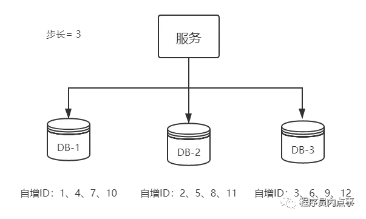

# 分库分表/分布式 ID

以下内容整理自

[面试总被问分库分表怎么办？你可以这样怼他](https://juejin.cn/post/6844904071393099783#heading-3)

[一口气说出 9种 分布式ID生成方式，面试官有点懵了](https://mp.weixin.qq.com/s?\_\_biz=MzAxNTM4NzAyNg==\&mid=2247483785\&idx=1\&sn=8b828a8ae1701b810fe3969be536cb14\&chksm=9b859174acf21862f0b95e0502a1a441c496a5488f5466b2e147d7bb9de072bde37c4db25d7a\&token=745402269\&lang=zh\_CN#rd)

## 分库分表

### 垂直切分

#### **垂直分库**

按照**业务分类**进行划分，每个业务有独立数据库。

.png>)

#### 垂直分表

基于**数据表的列**为依据切分的，是一种大表拆小表的模式。

把一个大表根据字段切分为核心表和扩展表，把访问频繁的列拆分出来创建一个核心表，把长度较大且访问不频繁的字段，拆分出来创建一个单独的扩展表。

这样拆分以后核心表大多是访问频率较高的字段，而且字段长度也都较短，可以加载更多数据到内存中，增加查询的命中率，减少磁盘IO，以此来提升数据库性能。

**优点：**

* 业务间解耦，不同业务的数据进行独立的维护、监控、扩展
* 在高并发场景下，一定程度上缓解了数据库的压力

**缺点：**

* 提升了开发的复杂度，由于业务的隔离性，很多表无法直接访问，必须通过接口方式聚合数据，
* 分布式事务管理难度增加
* 数据库还是存在单表数据量过大的问题，并未根本上解决，需要配合水平切分

### 水平切分

垂直切分还是会存在单表数据量过大的问题，此时就需要水平切分。

水平切分是将一张大数据量的表，切分成多个表结构相同，而每个表只占原表一部分数据，然后按不同的条件分散到多个数据库中。

水平切分又分有库内分表和分库分表

#### **库内分表**

库内分表虽然将表拆分，但子表都还是在同一个数据库实例中，只是解决了单一表数据量过大的问题，并没有将拆分后的表分布到不同机器的库上，还在竞争同一个物理机的CPU、内存、网络IO。


**分库分表**

分库分表则是将切分出来的子表，分散到不同的数据库中，从而使得单个表的数据量变小，达到分布式的效果。

**优点：**

* 解决高并发时单库数据量过大的问题，提升系统稳定性和负载能力
* 业务系统改造的工作量不是很大

**缺点：**

* 跨分片的事务一致性难以保证
* 跨库的join关联查询性能较差
* 扩容的难度和维护量较大

### 数据存储

#### 根据取值范围

按照**时间区间**或 **ID 区间**来切分，举个栗子：假如我们切分的是用户表，可以定义每个库的 User 表里只存10000条数据，第一个库`userId` 从1 \~ 9999，第二个库 10000 \~ 20000，第三个库 20001\~ 30000......以此类推。

**优点：**

* 单表数据量是可控的
* 水平扩展简单只需增加节点即可，无需对其他分片的数据进行迁移
* 能快速定位要查询的数据在哪个库

**缺点：**

* 由于连续分片可能存在数据热点，如果按时间字段分片，有些分片存储最近时间段内的数据，可能会被频繁的读写，而有些分片存储的历史数据，则很少被查询

#### hash取模

hash取模mod（**对hash结果取余数 (hash() mod N)**）的切分方式比较常见，还拿 User 表举例，对数据库从 0 到 N-1 进行编号，对User 表中 userId 字段进行取模，得到余数 `i`，`i=0` 存第一个库，`i=1` 存第二个库，`i=2` 存第三个库....以此类推。

这样同一个用户的数据都会存在同一个库里，用`userId` 作为条件查询就很好定位了

**优点：**

* 数据分片相对比较均匀，不易出现某个库并发访问的问题

**缺点：**

* 但这种算法存在一些问题，当某一台机器宕机，本应该落在该数据库的请求就无法得到正确的处理，这时宕掉的实例会被踢出集群，此时算法变成hash(userId) mod N-1，用户信息可能就不再在同一个库中。

####

## 分布式 ID

对数据库进行分库分表，但分库分表后需要有一个唯一 ID 来标识一条数据，时一个能够生成**全局唯一 ID 的系统是非常必要的。那么这个全局唯一 ID 就叫分布式 ID**。

分布式 id 生成方法：

* UUID
* 数据库自增ID
* 数据库多主模式
* 号段模式
* Redis
* 雪花算法（SnowFlake）
* 美团（Leaf）

#### uuid

不推荐

**优点：**

* 生成足够简单，本地生成无网络消耗，具有唯一性

**缺点：**

* 无序的字符串，不具备趋势自增特性
* 没有具体的业务含义
* 长度过长16 字节128位，36位长度的字符串，存储以及查询对MySQL的性能消耗较大，MySQL官方明确建议主键要尽量越短越好，作为数据库主键 `UUID` 的无序性会导致数据位置频繁变动，严重影响性能。

#### 基于数据库自增ID

需要一个单独的MySQL实例用来生成 ID，表结构：

```sql
CREATE DATABASE `SEQ_ID`;
CREATE TABLE SEQID.SEQUENCE_ID (
    id bigint(20) unsigned NOT NULL auto_increment, 
    value char(10) NOT NULL default '',
    PRIMARY KEY (id),
) ENGINE=MyISAM;
insert into SEQUENCE_ID(value)  VALUES ('values');
```

当我们需要一个ID的时候，向表中插入一条记录返回`主键ID`，但这种方式有一个比较致命的缺点，访问量激增时MySQL本身就是系统的瓶颈，用它来实现分布式服务风险比较大，不推荐。

**优点：**

* 实现简单，ID单调自增，数值类型查询速度快

**缺点：**

* DB单点存在宕机风险，无法扛住高并发场景

#### 基于数据库集群模式

根据第二种方法改良，使用集群模式来生成 ID，需要设置**起始值**和**自增步长**



**优点：**

* 解决DB单点问题

**缺点：**

* 不利于后续扩容，而且实际上单个数据库自身压力还是大，依旧无法满足高并发场景。

#### 基于数据库的号段模式

号段模式是当下分布式ID生成器的主流实现方式之一，号段模式可以理解为从数据库批量的获取自增ID，每次从数据库取出一个号段范围，例如 (1,1000] 代表1000个ID，具体的业务服务将本号段，生成1\~1000的自增ID并加载到内存。表结构如下：

```sql
CREATE TABLE id_generator (
  id int(10) NOT NULL,
  max_id bigint(20) NOT NULL COMMENT '当前最大id',
  step int(20) NOT NULL COMMENT '号段的布长',
  biz_type    int(20) NOT NULL COMMENT '业务类型',
  version int(20) NOT NULL COMMENT '版本号',
  PRIMARY KEY (`id`)
) 
```

biz\_type ：代表不同业务类型

max\_id ：当前最大的可用id

step ：代表号段的长度

version ：是一个乐观锁，每次都更新version，保证并发时数据的正确性

| id | biz\_type | max\_id | step | version |
| -- | --------- | ------- | ---- | ------- |
| 1  | 101       | 1000    | 2000 | 0       |

等这批号段ID用完，再次向数据库申请新号段，对`max_id`字段做一次`update`操作，`update max_id= max_id + step`，update成功则说明新号段获取成功，新的号段范围是`(max_id ,max_id +step]`。

```sql
update id_generator set max_id = #{max_id+step}, version = version + 1 where version = # {version} and biz_type = XXX
```

由于多业务端可能同时操作，所以采用版本号`version`乐观锁方式更新，这种分布式ID生成方式不强依赖于数据库，不会频繁的访问数据库，对数据库的压力小很多。

比如`DistributIdService`每次从数据库获取ID时，就获取一个号段，比如(1,1000]，这个范围表示了1000个ID，业务应用在请求DistributIdService提供ID时，`DistributIdService`只需要在本地从1开始自增并返回即可，而不需要每次都请求数据库，一直到本地自增到1000时，也就是当前号段已经被用完时，才去数据库重新获取下一号段。


#### 基于Redis模式

原理就是利用redis的 incr命令实现ID的原子性自增。

```
127.0.0.1:6379> set seq_id 1     // 初始化自增ID为1
OK
127.0.0.1:6379> incr seq_id      // 增加1，并返回递增后的数值
(integer) 2
```

用`redis`实现需要注意一点，要考虑到redis持久化的问题。`redis`有两种持久化方式`RDB`和`AOF`

* `RDB`会定时打一个快照进行持久化，假如连续自增但`redis`没及时持久化，而这会Redis挂掉了，重启Redis后会出现ID重复的情况。
* `AOF`会对每条写命令进行持久化，即使`Redis`挂掉了也不会出现ID重复的情况，但由于incr命令的特殊性，会导致`Redis`重启恢复的数据时间过长。

#### 基于雪花算法（Snowflake）模式


Snowflake ID组成结构：`正数位`（占1比特）+ `时间戳`（占41比特）+ `机器ID`（占5比特）+ `数据中心`（占5比特）+ `自增值`（占12比特），总共64比特组成的一个Long类型。

* 第一个bit位（1bit）：Java中long的最高位是符号位代表正负，正数是0，负数是1，一般生成ID都为正数，所以默认为0。
* 时间戳部分（41bit）：毫秒级的时间，不建议存当前时间戳，而是用（当前时间戳 - 固定开始时间戳）的差值，可以使产生的ID从更小的值开始；41位的时间戳可以使用69年，(1L << 41) / (1000L \* 60 \* 60 \* 24 \* 365) = 69年
* 工作机器id（10bit）：也被叫做`workId`，这个可以灵活配置，机房或者机器号组合都可以。
* 序列号部分（12bit），自增值支持同一毫秒内同一个节点可以生成4096个ID

####

#### 美团（Leaf）

`Leaf`由美团开发，github地址：https://github.com/Meituan-Dianping/Leaf

`Leaf`同时支持号段模式和 snowflake 算法模式，可以切换使用。

号段模式（原理和上面介绍的号段模式类似）：

.png>)

* Leaf Server 1：从DB加载号段\[1，1000]。
* Leaf Server 2：从DB加载号段\[1001，2000]。
* Leaf Server 3：从DB加载号段\[2001，3000]。

用户通过 Round-robin 的方式调用 Leaf Server 的各个服务，所以某一个 Client 获取到的ID序列可能是：1，1001，2001，2，1002，2002……也可能是：1，2，1001，2001，2002，2003，3，4……当某个 Leaf Server 号段用完之后，下一次请求就会从DB中加载新的号段，这样保证了每次加载的号段是递增的。
