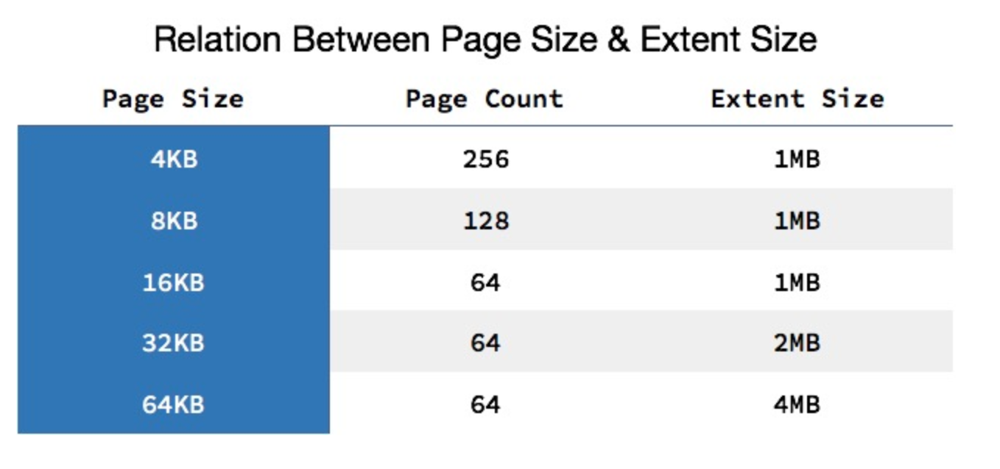
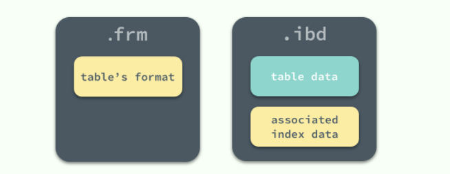
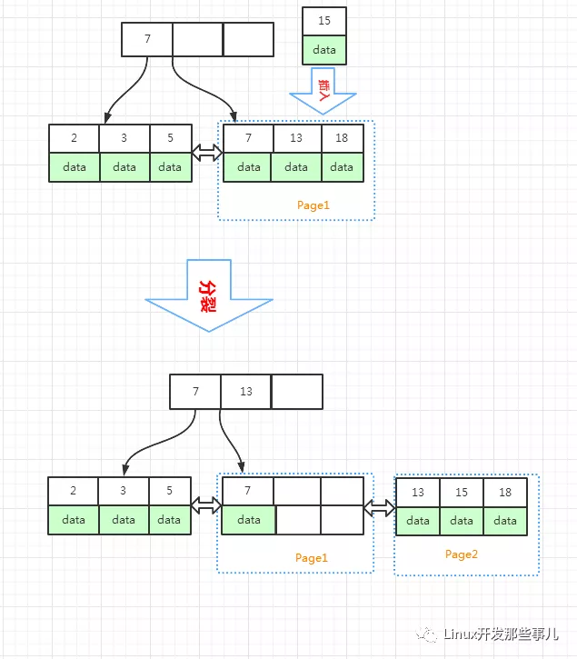
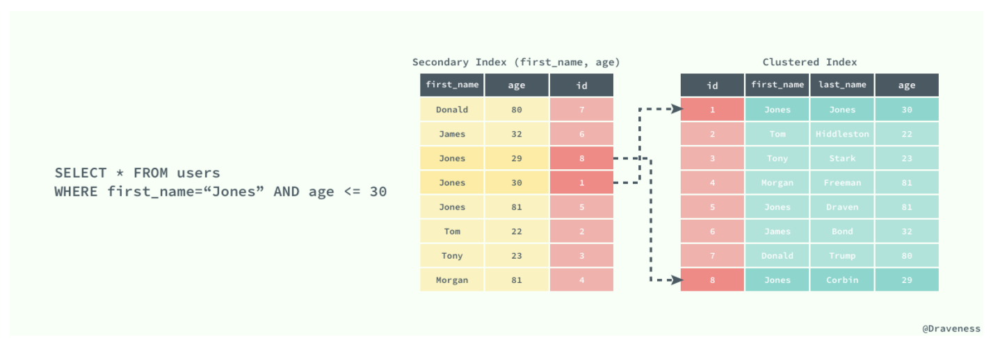
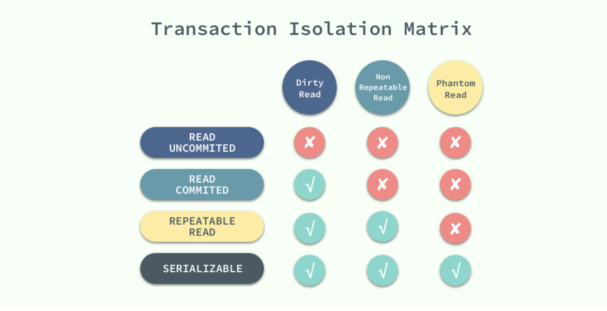
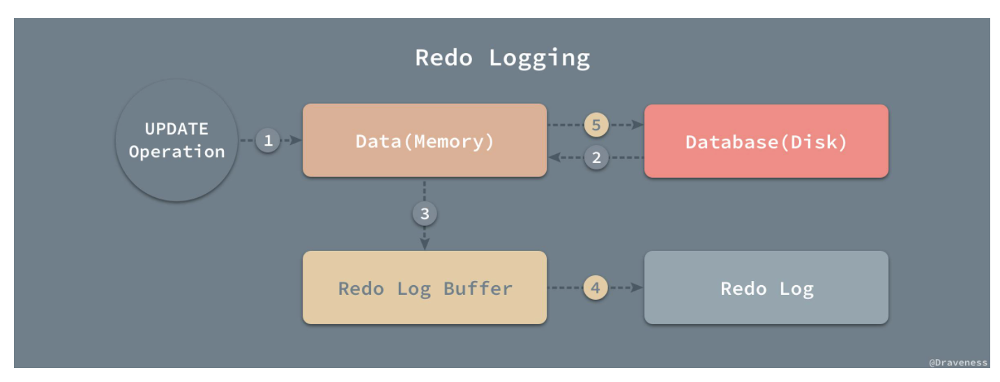
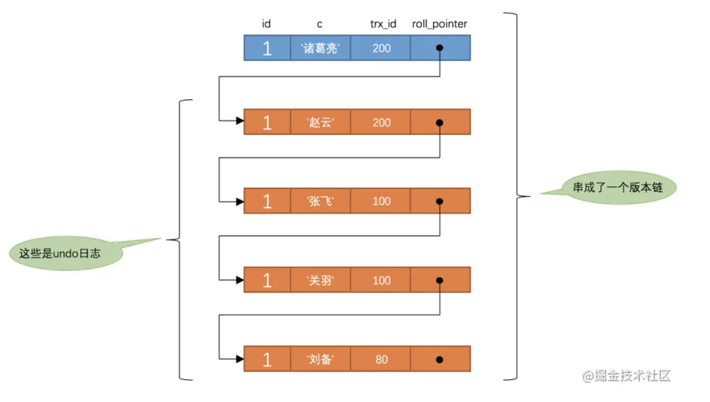
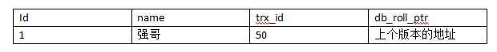
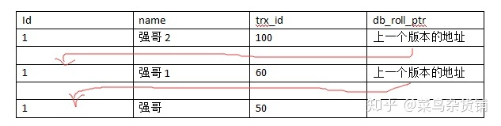

# InnoDB

以下内容整理自

[『浅入浅出』MySQL 和 InnoDB](https://draveness.me/mysql-innodb/)

[MySQL事务隔离级别和MVCC](https://juejin.cn/post/6844903808376504327)

等。

## 数据的存储

在 InnoDB 存储引擎中，所有的数据都被**逻辑地**存放在表空间中，表空间（tablespace）是存储引擎中最高的存储逻辑单位，在表空间的下面又包括段（segment）、区（extent）、页（page） 。



默认情况下，表空间中的页大小都为 16KB，在 InnoDB 存储引擎中，一个区的大小最小为 1MB，页的数量最少为 64 个。

### 如何存储表

MySQL 使用 InnoDB 存储表时，会创建两个文件：



#### .frm 文件

无论在 MySQL 中选择了哪个存储引擎，所有的 MySQL 表都会在硬盘上创建一个 `.frm` 文件用来描述表的格式或者说定义；`.frm` 文件的格式在不同的平台上都是相同的。

#### .ibd 文件

在MySQL配置中有个配置项叫 innodb\_file\_per\_table ，将它设置为1之后， 每个表的数据会单独存储在一个以 .ibd 为后缀的文件中。

如果 innodb\_file\_per\_table 没有开启的话， 表的数据是存储在系统的共享表空间，包括 `ibdata1`、`ibdata2` 等文件，其中存储了 InnoDB 系统信息和用户数据库表数据和索引，是所有表**公用的**。通常情况下，都是将 innodb\_file\_per\_table 选项设置为 1，这样`ibd` 文件就是每一个表独有的表空间，文件存储了当前表的数据和相关的索引数据。

一个表单独存储为一个 ibd 文件更容易管理，而且在不需要这个表的时候，通过drop table 命令，系统就会直接删除这个文件。而如果是放在共享表空间中，即使表删除了，空间也是**不会回收**的。

### 删除数据原理

.png>)

假如我们要删除Page1页中索引key值为 13 的数据，也即上图中红色部分。

InnoDB引擎会把索引key值为13的节点标记为已删除，它并不会回收节点真实的物理空间，只是将它标记为已删除的节点，后续是可以复用的，所以，删除表记录，磁盘上数据文件不会缩小。即使删除 Page1 整个页的数据，数据文件也不会缩小。

### 数据复用

#### 数据节点的复用

如上图，当删除了索引 key 值为 13 的节点后，此节点就被标记为可复用的。如果后续插入了一条索引为 7 \~ 18 之间的数据，则可以复用原来索引为 13 的数据节点的空间，否则不能复用。也就是说，数据节点的复用，需要索引 key 值满足一定的范围条件

#### 数据页的复用

在上图中，当删除了 Page1 数据页全部数据节点后，Page1 整页都是可复用的，当插入的记录需要用到新页的时候，Page1 就可以被复用。

当相邻的数据页利用率比较低的时候，有可能会把它们合并到其中一个数据页中，这时，另外一个数据页就空出来了，这个空出来的数据页就变成可复用的了。

### 数据空洞

* 我们用 `delete` 命令删除一条记录后，InnoDB只是把对应的数据节点标记为已删除且可复用的，这些可空着的等待使用的数据节点可以看作是一个一个的数据空洞。
* 或者在插入数据的时候，如果是从索引中间插入的话，有可能会造成页分裂，分裂之后的页有可能出现数据空洞。



* 在更新数据的时候也可能产生数据空洞，比如`id` 是表 `ta`的主键， `update ta set id = 10 where id = 1` 语句把 `id = 1` 修改为 `id = 10`，相当于先删除 `id = 1` 的记录，再插入 `id = 10` 的记录，这种情况是会产生数据空洞的。但是如果是类似 `update ta set ia = ia + 1 where id = 1` 这种没有更改主键值的语句是不会造成空洞的。

### 收缩表空间

下面介绍的几种收缩表空间的方法，虽然方法不同，但是基本的原理都是通过重建表的形式来达到目的。

* truncate table 表名

此操作等于 `drop + create`，先删除表，然后再创建一个同名的新表，当然，在执行 `truncate table` 命令之前需要先保存一份旧表的数据， 命令执行完成之后，再把这份数据导入新表

* alter table 表名 engine=InnoDB

重建表（recreate），这个操作是遍历旧表主键索引的数据页，把数据页中的记录生成B+树结构，存储到磁盘上的临时文件中，数据页遍历完了之后，用临时文件替换掉旧表的数据文件。

* optimize table t ( 等于 recreate+analyze)。

重建表的时候，会根据表大小预留一部分用于更新的空间，如果原始表已经使用了一部分更新的空间，那么有可能在重建表的时候，大小是大于原始表，没有达到缩容的目的，但是索引空洞会减少，更紧凑。

## 索引

InnoDB 存储引擎在绝大多数情况下使用 B+ 树建立索引，这是关系型数据库中查找最为常用和有效的索引。B+ 树是平衡树，它查找任意节点所耗费的时间都是完全相同的，比较的次数就是 B+ 树的高度。

### 聚集索引和辅助索引

数据库中的 B+ 树索引可以分为聚集索引（clustered index）和辅助索引（secondary index），它们之间的最大区别就是，聚集索引中存放着一条行记录的全部信息，而辅助索引中只包含索引列和一个用于查找对应行记录的『书签』。

#### 聚集索引

就是以表的主键作为索引，比如 PRIMARY KEY(id), 就会根据 id 的顺序构建一颗 B+ 树，并在叶节点中存放表中的**行记录数据**。聚集索引叶节点中保存的是**整条行记录**，而不是其中的一部分。所有正常的表应该**有且仅有一个**聚集索引。

也将聚集索引的叶子节点称为**数据页**，同B+树数据结构一样，每个数据页都通过一个双向链表来进行链接。聚集索引的存储并不是物理上连续的，而是逻辑上连续的。非叶子节点也称作为**索引页**。

#### 辅助索引

辅助索引也是通过 B+ 树实现的，但是它的节点仅包含索引中的列数据和主键数据。



上图展示了一个使用辅助索引查找一条表记录的过程：通过辅助索引查找到对应的主键，最后在聚集索引中使用主键获取对应的行记录，这也是通常情况下行记录的查找方式。

**最左匹配原则**：mysql 会一直向右匹配直到遇到范围查询(>、<、between、like)就停止匹配，比如a = 1 and b = 2 and c > 3 and d = 4 如果建立(a,b,c,d)顺序的索引，d是用不到索引的，如果建立(a,b,d,c)的索引则都可以用到，a,b,d的顺序可以任意调整。

**联合索引**：对于辅助索引（一般都是联合索引），在维护 B+ 树的时候，会根据联合索引的字段依次去判断，假设联合索引为：name + address + age，那么 MySQL 在维护该索引的 B+ 树的时候，首先会根据 name 进行排序，name 相同的话会根据第二个 address 排序，如果 address 也一样，那么就会根据 age 去排序，如果 age 也一样，那么就会根据主键字段值去排序，且对于辅助索引，MySQL 在维护 B+ 树的时候，仅仅是维护索引字段和主键字段。

### 回表

根据**辅助索引**查询到的结果并没有查找的字段值，此时就需要再次根据主键从**聚集索引**的根节点开始查找，这样再次查找到的记录才是完整的。比如以 name, age 字段作为联合索引，执行 sql ：

```sql
SELECT * FROM student WHERE name='xiaoming'
```

这种情况就需要回表，反之如果是下面这种情况就不需要回表：

```sql
SELECT name, age, id FROM student WHERE name='xiaoming'
```

这种不需要回表查询的情况就叫**覆盖索引**。

### 索引的创建原则

1. 索引并非越多越好，一个表中如果有大量的索引，不仅占用磁盘空间，而且会影响INSERT、DELETE、UPDATE等语句的性能，因为在表中的数据更改的同时，索引也会进行调整和更新
2. 避免对经常更新的表进行过多的索引，并且索引中的列尽可能少。而对经常用于查询的字段应该创建索引，但要避免添加不必要的字段。
3. 数据量小的表最好不要使用索引，由于数据较少，查询花费的时间可能比遍历索引的时间还要短，索引可能不会产生优化效果。
4. 在条件表达式中经常用到的不同值较多的列上建立索引，在不同值很少的列上不要建立索引。比如在学生表的“性别”字段上只有“男”与“女”两个不同值，因此就无须建立索引。如果建立索引，由于还需要回表操作，不但不会提高查询效率，反而会严重降低数据更新速度，还不如全表扫。
5. 当唯一性是某种数据本身的特征时，指定唯一索引（即 UNIQUE）。使用唯一索引需能确保定义的列的数据完整性，以提高查询速度。
6. 在频繁进行排序或分组（即进行group by或order by操作）的列上建立索引，如果待排序的列有多个，可以在这些列上建立组合索引。
7. 搜索的索引列，不一定是所要选择的列。换句话说，最适合索引的列是出现在WHERE子句中的列，或连接子句中指定的列，而不是出现在SELECT关键字后的选择列表中的列。
8. 使用短索引。如果对字符串列进行索引，应该指定一个前缀长度，只要有可能就应该这样做。例如，有一个CHAR(200)列，如果在前10个或20个字符内，多数值是唯一的，那么就不要对整个列进行索引。对前10个或20个字符进行索引能够节省大量索引空间，也可能会使查询更快。较小的索引涉及的磁盘 IO 较少，较短的值比较起来更快。更为重要的是，对于较短的键值，索引高速缓存中的块能容纳更多的键值，因此，MySQL 也可以在内存中容纳更多的值。这样就增加了找到行而不用读取索引中较多块的可能性。
9. 利用最左前缀。在创建一个n列的索引时，实际是创建了MySQL可利用的n个索引。多列索引可起几个索引的作用，因为可利用索引中最左边的列集来匹配行。这样的列集称为最左前缀。
10. 对于InnoDB存储引擎的表，记录默认会按照一定的顺序保存，如果有明确定义的主键，则按照主键顺序保存。如果没有主键，但是有唯一索引，那么就是按照唯一索引的顺序保存。如果既没有主键又没有唯一索引，那么表中会自动生成一个内部列，按照这个列的顺序保存。按照主键或者内部列进行的访问是最快的，所以InnoDB表尽量自己指定主键，当表中同时有几个列都是唯一的，都可以作为主键的时候，要选择最常作为访问条件的列作为主键，提高查询的效率。另外，还需要注意，InnoDB 表的普通索引都会保存主键的键值，所以主键要尽可能选择较短的数据类型，可以有效地减少索引的磁盘占用，提高索引的缓存效果。
11. 最左前缀匹配原则，非常重要的原则，mysql会一直向右匹配直到遇到范围查询(>、<、between、like)就停止匹配，比如a = 1 and b = 2 and c > 3 and d = 4 如果建立(a,b,c,d)顺序的索引，d是用不到索引的，如果建立(a,b,d,c)的索引则都可以用到，a,b,d的顺序可以任意调整。
12. =和in可以乱序，比如a = 1 and b = 2 and c = 3 建立(a,b,c)索引可以任意顺序，mysql的查询优化器会帮你优化成索引可以识别的形式。
13. 尽量选择区分度高的列作为索引，区分度的公式是count(distinct col)/count(*)，表示字段不重复的比例，比例越大我们扫描的记录数越少，唯一键的区分度是1，而一些状态、性别字段可能在大数据面前区分度就是0，那可能有人会问，这个比例有什么经验值吗？使用场景不同，这个值也很难确定，一般需要join的字段我们都要求是0.1以上，即平均1条扫描10条记录。
14. 索引列不能参与计算，保持列“干净”，比如from_unixtime(create_time) = ’2014-05-29’就不能使用到索引，原因很简单，b+树中存的都是数据表中的字段值，但进行检索时，需要把所有元素都应用函数才能比较，显然成本太大。所以语句应该写成create_time = unix_timestamp(’2014-05-29’)。
15. 尽量的扩展索引，不要新建索引。比如表中已经有a的索引，现在要加(a,b)的索引，那么只需要修改原来的索引即可。
16. 联合索引中，一般情况下，将查询需求频繁或者字段选择性高的列放在前面。此外可以根据特例的查询或者表结构进行单独的调整。
17. 最好用自增主键作为索引。因为结合B+Tree的特点，自增主键是连续的，在插入过程中尽量减少页分裂，即使要进行页分裂，也只会分裂很少一部分。并且能减少数据的移动，每次插入都是插入到最后。总之就是减少分裂和移动的频率。


另外可参考 [MySQL索引原理及慢查询优化](https://tech.meituan.com/2014/06/30/mysql-index.html)

## 锁

### 并发控制机制

乐观锁和悲观锁其实都是并发控制的机制，同时它们在原理上就有着本质的差别；

* 乐观锁是一种思想，它其实并不是一种真正的『锁』，它会先尝试对资源进行修改，在写回时判断资源是否进行了改变，如果没有发生改变就会写回，否则就会进行重试，在整个的执行过程中其实都**没有对数据库进行加锁**；
* 悲观锁就是一种真正的锁了，它会在获取资源前对资源进行加锁，确保同一时刻只有有限的线程能够访问该资源，其他想要尝试获取资源的操作都会进入等待状态，直到该线程完成了对资源的操作并且释放了锁后，其他线程才能重新操作资源；（select .. for update)

乐观锁不会存在死锁的问题，但是由于更新后验证，所以当**冲突频率**和**重试成本**较高时更推荐使用悲观锁，而需要非常高的**响应速度**并且**并发量**非常大的时候使用乐观锁就能较好的解决问题，在这时使用悲观锁就可能出现严重的性能问题；在选择并发控制机制时，需要综合考虑上面的四个方面（冲突频率、重试成本、响应速度和并发量）进行选择。

### 锁的种类

以下都是行锁：

* **共享锁（读锁，Shared Lock， S 锁）**：可以查看但无法修改和删除的一种数据锁。如果事务 T 对数据 A 加上共享锁后，则其他事务只能对 A 再加共享锁，不能加互斥锁。获得共享锁的事务只能读数据，不能修改数据。 共享锁下其它用户可以并发读取，查询数据。但不能修改，增加，删除数据。资源共享。
* **互斥锁（写锁，Exclusive Lock， X 锁）**：若事务 T 对数据对象 A 加上互斥锁，则允许 T 读取和修改 A，其他任何事务都不能再对 A加任何类型的锁，直到 T 释放 A 上的锁。这就保证了其他事务在 T 释放 A上 的锁之前不能再读取和修改 A。

### 锁的粒度

表锁（也叫意向锁，Intention Lock）：

* **意向共享锁（IS 锁）**：事务想要在获得表中某些记录的共享锁，需要在表上先加意向共享锁；
* **意向互斥锁（IX 锁）**：事务想要在获得表中某些记录的互斥锁，需要在表上先加意向互斥锁；

意向锁其实不会阻塞全表扫描之外的任何请求，它们的主要目的是为了表示**是否有人请求锁定表中的某一行数据**。

例子：如果没有意向锁，当已经有人使用行锁对表中的某一行进行修改时，如果另外一个请求要对全表进行修改，那么就需要对所有的行是否被锁定进行扫描，在这种情况下，效率是非常低的；不过，在引入意向锁之后，当有人使用行锁对表中的某一行进行修改之前，会先为表添加意向互斥锁（IX），再为行记录添加互斥锁（X），在这时如果有人尝试对全表进行修改就不需要判断表中的每一行数据是否被加锁了，只需要通过等待意向互斥锁被释放就可以了。

意向锁的目的是告知其他事务，某事务已经锁定了或即将锁定某个/些数据行。事务在获取行锁之前，首先要获取到意向锁，即：

1. 事务在获取行上的 S 锁之前，事务必须首先获取表上的 IS 锁。
2. 事务在获取行上的 X 锁之前，事务必须首先获取表上的 IX 锁。

注意：

读取分为**快照读**和**当前读**。

快照读就是普通的 select ，**不加锁**，可能读取的是历史数据，具有隔离性。

当前读就是 select ... for update、select ... lock in share mode、insert、update、delete 等操作，读取的是记录中最新版本，并且当前读返回的记录都会加上锁，这样保证了其他事务不会再并发修改这条记录。

一般情况下，

select ... for update 会给表加一个 IX 锁，行加一个 X 锁，其他事务不能读取或修改该行数据。

select ... lock in share mode 会给表加一个 IS 锁，行加一个 S 锁，其他事务能读取该行数据，但不能修改。

### 锁的算法

#### Record Lock

记录锁（Record Lock）是加到**索引记录**上的锁，假设我们存在下面的一张表 `users`，主键索引 id，辅助索引 last_name 和 age：

```sql
CREATE TABLE users(
    id INT NOT NULL AUTO_INCREMENT,
    last_name VARCHAR(255) NOT NULL,
    first_name VARCHAR(255),
    age INT,
    PRIMARY KEY(id),
    KEY(last_name),
    KEY(age)
);
```

如果我们使用 `id` 或者 `last_name` 作为 SQL 中 `WHERE` 语句的过滤条件，那么 InnoDB 就可以通过索引建立的 B+ 树找到行记录并添加锁，但是如果使用 `first_name` 作为过滤条件时，由于 InnoDB 不知道待修改的记录具体存放的位置，也无法对将要修改哪条记录提前做出判断就会锁定整个表（即没有索引的时候会把整个表锁住）。

#### Gap Lock

间隙锁是对索引记录中的一段连续区域的锁；当使用类似 `SELECT * FROM users WHERE id BETWEEN 10 AND 20 FOR UPDATE;` 的 SQL 语句时，就会阻止其他事务向表中插入 `id = 15` 的记录，因为整个范围都被间隙锁锁定了。用于锁定的索引之间的间隙，但是**不会包含记录本身**。

> 间隙锁是存储引擎对于性能和并发做出的权衡，并且只用于某些事务隔离级别。双开区间，即（10, 20）。

间隙锁唯一阻止的就是**其他事务向这个范围中添加新的记录**。**RR 级别下才会生效**，可以选择不开启。

.png>)

#### Next-Key Lock

它是记录锁和间隙锁的结合，在 `users` 表中有以下记录：

```sql
+------|-------------|--------------|-------+
|   id | last_name   | first_name   |   age |
|------|-------------|--------------|-------|
|    4 | stark       | tony         |    21 |
|    1 | tom         | hiddleston   |    30 |
|    3 | morgan      | freeman      |    40 |
|    5 | jeff        | dean         |    50 |
|    2 | donald      | trump        |    80 |
+------|-------------|--------------|-------+
```

如果使用 Next-Key 锁，那么 Next-Key 锁就可以在需要的时候锁定以下的范围：

```sql
(-∞, 21]
(21, 30]
(30, 40]
(40, 50]
(50, 80]
(80, ∞)
```

> 既然叫 Next-Key 锁，锁定的应该是当前值和后面的范围，但是实际上却不是，Next-Key 锁锁定的是**当前值和前面的范围**。前开后闭。

当我们更新一条记录，比如 `SELECT * FROM users WHERE age = 30 FOR UPDATE;`，InnoDB 不仅会在范围 `(21, 30]` 上加 Next-Key 锁，还会在这条记录后面的范围 `(30, 40]` 加间隙锁，所以插入 `(21, 40]` 范围内的记录都会被锁定（非唯一索引的情况）。

Next-Key 锁的作用其实是在当前读的情况下解决幻读的问题（具体可以看后文幻读问题）。

总结：

1. Record Lock：单个行记录上的锁。

2. Gap Lock：间隙锁，锁定一个范围，但不包括记录本身。GAP锁的目的，是为了防止同一事务的两次当前读，出现幻读的情况。

3. Next-Key Lock：1+2，锁定一个范围，并且锁定记录本身。对于行的查询，都是采用该方法，主要目的是解决幻读的问题。

Next-Key lock 加锁范围后面文章会再详细介绍。

### 死锁

两个会话都持有一个锁，并且尝试获取对方的锁时就会发生死锁。

## 事务与隔离级别

### 隔离级别

ACID：

* Atomicity（原子性）：一个事务中的所有操作，要么全部完成，要么全部不完成，不会结束在中间某个环节。事务在执行过程中发生错误，会被恢复（Rollback）到事务开始前的状态，就像这个事务从来没有执行过一样。
* Consistency（一致性）：在事务开始之前和事务结束以后，数据库的完整性没有被破坏。这表示写入的资料必须完全符合所有的预设规则，这包含资料的精确度、串联性以及后续数据库可以自发性地完成预定的工作。
* Isolation（隔离性）：数据库允许多个并发事务同时对其数据进行读写和修改的能力，隔离性可以防止多个事务并发执行时由于交叉执行而导致数据的不一致。事务隔离分为不同级别，包括读未提交（Read uncommitted）、读提交（read committed）、可重复读（repeatable read）和串行化（Serializable）。
* Durability（持久性）：事务处理结束后，对数据的修改就是永久的，即便系统故障也不会丢失。

隔离性正是通过锁机制来实现的。**隔离级别改变的是读操作的行为，而死锁是由于写操作产生的。**

四种隔离级别：`READ UNCOMMITED`、`READ COMMITED`、`REPEATABLE READ` 和 `SERIALIZABLE`；每个事务的隔离级别其实都比上一级多解决了一个问题：

* `RAED UNCOMMITED`：使用查询语句不会加锁，可能会读到未提交的行（脏读）；
* `READ COMMITED`：允许不可重复读，但不允许脏读。这可以通过“瞬间共享读锁”和“排他写锁”实现。读取数据的事务允许其他事务继续访问该行数据，但是未提交的写事务将会禁止其他事务访问该行。
* `REPEATABLE READ`：多次读取同一范围的数据会返回第一次查询的快照，不会返回不同的数据行，但是可能发生幻读（Phantom Read）；
* `SERIALIZABLE`：InnoDB 隐式地将全部的查询语句加上**共享锁**，解决了幻读的问题；

MySQL 中默认的事务隔离级别就是 `REPEATABLE READ`。



**脏读**：在一个事务中，读取了其他事务未提交的数据。

当事务的隔离级别为 `READ UNCOMMITED` 时，我们在 `SESSION 2` 中插入的**未提交**数据在 `SESSION 1` 中是可以访问的。

**不可重复读**：在一个事务中，同一行记录被访问了两次却得到了不同的结果。

当事务的隔离级别为 `READ COMMITED` 时，虽然解决了脏读的问题，但是如果在 `SESSION 1` 先查询了**一行**数据，在这之后 `SESSION 2` 中修改了同一行数据并且提交了修改，在这时，如果 `SESSION 1` 中再次使用相同的查询语句，就会发现两次查询的结果不一样。

**幻读**：当某个事务在读取某个范围的记录的时候，另外一个事务又在该范围插入了新的记录，当前事务再次读取这个范围的记录，会产生幻行（Phantom Data）。

重新开启了两个会话 `SESSION 1` 和 `SESSION 2`，在 `SESSION 1` 中我们查询全表的信息，没有得到任何记录；在 `SESSION 2` 中向表中插入一条数据并提交；由于 `REPEATABLE READ` 的原因，再次查询全表的数据时，我们获得到的仍然是空集，但是在向表中插入同样的数据却出现了错误。这种现象在数据库中就被称作幻读，虽然我们使用查询语句得到了一个空的集合，但是插入数据时却得到了错误，好像之前的查询是幻觉一样。因为在 RR 隔离级别下，select 都是快照读，而插入数据就变成了当前读，所以会产生幻读的现象。

在标准的事务隔离级别中，幻读是由更高的隔离级别 `SERIALIZABLE` 解决的，但是它也可以通过 MySQL 提供的 Next-Key 锁解决（具体可以看后文 幻读问题）。

### Log

#### **Undo Log**

回滚日志（undo log ）用来**记录事务进行的修改**，存储的是老版本数据，能够在发生错误或者用户执行 `ROLLBACK` 时提供回滚相关的信息，回滚日志必须先于数据持久化到磁盘上。undo log 是逻辑日志，只会按照日志**逻辑地**将数据库中的修改撤销掉，可以理解为，我们在事务中使用的每一条 `INSERT` 都对应了一条 `DELETE`，每一条 `UPDATE` 也都对应一条相反的 `UPDATE` 语句。主要用于 MVCC 中记录版本数据。

Undo Log 用来保证事务的原子性。

#### **Redo Log**

innodb 的 update 操作其实是分为两步操作：

1. 先查询到对应的行记录。
2. 再根据条件进行更新操作。

如果没有 redo log 的话，MySQL 每次的update操作都要更新磁盘文件，更新磁盘文件需要先在磁盘中找到对应的行记录，再更新，每一条 update 语句都要操作磁盘文件，整个过程的 I/O 成本，查找成本都很高。为了解决这个问题，InnoDB 引擎的设计者想到了一个办法，**先将记录写到 redo log 中，并更新内存**，这个时候更新就算完成了。同时，InnoDB 会在适当的时候，将 redo log 中的记录更新到磁盘文件中。这个更新往往是系统空闲时做。因此当数据库崩溃之后，可以使用 redo log 来恢复之前做的修改，也就保证了事务的**持久性**。

重做日志（redo log）**记录事务对数据页做了哪些修改**，由两部分组成，一是内存中的 redo log 缓冲区，它是易失的。另一个就是在磁盘上的 redo log 文件，它是持久的。可以在数据库崩溃之后用于恢复数据。

下图 update 流程：提交 update，从磁盘读取查询到对应的行记录，更新 redo log 缓存数据，事务提交，更新磁盘上的 redo log 文件，最后再将内存中的数据更新刷到磁盘上。





**WAL 技术**

如果每次更新操作都要写进磁盘，然后磁盘要找到对应记录，然后再更新，整个过程 io 成本、查找成本都很高。

解决方案：WAL 技术（Write-Ahead Logging）。先写日志，再写磁盘。

当有一条记录需要更新时，InnoDB 会**更新内存数据和 redo log buffer**，事务提交后把记录写到磁盘上的 redo log 里面（第 1 步到上图的第 4 步），这个时候更新就算完成了。同时，InnoDB 会在适当的时候，将这个操作记录更新到磁盘里面（上图第 5 步），而这个更新往往是在系统比较空闲的时候做。InnoDB 的 redo log 是固定大小的（这个指的是磁盘上的 redo log 文件），比如可以配置为一组 4 个文件，每个文件的大小是 1GB，那么总共就可以记录 4GB 的操作。从头开始写，写到末尾就又回到开头循环写，如下面这个图所示。

.png>)

write pos 是当前记录的位置，一边写一边后移，写到第 3 号文件末尾后就回到 0 号文件开头。checkpoint 是当前要擦除的位置，也是往后推移并且循环的，**擦除记录前要把记录更新到磁盘上的数据文件**（即上上图的第五步）。

write pos 和 checkpoint 之间的是 log 上还空着的部分，可以用来记录新的操作。如果 write pos 追上 checkpoint，表示 log 满了，这时候不能再执行新的更新，得停下来先擦掉一些记录，把 checkpoint 推进一下。

有了 redo log，InnoDB 就可以保证即使数据库发生异常重启，之前提交的记录都不会丢失，这个能力称为 crash-safe。

在重启 mysql 服务的时候，innodb 会根据 redo log 进行重做。

redo log 用来保证事务的持久性。

#### **Bin Log**

归档日志（二进制日志）

作用：用于复制，在主从复制中，从库利用主库上的 binlog 进行重播，实现主从同步。 **用于数据库的基于时间点的还原**。

内容：逻辑格式的日志，可以简单认为就是执行过的事务中的 sql 语句。但又不完全是 sql 语句这么简单，而是包括了执行的 sql 语句（增删改）反向的信息，也就意味着 delete 对应着 delete 本身和其反向的 insert；update 对应着 update 执行前后的版本的信息；insert 对应着 delete 和 insert 本身的信息。

MySQL 整体来看，其实就有两块：一块是 Server 层，它主要做的是 MySQL 功能层面的事情；还有一块是引擎层，负责存储相关的具体事宜。redo log 是 InnoDB 引擎特有的日志，而 Server 层也有自己的日志，称为 binlog（归档日志）。

在实际应用中， `binlog `的主要使用场景有两个，分别是 **主从复制** 和 **数据恢复** 。

1. **主从复制** ：在 `Master `端开启 `binlog `，然后将 `binlog `发送到各个 `Slave `端， `Slave `端重放 `binlog `从而达到主从数据一致。
2. **数据恢复** ：通过使用 `mysqlbinlog `工具来恢复数据。

`binlog `日志有三种格式，分别为 `STATMENT `、 `ROW `和 `MIXED `。

> 在 `MySQL 5.7.7 `之前，默认的格式是 `STATEMENT `， `MySQL 5.7.7 `之后，默认值是 `ROW `。日志格式通过 `binlog-format `指定。

- `STATMENT `： 基于` SQL `语句的复制( `statement-based replication, SBR `)，每一条会修改数据的sql语句会记录到 `binlog `中 。
- `ROW `： 基于行的复制(` row-based replication, RBR `)，不记录每条sql语句的上下文信息，仅需记录哪条数据被修改了 。
  - 优点： 不会出现某些特定情况下的存储过程、或function、或trigger的调用和触发无法被正确复制的问题 ；
  - 缺点： 会产生大量的日志，尤其是` alter table `的时候会让日志暴涨
- `MIXED `： 基于` STATMENT `和 `ROW `两种模式的混合复制( `mixed-based replication, MBR `)，一般的复制使用 `STATEMENT `模式保存 `binlog `，对于 `STATEMENT `模式无法复制的操作使用 `ROW `模式保存 `binlog`。

#### redo log 与 binlog 区别

|          | redo log                                                     | binlog                                                       |
| -------- | ------------------------------------------------------------ | ------------------------------------------------------------ |
| 文件大小 | `redo log `的大小是固定的。                                  | `binlog `可通过配置参数 `max_binlog_size `设置每个` binlog `文件的大小。 |
| 实现方式 | `redo log `是 `InnoDB `引擎层实现的，并不是所有引擎都有。    | `binlog `是 `Server` 层实现的，所有引擎都可以使用 `binlog `日志 |
| 记录方式 | redo log 采用循环写的方式记录，当写到结尾时，会回到开头循环写日志。 | binlog通过追加的方式记录，当文件大小大于给定值后，后续的日志会记录到新的文件上 |
| 适用场景 | `redo log `适用于崩溃恢复(crash-safe)                        | `binlog `适用于主从复制和数据恢复                            |

由 binlog和 redo log的区别可知： binlog日志只用于归档，只依靠 binlog是没有 crash-safe能力的，如果只有 binlog，那么每次崩溃就需要新建一个数据库使用 binlog 全量恢复，速度太慢。但只有 redo log也不行，因为 redo log是 InnoDB特有的，且日志上的记录落盘后会被覆盖掉。因此需要 binlog和 redo log二者同时记录，才能保证当数据库发生宕机重启时，数据不会丢失。


update 语句时的内部流程：

1. 执行器先找引擎取 ID=2 这一行。ID 是主键，引擎直接用树搜索找到这一行。如果 ID=2 这一行所在的数据页本来就在内存中，就直接返回给执行器；否则，需要先从磁盘读入内存，然后再返回。
2. 执行器拿到引擎给的行数据，把这个值加上 1，比如原来是 N，现在就是 N+1，得到新的一行数据，再调用引擎接口写入这行新数据。
3. 引擎将这行新数据更新到内存中，同时将这个更新操作记录到 redo log 里面，此时 redo log 处于 prepare 状态。然后告知执行器执行完成了，随时可以提交事务。
4. 执行器生成这个操作的 binlog，并把 binlog 写入磁盘。
5. 执行器调用引擎的提交事务接口，引擎把刚刚写入的 redo log 改成提交（commit）状态，更新完成。

最后三步，将 redo log 的写入拆成了两个步骤：prepare 和 commit，这就是” 两阶段提交”。

**两阶段提交**

　　两阶段提交，是为了 binlog 和 redo log 两份日志之间的逻辑一致。redo log 和 binlog 都可以用于表示事务的提交状态，而两阶段提交就是让这两个状态保持逻辑上的一致。

　　由于 redo log 和 binlog 是两个独立的逻辑，如果不用两阶段提交，要么就是先写完 redo log 再写 binlog，或者采用反过来的顺序。可能造成的问题：

　　update 语句来做例子。假设当前 ID=2 的行，字段 c 的初始值是 0，update 语句是将 c 更新为 1。再假设执行 update 语句过程中在写完第一个日志后，第二个日志还没有写完期间发生了 crash，会出现什么情况呢？

- 先写 redo log 后写 binlog。

　　假设在 redo log 写完，binlog 还没有写完的时候，MySQL 进程异常重启。由于redo log 写完之后，系统即使崩溃，仍然能够把数据恢复回来，所以恢复后这一行 c 的值是 1。但是由于 binlog 没写完就 crash 了，这时候 binlog 里面就没有记录这个语句。因此，之后备份日志的时候，存起来的 binlog 里面就没有这条语句。然后你会发现，如果需要用这个 binlog 来恢复临时库的话，由于这个语句的 binlog 丢失，这个临时库就会少了这一次更新，恢复出来的这一行 c 的值就是 0，与原库的值不同。

- 先写 binlog 后写 redo log。

　　如果在 binlog 写完之后 crash，由于 redo log 还没写，崩溃恢复以后这个事务无效，所以这一行 c 的值是 0。但是 binlog 里面已经记录了 “把 c 从 0 改成 1” 这个日志。所以，在之后用 binlog 来恢复的时候就多了一个事务出来，恢复出来的这一行 c 的值就是 1，与原库的值不同。

　　因此如果不使用 “两阶段提交”，那么数据库的状态就有可能和用它的日志恢复出来的库的状态不一致。

日志采用两阶段：

1.  先写入内存， 在 redo log 中写入日志信息，状态为 prepare。
2.  写 binlog 。
3.   redo log 改为 commit 状态。 

当在 2 之前崩溃时，重启恢复后发现没有 commit ，也没有 binlog ，回滚。备份恢复：没有 binlog 。一致。

当在 3 之前崩溃，重启恢复：**虽没有 commit，但满足 prepare 和 binlog 完整，所以重启后会自动 commit**。

**通过 binlog 和 redo log 做归档备份，重启恢复**。

binlog 可以用来归档/主从复制（备份+日志可以恢复到任意时刻）。重启恢复是使用 redo log + bin log。


### 版本链

Innodb 的引擎，聚簇索引记录中都包含两个必要的隐藏列：

`trx_id`：每次对某条聚簇索引记录进行改动时，都会把对应的事务id赋值给`trx_id`隐藏列。

`roll_pointer`：每次对某条聚簇索引记录进行改动时，都会把旧的版本写入到**undo日志**中，然后这个隐藏列就相当于一个指针，可以通过它来找到该记录修改前的信息。

（其实还有个 row\_id – 单调递增的行 ID，他就是 AUTO\_INCREMENT 的主键 ID。row\_id并不是必要的，我们创建的表中有主键或者非NULL唯一键时都不会包含row\_id列。）



对该记录每次**更新**后，都会将旧值放到一条`undo日志`中，就算是该记录的一个旧版本，随着更新次数的增多，所有的版本都会被`roll_pointer`属性连接成一个链表，我们把这个链表称之为`版本链`。

### ReadView

只有`READ COMMITTED`和`REPEATABLE READ`隔离级别的事务才会使用版本链（READ UNCOMMITTED 直接读取最新记录，SERIALIZABLE 使用加锁的方式读取记录）。

对于这两种事务来说，需要通过`ReadView`来判断版本链中的哪个版本是当前事务可见的，`ReadView` 把它们的事务id放到一个列表中，我们把这个列表命名为为`m_ids`。

在事务生成`readview`时，会把当前系统中**正在执行**的读写事务写入到`m_ids`列表中（已提交的不会放进去），另外还会存储两个值：

* `min_trx_id`：该值代表生成`readview`时`m_ids`中的最小值。
*   `max_trx_id`：该值代表生成`readview`时系统中应该分配给下一个事务的id值。

    >  注意max\_trx\_id并不是m\_ids中的最大值，事务id是递增分配的。比方说现在有id为1，2，3这三个事务，之后id为3的记录提交了。那么一个新的读事务在生成readview时，m\_ids就包括1和2，min\_trx\_id的值就是1，max\_trx\_id的值就是4。

所以判断可见性的步骤就是：

* 如果记录的`trx_id`列小于`min_trx_id`，说明肯定可见（已经提交，可见）。
* 如果记录的`trx_id`列大于`max_trx_id`，说明肯定不可见。
* 如果记录的`trx_id`列在`min_trx_id`和`max_trx_id`之间，就要看一下该`trx_id`在不在`m_ids`列表中，如果在，说明不可见（还在执行，就不可见），否则可见。

如果某个版本的数据对当前事务不可见的话，那就顺着版本链找到下一个版本的数据，继续按照上边的步骤判断可见性，依此类推，直到版本链中的最后一个版本，如果最后一个版本也不可见的话，那么就意味着该条记录对该事务不可见，查询结果就不包含该记录。

在MySQL中，READ COMMITTED 和 REPEATABLE READ 隔离级别的的一个非常大的区别就是它们创建 ReadView 的**时机不同**。

RC 在每次读取数据前**都会创建**一个 ReadView（这种机制从而也造成了 RC 不可重复读的问题）， 而 RR 在第一次读取数据时会创建一个 ReadView，之后就**不会重复创建**了（即快照）。

### MVCC总结

从上边的描述中我们可以看出来，所谓的 MVCC（Multi-Version Concurrency Control ，多版本并发控制）指的就是在使用 READ COMMITTD、REPEATABLE READ 这两种隔离级别的事务在执行普通的 SEELCT 操作时访问记录的版本链的过程，这样可以使不同事务的读-写、写-读操作并发执行，从而提升系统性能。READ COMMITTD、REPEATABLE READ这两个隔离级别的一个很大不同就是生成ReadView 的时机不同，READ COMMITTD在每一次进行普通 SELECT（即不加 lock in share mode 或 for update 的 select） 操作前都会生成一个 ReadView，而 REPEATABLE READ 只在第一次进行普通 SELECT 操作前生成一个 ReadView，之后的查询操作都重复这个 ReadView 就好了。

在MVCC下，就可以做到读写不阻塞，且避免了类似脏读这样的问题。

隔离级别为RU和Serializable时不需要MVCC，因此，只有RC和RR时，才存在MVCC，才存在一致性非锁定读（在事务T1读取的同一时刻，事务T2可以自由的修改事务T1所读取的数据）。

#### 多版本并发控制解决了哪些问题

1. 读写之间阻塞的问题

   通过 MVCC 可以让读写互相不阻塞，即读不阻塞写，写不阻塞读，这样就可以提升事务并发处理能力。

   > 提高并发的演进思路：
   >
   > - 普通锁，只能串行执行；
   > - 读写锁，可以实现读读并发；
   > - 数据多版本并发控制，可以实现读写并发。

   

2. 降低了死锁的概率

   因为 InnoDB 的 MVCC 采用了乐观锁的方式，读取数据时并不需要加锁，对于写操作，也只锁定必要的行。

   

3. 解决一致性读的问题

   一致性读也被称为**快照读**，当我们查询数据库在某个时间点的快照时，只能看到这个时间点之前事务提交更新的结果，而不能看到这个时间点之后事务提交的更新结果。

   

   **快照读（SnapShot Read）** 是一种**一致性不加锁的读**，是**InnoDB并发如此之高的核心原因之一**。

   > 这里的**一致性**是指，事务读取到的数据，要么是**事务开始前就已经存在的数据**，要么是**事务自身插入或者修改过的数据**。

   不加锁的简单的 SELECT 都属于**快照读**，例如：

   ```sql
   SELECT * FROM t WHERE id=1
   ```

   与 **快照读** 相对应的则是 **当前读**，**当前读**就是读取最新数据，而不是历史版本的数据。加锁的 SELECT 就属于当前读，例如：

   ```sql
   SELECT * FROM t WHERE id=1 LOCK IN SHARE MODE;
   
   SELECT * FROM t WHERE id=1 FOR UPDATE;
   ```

   

#### 例子

比如我们有如下表：



现在有一个事务id是60的执行如下语句并提交：

```sql
update user set name = '强哥1' where id = 1;
```

此时`undo log`存在版本链如下：


提交事务id是60的记录后，接着有一个事务id为100的事务，修改name=强哥2，但是事务还没提交。则此时的版本链是：



此时另一个事务发起`select`语句查询id=1的记录，因为`m_ids`当前只有事务id为100的，所以该条记录不可见，继续查询下一条，发现`trx_id=60`的事务号小于`min_trx_id`（即100），则可见，直接返回结果强哥1。

那这时候我们把事务id为100的事务**提交**了，并且新建了一个事务 id 为 110 也修改 id 为 1 的记录 name=强哥3，并且不提交事务。这时候版本链就是：


这时候之前那个`select`事务又执行了一次查询,要查询id为1的记录。

如果是已提交读隔离级别`READ_COMMITED`，这时候会重新生成一个ReadView，那`m_ids`列表中的值就变了，变成了[110]。这时候你去版本链通过`trx_id`对比查找到合适的结果就是“强哥2”。

如果是可重复读隔离级别`REPEATABLE_READ`，这时候你的`ReadView`还是第一次`select`时候生成的`ReadView`,也就是列表的值还是[100]。所以`select`的结果是“强哥1”。所以第二次`select`结果和第一次一样，所以叫可重复读。

也就是说已提交读隔离级别下的事务在每次查询的开始都会生成一个独立的`ReadView`,而可重复读隔离级别则在第一次读的时候生成一个`ReadView`，之后的读都复用之前的`ReadView`。

这就是Mysql的`MVCC`,通过版本链，实现多版本，可并发读-写，写-读。通过`ReadView`生成策略的不同实现不同的隔离级别。


### Count

从执行时间上来看的话，效率大致是 count(可为空的字段) < count(id) < count(1)≈count(\*)。

`count`是一个聚合函数，对于返回的结果集，一行行地判断，如果`count`函数的参数不是`NULL`，累计值就加1，否则不加。最后返回累计值。

* `count(*)` ：在 InnoDB 下优化了，**返回所有数据的数量，但是不会过滤其中的NULL值**，它会直接忽略所有的列而直接统计所有的行数。 在 MyISAM 引擎下由于不需要支持事务，所以可以直接将表的总行数存储在磁盘上，因此效率很高。
* `count(1)`： InnoDB 仍遍历全表，但是不取值，server 层对扫描到的每条记录都返回 1，然后进行累加；
* `count(id)`：InnoDB 会遍历全表，取每行的主键 id，返回给 server 层，server 层拿到数据后，进行判断累加。
* `count(可为空的字段)`最慢的原因是它可能需要判断每个数据行中的该字段是否为 null。

所以，最好还是用`count(*)`。
