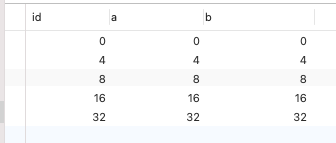
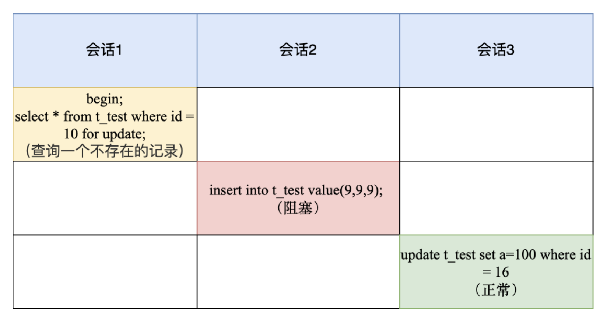

# Next-Key Lock 加锁范围

转载自 [我做了一天的实验](https://www.teqng.com/2021/08/21/%E6%88%91%E5%81%9A%E4%BA%86%E4%B8%80%E5%A4%A9%E7%9A%84%E5%AE%9E%E9%AA%8C%EF%BC%81/)

其中，id 是主键索引（唯一索引），b 是普通索引（非唯一索引），a 是普通的列。

## 唯一索引

### 唯一索引等值查询

* **当查询的记录是存在的，在用「唯一索引进行等值查询」时，next-key lock 会退化成「记录锁」**。
* **当查询的记录是不存在的，在用「唯一索引进行等值查询」时，next-key lock 会退化成「间隙锁」**。

#### 唯一索引等值查询，值存在

select \* from lock\_test where id = 16 for update;

.png>)

只锁住 16 这一行

#### 唯一索引等值查询，值不存在

select \* from lock\_test where id = 10 for update;

next-key lock 退化成间隙锁，锁住 (8, 16)

### 唯一索引范围查询

select \* from lock\_test where id>=8 and id<9 for update;

.png>)

1. 最开始要找的第一行是 id = 8，因此 next-key lock(4,8]，但是由于 id 是唯一索引，且该记录是存在的，因此会退化成记录锁，也就是只会对 id = 8 这一行加锁；
2. 由于是范围查找，就会继续往后找存在的记录，也就是会找到 id = 16 这一行停下来，然后加 next-key lock (8, 16]，但由于 id = 16 不满足 id < 9，所以会退化成间隙锁，加锁范围变为 (8, 16)。

锁住 \[8, 16)

## 非唯一索引

### 非唯一索引等值查询

* **当查询的记录存在时，除了会加 next-key lock 外，还额外加间隙锁，也就是会加两把锁**。
* **当查询的记录不存在时，只会加 next-key lock，然后会退化为间隙锁，也就是只会加一把锁。**

#### 非唯一索引等值查询，值存在

select \* from lock\_test where b = 8 for update;

.png>)

1. 先会对普通索引 b 加上 next-key lock，范围是(4,8];
2. 然后因为是非唯一索引，且查询的记录是存在的，所以还会加上间隙锁，规则是向下遍历到第一个不符合条件的值才能停止，因此间隙锁的范围是(8,16)。

锁住 (4,16)

#### 非唯一索引等值查询，值不存在

select \* from lock\_test where b = 10 for update;

.png>)

1. 先会对普通索引 b 加上 next-key lock，范围是(8,16];
2. 但是由于查询的记录是不存在的，所以不会再额外加个间隙锁，但是 next-key lock 会退化为间隙锁，最终加锁范围是 (8,16)。

锁住 (8,16)

### 非唯一索引范围查询

**普通索引范围查询，next-key lock 不会退化为间隙锁和记录锁**。

select \* from lock\_test where b >= 8 and b < 9 for update;

1. 最开始要找的第一行是 b = 8，因此 next-key lock (4,8]，但是由于 b 不是唯一索引，并不会退化成记录锁。
2. 但是由于是范围查找，就会继续往后找存在的记录，也就是会找到 b = 16 这一行停下来，然后加 next-key lock (8, 16]，因为是普通索引查询，所以并不会退化成间隙锁。

锁住 (4, 16]

## 总结

唯一索引等值查询：

* 当查询的记录是存在的，next-key lock 会退化成「记录锁」。
* 当查询的记录是不存在的，next-key lock 会退化成「间隙锁」。

非唯一索引等值查询：

* 当查询的记录存在时，除了会加 next-key lock 外，还额外加间隙锁，也就是会加两把锁。
* 当查询的记录不存在时，只会加 next-key lock，然后会退化为间隙锁，也就是只会加一把锁。

非唯一索引和主键索引的范围查询的加锁规则不同之处在于：

* 唯一索引在满足一些条件的时候，next-key lock 退化为间隙锁和记录锁。
* 非唯一索引范围查询，next-key lock 不会退化为间隙锁和记录锁。

在非索引字段上做查找是所有行加行锁（即整个表都锁了）。
