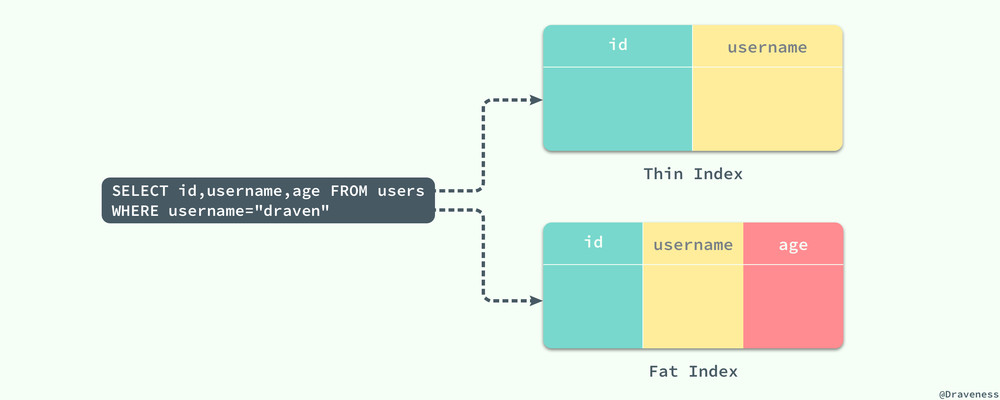
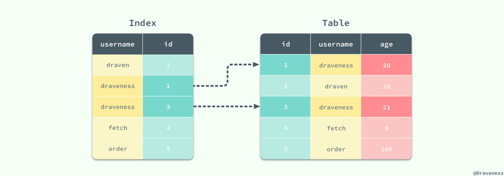
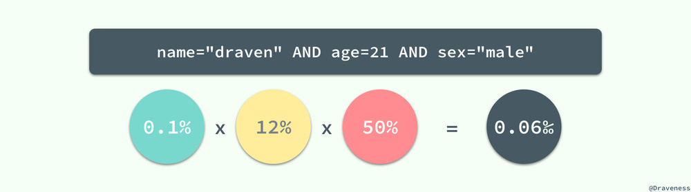
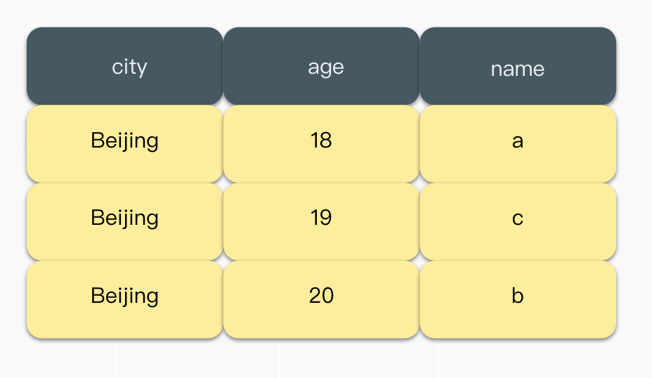

# 索引

参考

[MySQL 索引设计概要](https://draveness.me/sql-index-intro/)

[MySQL索引有哪些分类，你真的清楚吗？](https://segmentfault.com/a/1190000037683781)

## 索引类型

### 按数据结构分类

可分为：**Hash 索引、B 树索引、B+ 树索引**。

#### Hash 索引

的检索可以一次定位，所以 Hash 索引的查询效率要远高于 B-Tree 索引。但是对于处理**范围查询或者排序**性能会非常差，只能进行全表扫描并依次判断是否满足条件。因为哈希函数的目的就是让数据尽可能被分散到不同的桶中进行存储，无法排序，可能 id 相近的两条数据被分配到两个不同的桶内。

#### B+ 树

.png>)

B 树与 B+ 树的最大区别就是，B 树可以在非叶结点中存储数据，但是 B+ 树的所有数据其实都存储在叶子节点中，

1、B+**树的层级更少**：相较于B树B+每个**非叶子**节点存储的关键字数更多，树的层级更少所以查询数据更快；

2、B+**树查询速度更稳定**：B+所有关键字数据地址都存在**叶子**节点上，所以每次查找的次数都相同所以查询速度要比B树更稳定;

3、B+**树天然具备排序功能：B+树所有的叶子**节点数据构成了一个有序链表，在查询大小区间的数据时候更方便，数据紧密性很高，缓存的命中率也会比B树高。

4、B+**树全节点遍历更快：B+树遍历整棵树只需要遍历所有的叶子**节点即可，，而不需要像B树一样需要对每一层进行遍历，这有利于数据库做[全表扫描](https://www.zhihu.com/search?q=%E5%85%A8%E8%A1%A8%E6%89%AB%E6%8F%8F\&search\_source=Entity\&hybrid\_search\_source=Entity\&hybrid\_search\_extra={%22sourceType%22%3A%22article%22%2C%22sourceId%22%3A27700617})。

B树相对于B+树的优点是，如果经常访问的数据离根节点很近，而B树的非叶子节点本身存有关键字其数据的地址，所以这种数据检索的时候会要比B+树快。

B 树能够在非叶节点中存储数据，但是这也导致在查询连续数据时可能会带来更多的随机 I/O，而 B+ 树的所有叶节点可以通过指针相互连接，能够减少顺序遍历时产生的额外随机 I/O；

#### 红黑树


红黑树可参考 [30张图带你彻底理解红黑树](https://www.jianshu.com/p/e136ec79235c)。

### 按物理存储分类

可分为：**聚簇索引、二级索引（辅助索引）**。

#### 聚簇索引

就是以表的主键作为索引，比如 PRIMARY KEY(id), 就会根据 id 的顺序构建一颗 B+ 树，并在叶节点中存放表中的**行记录数据**。聚集索引叶节点中保存的是**整条行记录**，而不是其中的一部分。所有正常的表应该**有且仅有一个**聚集索引。

#### 辅助索引

也是通过 B+ 树实现的，但是它的节点仅包含索引中的列数据和主键数据。

需要注意的是，**通过辅助索引查询时，回表不是必须的过程**，当**SELECT的所有字段在单个辅助索引中都能够找到**时，就不需要回表，MySQL称此时的二级索引为**覆盖索引**或触发了**索引覆盖**。

### 按字段特性分类

可分为：**主键索引、普通索引、前缀索引**。

#### 主键索引

建立在主键上的索引被称为**主键索引**，一张数据表只能有一个主键索引，索引列值不允许有空值，通常在创建表时一起创建。

#### 唯一索引

建立在UNIQUE字段上的索引被称为**唯一索引**，一张表可以有多个唯一索引，索引列值允许为空，列值中出现多个空值不会发生重复冲突。

#### 普通索引

建立在普通字段上的索引被称为**普通索引**。

#### 前缀索引

**前缀索引**就是基于原始索引字段，截取前面指定的字符个数或者字节数来做的索引。而不是在整个字段上建索引。前缀索引可以建立在类型为char、varchar、binary、varbinary的列上，可以大大减少索引占用的存储空间，也能提升索引的查询效率。

具体可以查看 [第20期：索引设计（前缀索引）](https://opensource.actionsky.com/20210120-mysql/)

### 按字段个数分类

可分为：**单列索引、联合索引**。

#### 单列索引

建立在单个列上的索引被称为单列索引。

#### 联合索引

建立在多个列上的索引被称为联合索引，又叫复合索引、组合索引。

## 索引基础

数据库查询操作的时间大都消耗在从磁盘或者内存中读取数据的过程，由于随机 IO（一次大概要 10 ms） 的代价巨大，如何在一次数据库查询中减少随机 IO 的次数往往能够大幅度的降低查询所耗费的时间提高磁盘的吞吐量。

数据页面的顺序读取有两个非常重要的优势：

1. 同时读取多个界面意味着总时间的消耗会大幅度减少，磁盘的吞吐量可以达到 40MB/s；
2. 数据库管理程序会对一些即将使用的界面进行预读，以减少查询请求的等待和响应时间；

### 索引片（Index Slices）

就是 SQL 查询在执行过程中扫描的一个索引片段，在这个范围中的索引将被顺序扫描。



**宽索引**包含了所需的数据列不需要回表，**窄索引**没有包含 sql 查询的所有列就需要回表。

宽索引能够避免二次的随机 IO，而窄索引就需要在对索引进行顺序读取之后再根据主键 id 从主键索引中查找对应的数据：



**对于窄索引，每一个在索引中匹配到的记录行最终都需要执行另外的随机读取从聚集索引中获得剩余的数据**，如果结果集非常大，那么就会导致**随机读取的次数过多**进而影响性能。

### 过滤因子

过滤因子就是作为索引的列。比如 sex 这一列，只有男女两类数据，就不是一个好的过滤因子。所以**在一般情况下**我们最好不要使用 sex 列作为整个索引的第一列。而 name=“draven” 的使用就可以得到一个比较好的过滤因子了，它的使用能过滤整个数据表中 99.9% 的数据；当然我们也可以将这三个过滤进行组合，创建一个新的索引 (name, age, sex) 并同时使用这三列作为过滤条件：



当三个过滤条件都是等值谓词时，几个索引列的顺序其实是无所谓的，索引列的顺序不会影响同一个 SQL 语句对索引的选择，也就是索引 (name, age, sex) 和 (age, sex, name) 对于上图中的条件来说是完全一样的，这两个索引在执行查询时都有着完全相同的效果。

### 匹配列与过滤列

匹配列就是等值谓词，过滤列就是其他。比如以下 sql：

```sql
SELECT * FROM users
WHERE name = "draven" AND sex = "male" AND age > 20;
```

name 和 sex 就是匹配列，age 就是过滤列。

.png>)

## 索引的设计

### 三星索引

如果一个查询语句的索引是三星索引，那么它只需要进行**一次磁盘的随机读及一个窄索引片的顺序扫描**就可以得到全部的结果集；

为了满足三星索引中的三颗星，我们分别需要做以下几件事情：

1. 第一颗星需要取出所有**等值谓词**中的列，作为索引开头的最开始的列（任意顺序）；
2. 第二颗星需要将 ORDER BY 列加入索引中；
3. 第三颗星需要将查询语句剩余的列全部加入到索引中；


三颗星的作用：

1. 第一颗星是减少索引片的大小以减少需要扫描的数据行；尽量缩短将要被扫描的叶子节点范围。（如果与一个查询相关的索引行是相邻的，或者至少相距足够靠近的话，就最小化了必须扫描的索引片的宽度。即，把 WHERE 后的等值条件列作为索引最开头的列，如此，必须扫描的索引片宽度就会缩至最短。）
2. 第二颗星用于避免排序，减少磁盘 IO 和内存的使用。
3. 第三颗星用于避免回表。


比如以下 sql：

```sql
SELECT id, name, age FROM users
WHERE age BETWEEN 18 AND 21
  AND city = "Beijing"
ORDER BY name;
```

在上述查询中，我们可以把所有需要的数据列都放入索引中，这样不需要回表，以获得第三颗星。

不管怎么样，先把等值谓词放到索引最前面，即 city 放在第一列。

如果要满足第一颗星，就需要减少索引片。怎么减少索引片呢？就需要将 age 列放到 city 后面，将符合 age 的数据过滤出来，这样就减少了索引页了。但是把 name 放在 age 后面的话，还需要对当前的索引页数据额外排序，第二颗星就拿不到了。

（比如下图还要对 name 这个列进行额外排序。）



如果不想额外排序，就需要将 name 放在 city 后面，后面再跟 age，这样索引页就可以先排好序，然后再在排好序的数据里选出符合条件的 age。这样就满足了第二颗星，但不满足第一颗星。

当一个 SQL 查询中**同时拥有范围谓词和 ORDER BY 时**，无论如何我们都是没有办法获得一个三星索引的，我们能够做的就是在这两者之间做出选择，是牺牲第一颗星还是第二颗星。

**候选A**

> （第一颗星 + 第三颗星）追求窄，扫描最少的索引片

1. 取出对于等值条件的列，将这些列作为索引的前导列，任意顺序皆可。（选择性高的靠前会好点，便于其他查询复用这个是索引）
2. 将选择性最好的范围条件作为索引的下一列。
3. 以正确的顺序添加 `order by`列。忽略上面两步已经添加过的列。
4. 以任意顺序将select语句中的其他列添加到索引中，已不易变列开始。

**候选B**

> （第二颗星 + 第三颗星）追求不用排序

1. 取出对于等值条件的列，将这些列作为索引的前导列，任意顺序皆可。（选择性高的靠前会好点，便于其他查询复用这个是索引）
2. 以正确的顺序添加 `order by`列。忽略上面两步已经添加过的列。
3. 以任意顺序将 select 语句中的其他列添加到索引中，以不易变列开始。

**有排序且有范围查询时**，才考虑选择 候选A 或 候选B，其他情况，都能满足三星索引。

选择 候选A 还是 候选B，就是判断：load 进内存排序的成本大，还是一个一个从头遍历的筛选的成本大。这种没有定性的答案，需要根据数据的特性以及要去取怎样的数据决定。
