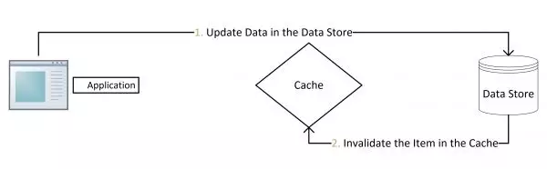

# 常见面试题

## 缓存穿透、缓存击穿与缓存雪崩

**缓存穿透**是指查询一个不存在的数据，由于缓存是不命中时被动写的，并且出于容错考虑，如果从存储层查不到数据则不写入缓存，这将导致这个不存在的数据每次请求都要到存储层去查询，失去了缓存的意义。这时的用户很可能是攻击者，攻击会导致数据库压力过大，严重会击垮数据库。

解决方法：

* 在接口层增加校验，比如用户鉴权校验，参数做校验，不合法的参数直接代码Return。
* 从缓存取不到的数据，在数据库中也没有取到，这时也可以将对应Key的Value对写为null、位置错误、稍后重试这样的值等。
* 布隆过滤器。利用高效的数据结构和算法快速判断出你这个Key是否在数据库中存在，不存在return，存在就去查DB刷新KV再return

**缓存击穿**是指一个Key非常热点，在不停的扛着大并发，大并发集中对这一个点进行访问，当这个Key在失效的瞬间（可能设置了过期时间），持续的大并发就穿破缓存，直接请求数据库，就像在一个完好无损的桶上凿开了一个洞。

解决方法：

* 设置热点数据永远不过期。

**缓存雪崩**是指在我们设置缓存时采用了相同的过期时间，导致缓存在某一时刻同时失效，请求全部转发到DB，DB瞬时压力过重雪崩。

解决方法：

* 在批量往**Redis**存数据的时候，把每个Key的失效时间都加个随机值。
* 设置热点数据永不过期。

## Redis为何这么快

* Redis完全基于内存，绝大部分请求是纯粹的内存操作，非常迅速，数据存在内存中，类似于HashMap，HashMap的优势就是查找和操作的时间复杂度是O(1)。
* 数据结构简单，对数据操作也简单。
* 采用单线程，避免了不必要的上下文切换和竞争条件，不存在多线程导致的CPU切换，不用去考虑各种锁的问题，不存在加锁释放锁操作，没有死锁问题导致的性能消耗。
* 使用多路复用IO模型，非阻塞IO。
* 大量的数据结构上的优化, 比如说字符串没有用C语言自带的,而是用自己的Simple Dynamic String。

## Redis和Memcached的区别

* 存储方式上：memcache会把数据全部存在内存之中，断电后会挂掉，数据不能超过内存大小。redis有部分数据存在硬盘上，这样能保证数据的持久性。
* 数据支持类型上：memcache对数据类型的支持简单，只支持简单的key-value。而redis支持五种数据类型。
* 使用底层模型不同：它们之间底层实现方式以及与客户端之间通信的应用协议不一样。redis直接自己构建了VM机制，因为一般的系统调用系统函数的话，会浪费一定的时间去移动和请求。
* value的大小：redis可以达到1GB，而memcache只有1MB。

## Redis 单线程 or 多线程

redis 4.0 之前，redis 是**完全单线程的**。

redis 4.0 时，redis 引入了多线程，但是**额外的线程只是用于后台处理**，例如：删除对象，核心流程还是完全单线程的。这也是为什么有些人说 4.0 是单线程的，因为他们指的是核心流程是单线程的。

Redis 6.0 之后在网络 IO 处理方面上了多线程，如网络数据的读写和协议解析等，需要注意的是，执行命令的核心模块还是单线程的。这样做的目的是因为redis的性能瓶颈在于网络IO而非CPU，使用多线程能提升IO读写的效率，从而整体提高redis的性能

## Redis缓存与数据库双写一致性

这里的一致性是指：数据库数据发生更新后，缓存中的数据要和数据库保持一致。

更新数据库有两种方案：

1. 先更新数据库，再删除缓存。

​ 对于这种策略，其实是一种设计模式：`Cache Aside Pattern`

**在高并发下不容易出问题，在原子性被破坏时表现不如意。**

如果原子性被破坏了，可能会发生：

* 第一步成功(操作数据库)，第二步失败(删除缓存)，会导致**数据库里是新数据，而缓存里是旧数据**。
* 如果第一步(操作数据库)就失败了，我们可以直接返回错误(Exception)，不会出现数据不一致。

**原子性破坏时，删除缓存失败的解决思路**：

* 将需要删除的key发送到消息队列中
* 消费消息，获得需要删除的key
* 不断重试删除操作，直到成功

1. 先删除缓存，再更新数据库。

**在高并发下表现不如意，在原子性被破坏时表现优异**

并发场景下的问题：

* 线程A删除了缓存
* 线程B查询，发现缓存已不存在
* 线程B去数据库查询得到旧值
* 线程B将旧值写入缓存
* 线程A将新值写入数据库

**并发下解决数据库与缓存不一致的思路**：

* 将删除缓存、修改数据库、读取缓存等的操作积压到**队列**里边，实现**串行化**。

.png>)

更多面试题参考：

[面试前必须要知道的Redis面试题](https://mp.weixin.qq.com/s?\_\_biz=Mzg2NzA4MTkxNQ==\&mid=2247485078\&idx=1\&sn=725f2169e308ae20de82801f3bc628c5\&source=41#wechat\_redirect)

[全网最硬核 Redis 大厂面试题解析（2021年最新版）](https://jishuin.proginn.com/p/763bfbd57a6d)
