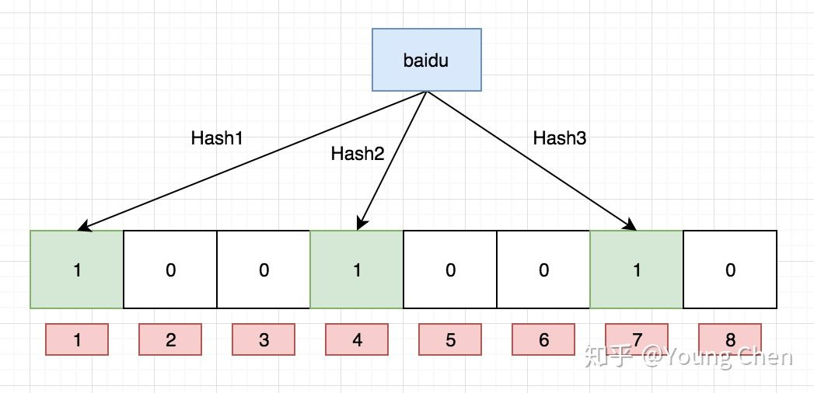

# 常见面试题

## 缓存穿透、缓存击穿与缓存雪崩

**缓存穿透**是指查询一个不存在的数据，由于缓存是不命中时被动写的，并且出于容错考虑，如果从存储层查不到数据则不写入缓存，这将导致这个不存在的数据每次请求都要到存储层去查询，失去了缓存的意义。这时的用户很可能是攻击者，攻击会导致数据库压力过大，严重会击垮数据库。

解决方法：

* 在接口层增加校验，比如用户鉴权校验，参数做校验，不合法的参数直接代码Return。
* 从缓存取不到的数据，在数据库中也没有取到，这时也可以将对应Key的Value对写为null、位置错误、稍后重试这样的值等（这种情况我们一般会将空对象设置一个**较短的过期时间**）。
* 布隆过滤器。利用高效的数据结构和算法快速判断出你这个Key是否在数据库中存在，不存在return，存在就去查DB刷新KV再return

**缓存击穿**是指一个Key非常热点，在不停的扛着大并发，大并发集中对这一个点进行访问，当这个Key在失效的瞬间（可能设置了过期时间），持续的大并发就穿破缓存，直接请求数据库，就像在一个完好无损的桶上凿开了一个洞。

解决方法：

* 设置热点数据永远不过期。
* Go 的单飞模式（多个同样的请求，只执行一次）。可参考 [Go并发编程(十二) Singleflight](https://lailin.xyz/post/go-training-week5-singleflight.html)

**缓存雪崩**是指在我们设置缓存时采用了相同的过期时间，导致缓存在某一时刻同时失效，请求全部转发到DB，DB瞬时压力过重雪崩。

解决方法：

* 在批量往**Redis**存数据的时候，把每个Key的失效时间都加个随机值。
* 设置热点数据永不过期。

### 布隆过滤器

本质上布隆过滤器是一种数据结构，比较巧妙的概率型数据结构（probabilistic data structure），特点是高效地插入和查询，可以用来告诉你 **“某样东西一定不存在或者可能存在”**。

相比于传统的 List、Set、Map 等数据结构，它更高效、占用空间更少，但是缺点是其返回的结果是概率性的，而不是确切的。

#### 实现原理

**HashMap 的问题**

讲述布隆过滤器的原理之前，我们先思考一下，通常你判断某个元素是否存在用的是什么？应该蛮多人回答 HashMap 吧，确实可以将值映射到 HashMap 的 Key，然后可以在 O(1) 的时间复杂度内返回结果，效率奇高。但是 HashMap 的实现也有缺点，例如存储容量占比高，考虑到负载因子的存在，通常空间是不能被用满的，而一旦你的值很多例如上亿的时候，那 HashMap 占据的内存大小就变得很可观了。

还比如说你的数据集存储在远程服务器上，本地服务接受输入，而数据集非常大不可能一次性读进内存构建 HashMap 的时候，也会存在问题。

**布隆过滤器数据结构**

布隆过滤器是一个 bit 向量或者说 bit 数组，长这样：

如果我们要映射一个值到布隆过滤器中，我们需要使用**多个不同的哈希函数**生成多个哈希值，并对每个生成的哈希值指向的 bit 位置设为 1，例如针对值 “baidu” 和三个不同的哈希函数分别生成了哈希值 1、4、7，则上图转变为：

Ok，我们现在再存一个值 “tencent”，如果哈希函数返回 3、4、8 的话，图继续变为：

值得注意的是，4 这个 bit 位由于两个值的哈希函数都返回了这个 bit 位，因此它被覆盖了。现在我们如果想查询 “dianping” 这个值是否存在，哈希函数返回了 1、5、8三个值，结果我们发现 5 这个 bit 位上的值为 0，**说明没有任何一个值映射到这个 bit 位上**，因此我们可以很确定地说 “dianping” 这个值不存在。而当我们需要查询 “baidu” 这个值是否存在的话，那么哈希函数必然会返回 1、4、7，然后我们检查发现这三个 bit 位上的值均为 1，那么我们可以说 “baidu” **存在了么？答案是不可以，只能是 “baidu” 这个值可能存在。**

这是为什么呢？答案很简单，因为随着增加的值越来越多，被置为 1 的 bit 位也会越来越多，这样某个值 “taobao” 即使没有被存储过，但是万一哈希函数返回的三个 bit 位都被其他值置位了 1 ，那么程序还是会判断 “taobao” 这个值存在。所以它可以用来告诉你 **“某样东西一定不存在或者可能存在”**。

参考 [详解布隆过滤器的原理，使用场景和注意事项](https://zhuanlan.zhihu.com/p/43263751) [5 分钟搞懂布隆过滤器](https://juejin.cn/post/6844904007790673933)

## Redis为何这么快

* Redis完全基于内存，绝大部分请求是纯粹的内存操作，非常迅速，数据存在内存中，类似于HashMap，HashMap的优势就是查找和操作的时间复杂度是O(1)。
* 数据结构简单，对数据操作也简单。
* 采用单线程，避免了不必要的上下文切换和竞争条件，不存在多线程导致的CPU切换，不用去考虑各种锁的问题，不存在加锁释放锁操作，没有死锁问题导致的性能消耗。
* 使用多路复用IO模型，非阻塞IO。
* 大量的数据结构上的优化, 比如说字符串没有用C语言自带的,而是用自己的Simple Dynamic String。

## Redis和Memcached的区别

* 存储方式上：memcache会把数据全部存在内存之中，断电后会挂掉，数据不能超过内存大小。redis有部分数据存在硬盘上，这样能保证数据的持久性。
* 数据支持类型上：memcache对数据类型的支持简单，只支持简单的key-value。而redis支持五种数据类型。
* 使用底层模型不同：它们之间底层实现方式以及与客户端之间通信的应用协议不一样。redis直接自己构建了VM机制，因为一般的系统调用系统函数的话，会浪费一定的时间去移动和请求。
* value的大小：redis可以达到1GB，而memcache只有1MB。

Memcached利用**slab allocation**机制来分配和管理内存，它按照预先规定的大小，将分配的内存**分割成特定长度的内存块**，**再把尺寸相同的内存块分成组**，数据在存放时，根据键值大小去匹配slab大小，找就近的slab存放，所以存在空间浪费现象。

传统的内存管理方式是，使用完**通过malloc分配的内存后通过free来回收内存**，这种方式**容易产生内存碎片并降低操作系统对内存的管理效率**。

Memcached的内存管理制效率高，而且不会造成内存碎片，但是它最大的缺点就是会导致空间浪费。因为每个 Chunk都分配了特定长度的内存空间，所以变长数据无法充分利用这些空间。

memcached 具体可参考 [memcached分布式原理与实现](https://segmentfault.com/a/1190000016173095)

## Redis 单线程 or 多线程

redis 4.0 之前，redis 是**完全单线程的**。

redis 4.0 时，redis 引入了多线程，但是**额外的线程只是用于后台处理**，例如：删除对象，核心流程还是完全单线程的。这也是为什么有些人说 4.0 是单线程的，因为他们指的是核心流程是单线程的。

Redis 6.0 之后在网络 IO 处理方面上了多线程，如网络数据的读写和协议解析等，需要注意的是，执行命令的核心模块还是单线程的。这样做的目的是因为redis的性能瓶颈在于网络IO而非CPU，使用多线程能提升IO读写的效率，从而整体提高redis的性能。

## Redis 缓存与数据库双写一致性

可以参考 [高并发系统40问笔记-缓存的读写策略](https://stormspirit.gitbook.io/stormspirit/microservice/high-concurrency/hc-cache#huan-cun-de-du-xie-ce-lve) 。

延迟删除可参考 [延时双删实现MySQL和Redis的数据一致性 ](https://cloud.tencent.com/developer/news/634004)。

## Redis 删除大 key 的方案

大key（bigkey）是指 key 的 value 是个庞然大物，例如 `Hashes, Sorted Sets, Lists, Sets`，日积月累之后，会变得非常大，可能几十上百MB，甚至到GB。

如果对这类大key直接使用 `del` 命令进行删除，会导致长时间阻塞，甚至崩溃。

因为 `del` 命令在删除集合类型数据时，时间复杂度为 `O(M)`，M 是集合中元素的个数。

Redis 是单线程的，单个命令执行时间过长就会阻塞其他命令，容易引起雪崩。

非字符串的bigkey，不要使用 del 删除，使用 hscan、sscan、zscan 方式渐进式删除。

可靠方案：

- 渐进式删除
- UNLINK (4.0版本以后)

### 渐进式删除

分批删除，通过 scan 命令遍历大key，每次取得少部分元素，对其删除，然后再获取和删除下一批元素。

步骤：

1. key改名（redis.RENAME），相当于逻辑上把这个key删除了，任何redis命令都访问不到这个key了。

2. 小步多批次的删除。

- hash key: 通过hscan命令，每次获取500个字段，再用hdel命令；
- set key: 使用sscan命令，每次扫描集合中500个元素，再用srem命令每次删除一个元素；
- list key: 删除大的List键，未使用scan命令； 通过ltrim命令每次删除少量元素。
- sorted set key: 删除大的有序集合键，和List类似，使用sortedset自带的zremrangebyrank命令,每次删除top 100个元素。

### UNLINK

Redis 4.0 推出了一个重要命令 `UNLINK`，用来拯救 `del` 删大key的困境，推荐使用该方案。UNLINK 命令只是将键与键空间**断开连接**。实际的删除将稍后异步进行。

UNLINK 工作思路：

（1）在所有命名空间中把 key 删掉，立即返回，不阻塞。

（2）后台线程执行真正的释放空间的操作。

`UNLINK` 基本可以替代 `del`，但个别场景还是需要 `del` 的，例如在空间占用积累速度特别快的时候就不适合使用`UNLINK`，因为 `UNLINK` 不是立即释放空间。

更多面试题参考：

[面试前必须要知道的Redis面试题](https://mp.weixin.qq.com/s?\_\_biz=Mzg2NzA4MTkxNQ==\&mid=2247485078\&idx=1\&sn=725f2169e308ae20de82801f3bc628c5\&source=41#wechat\_redirect)

[全网最硬核 Redis 大厂面试题解析（2021年最新版）](https://jishuin.proginn.com/p/763bfbd57a6d)
