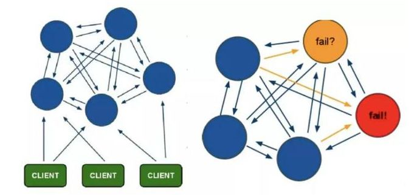
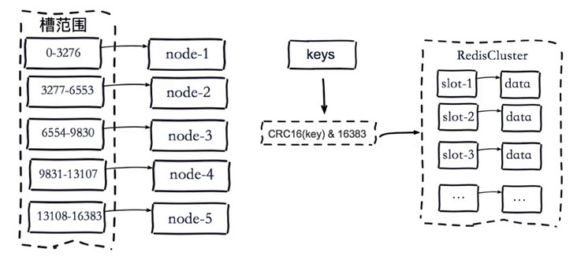
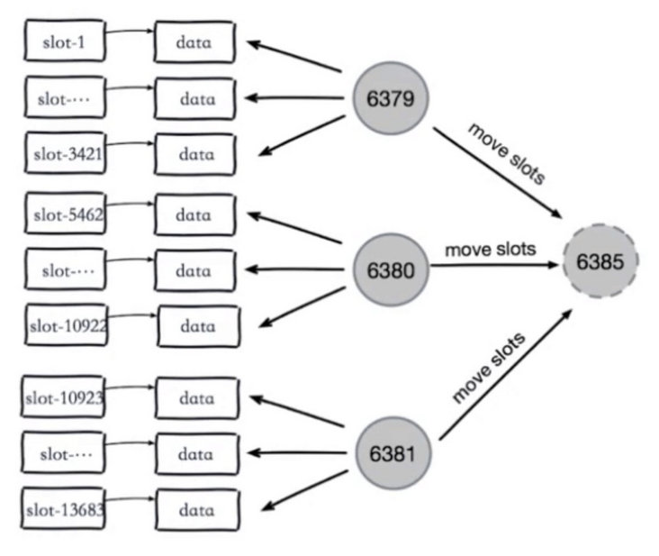
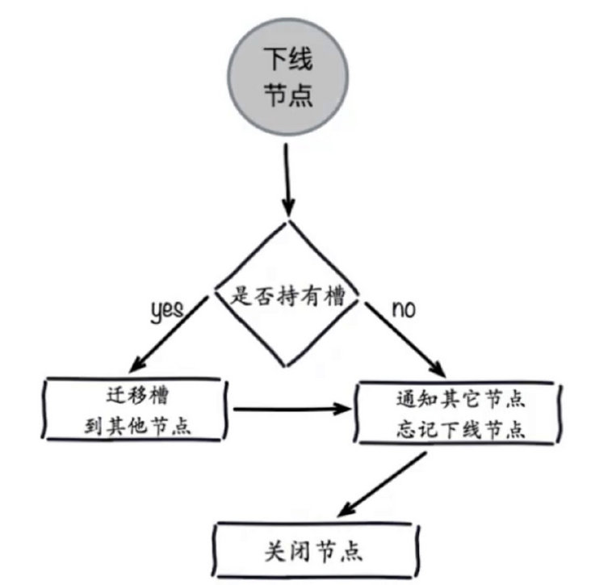
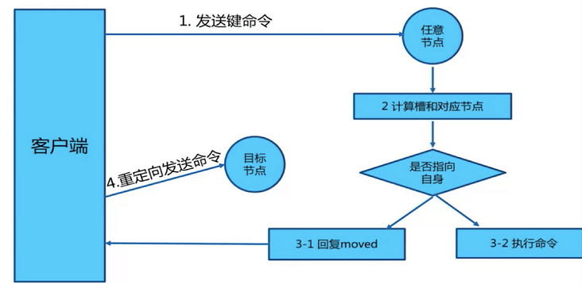

# 集群

**Redis 支持三种集群方案**

* 主从复制模式
* Sentinel（哨兵）模式
* Cluster 模式

## Redis 集群的三种模式

### 主从复制模式

主数据库可以进行读写操作，当写操作导致数据变化时会自动将数据同步给从数据库。而从数据库一般是只读的，并接受主数据库同步过来的数据。一个主数据库可以拥有多个从数据库，而一个从数据库只能拥有一个主数据库。

* 从数据库启动成功后，连接主数据库，发送 SYNC 命令；
* 主数据库接收到 SYNC 命令后，开始执行 BGSAVE 命令生成 RDB 文件并使用缓冲区记录此后执行的所有写命令；
* 主数据库 BGSAVE 执行完后，向所有从数据库发送快照文件，并在发送期间继续记录被执行的写命令；
* 从数据库收到快照文件后丢弃所有旧数据，载入收到的快照；
* 主数据库快照发送完毕后，开始向从数据库发送缓冲区中的写命令；
* 从数据库完成对快照的载入，开始接收命令请求，并执行来自主数据库缓冲区的写命令；（**从数据库初始化完成**）
* 主数据库每执行一个写命令就会向从数据库发送相同的写命令，从数据库接收并执行收到的写命令（**从数据库初始化完成后的操作**）
* 出现断开重连后，2.8之后的版本会将断线期间的命令传给重数据库，增量复制（即 PSYNC）。
* 主从刚刚连接的时候，进行全量同步；全同步结束后，进行增量同步。当然，如果有需要，slave 在任何时候都可以发起全量同步。Redis 的策略是，无论如何，首先会尝试进行增量同步，如不成功，要求从机进行全量同步。

Redis 2.8以前采用的复制都为全量复制，使用SYNC命令全量同步复制，SYNC存在很大的缺陷就是：不管slave是第一次启动，还是连接断开后的重连，主从同步都是全量数据复制，严重消耗master的资源以及大量的网络连接资源。Redis在2.8及以上版本使用PSYNC命令完成主从数据同步，PSYNC同步过程分为全量复制和部分复制，完善了SYNC存在的缺陷。

#### 主从复制优缺点

**主从复制优点**

* 支持主从复制，主机会自动将数据同步到从机，可以进行读写分离；
* 为了分载 Master 的读操作压力，Slave 服务器可以为客户端提供只读操作的服务，写服务仍然必须由Master来完成；
* Slave 同样可以接受其它 Slaves 的连接和同步请求，这样可以有效的分载 Master 的同步压力；
* Master Server 是以非阻塞的方式为 Slaves 提供服务。所以在 Master-Slave 同步期间，客户端仍然可以提交查询或修改请求；
* Slave Server 同样是以非阻塞的方式完成数据同步。在同步期间，如果有客户端提交查询请求，Redis则返回同步之前的数据；

**主从复制缺点**

* Redis不具备自动容错和恢复功能，主机从机的宕机都会导致前端部分读写请求失败，需要等待机器重启或者手动切换前端的IP才能恢复（**也就是要人工介入**）；
* 主机宕机，宕机前有部分数据未能及时同步到从机，切换IP后还会引入数据不一致的问题，降低了系统的可用性；
* 如果多个 Slave 断线了，需要重启的时候，尽量不要在同一时间段进行重启。因为只要 Slave 启动，就会发送sync 请求和主机全量同步，当多个 Slave 重启的时候，可能会导致 Master IO 剧增从而宕机。
* Redis 较难支持在线扩容，在集群容量达到上限时在线扩容会变得很复杂；

### Sentinel（哨兵）模式

第一种主从同步/复制的模式，当主服务器宕机后，需要手动把一台从服务器切换为主服务器，这就需要人工干预，费事费力，还会造成一段时间内服务不可用。这不是一种推荐的方式，更多时候，我们优先考虑哨兵模式。

**哨兵是一个独立的进程，作为进程，它会独立运行。其原理是哨兵通过发送命令，等待Redis服务器响应，从而监控运行的多个 Redis 实例**。

#### **哨兵模式的作用**

* 监控：不断检查主服务器和从服务器是否正常运行。
* 通知：当被监控的某个redis服务器出现问题，Sentinel通过API脚本向管理员或者其他应用程序发出通知。
* 自动故障转移：当主节点不能正常工作时，Sentinel会开始一次自动的故障转移操作，它会将与失效主节点是主从关系的其中一个从节点升级为新的主节点，并且将其他的从节点指向新的主节点，这样人工干预就可以免了。
* 配置提供者：在Redis Sentinel模式下，客户端应用在初始化时连接的是Sentinel节点集合，从中获取主节点的信息。

#### **故障切换的过程**

假设主服务器宕机，哨兵1先检测到这个结果，系统并不会马上进行 failover 过程，仅仅是哨兵1主观的认为主服务器不可用，这个现象成为**主观下线**。当后面的哨兵也检测到主服务器不可用，并且数量达到一定值时，那么哨兵之间就会进行一次投票，投票的结果由一个哨兵发起，进行 failover 操作。切换成功后，就会通过发布订阅模式，让各个哨兵把自己监控的从服务器实现切换主机，这个过程称为**客观下线**。这样对于客户端而言，一切都是透明的。

#### 哨兵模式的优缺点

**优点：**

* 哨兵模式是基于主从模式的，所有主从的优点，哨兵模式都具有。
* 主从可以自动切换，系统更健壮，可用性更高(**可以看作自动版的主从复制**)。

**缺点：**

* Redis较难支持在线扩容，在集群容量达到上限时在线扩容会变得很复杂。

其实上面两种集群模式现在基本用的很少了，主要还是用下面 redis cluster。

### Cluster 集群模式（Redis官方）

Redis Cluster是一种服务器 Sharding 技术，3.0版本开始正式提供。

Redis 的哨兵模式基本已经可以实现高可用，读写分离 ，但是在这种模式下每台 Redis 服务器都存储相同的数据，很浪费内存，所以在 redis3.0上加入了 Cluster 集群模式，实现了 Redis 的分布式存储，**也就是说每台 Redis 节点上存储不同的内容**。

在这个图中，每一个蓝色的圈都代表着一个 redis 的服务器节点。它们任何两个节点之间都是相互连通的。客户端可以与任何一个节点相连接，然后就可以访问集群中的任何一个节点。对其进行存取和其他操作。

Cluster 集群具有如下优点:

* 无需Sentinel哨兵监控，如果Master挂了，Redis Cluster内部自动将Slave切换Master
* 可以进行水平扩容
* 支持自动化迁移，当出现某个Slave宕机了，那么就只有Master了，这时候的高可用性就无法很好的保证了，万一Master也宕机了，咋办呢？ 针对这种情况，如果说其他Master有多余的Slave ，集群自动把多余的Slave迁移到没有Slave的Master 中。

#### 集群分片路由

* 客户端分片路由：客户端直接访问分片的实例，服务端节点变化对客户端有影响。
* 服务端分片路由：客户端访问任意节点，如果数据不在该分片上，返回客户端真正的节点重新访问。
* 代理中间件分片路由：客户端访问代理，由代理访问真实的redis节点。

#### **集群分片策略**

* 预分片：一般的分片是因为数据量比较大了，所以做分片，分开存储。预分片就是先提前做好分片，每个分片的存储空间随着数据量增加做扩展，这样不影响分片的路由规则
* 一致性哈希+虚拟节点+哈希环形桶：单纯采用一致性hash会出现数据倾斜情况：如果在分片的集群中，节点太少，并且分布不均，一致性哈希算法就会出现部分节点数据太多，部分节点数据太少；所以加上了虚拟节点问题(也可以解决雪崩问题)
*   redis cluster：

    Redis 集群没有使用一致性 hash，而是引入了哈希槽【hash slot】的概念。

    Redis Cluster中，分片采用slot(槽)的概念，一共分成16384个槽，这有点儿类似前面讲的预分片思路。对于每个进入Redis的键值对，根据key进行散列，分配到这16384个slot中的某一个中。使用的hash算法也比较简单，就是CRC16后16384取模。Redis集群中的每个node(节点)负责分摊这16384个slot中的一部分，也就是说，每个slot都对应一个node负责处理。当动态添加或减少node节点时（node之间互相通信确定节点状态），需要将16384个槽做个再分配，槽中的键值也要迁移。**（感觉和虚拟节点的意思差不多，就是一个是虚拟位置，一个是真的有这么多槽）**

**Redis虚拟槽分区的特点**：

* 解耦数据和节点之间的关系，简化了节点扩容和收缩难度。
* 节点自身维护槽的映射关系，不需要客户端或者代理服务维护槽分区元数据。
* 支持节点、槽、键之间的映射查询，用于数据路由、在线伸缩等场景。

#### 集群伸缩原理

Redis集群提供了灵活的节点扩容和收缩方案。在不影响集群对外服务的情况下，可以为集群添加节点进行扩容也可以下线部分节点进行缩容。原理可抽象为槽和对应数据在不同节点之间灵活移动。

当我们现在有三个节点，此时想增加6385节点，也就是每个节点把一部分槽和数据迁移到新的节点6385，每个节点负责的槽和数据相比之前变少了从而达到了集群扩容的目的。

#### 收缩集群

- 首先需要确定下线节点是否有负责的槽，如果是，需要把槽迁移到 其他节点，保证节点下线后整个集群槽节点映射的完整性。
- 当下线节点不再负责槽或者本身是从节点时，就可以通知集群内其 他节点忘记下线节点，当所有的节点忘记该节点后可以正常关闭。

收缩正好和扩容迁移方向相反，7006变为源节点，其他主节点变为目标节点，源节点需要把自身负责的4096个槽均匀地迁移到其他主节点上。

#### 请求重定向

在集群模式下，Redis接收任何键相关命令时首先计算键对应的槽，再根据槽找出所对应的节点，如果节点是自身，则处理键命令；否则回复MOVED重定向错误，通知客户端请求正确的节点。

事实上，对于 redis-cli 工具而言，当我们添加 **-c 选项** 后，即以集群方式执行 redis-cli 命令后，其会帮我们自动处理 MOVED 重定向。go-redis 库也支持 redis 集群模式，不用手动处理 MOVED 问题。

#### ASK 重定向

Ask 重定向发生于 Redis 集群进行伸缩（扩容 / 缩容）时，由于此时会进行 Slot 槽迁移。当我们去源节点访问时，数据可能已经迁移到目标节点中。故此时需要借助 **Ask 重定向**来解决该问题。具体地，在将 A 节点中的某个槽迁移到 B 节点过程中：

- 当 A 节点该 Slot 槽设置为 **MIGRATING 迁出状态** 后，A 节点依然可以接受有关此 Slot 槽的查询命令。如果该 Key 依然存在于该 Slot 槽中，则直接返回结果；如果该 Key 不存在于该 Slot 槽，说明该 Key 可能已经迁移到目的节点 B 当中了，故其会返回 **ASK 重定向**以告知客户端该 Slot 槽迁入的目的节点 B 地址信息
- 当 B 节点该 Slot 槽设置为 **IMPORTING 迁入状态** 时，B 节点可以接受有关此哈希槽的查询命令。但前提是客户端向 B 节点发送该 Key 的查询命令之前，必须要先发送 **ASKING 命令**。否则，B 节点会返回 **MOVED 重定向**以告知客户端 A 节点的地址信息。

#### MOVED 和 ASK 的区别

从上面的介绍来看 MOVED 错误和 ASK 错误非常类似，都起到重定向客户端的效果，他们有什么区别？能否合并成一个？

- MOVED 错误代表槽位的负责权已经从一个节点转移到了另一个节点：在客户端收到关于槽位 k 的MOVED 错误之后，会更新槽位 k 及其负责节点的对应关系，这样下次遇到关于槽位 k 的命令请求时，就可以直接将命令请求发送新的负责节点。

- ASK 错误只是两个节点在迁移槽的过程中使用的一种临时措施：客户端收到关于槽位 k 的 ASK 错误之后，客户端只会在接下来的一次命令请求中将关于槽位 k 的命令请求发送至 ASK 错误所指示的节点（即上图的 destination 节点），但这种重定向不会对客户端今后发送关于槽位 k 的命令请求产生任何影响，客户端之后仍然会将关于槽位 k 的命令请求发送至目前负责处理 k 槽位的节点，除非 ASK 错误再次出现。

总结就是：

1）ASK 是一种迁移槽临时措施，只是会产生一次重定向

2）MOVED 代表该槽已经完全由另一个节点负责了，会触发客户端刷新本地路由表，之后对于该槽的请求都会请求新的节点。

这边提到的本地路由表是该集群的插槽和负责处理该槽的节点地址的映射，通过该路由表客户端可以在大部分情况下都直接请求到正确的节点，而无需重定向，从而提升性能。

#### 纪元

Redis 集群中使用了类似于 Raft 算法 term（任期）的概念称为 epoch（纪元），用来给事件增加版本号。

Redis 集群中的纪元主要是两种：currentEpoch 和 configEpoch 。

##### currentEpoch

这是一个集群状态相关的概念，可以当做记录集群状态变更的递增版本号。每个集群节点，都会通过 server.cluster->currentEpoch 记录当前的 ***currentEpoch***。

currentEpoch 作用在于，当集群的状态发生改变，某个节点为了执行一些动作需要寻求其他节点的同意时，就会增加 currentEpoch 的值，例如故障转移流程。

当从节点 A 发现其所属的主节点下线时，就会试图发起故障转移流程。首先就是增加 currentEpoch 的值，这个增加后的 currentEpoch 是所有集群节点中最大的。然后从节点A向所有节点发包用于拉票，请求其他主节点投票给自己，使自己能成为新的主节点。

其他节点收到包后，发现发送者的 currentEpoch 比自己的 currentEpoch 大，就会更新自己的 currentEpoch，并在尚未投票的情况下，投票给从节点 A，表示同意使其成为新的主节点。

##### configEpoch

节点当前的配置纪元，这是一个集群节点配置相关的概念，每个集群节点都有自己独一无二的 configepoch。所谓的节点配置，实际上是指节点所负责的槽位信息。

每一个 master 在向其他节点发送消息时，都会附带其 configEpoch 信息，以及一份表示它所负责的 slots 信息。

节点收到消息之后，就会根据消息中的 configEpoch 和负责的 slots 信息，记录到相应节点属性中。这边有两种情况：

1）如果该消息中的 slots 在当前节点中被记录为还未有节点负责，那可以直接指定为发送消息的节点。

2）如果消息中的 slots 在当前节点已经被记录为有节点负责，这种情况相当于有多个节点都宣称他负责了某个 slot，这时候就要用到 configEpoch，configEpoch 更大的说明是更新的配置，当前节点就会将该 slot 的负责节点设置为 configEpoch 更大的节点。

#### 故障发现

cluster 集群模式也有主观下线和客观下线两种方式。

- **当集群内某个节点出现问题时，需要通过一种健壮的方式保证识别出节点是否发生了故障**。Redis集群内节点通过ping/pong消息实现节点通信，消息不但可以传播节点槽信息，还可以传播其他状态如：主从状态、节点故障等。
- **因此故障发现也是通过消息传播机制实现的，主要环节包括：**
  - 主观下线 （pfail）：指某个节点认为另一个节点不可用，即下线状态，这个状态并不是最终的故障判定，只能代表一个节点的意见，可能存在误判情况。
  - 客观下线（fail）：指标记一个节点真正的下线，集群内多个节点（持有槽的主节点）都认为该节点不可用，从而达成共识的结果。如果是持有槽的主节点故障，需要为该节点进行故障转移。
