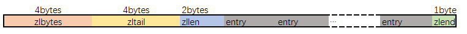

# 底层数据结构

以下内容整理自 https://pdai.tech/md/db/nosql-redis/db-redis-x-redis-ds.html

## 简单动态字符串 - SDS

使用场景：String

数据结构：


其中`sdshdr`是头部, `buf`是真实存储用户数据的地方，在buf中, 用户数据后总跟着一个\0. 即图中 `"数据" + "\0"`是为所谓的buf。

SDS有五种不同的头部. 其中sdshdr5实际并未使用到. 所以实际上有四种不同的头部, 分别如下:


其中：

* `len` 保存了SDS保存字符串的长度
* `buf[]` 数组用来保存字符串的每个元素
* `alloc`分别以uint8, uint16, uint32, uint64表示整个SDS, 除过头部与末尾的\0, 剩余的字节数.
* `flags` 始终为一字节, 以低三位标示着头部的类型, 高5位未使用.

### 为什么使用SDS

* **常数复杂度获取字符串长度**
*   **杜绝缓冲区溢出**

    在进行字符修改的时候，**会首先根据记录的 len 属性检查内存空间是否满足需求**，如果不满足，会进行相应的空间扩展，然后在进行修改操作，所以不会出现缓冲区溢出。
*   **减少修改字符串的内存重新分配次数**

    空间预分配：当新字符串的长度小于1M时，redis会分配他们所需大小一倍的空间，当大于1M的时候，就为他们额外多分配1M的空间。
*   **二进制安全**

    所有 SDS 的API 都是以处理二进制的方式来处理 `buf` 里面的元素，并且 SDS 不是以空字符串来判断是否结束，而是以 len 属性表示的长度来判断字符串是否结束，所以可以处理特殊字符比如 `\0`

## 压缩列表 - ZipList

使用场景：Hash、List、Zset

* Hash：key和value的字符串长度都小于64字节&&键值对总数量小于512。
* List：字符串元素的长度都小于64个字节&&总数量少于512个（内存占用少，插入删除效率低）。
* Zset：元素长度小于64&&总数量小于128。

ziplist是为了提高存储效率而设计的一种特殊编码的双向链表。它可以存储字符串或者整数，存储整数时是采用整数的二进制而不是字符串形式存储。他能在O(1)的时间复杂度下完成list两端的push和pop操作。但是因为每次操作都需要重新分配ziplist的内存，所以实际复杂度和ziplist的内存使用量相关。

存储格式如下：



### Entry 结构

默认是 `<prevlen> <encoding> <entry-data>`。

`prevlen`：前一个entry的大小，编码方式见下文；

`encoding`：不用于表示当前entry的类型（是 int 还是 string）和长度（int、string 的长度限制）；

`entry-data`：真是用于存储entry表示的数据；

在entry中存储的是int类型时，`encoding`和`entry-data`会合并在`encoding`中表示，此时没有`entry-data`字段；

redis中，在存储数据时，会先尝试将string转换成int存储，节省空间；

此时entry结构：`<prevlen> <encoding>`

### 为什么ZipList特别省内存

* encoding字段，针对不同的encoding来细化存储大小；
* 是ziplist中每个data占据的内存不一样，所以为了解决遍历，需要增加记录上一个元素的length，所以增加了prelen字段。

## 快表 - QuickList

使用场景：List

Ziplist：字符串元素的长度都小于64个字节&&总数量少于512个（内存占用少，插入删除效率低）。

Linkedlist（双端链表）：字符串元素的长度大于64个字节||总数量大于512个（内存占用多，插入删除效率高）。

Quicklist（3.2版本之后）：结合了Ziplist和Linkedlist的优点。

它是一种以ziplist为结点的双端链表结构. 宏观上, quicklist是一个链表, 微观上, 链表中的每个结点都是一个ziplist。


list作为最传统的双链表, 结点通过指针持有数据, 指针字段会耗费大量内存. ziplist解决了耗费内存这个问题. 但引入了新的问题: 每次写操作整个ziplist的内存都需要重分配. quicklist在两者之间做了一个平衡. 并且使用者可以通过自定义`quicklist.fill`, 根据实际业务情况, 经验主义调参。

## 字典/哈希表 - Dict （hashtable）

使用场景：

* Hash：key和value的字符串长度大于64字节||键值对总数量大于512。
* Set ：保存的元素不是整数`||`总数量大于512。

使用链地址法（拉链法）解决冲突，通过字典里面的 \*next 指针指向下一个具有相同索引值的哈希表节点。：


* **扩容和收缩**：当哈希表保存的键值对太多或者太少时，就要通过 rerehash(重新散列）来对哈希表进行相应的扩展或者收缩。具体步骤：

1、如果执行扩展操作，每次扩展都是根据原哈希表已使用的空间扩大一倍创建另一个哈希表。相反如果执行的是收缩操作，每次收缩是根据已使用空间缩小一倍创建一个新的哈希表。

2、重新利用上面的哈希算法，计算索引值，然后将键值对放到新的哈希表位置上。

3、所有键值对都迁徙完毕后，释放原哈希表的内存空间。

* **触发扩容的条件**：

1、服务器目前没有执行 BGSAVE 命令或者 BGREWRITEAOF 命令，并且负载因子大于等于1。

2、服务器目前正在执行 BGSAVE 命令或者 BGREWRITEAOF 命令，并且负载因子大于等于5。

ps：负载因子 = 哈希表已保存节点数量 / 哈希表大小。

* **渐近式 rehash**

也就是说扩容和收缩操作不是一次性、集中式完成的，而是分多次、渐进式完成的。如果保存在Redis中的键值对只有几个几十个，那么 rehash 操作可以瞬间完成，但是如果键值对有几百万，几千万甚至几亿，那么要一次性的进行 rehash，势必会造成Redis一段时间内不能进行别的操作。所以Redis采用渐进式 rehash,这样在进行渐进式rehash期间，字典的删除查找更新等操作可能会在两个哈希表上进行，第一个哈希表没有找到，就会去第二个哈希表上进行查找。**但是进行增加操作，一定是在新的哈希表上进行的。**

## 整数集 - IntSet

使用场景：

* Set：保存的元素全都是整数`&&`总数量小于512。

整数集合（intset）是集合类型（set）的底层实现之一，当一个集合只包含整数值元素，并且这个集合的元素数量不多时，Redis 就会使用整数集合作为集合键的底层实现。

```c
typedef struct intset {
    uint32_t encoding;
    uint32_t length;
    int8_t contents[];
} intset;
```

`encoding` 表示编码方式，的取值有三个：INTSET\_ENC\_INT16, INTSET\_ENC\_INT32, INTSET\_ENC\_INT64

`length` 代表其中存储的整数的个数

`contents` 指向实际存储数值的连续内存区域, 就是一个数组；整数集合的每个元素都是 contents 数组的一个数组项（item），各个项在数组中按值得大小**从小到大有序排序**，且数组中不包含任何重复项。（虽然 intset 结构将 contents 属性声明为 int8\_t 类型的数组，但实际上 contents 数组并不保存任何 int8\_t 类型的值，contents 数组的真正类型取决于 encoding 属性的值）。

### 整数集合的升级

当在一个int16类型的整数集合中插入一个int32类型的值，整个集合的所有元素都会转换成32类型。 整个过程有三步：

* 根据新元素的类型（比如int32），扩展整数集合底层数组的空间大小，并为新元素分配空间。
* 将底层数组现有的所有元素都转换成与新元素相同的类型， 并将类型转换后的元素放置到正确的位上， 而且在放置元素的过程中， 需要继续维持底层数组的有序性质不变。
* 最后改变encoding的值，length+1。

**那么如果我们删除掉刚加入的int32类型时，会不会做一个降级操作呢**？

不会。主要还是减少开销的权衡。

## 跳表 - ZSkipList

使用场景：

* Zset：元素长度大于64||总数量大于128。

跳跃表结构在 Redis 中的运用场景只有一个，那就是作为有序列表 (Zset) 的使用。跳跃表的性能可以保证在查找，删除，添加等操作的时候在对数期望时间内完成，这个性能是可以和平衡树来相比较的，而且在实现方面比平衡树要优雅，这就是跳跃表的长处。跳跃表的缺点就是需要的存储空间比较大，属于利用空间来换取时间的数据结构。

### 


### 为什么不用平衡树或者哈希表

skiplist和各种平衡树（如AVL、红黑树等）的元素是有序排列的，而哈希表不是有序的。因此，在哈希表上只能做单个key的查找，不适宜做范围查找。

在做范围查找的时候，平衡树比skiplist操作要复杂。在平衡树上，我们找到指定范围的小值之后，还需要以中序遍历的顺序继续寻找其它不超过大值的节点。如果不对平衡树进行一定的改造，这里的中序遍历并不容易实现。而在skiplist上进行范围查找就非常简单，只需要在找到小值之后，对第1层链表进行若干步的遍历就可以实现。

平衡树的插入和删除操作可能引发子树的调整，逻辑复杂，而skiplist的插入和删除只需要修改相邻节点的指针，操作简单又快速。

从内存占用上来说，skiplist比平衡树更灵活一些。一般来说，平衡树每个节点包含2个指针（分别指向左右子树），而skiplist每个节点包含的指针数目平均为1/(1-p)，具体取决于参数p的大小。如果像Redis里的实现一样，取p=1/4，那么平均每个节点包含1.33个指针，比平衡树更有优势。

查找单个key，skiplist和平衡树的时间复杂度都为O(log n)，大体相当；而哈希表在保持较低的哈希值冲突概率的前提下，查找时间复杂度接近O(1)，性能更高一些。所以我们平常使用的各种Map或dictionary结构，大都是基于哈希表实现的。

从算法实现难度上来比较，skiplist比平衡树要简单得多。

## 总结

String： SDS

List：

* Ziplist：字符串元素的长度都小于64个字节&&总数量少于512个（内存占用少，插入删除效率低）。
* Linkedlist（双端链表）：字符串元素的长度大于64个字节||总数量大于512个（内存占用多，插入删除效率高）。
* Quicklist（3.2版本之后）：结合了Ziplist和Linkedlist的优点。

Hash：

* ziplist：key和value的字符串长度都小于64字节`&&`键值对总数量小于512
* hashtable：key和value的字符串长度大于64字节`||`键值对总数量大于512

Set：

* intset：保存的元素全都是整数`&&`总数量小于512
* hashtable：保存的元素不是整数`||`总数量大于512

Zset：

* ziplist：元素长度小于64`&&`总数量小于128
* skiplist：元素长度大于64`||`总数量大于128
