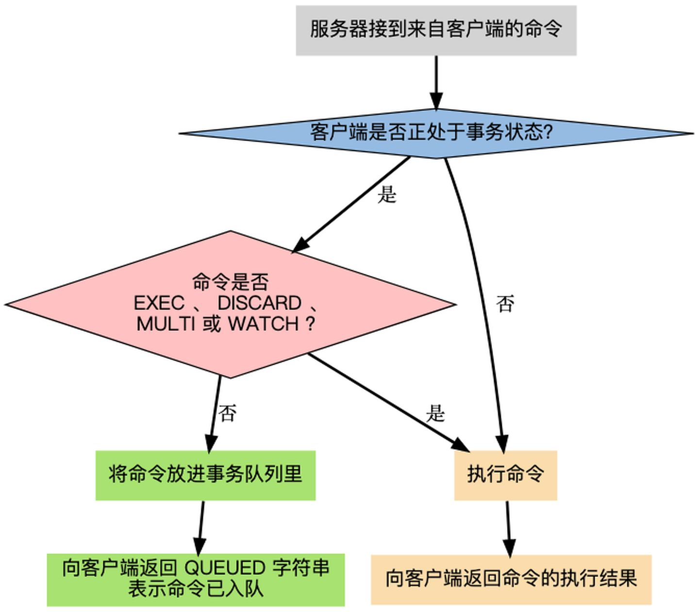
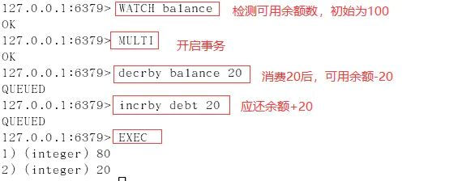
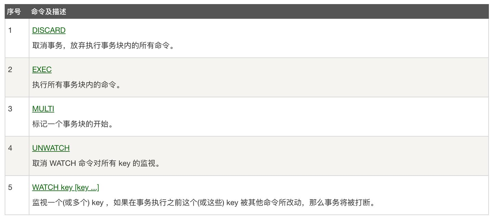
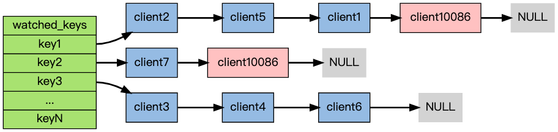

# 事务/分布式锁

## 事务

### 简介

redis 事务可以理解为一个打包的批量执行脚本，将一系列多个命令按照顺序一次性执行，并且在执行期间，事务不会被中断，也不会去执行客户端的其他请求，直到所有命令执行完毕。

批量指令并非原子化的操作，中间某条指令的失败不会导致前面已做指令的回滚，也不会造成后续的指令不做。

Redis的事务和传统的关系型数据库事务的最大区别在于，**Redis不支持事务回滚机制**(rollback)， 即使事务队列中的某个命令在执行期间出现了错误，整个事务也会继续执行下去，直到将事务队列中的所有命令都执行完毕为止。

### 事务流程图



### 事务执行过程

1. 使用WATCH命令，监控一个/多个key，WATCH 命令可以为 Redis 事务提供 check-and-set （CAS）行为
2. 客户端发送MULTI命令开启事务
3. 客户端发送的后续命令服务端会放在队列中，返回客户端QUEUED
4. 客户端发送EXEC命令，服务端执行队列中的命令，也可以发送DISCARD清空命令队列，并放弃事务。
5. 有至少一个被监视的键在 EXEC 执行之前被修改了， 那么整个事务都会被取消， EXEC 返回空多条批量回复（null multi-bulk reply）来表示事务已经失败。否则返回正确执行命令的结果。

### 示例

使用watch检测balance，事务期间balance数据未变动，事务执行成功：



如果任意一个被监视的键已经被其他客户端修改了， 那么整个事务不再执行， 直接返回失败\\

.png>)

命令解释：



### watch 命令的实现

如果当前客户端为 `client10086` ， 那么当客户端执行 `WATCH` `key1` `key2` 时， 前面展示的 `watched_keys` 将被修改成这个样子：



通过`watched_keys`字典， 如果程序想检查某个键是否被监视， 那么它只要检查字典中是否存在这个键即可； 如果程序要获取监视某个键的所有客户端， 那么只要取出键的值（一个链表）， 然后对链表进行遍历即可。

## 分布式锁

参考 https://blog.csdn.net/lihao21/article/details/49104695

### SETNX命令简介

命令格式

```
SETNX key value
```

将 key 的值设为 value，当且仅当 key 不存在。
若给定的 key 已经存在，则 SETNX 不做任何动作。
SETNX 是SET if Not eXists的简写。

### 返回值

返回整数，具体为

- 1，当 key 的值被设置
- 0，当 key 的值没被设置

### 例子

```
redis> SETNX mykey “hello”
(integer) 1
redis> SETNX mykey “hello”
(integer) 0
redis> GET mykey
“hello”
redis>
```


### 使用SETNX实现分布式锁

多个进程执行以下Redis命令：

```
SETNX lock.foo <current Unix time + lock timeout + 1>
```

如果 SETNX 返回1，说明该进程获得锁，SETNX将键 lock.foo 的值设置为锁的超时时间（当前时间 + 锁的有效时间）。

如果 SETNX 返回0，说明其他进程已经获得了锁，进程不能进入临界区。进程可以在一个循环中不断地尝试 SETNX 操作，以获得锁。

[go 实现分布式锁](https://chai2010.cn/advanced-go-programming-book/ch6-cloud/ch6-02-lock.html)

[java 分布式锁](https://juejin.cn/post/6844903688088059912)

