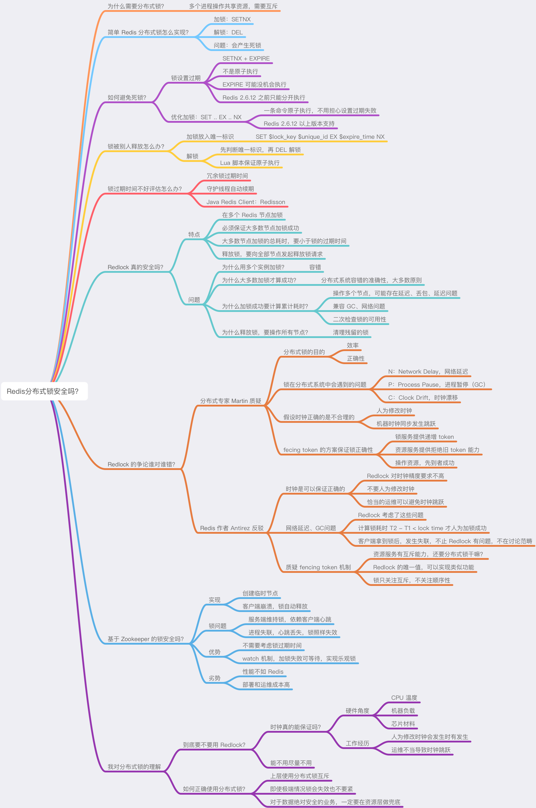

# 事务/分布式锁

## 事务

### 简介

redis 事务可以理解为一个打包的批量执行脚本，将一系列多个命令按照顺序一次性执行，并且在执行期间，事务不会被中断，也不会去执行客户端的其他请求，直到所有命令执行完毕。

批量指令并非原子化的操作，中间某条指令的失败不会导致前面已做指令的回滚，也不会造成后续的指令不做。

Redis的事务和传统的关系型数据库事务的最大区别在于，**Redis不支持事务回滚机制**(rollback)， 即使事务队列中的某个命令在执行期间出现了错误，整个事务也会继续执行下去，直到将事务队列中的所有命令都执行完毕为止。

### 事务流程图


### 事务执行过程

1. 使用WATCH命令，监控一个/多个key，WATCH 命令可以为 Redis 事务提供 check-and-set （CAS）行为
2. 客户端发送MULTI命令开启事务
3. 客户端发送的后续命令服务端会放在队列中，返回客户端QUEUED
4. 客户端发送EXEC命令，服务端执行队列中的命令，也可以发送DISCARD清空命令队列，并放弃事务。
5. 有至少一个被监视的键在 EXEC 执行之前被修改了， 那么整个事务都会被取消， EXEC 返回空多条批量回复（null multi-bulk reply）来表示事务已经失败。否则返回正确执行命令的结果。

### 示例

使用watch检测balance，事务期间balance数据未变动，事务执行成功：


如果任意一个被监视的键已经**被其他客户端修改**了， 那么整个事务不再执行， 直接返回失败。

.png>)

命令解释：


### watch 命令的实现

如果当前客户端为 `client10086` ， 那么当客户端执行 `WATCH` `key1` `key2` 时， 前面展示的 `watched_keys` 将被修改成这个样子：


通过`watched_keys`字典， 如果程序想检查某个键是否被监视， 那么它只要检查字典中是否存在这个键即可； 如果程序要获取监视某个键的所有客户端， 那么只要取出键的值（一个链表）， 然后对链表进行遍历即可。

## 分布式锁

参考 

[深度剖析：Redis分布式锁到底安全吗？看完这篇文章彻底懂了！](http://kaito-kidd.com/2021/06/08/is-redis-distributed-lock-really-safe/)

[go 实现分布式锁](https://chai2010.cn/advanced-go-programming-book/ch6-cloud/ch6-02-lock.html)

总结：

加锁： 

`SET lock $uuid EX 20 NX` 

EX 表示过期时间， NX 表示 Not Exist。

Lua 脚本（可以保证 Get，Del 的原子性）解锁：

```lua
// 判断锁是自己的，才释放
if redis.call("GET",KEYS[1]) == ARGV[1]
then
    return redis.call("DEL",KEYS[1])
else
    return 0
end
```

以上方法在单机 redis 可以保证原子性。集群方式可以参考下面：

Redlock： 需要至少 5 个 redis 主服务器，分别申请加锁，如果超过半数以上加锁成功且大多数节点加锁的总耗时小于锁的过期时间，则加锁成功。释放锁：向全部节点释放锁。（问题：分布式服务器时钟不统一，依赖服务器的时钟正确不合理）

Fencing Token：需要提供一个锁服务，产生全局的自增 id，然后存储服务要有能判断 id 是否过期的能力，需要拒绝已经过期的 id。（可以用 Zookeeper 的 zxid 来实现，或者搞一个分布式 id 生成服务，但这样也比较麻烦）。

Zookeeper：可以查看下图。


