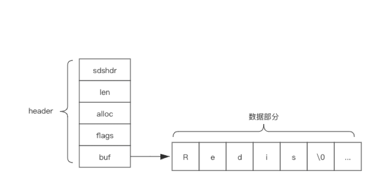
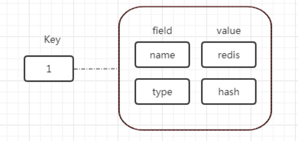
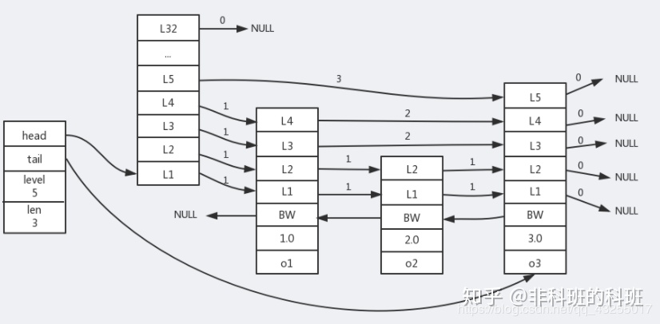

# 数据结构

## 基础数据结构

### String

简单动态字符串（SDS，Simple Dynamic String)。

它并不像C语言那样, 使用‘\0’作为判定一个字符串的结尾, 而是使用了独立的len, 这样可以保证即使存储的数据中有'\0'这样的字符,它也是可以支持读取的。

只关心二进制化的字符串, 不关心具体格式。只会严格的按照二进制的数据存取。不会以某种特殊格式解析数据。

示例图：

.png>)

redis 3.2 及 3.2以前，代码结构：

.png>)

3.2 之后定义了多种长度类型的 sds，代码结构：

.png>)

* len：sds 字符串的实际长度。
* alloc： 分配给字符串的总容量，这个容量是不包含header和'\0'字符的容量，初始化的时候这个值和sds长度是一样的，当有修改的时候往往会分配大于实际需要用到的长度。
* flags： 类型的标志，用一个字节的低3位保存，主要有 SDS\_TYPE\_5，SDS\_TYPE\_8，SDS\_TYPE\_16，SDS\_TYPE\_32，SDS\_TYPE\_64 这几种类型，它们分别数字对应0,1,2,3,4。
* buf\[]： 字符数组。

### Hash

Redis中的每个hash可以存储 2^32个键值对。

实现方式：

* ziplist：key和value的字符串长度都小于64字节&&键值对总数量小于512
* hashtable：key和value的字符串长度大于64字节||键值对总数量大于512

可以在配置文件里配置使用 ziplist 实现时需要的条件，默认配置如下：

Redis.conf

hash-max-ziplist-entries 512

hash-max-ziplist-value 64

#### ZipList

官方解释：ziplist是一个经过特殊编码的双向链表，它的设计目标就是为了提高存储效率。ziplist可以用于存储字符串或整数，其中整数是按真正的二进制表示进行编码的，而不是编码成字符串序列。它能以O(1)的时间复杂度在表的两端提供push和pop操作。

ziplist在内存中是高度紧凑的连续存储，这意味着它对修改并不友好，如果要对ziplist做修改类的操作，那就需重新分配新的内存来存储新的ziplist。

总结：

* 压缩列表，节省内存。
* Ziplist里的数据量过多时，插入修改查询性能会变的很低。

### List

Redis列表是简单的字符串列表，按照插入顺序排序。你可以添加一个元素到列表的头部（左边）或者尾部（右边）

一个列表最多可以包含 232 - 1 个元素 (4294967295, 每个列表超过40亿个元素)。

链表的基本操作：

* `LPUSH` 和 `RPUSH` 分别可以向 list 的左边（头部）和右边（尾部）添加一个新元素；
* `LRANGE` 命令可以从 list 中取出一定范围的元素；
* `LINDEX` 命令可以从 list 中取出指定下表的元素，相当于 Java 链表操作中的 `get(int index)` 操作；

实现方式：

* Ziplist：字符串元素的长度都小于64个字节&&总数量少于512个（内存占用少，插入删除效率低）。
* Linkedlist（双端链表）：字符串元素的长度大于64个字节||总数量大于512个（内存占用多，插入删除效率高）。
* Quicklist（3.2版本之后）：结合了Ziplist和Linkedlist的优点。

双向链表linkedlist便于在表的两端进行push和pop操作，在插入节点上复杂度很低，但是它的内存开销比较大。首先，它在每个节点上除了要保存数据之外，还要额外保存两个指针；其次，双向链表的各个节点是单独的内存块，地址不连续，节点多了容易产生内存碎片。

ziplist存储在一段连续的内存上，所以存储效率很高。但是，它不利于修改操作，插入和删除操作需要频繁的申请和释放内存。特别是当ziplist长度很长的时候，一次realloc可能会导致大批量的数据拷贝。

Quicklist 是一个节点都是ziplist的双端链表。

应用场景：

可以用来作为消息队列、评论列表。

### Set

Redis 的 Set 是 String 类型的无序集合。集合中会出现重复的数据。

整数集合是set(集合)的底层数据结构之一。当一个set(集合)**只包含整数值元素**，并且**元素的数量不多**时，Redis就会采用整数集合(intset)作为set(集合)的底层实现。

整数集合(intset)保证了元素是**不会出现重复**的，并且是**有序**的(从小到大排序)

实现方式：

* intset：保存的元素全都是整数&&总数量小于512
* hashtable：保存的元素不是整数||总数量大于512

应用场景：

利用唯一性统计独立IP等。利用对交集、并集、差集的计算对数据进行过滤处理，如共同好友、推荐信息的数据过滤等。

### Zset

Redis 有序集合和集合一样也是 string 类型元素的集合,且不允许重复的成员。默认按照字典序排序。

跳跃表(skiplist)是实现zset(**有序集合**)的底层数据结构之一，跳跃表是一种有序的数据结构，它通过每一个节点维持多个指向其它节点的指针，从而达到快速访问的目的。

skiplist由如下几个特点：

1. 有很多层组成，由上到下节点数逐渐密集，最上层的节点最稀疏，跨度也最大。
2. 每一层都是一个有序链表，只扫包含两个节点，头节点和尾节点。
3. 每一层的每一个每一个节点都含有指向同一层下一个节点和下一层同一个位置节点的指针。
4. 如果一个节点在某一层出现，那么该以下的所有链表同一个位置都会出现该节点

redis跳跃表具体的实现如图所示：

实现方式：

* ziplist：元素长度小于64&&总数量小于128
* skiplist：元素长度大于64||总数量大于128

应用场景：

排行榜、统计类的数据需求。

## 高级数据结构

### Bitmap

位图不是实际的数据类型，而是在String类型上定义的一组面向位的操作。由于字符串是二进制安全的，最大长度是512MB,转换成位可以设置 2^32不同的位。

.png>)

实现方式：

Redis string

应用场景：

* 统计活跃用户（用户登陆情况）（将用户id作为偏移量）
* 实现布隆过滤器（将存量 + 增量的标识数据进行存储，去判断）

### Geo

可以用于存储经纬度、计算两地之间的距离、范围计算等。

命令：

* GEOADD：添加地理位置的坐标。
* GEOPOS：获取地理位置的坐标。
* GEODIST：计算两个位置之间的距离。
* GEORADIUS：根据用户给定的经纬度坐标来获取指定范围内的地理位置集合。
* GEORAIDUSBYMEMBER：根据储存在位置集合里面的某个地点获取指定范围内的地理位置集合。
* GEOHASH：返回一个或多个位置对象的 geohash 值。

实现方式：

Zset和geohash（Redis将所有地理位置信息的geohash存在zset中）。

### HyperLogLog

基数统计的算法，以使用少量固定的内存去存储并识别集合中的唯一元素。但是这个估算的基数并不一定准确，是一个带有 0.81% 标准错误（standard error）的近似值。例如集合 {1,2,3,1,2}，它有5个元素，但它的基数/Distinct 数为3

在 Redis 里面，每个 HyperLogLog 键只需要花费 12 KB 内存，就可以计算接近 2^64 个不同元素的基数。它并不实际存储数据的内容。

命令：

* PFADD
* PFCOUNT
* PFMERGE

.png>)

应用场景：

常用来统计一个集合中不重复的元素个数，例如网站PV，搜索关键词数量。

### Steam

Redis 5.0 版本新增加的数据结构，内存版的kafka。相比于PUB/SUB、BLOCKED LIST，其虽然也可以在简单的场景下作为消息队列来使用，但是Redis Stream要完善很多。Redis Stream提供了消息的持久化和主备复制功能、甚至是类似于Kafka的Consumer Group功能。

实现方式：

Radix tree

应用场景：

消息队列

底层数据结构可参考（总结得很好）：

[Redis进阶 - 数据结构：底层数据结构详解](https://pdai.tech/md/db/nosql-redis/db-redis-x-redis-ds.html#%E5%BA%95%E5%B1%82%E6%95%B0%E6%8D%AE%E7%BB%93%E6%9E%84%E5%BC%95%E5%85%A5)
