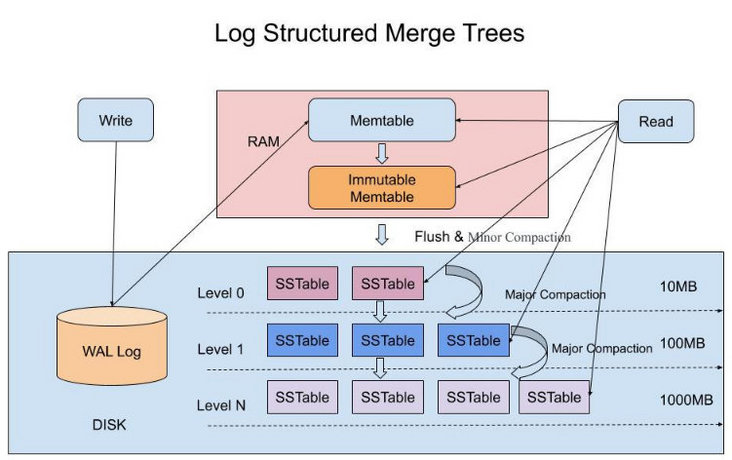
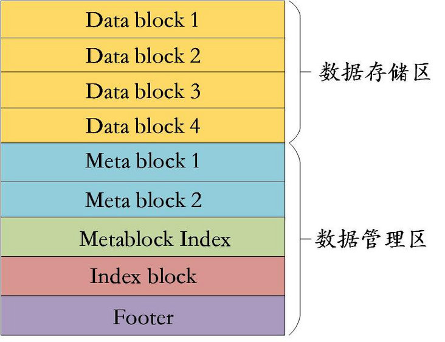
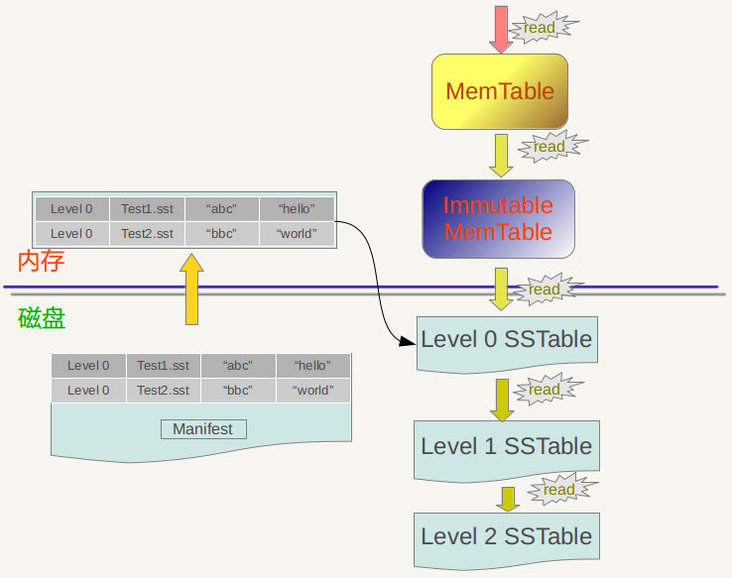
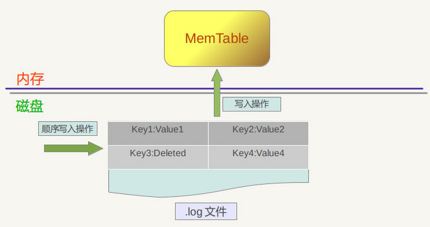
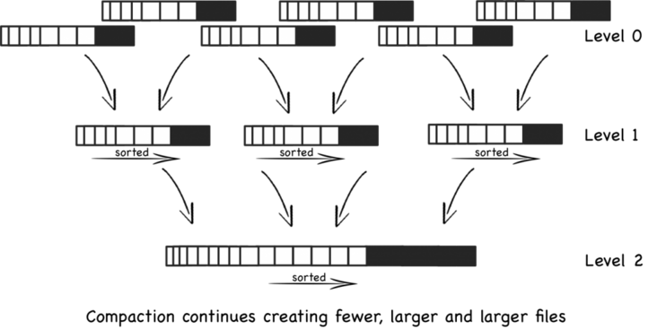
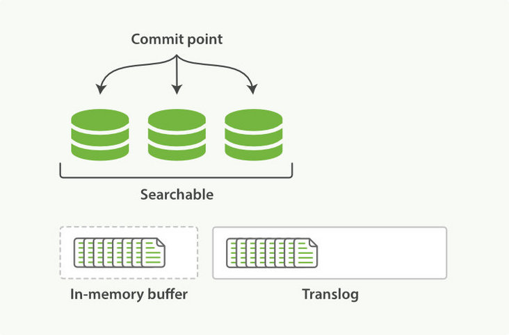
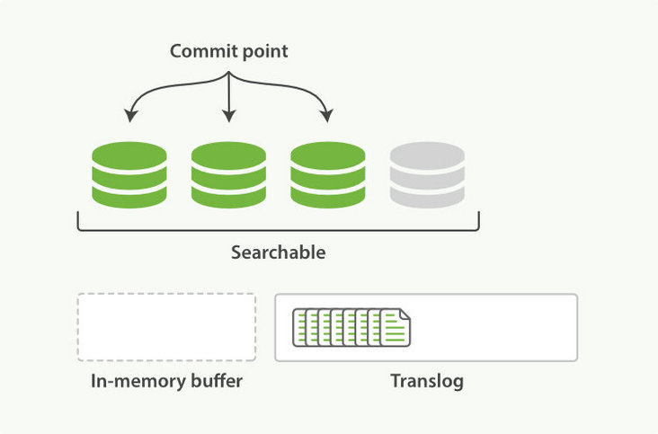

# TiKV

TiKV 是一个分布式事务型的键值数据库，提供了满足 ACID 约束的分布式事务接口，并且通过 [Raft 协议](https://raft.github.io/raft.pdf)保证了多副本数据一致性以及高可用。

## 整体架构

与传统的整节点备份方式不同，TiKV 参考 Spanner 设计了 multi-raft-group 的副本机制。将数据按照 key 的范围划分成大致相等的切片（下文统称为 Region），每一个切片会有多个副本（通常是 3 个），其中一个副本是 Leader，提供读写服务。TiKV 通过 PD 对这些 Region 以及副本进行调度，以保证数据和读写负载都均匀地分散在各个 TiKV 上，这样的设计保证了整个集群资源的充分利用并且可以随着机器数量的增加水平扩展。


TiKV 使用 Raft 一致性算法来保证数据的安全，默认提供的是三个副本支持，这三个副本形成了一个 Raft Group。

当 Client 需要写入某个数据的时候，Client 会将操作发送给 Raft Leader，这个在 TiKV 里面我们叫做 Propose，Leader 会将操作编码成一个 entry，写入到自己的 Raft Log 里面，这个我们叫做 Append。

Leader 也会通过 Raft 算法将 entry 复制到其他的 Follower 上面，这个我们叫做 Replicate。Follower 收到这个 entry 之后也会同样进行 Append 操作，顺带告诉 Leader Append 成功。

当 Leader 发现这个 entry 已经被大多数节点 Append，就认为这个 entry 已经是 Committed 的了，然后就可以将 entry 里面的操作解码出来，执行并且应用到状态机里面，这个我们叫做 Apply。

## RocksDB

TiKV 会将数据存储到 RocksDB，RocksDB 是一个 key-value 存储系统，所以对于 TiKV 来说，任何的数据都最终会转换成一个或者多个 key-value 存放到 RocksDB 里面。

每个 TiKV 包含两个 RocksDB 实例，一个用于存储 Raft Log，我们后面称为 Raft RocksDB，而另一个则是存放用户实际的数据，我们称为 KV RocksDB。

一个 TiKV 会有多个 Regions，我们在 Raft RocksDB 里面会使用 Region 的 ID 作为 key 的前缀，然后再带上 Raft Log ID 来唯一标识一条 Raft Log。譬如，假设现在有两个 Region，ID 分别为 1，2，那么 Raft Log 在 RocksDB 里面类似如下存放：

```
1_1 -> Log {a = 1}
1_2 -> Log {a = 2}
…
1_N -> Log {a = N}
2_1 -> Log {b = 2}
2_2 -> Log {b = 3}
…
2_N -> Log {b = N}
```

因为我们是按照 range 对 key 进行的切分，那么在 KV RocksDB 里面，我们直接使用 key 来进行保存，类似如下：

```
a -> N
b -> N
```

里面存放了两个 key，a 和 b，但并没有使用任何前缀进行区分。

## PD

TiKV 会将自己所有的 Region 信息汇报给 PD，这样 PD 就有了整个集群的 Region 信息，当然就有了一张 Region 的路由表，如下：


当 Client 需要操作某一个 key 的数据的时候，它首先会向 PD 问一下这个 key 属于哪一个 Region，譬如对于 key a 来说，PD 知道它属于 Region 1，就会给 Client 返回 Region 1 的相关信息，包括有多少个副本，现在 Leader 是哪一个副本，这个 Leader 副本在哪一个 TiKV 上面。

Client 会将相关的 Region 信息缓存到本地，加速后续的操作，但有可能 Region 的 Raft Leader 变更，或者 Region 出现了分裂，合并，Client 会知道缓存失效，然后重新去 PD 获取最新的信息。

PD 同时也提供全局的授时服务，在 Percolator 事务模型里面，我们知道事务开始以及提交都需要有一个时间戳，这个就是 PD 统一分配的。


以下内容转载自 [从 RocksDB 看 LSM-Tree 算法设计-Richard_Yi](https://segmentfault.com/a/1190000041198407) 

## LSM 树 简介

LSM 树，全称 Log-Structured-Merge Tree。初看名字你可能认为它会是一个树，但其实不是，LSM 树实际上是一个复杂的算法设计。这个算法设计源自 Google 的 Bigtable 论文 （引入了术语 SSTable 和 memtable ）。

基于 LSM 树算法设计实现的存储引擎，我们称之为 LSM 存储引擎。在 LevelDB、RocksDB、Cassandra、HBase 都基于 LSM 树算法实现了对应的存储引擎。

下面我们通过 RocksDB 的 LSM 树实现，来详细了解一下 LSM 树的设计思想。如果只想看 LSM 树的设计思想总结，可以跳转到最后的总结部分，私以为总结的还是不错的。

## RocksDB LSM 树 实现

### 1. 核心组成

首先，先看看 RocksDB 的三种基本文件格式 memtable & WAL & SSTable。

下图描述了 RocksDB LSM 树的核心组成和关键流程步骤（读 & 写 & flush & compaction）。



#### 1.1 memtable (active & immutable)

memtable 是 RocksDB 内存中的数据结构，同时服务于读和写；数据在写入时总会将数据写入 active memtable，执行查询的时候总是要先查询 memtable，因为 memtable 中的数据总是更新的；memtable 实现方式是 skiplist，适合范围查询和插入；

##### memtable 生命周期

当一个 active memtable 被写满，会被置为只读状态，变成 immutable memtable。然后会创建一块新的 active memtable 来提供写入。

immutable memtable 会在内存中保留，等待后台线程对其进行 flush 操作。flush 的触发条件是 immutable memtable 数量超过 min_write_buffer_number_to_merge 。flush 会一次把 immutable memtable 合并压缩后写入磁盘的 L0 SSTable 中。 flush 之后对应的 memtable 会被销毁。

> 相关参数：
>
> - write_buffer_size：一块 memtable 的 容量
> - max_write_buffer_number：memtable 的最大存在数
> - min_write_buffer_number_to_merge：设置刷入 sst 之前，最小可合并的 memtable 数（如果设置成 1，代表着 flush 过程中没有合并压缩操作）

#### 1.2 WAL (write-ahead log)

WAL 大家应该都很熟悉，一种有利于顺序写的持久化日志文件。很多存储系统中都有类似的设计（如 MySQL 的 redo log/undo log、ZK 的 WAL）；

RocksDB 每次写数据都会先写入 WAL 再写入 memtable，在发生故障时，通过重放 WAL 恢复内存中的数据，保证数据一致性。

这种设计有什么好处呢？这样 LSM 树就可以将有易失性（volatile）的内存看做是持久型存储，并且信任内存上的数据。

至于 WAL 的创建删除时机，每次 flush 一个 CF（列族数据，下文会提） 后，都会新建一个 WAL。**这并不意味着旧的 WAL 会被删除，因为别的 CF 数据可能还没有落盘，只有所有的 CF 数据都被 flush 且所有的 WAL 有关的 data 都落盘，相关的 WAL 才会被删除**。

#### 1.3 SSTable (sorted string table)

SSTable，全称是 Sorted String Table，存在于磁盘，是一个持久化的、有序的、不可更改的 Map 结构，Key 和 Value 都是任意的 Byte 串。上文提到内存中的 memtable 在满足条件的情况下会执行 flush 操作。

SSTable 的 文件结构如下：



既然对文件结构进行了划分，每块区域肯定都有其作用：

- 数据块 Data Block，存储**有序**键值对，是 SSTable 的数据实体；**为了节省存储空间，并不会为每一对 key-value 对都存储完整的 key 值，而是存储与上一个 key 非共享的部分，避免了 key 重复内容的存储（这种通过 delta encode 的方式节省空间的方式在其他存储中间件底层中也很常见）**。
- Meta Block，存储 Filter 相关信息，用于加快 sst 中查询数据的效率；Filter 通过 **Bloom Filter** 来过滤判断指定的 data block 中是否存在要查询的数据。
- Meta Index Block，对 Meta Block 的索引，它只有一条记录，key 是 meta index 的名字（也就是 Filter 的名字），value 为指向 meta index 的位置；
- Index Block，index block 用来存储所有 data block 的相关索引信息。indexblock 包含若干条记录，每一条记录代表一个 data block 的索引信息；
- Footer，指向各个分区的位置和大小。**Footer 是定长的，读取 SSTable 文件的时候，就是从文件末尾，固定读取字节数，进而得到了 Footer 信息。 Footer 中的信息，指明了 MetaIndexBlock 和 IndexBlock 的位置，进而找到 MetaBlock 和 DataBlock。**

> 可以看到，SSTable 文件除了存储实际数据外，还有索引结构 和 Filter，来加快 SST 的查询效率，设计非常精妙。

### 2. 其他的一些名词概念

#### Column Family （CF）

RocksDB 3.0 以后添加了一个 Column Family 的 feature，每个 kv 存储之时都必须指定其所在的 CF。RocksDB 为了兼容以往版本，默认创建一个 “default” 的 CF。存储 kv 时如果不指定 CF，RocksDB 会把其存入 “default” CF 中。

RocksDB 允许用户创建多个 Column Family ，这些 Column Family 各自拥有独立的 memtable 以及 SST 文件，但是共享同一个 WAL 文件，这样的好处是可以根据应用特点为不同的 Column Family 选择不同的配置，但是又没有增加对 WAL 的写次数。

> 如果类比到关系型数据库中，列族可以看做是表的概念。

### 3. 读 & 写

#### 3.1 读操作



1. 在 active memtable 中查找；
2. 如果 active memtable 没有，则在 immutable memtable 中查找；
3. 如果 immutable memtable 没有，则在 L0 SSTable 中查找（RocksDB 采用遍历的方法查找 L0 SSTable，为了提高查找效率会控制 L0 文件的个数）；
4. 如果找不到，则在剩余的 SSTable 中查找（对于 L1 层以及 L1 层以上层级的文件，每个 SSTable 没有交叠，可以使用二分查找快速找到 key 所在的 Level 以及 SSTable）

每个 SSTable 在查找之前通过 bloom filter 快速判断数据是否存在于当前文件，减少不必要的 IO。

RocksDB 为 SST 中访问频繁的 data blocks 设置了一个读缓存结构 [Block cache](https://link.segmentfault.com/?enc=CFDEVTfl1WUBz3c7INVoRA%3D%3D.kfbt%2Fnb%2BYLRs3aiWbmbJ5ii2gVBLUvN8Ncs2%2F7nqEc545q1zY23oRdanGqJaMF7KtPPC5B%2FvJ977NXyj8lCBYg%3D%3D)，并提供了两种开箱即用的实现 LRUCache 和 ClockCache 。

#### 3.2 写操作



1. 写操作会先写 WAL 文件，保证数据不丢失；
2. 完成 WAL 写入后，将数据写入到 内存中的 active memtable 中（为了保证有序性，RocksDB 使用跳表数据结构实现 memtable）；
3. 然后等 memtable 数据达到一定规模时，会转变成 immutable memtable，同时生成新的 memtable 提供服务；
4. 在满足落盘条件后，immutable memtable 会被合并刷入到硬盘的 SST 中；

顺带一提，默认情况下 RocksDB 中的写磁盘行为都是异步写，仅仅把数据写进了操作系统的缓存区就返回了（pageCache），而这些数据被写进磁盘是一个异步的过程。异步写的吞吐率是同步写的一千多倍。**异步写的缺点是机器或者操作系统崩溃时可能丢掉最近一批写请求发出的由操作系统缓存的数据，但是 RocksDB 自身崩溃并不会导致数据丢失。而机器或者操作系统崩溃的概率比较低，所以大部分情况下可以认为异步写是安全的**。

### 4. Compaction

LSM 树将离散的随机写请求都转换成批量的顺序写请求（WAL + memtable），以此提高写性能。但也带来了一些问题：

- 读放大（Read Amplification）。按照上面【读操作】的描述，读操作有可能会访问大量的文件；
- 空间放大（Space Amplification）。因为所有的写入都是顺序写（append-only）的，不是在对数据进行直接更新（in-place update），所以过期数据不会马上被清理掉。

所以维护和减少 SST 文件数量是很有必要的。RocksDB 会根据配置的不同 Compaction 算法策略，进行 Compaction 操作。**Compaction 操作会删除过期 或者标记为删除/重复的 key，对数据进行重新合并来提高查询效率。**

#### 4.1 [Level Style Compaction](https://link.segmentfault.com/?enc=ftMvYt1unL%2BGh7IaDZqKSw%3D%3D.hJDASCYesqdChN7611Ij6ipmj9XKKH8ygpbwZ7vlKmqGcwrrT3CYXe0lE2BhkOYLdzi365nkw8U3hB8NVg7%2Fnw%3D%3D) (default compaction style)

默认情况下，RocksDB 采用 Level Style Compaction 作为 LSM 树的 Compaction 策略。

如果启用 Level Style Compaction，L0 存储着 RocksDB 最新的数据，Lmax 存储着比较老的数据，L0 里可能存着重复 keys，但是其他层文件则不可能存在重复 key。每个 compaction 任务都会选择 Ln 层的一个文件以及与其相邻的 Ln+1 层的多个文件进行合并，删除过期 或者 标记为删除 或者 重复 的 key，然后把合并后的文件放入 Ln+1 层。



> Compaction 虽然减少了读放大（减少 SST 文件数量）和空间放大（清理无效数据），但也因此带来了写放大（Write Amplification）的问题（底层 I/O 被 Compaction 操作消耗，会大于上层请求速递）

RocksDB 还有支持的其他的 Compaction 策略。

#### 4.2 Universal Compaction

- 只压缩 L0 的所有文件，合并后再放入 L0 层里；
- 目标是更低的写放大，并且在读放大和空间放大中 trade off；

> 具体算法本篇不深究；

#### 4.3 FIFO Compaction

- FIFO 顾名思义就是先进先出，这种模式周期性地删除旧数据。在 FIFO 模式下，所有文件都在 L0，当 SST 文件总大小超过 compaction_options_fifo.max_table_files_size，则删除最老的 SST 文件。对于 FIFO 来说，它的策略非常的简单，所有的 SST 都在 Level 0，如果超过了阈值，就从最老的 SST 开始删除。
- 这套机制非常适合于存储时序数据。

## ⭐ LSM 树 设计思想总结

LSM 树的设计思想很有意思。我这里做下总结。

LSM 树将对磁盘的随机写入转化为了磁盘友好型的顺序写（无论机械磁盘还是 SSD，随机读写都要远远慢于顺序读写），从而大大提高了写性能。

那么是怎么转化的呢？核心就是在内存中维护一个有序的内存表（memtable），当内存表大于阈值的时候批量刷入磁盘，生成最新的 SSTable 文件。因为本身 memtable 已经维护了按键排序的键值对，所以这个步骤可以高效地完成。

**写入内存表时先将数据写入 WAL 日志，用以在发生故障时，通过重放 WAL 恢复内存中的数据，保证数据库的数据一致性。**

在这种追加（append-only）写入模式下，删除数据变成了对数据添加删除标记，更新数据变成了写入新的 value，在同一个时间数据库中会存在同个 key 的新值和旧值。这种影响被称之为 **空间放大（Space Amplification）**。

随着数据的写入，底层的 SSTable 文件也会越来越多。

读请求在这个模式下，变成了先在内存中寻找关键字，如果找不到则在磁盘中按照新-> 旧查找 SSTable 文件。**为了优化这种访问模式的读性能，存储引擎通常使用常见的针对读的优化策略，比如使用额外的 Bloom Filter、读 Cache**。

这种需要多次读取的过程（或者说影响）被称之为**读放大（Read Amplification）**。很显然，读放大会影响 LSM 树的读性能。

为了优化读性能（读放大），同时优化存储空间（空间放大），LSM 树通过在运行合并和压缩过程减少 SSTable 文件数量，删除**无效（被删除或者被覆盖）** 的旧值。这一过程被称之为 **compaction**。

但是 compaction 也会一些影响，在数据库的生命周期中每次的数据写入实际上会造成多次的磁盘写入。这种影响被称之为写放大（Write Amplification）。在**写入繁重的应用程序**中，性能瓶颈可能是数据库可以写入磁盘的速度。在这种情况下，写放大会导致直接的性能代价：存储引擎写入磁盘的次数越多，可用磁盘带宽内的每秒写入次数越少。

这也是我认为 LSM 引擎存储的一个缺点，就是**压缩过程有可能会干扰到正在进行的读写请求**。尽管存储引擎尝试逐步执行压缩而不影响并发访问，但是磁盘资源有限，所以很容易发生请求需要等待磁盘完成昂贵的压缩操作。对吞吐量和平均响应时间的影响通常很小，但是如果是高百分位情况下（如 P99 RT），有时就会出现查询响应较长的情况。

上述是对 LSM 树的个人总结，一些没有提到实现细节的抽象描述（比如 memtable、compaction），在实际的存储中都有对应的实现，细节可能不同，但是设计思想都是类似。

在本文具体提到的 RocksDB 实现中，写放大、读放大、空间放大，这三者就像 CAP 定理一样，无法同时达到最优。为此 RocksDB 暴露了很多参数来让使用者进行调优，以适应更多的应用场景。这其中很大一部分工作是在写放大、读放大和空间放大这三个放大因子之间做好 trade off。

#### Elasticsearch Lucene 中的类 LSM 设计思想

ES 底层搜索引擎 Lucene 的 segment 设计思想和 LSM 树非常相似。也运用到了WAL、内存 buffer、分段merge等思想。

一个文档被索引之后，就会被添加到内存缓冲区，并且 追加到了 translog。



随着当前分片（shard）的 refresh 操作，这些在内存缓冲区的文档被 flush 到一个新的 segment 中，这个 segment 被打开，使其可被搜索，对应的内存缓冲区被清空。



随着数据的写入，还会触发 commit 操作，做一次全量提交，然后对应的 Translog 会被删除。（具体过程限于篇幅不赘述）。

> segment 被 refresh 或 commit 之前，数据保存在内存中，是不可被搜索的，这也就是为什么 Lucene 被称为提供近实时而非实时查询的原因。

Segment 中写入的文档不可被修改，但可被删除，删除的方式也不是在文件内部原地更改，而是会由另外一个文件保存需要被删除的文档的 DocID，保证数据文件不可被修改。Index的查询需要对多个 Segment 进行查询并对结果进行合并，还需要处理被删除的文档，为了对查询进行优化，Lucene会有策略对多个Segment进行合并，这点与 LSM 对 SSTable 的 compaction 类似。

这种机制避免了随机写，数据写入都是 Batch 和 Append，能达到很高的吞吐量。同时为了提高写入的效率，利用了文件缓存系统和内存来加速写入时的性能，并使用日志来防止数据的丢失。

## ⭐ LSM 树 vs B+ 树

讲到这里了，想想不如再和我们常见的 B+ 树做一些对比。

### 设计理念不同

虽然像 LSM 树一样，B+ 树保持按键排序的键值对（这允许高效的键值查找和范围查询），但是两者设计理念完全不同。

- LSM 树将数据库分解为可变大小的段，通常是几兆字节或更大的大小，并且总是按顺序编写段。
- 相比之下，B+ 树将数据库分解成固定大小的块或页面，传统上大小为 4KB（有时会更大），并且一次只能读取或写入一个页面。这种设计更接近于底层硬件，因为磁盘也被安排在固定大小的块中。

### 数据的更新和删除方面

- B(+) 树可以做到原地更新和删除（in-place update），这种方式对**数据库事务支持更加友好**，因为一个 key 只会出现一个 Page 页里面；
- 但由于 LSM 树只能追加写（out-place update），并且在 L0 层的 SSTable 中会重叠，所以对事务支持较弱，只能在 compaction 的时候进行真正地更新和删除。

### 性能方面

- LSM 树的优点是支持高吞吐的写（可认为是 O(1)），这个特点在分布式系统上更为看重，当然针对读取普通的 LSM 树结构，读取是 O(n) 的复杂度，在使用索引或者缓存优化后的也可以达到 O（logN）的复杂度。
- B+ 树的优点是支持高效的读（稳定的 O(logN)），但是在大规模的写请求下（复杂度 O(LogN)），效率会变得比较低，因为随着 insert 的操作，为了维护树结构，节点会不断的分裂和合并。操作磁盘的随机读写概率会变大，故导致性能降低。

**通常**来说，我们会说，LSM 树写性能会优于 B 树，而 B 树的读性能会优于 LSM 树。但是请不要忽略 LSM 树写放大的影响，在进行性能判定是要更辩证的思考。


可参考

[TiKV 是如何存取数据的](https://pingcap.com/zh/blog/how-tikv-store-get-data)

 [三篇文章了解 TiDB 技术内幕 - 说存储](https://pingcap.com/zh/blog/tidb-internal-1)

[从 RocksDB 看 LSM-Tree 算法设计](https://segmentfault.com/a/1190000041198407)