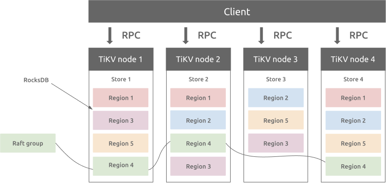
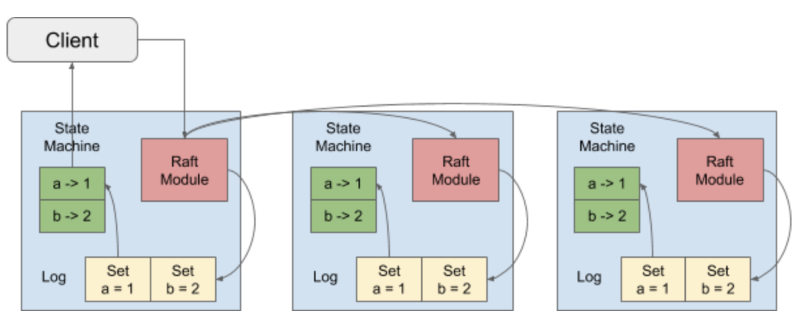
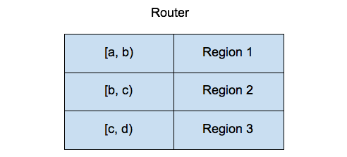

# TiKV

TiKV 是一个分布式事务型的键值数据库，提供了满足 ACID 约束的分布式事务接口，并且通过 [Raft 协议](https://raft.github.io/raft.pdf)保证了多副本数据一致性以及高可用。

## 整体架构

与传统的整节点备份方式不同，TiKV 参考 Spanner 设计了 multi-raft-group 的副本机制。将数据按照 key 的范围划分成大致相等的切片（下文统称为 Region），每一个切片会有多个副本（通常是 3 个），其中一个副本是 Leader，提供读写服务。TiKV 通过 PD 对这些 Region 以及副本进行调度，以保证数据和读写负载都均匀地分散在各个 TiKV 上，这样的设计保证了整个集群资源的充分利用并且可以随着机器数量的增加水平扩展。





TiKV 使用 Raft 一致性算法来保证数据的安全，默认提供的是三个副本支持，这三个副本形成了一个 Raft Group。

当 Client 需要写入某个数据的时候，Client 会将操作发送给 Raft Leader，这个在 TiKV 里面我们叫做 Propose，Leader 会将操作编码成一个 entry，写入到自己的 Raft Log 里面，这个我们叫做 Append。

Leader 也会通过 Raft 算法将 entry 复制到其他的 Follower 上面，这个我们叫做 Replicate。Follower 收到这个 entry 之后也会同样进行 Append 操作，顺带告诉 Leader Append 成功。

当 Leader 发现这个 entry 已经被大多数节点 Append，就认为这个 entry 已经是 Committed 的了，然后就可以将 entry 里面的操作解码出来，执行并且应用到状态机里面，这个我们叫做 Apply。

## RocksDB

TiKV 会将数据存储到 RocksDB，RocksDB 是一个 key-value 存储系统，所以对于 TiKV 来说，任何的数据都最终会转换成一个或者多个 key-value 存放到 RocksDB 里面。

每个 TiKV 包含两个 RocksDB 实例，一个用于存储 Raft Log，我们后面称为 Raft RocksDB，而另一个则是存放用户实际的数据，我们称为 KV RocksDB。

一个 TiKV 会有多个 Regions，我们在 Raft RocksDB 里面会使用 Region 的 ID 作为 key 的前缀，然后再带上 Raft Log ID 来唯一标识一条 Raft Log。譬如，假设现在有两个 Region，ID 分别为 1，2，那么 Raft Log 在 RocksDB 里面类似如下存放：

```
1_1 -> Log {a = 1}
1_2 -> Log {a = 2}
…
1_N -> Log {a = N}
2_1 -> Log {b = 2}
2_2 -> Log {b = 3}
…
2_N -> Log {b = N}
```

因为我们是按照 range 对 key 进行的切分，那么在 KV RocksDB 里面，我们直接使用 key 来进行保存，类似如下：

```
a -> N
b -> N
```

里面存放了两个 key，a 和 b，但并没有使用任何前缀进行区分。

## PD

TiKV 会将自己所有的 Region 信息汇报给 PD，这样 PD 就有了整个集群的 Region 信息，当然就有了一张 Region 的路由表，如下：



当 Client 需要操作某一个 key 的数据的时候，它首先会向 PD 问一下这个 key 属于哪一个 Region，譬如对于 key a 来说，PD 知道它属于 Region 1，就会给 Client 返回 Region 1 的相关信息，包括有多少个副本，现在 Leader 是哪一个副本，这个 Leader 副本在哪一个 TiKV 上面。

Client 会将相关的 Region 信息缓存到本地，加速后续的操作，但有可能 Region 的 Raft Leader 变更，或者 Region 出现了分裂，合并，Client 会知道缓存失效，然后重新去 PD 获取最新的信息。

PD 同时也提供全局的授时服务，在 Percolator 事务模型里面，我们知道事务开始以及提交都需要有一个时间戳，这个就是 PD 统一分配的。


可参考

[TiKV 是如何存取数据的](https://pingcap.com/zh/blog/how-tikv-store-get-data)

 [三篇文章了解 TiDB 技术内幕 - 说存储](https://pingcap.com/zh/blog/tidb-internal-1)

[从 RocksDB 看 LSM-Tree 算法设计](https://segmentfault.com/a/1190000041198407)