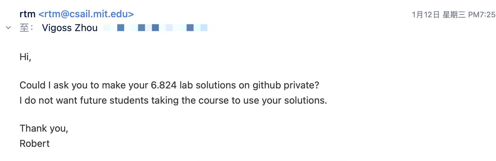

# 简介

最近开始学习 MIT6.824 课程，记录一些学习经历里一些有用的链接和过程在这里。

[B站课程](https://www.bilibili.com/video/BV1R7411t71W?from=search\&seid=14261257087640350601\&spm\_id\_from=333.337.0.0)

[课程翻译](https://mit-public-courses-cn-translatio.gitbook.io/mit6-824/)

[Lab提示，做完了可以看看别人怎么做的](https://github.com/LebronAl/MIT6.824-2021)

目前已经完成的 Lab：

Lab1、Lab2。

一个小插曲：

昨天在邮箱里收到一封邮件，一看是教授发的：

这里提醒大家也把自己的 lab 仓库变成 private 啦，不然可能会对教授造成困扰。
