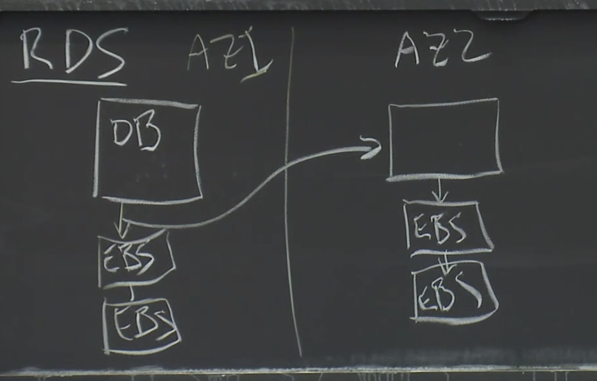
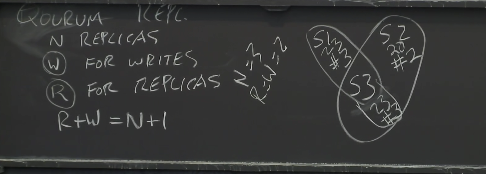

# Aurora

## History

Amazon ec2 并不适合作为数据服务器使用。fault-tolerance 不好。

EBS： elastic block store，块存储方案。使用链式复制来容错。可以供某一个 ec2 实例连接，作为数据存储。

EBS 缺点：

1. 写数据库会需要大量的网络负载，对网络要求很高。
2. 容错不够好，某一个 ebs 节点宕机可以恢复，但是如果整个数据中心都下线了就无法恢复。

AZ（Avalibitity Zone）：可以理解为一个数据中心。

 (1).png>)

## DB Tutorial

MySQL

事务，undo log、redo log

WAL（Write Ahead Log）：预写日志，是数据库系统中常见的一种手段，用于保证数据操作的原子性和持久性。在使用 WAL 的系统中，所有的修改在提交之前都要先写入 log 文件中。

redo log 称为重做日志，每当有操作时，在数据变更之前将操作写入 redo log，这样当发生掉电之类的情况时系统可以在重启后继续操作。undo log 称为撤销日志，当一些变更执行到一半无法完成时，可以根据撤销日志恢复到变更之间的状态。mysql 中用 redo log 来在系统 Crash 重启之类的情况时修复数据（事务的持久性），而 undo log 来保证事务的原子性。

.png>)

RDS（Relational Database Service）：用来管理元数据

.png>)

上述过程虽然有比较好的容错，但是性能不够，需要等待所有 AZ 的数据同步，进行多次网络 IO，响应时间非常慢。

## Aurora

3 个 AZ，6 个副本。

优化：

1. 只传输日志。
2. Quorum 协议，写入需要 4 个节点的投票，读取需要 3 个节点的投票。

.png>)

.png>)

### FT Goals

1. 1 个 AZ 故障，能正常写。
2. 1 个 AZ 故障 + 1 个节点故障，能正常读。
3. transient slow。
4. 要能够快速根据已有的副本中生成一个新的副本。因为当一个副本出现故障时，很可能下一个副本也会马上出现故障，所以需要尽可能快地根据已有的副本创建一个新的副本。

（为了保证 durability，需要在出现 uncorrelated failures（AZ 级别）的时候，不能同时有两个节点或硬盘的错误。这样我们就丢失了 4 个节点，因此导致了不能确保读取到最新数据。节点的 MTTF(Mean Time to Failure)，要低于修复节点的 MTTR(Mean Time to Repair)，否则将很有可能发生两个节点都出故障。如果 MTTF 低于 MTTR，那么一个节点故障了，去修理，还没修理完，有可能别的节点又出现故障。）

.png>)

### Quorum Replication

有 N 个节点

写操作需要等待写入 W 个节点

读操作需要等待读取 R 个节点

只要服务器中最快的 W 或 R 个节点有返回就行。

R+W > N

通过版本号来判断数据新旧。

写就是 append logs，只需要在后面顺序添加新的日志。

存储：

存储的是一个旧的数据页+一连串的日志，等到需要更新的时候会将日志里的更新应用到数据页中。

db 会记录每个节点存储的日志数目，写需要按照 quorum write，读只需要找到日志最新的那个节点直接读就行，并不一定要 quorum read。但是当 db server crash 了就需要 quorum read 了。

### Protection Group

每个分片 10GB，六个分片组成一个 PG(Protection Group)。

如果一个 pg 挂了，那么可以通过其他的分片并行地恢复该 pg 里的分片数据。

有一些只读的 db server：
