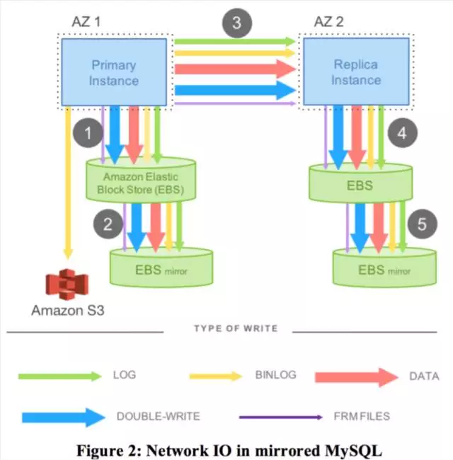
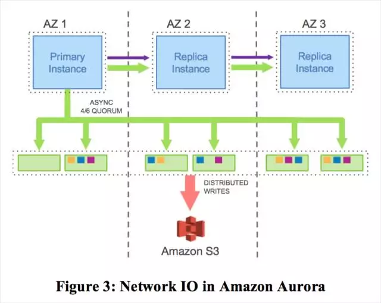
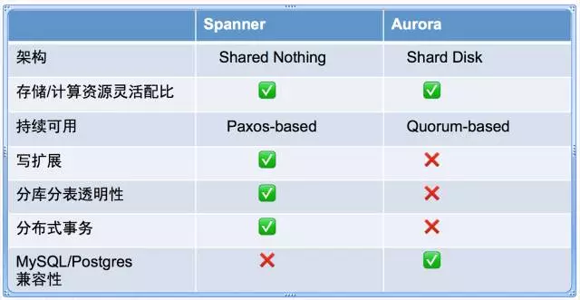

# Amazon Aurora

转载自 [Amazon Aurora解读(SIGMOD 2017)](https://mp.weixin.qq.com/s?\_\_biz=MzIxNTQ0MDQxNg==\&mid=2247484007\&idx=1\&sn=5b85170bf46c5e54edc1e8b8a1c211e1\&chksm=97990f28a0ee863e161b2277a5d63a10396823d8d9a8c6cce38109b48939d5c24aae6cea26e0#rd)

同时可参考 [Amazon Aurora 论文笔记](https://www.cnblogs.com/zzk0/p/13425353.html)

### >>摘要

Aurora是亚马逊云服务AWS中的关系型数据库服务，主要面向OLTP场景。本文会详细介绍Aurora的架构以及设计背后的理念。 **Aurora基本设计理念是在云上环境下，数据库的最大瓶颈不再是计算或者存储资源，而是网络，因此基于一套存储计算分离架构，将日志处理下推到分布式存储层，通过架构上的优化来解决网络瓶颈。** 下文首先会介绍Aurora如何做到不仅减少了网络资源消耗，同时还能快速故障恢复且不丢失数据，接着会介绍Aurora如何做到异步模式下分布式存储节点的一致性，最后会介绍Aurora在生产环境使用的经验。

### >>1. 概述

在云上环境下，存储计算分离作为解决系统弹性和伸缩性的方案越来越普遍。广义来说，任何数据库，底下文件系统挂一个分布式存储，即可以认为做到了存储计算分离。通过存储计算分离，可以透明添加存储节点，剔除故障节点，进行故障切换，扩展存储空间等。在这个背景下，IO不再成为数据库的瓶颈，因为IO压力可以打散在多个存储节点上，反而是网络成为瓶颈，因为数据库实例与所有存储节点的交互都需要通过网络，尤其是为了提升数据库性能，数据库实例与存储节点可能是并行交互的，这进一步加重了网络压力。传统数据库中的IO操作是需要同步执行的，当需要进行IO等待时，这往往会导致线程上下文切换，影响数据库性能。比如IO读操作，当需要访问一个数据页时，如果在缓冲池没有命中，则需要进行磁盘IO，那么读线程需要等待IO完成才能继续其它操作，同时这种动作可能会进一步引发刷脏页等。另外一个我们熟悉场景是事务提交操作(IO写操作)，事务提交成功返回前一定要等待事务对应日志刷盘才能返回，由于事务是串行提交，因此其它事务也必须同步等待这个事务提交。 **传统数据库中的两阶段事务尤其不适合与分布式云环境，因为二阶段提交协议对系统中参与的节点和网络要求很高，自身容错能力有限，这点与大规模分布式云环境中，软件和硬件故障是常态的特征是矛盾的。**

本文介绍的Aurora是一个云上环境全新的数据库服务可以很好的解决上述传统数据库遇到的问题。 **它基于存储计算分离的架构，并将回放日志部分下推到分布式存储层，存储节点与数据库实例(计算节点)松耦合，并包含部分计算功能。** Aurora体系下的数据库实例仍然包含了大部分核心功能，比如查询处理，事务，锁，缓存管理，访问接口和undo日志管理等；但redo日志相关的功能已经下推到存储层，包括日志处理，故障恢复，备份还原等。Aurora相对于传统数据库有三大优势，首先，底层数据库存储是一个分布式存储服务，可以轻松应对故障；其次，数据库实例往底层存储层只写redo日志，因此数据库实例与存储节点之间的网络压力大大减小，这为提升数据库性能提供了保障；第三，将部分核心功能(故障恢复，备份还原)下推到存储层，这些任务可以在后台不间歇地异步执行，并且不影响前台用户任务。下文会详细介绍Aurora如何实现这些功能，主要包括三大块： 1.如何基于Quorum模型保证底层存储的一致性 2.如何将redo日志相关的功能下推到存储层 3.如何消除同步点，分布式存储下如何做检查点和故障恢复

### **>>** 2. 可扩展高可用存储

#### 2.1复制和容错处理

Aurora存储层的复制基于Quorum协议，假设复制拓扑中有V个节点，每个节点有一个投票权，读 或 写 必须拿到Vr 或 Vw个投票才能返回。为了满足一致性，需要满足两个条件，首先Vr + Vw > V，这个保证了每次读都能读到拥有最新数据的节点；第二，Vw > V/2，每次写都要保证能获取到上次写的最新数据，避免写冲突。比如V=3，那么为了满足上述两个条件，Vr=2，Vw=2。为了保证各种异常情况下的系统高可用，Aurora的数据库实例部署在3个不同AZ(AvailablityZone)，每个AZ包含了2个副本，总共6个副本，每个AZ相当于一个机房，是一个独立的容错单元，包含独立的电源系统，网络，软件部署等。结合Quorum模型以及前面提到的两条规则， **V=6，Vw=4，Vr=3，Aurora可以容忍任何一个AZ出现故障，不会影响写服务；任何一个AZ出现故障，以及另外一个AZ中的一个节点出现故障，不会影响读服务且不会丢失数据。**

#### 2.2分片管理

通过Quorum协议，Aurora可以保证只要AZ级别的故障(火灾，洪水，网络故障)和节点故障(磁盘故障，掉电，机器损坏)不同时发生，就不会破坏协议本身，数据库可用性和正确性就能得到保证。那么，如果想要数据库“永久可用”，问题变成如何降低两类故障同时发生的概率。由于特定故障发生的频率(MTTF, Mean Time to Fail)是一定的，为了减少故障同时发生的概率，可以想办法提高故障的修复时间(MTTR,Mean Time To Repair)。Aurora将存储进行分片管理，每个分片10G，6个10G副本构成一个PGs(Protection Groups)。Aurora存储由若干个PGs构成，这些PGs实际上是EC2(AmazonElastic Compute Cloud)服务器+本地SSD磁盘组成的存储节点构成，目前Aurora最多支持64T的存储空间。分片后，每个分片作为一个故障单位，在10Gbps网络下，一个10G的分片可以在10s内恢复，因此当前仅当10s内同时出现大于2个的分片同时故障，才会影响数据库服务的可用性，实际上这种情况基本不会出现。 **通过分片管理，巧妙提高了数据库服务的可用性。**

#### 2.3轻量级运维

基于分片管理，系统可以灵活应对故障和运维。比如，某个存储节点的磁盘IO压力比较大，可以人为将这个节点剔除，并快速新加一个节点到系统。另外，在进行软件升级时，同样可以临时将存储节点剔除，待升级完毕后再将节点加入到系统。所有这些故障和运维管理都是分片粒度滚动进行的，对于用户完全透明。

### **>>** 3. 存储计算分离

#### 3.1传统数据库写放大问题

我们看看在传统数据库中写的流程。以单机MySQL为例，执行写操作会导致日志落盘，同时后台线程也会异步将脏页刷盘，另外为了避免页断裂，进行刷脏页的过程还需要将数据页写入double-write区域。如果考虑生产环境中的主备复制，如图2所示，AZ1和AZ2分别部署一个MySQL实例做同步镜像复制，底层存储采用Elastic Block Store(EBS)，并且每个EBS还有自己的一份镜像，另外部署Simple Storage Service(S3)进行redo日志和binlog日志归档，以支持基于时间点的恢复。从流程上来看，每个步骤都需要传递5种类型的数据，包括redo，binlog，data-page，double-write和frm元数据。由于是基于镜像的同步复制，这里我理解是Distributed Replicated Block Device(DRBD)，因此**图中的1，3，5步骤是顺序的，这种模型响应时间非常糟糕，因为要进行4次网络IO，且其中3次是同步串行的。从存储角度来看，数据在EBS上存了4份，需要4份都写成功才能返回。** 所以在这种架构下，无论是IO量还是串行化模型都会导致性能非常糟糕。

#### 3.2日志处理下放到存储层

传统数据库中，修改一个数据页，会同步产生对应的redo日志，基于数据页的前镜像回放redo日志可以得到数据页的后镜像。事务提交时，需要事务对应的redo日志都写盘成功后才能返回。在Aurora中，所有的写类型只有一种，那就是redo日志，任何时候都不会写数据页。存储节点接收redo日志，基于旧版本数据页回放日志，可以得到新版本的数据页。为了避免每次都从头开始回放数据页变更产生的redo日志，存储节点会定期物化数据页版本。如图3所示， **Aurora由跨AZ的一个主实例和多个副本实例组成，主实例与副本实例或者存储节点间只传递redo日志和元信息。主实例并发向6个存储节点和副本实例发送日志，当4/6的存储节点应答后，则认为日志已经持久化，对于副本实例，则不依赖其应答时间点。** 从sysbench测试(100G规模，只写场景，压测30分钟)的数据来看，Aurora是基于镜像MySQL吞吐能力的35倍，每个事务的日志量比基于镜像MySQL日志量要少7.7倍。再来看看故障恢复速度，传统数据库宕机重启后，恢复从最近的一个检查点开始，读取检查点后的所有redo日志进行回放，确保已经提交的事务对应的数据页得到更新。在Aurora中，redo日志相关的功能下推到存储层，回放日志的工作可以一直在后台做。任何一次读磁盘IO操作，如果数据页不是最新版本，都会触发存储节点回放日志，得到新版本的数据页。因此类似传统数据库的故障恢复操作实质在后台一直不断地进行，而真正进行故障恢复时，需要做的事情很少，所以故障恢复的速度非常快。

3.3存储服务设计关键点

Aurora存储服务设计的一个关键原则是减少前台用户写的响应时间，因此将尽可能多的操作移到后台异步执行，并且存储节点会根据前台的请求压力，自适应分配资源做不同的工作。比如，当前台请求很繁忙时，存储节点会减缓对旧版本数据页的回收。传统数据库中，后台线程需要不断地推进检查点，避免故障恢复时间消耗的时间过长，但会影响前台用户请求处理能力； **对于Aurora而言，分离的存储服务层使得后台线程推进检查点动作完全不影响数据库实例，并且是推进地越快，越有利于前台的磁盘IO读操作(减少了回放日志过程)。** Aurora写基于Quorum模型，存储分片后，按片达成多数派即可返回，由于分布足够离散，少数的磁盘IO压力大也不会影响到整体的写性能。如图4所示，图中详细介绍了主要的写流程，1).存储节点接收数据库实例的日志，并追加到内存队列；2).将日志在本地持久化成功后，给实例应答；3).按分片归类日志，并确认丢失了哪些日志；4).与其它存储节点交互，填充丢失的日志；5).回放日志生成新的数据页；6).周期性地备份数据页和日志到S3系统；7).周期性地回收过期的数据页版本；8).周期性地对数据页进行CRC校验。上述所有写相关的操作，只有第1)和第2)步是串行同步的，会直接影响前台请求的响应时间，其它操作都是异步的。

.png>)

**>>** 4.一致性原理

这节主要介绍Aurora如何在不利用2PC协议的情况下，如何通过在读副本，存储节点间传递redo日志保证数据一致性。首先，我们会介绍如何做到在故障恢复时不需要回放redo日志；其次，我们会介绍常见的操作，比如读，写和事务提交操作，然后会介绍Aurora如何保证从数据库副本实例读取的数据处于一致的状态；最后会详细介绍故障恢复的流程。

#### 4.1日志处理

目前市面上几乎所有的数据库都采用WAL(Write Ahead Logging)日志模型，任何数据页的变更，都需要先写修改数据页对应的redo日志，Aurora基于MySQL改造当然也不例外。在实现中，每条redo日志拥有一个全局唯一的Log Sequence Number(LSN)。为了保证多节点数据的一致性，我们并没有采用2PC协议，因为2PC对错误的容忍度太低，取而代之的是，我们基于Quorum协议来保证存储节点的一致性。由于在生产环境中，各个节点可能会缺少部分日志，各个存储节点利用gossip协议补全本地的redo日志。 **在正常情况下，数据库实例处于一致的状态，进行磁盘IO读时，只需要访问redo日志全的存储节点即可；但在故障恢复过程中，需要基于Quorum协议进行读操作，重建数据库运行时的一致状态。** 数据库实例中活跃着很多事务，事务的开始顺序与提交顺序也不尽相同。当数据库异常宕机重启时，数据库实例需要确定每个事务最终要提交还是回滚。这里介绍下Aurora中存储服务层redo日志相关几个关键的概念。Volumn Complete LSN(VCL)，表示存储服务拥有VCL之前的所有完整的日志。在故障恢复时，所有LSN大于VCL的日志都要被截断。ConsistencyPoint LSNs(CPLs)，对于MySQL(InnoDB)而言，如下图所示， **每个事务在物理上由多个mini-transaction组成，而每个mini-transaction是最小原子操作单位，比如B树分裂可能涉及到多个数据页的修改，那么这些页修改对应的对应一组日志就是原子的，重做日志时，也需要以mini-transaction为单位。** CPL表示一组日志中最后的一条日志的LSN，一个事务由多个CPL组成，所以称之为CPLs。Volumn Durable LSN(VDL)表示已持久化的最大LSN，是所有CPLs中最大的LSN，VDL<=VCL，为了保证不破坏mini-transaction原子性，所有大于VDL的日志，都需要被截断。比如，VCL是1007，LSN为900，1000，1100是CPLs，那么我们需要截断1000以前的日志。 **VDL表示了数据库处于一致状态的最新位点，在故障恢复时，数据库实例以PG为单位确认VDL，截断所有大于VDL的日志。**

 (1).png>)

4.2基本操作

**1).Writes**

**在Aurora中，数据库实例向存储节点传递redo日志，达成多数派后将事务标记为提交状态，然后推进VDL，使数据库进入一个新的一致状态。** 在任何时刻，数据库中都会并发运行着成千上万个事务，每个事务的每条redo日志都会分配一个唯一的LSN，这个LSN一定大于当前最新的VDL，为了避免前台事务并发执行太快，而存储服务的VDL推进不及时，我们定义了LSN Allocation Limit(LAL)，目前定义的是10,000,000，这个值表示新分配LSN与VDL的差值的最大阀值，设置这个值的目的是避免存储服务成为瓶颈，进而影响后续的写操作。由于底层存储按segment分片，每个分片管理一部分页面，当一个事务涉及的修改跨多个分片时，事务对应的日志被打散，每个分片只能看到这个事务的部分日志。 **为了确保各个分片日志的完整性，每条日志都记录前一条日志的链接，通过前向链接确保分片拥有了完整的日志。Segment Complete LSN(SCL)表示分片拥有完整日志的位点，存储节点相互间通过gossip协议来弥补本地日志空洞，推进SCL** 。

**2).Commits**

在Aurora中，事务提交是完全异步的。每个事务由若干个日志组成，并包含有一个唯一的“commit LSN”，工作线程处理事务提交请求时，将事务相关的日志提交到持久化队列并将事务挂起，并继续处理其它数据库请求。 **当VDL的位点大于事务的commit LSN时，表示这个事务redo日志都已经持久化，可以向客户端回包，通知事务已经成功执行。在Aurora中，有一个独立的线程处理事务成功执行的回包工作，因此，从整个提交流程来看，所有工作线程不会因为事务提交等待日志推进而堵塞** ，他们会继续处理新的请求，通过这种异步提交方式，大大提高了系统的吞吐。这种异步化提交思想目前比较普遍，AliSQL也采用类似的方式。

**3).Reads**

在Aurora中，与大多数数据库一样，数据页的请求一般都从缓冲池中获得，当缓冲池中对应的数据页不存在时，才会从磁盘中获取。如果缓冲池满了，根据特定的淘汰算法(比如LRU)，系统会选择将一个数据页淘汰置换出去，如果被置换的数据页被修改过，则首先需要将这个数据页刷盘，确保下次访问这个页时，能读到最新的数据。但是Aurora不一样，淘汰出去的数据页并不会刷盘写出，而是直接丢弃。 **这就要求Aurora缓冲池中的数据页一定有最新数据，被淘汰的数据页的page-LSN需要小于或等于VDL。(注意，这里论文中描述有问题，page-LSN<=VDL才能被淘汰，而不是大于等于)** 这个约束保证了两点：1.这个数据页所有的修改都已经在日志中持久化，2.当缓存不命中时，通过数据页和VDL总能得到最新的数据页版本。

**在正常情况下，进行读操作时并不需要达成Quorum。当数据库实例需要读磁盘IO时，将当前最新的VDL作为一致性位点read-point，并选择一个拥有所有VDL位点的日志的节点作为请求节点，这样只需要访问这一个节点即可得到数据页的最新版本。** 从实现上来看，因为所有数据页通过分片管理，数据库实例记录了存储节点管理的分片以及SCL信息，因此进行IO操作时，通过元信息可以知道具体哪个存储节点有需要访问的数据页，并且SCL>read-point。数据库实例接收客户端的请求，以PG为单位计算Minimum Read Point LSN，在有读副本实例的情况下，每个实例都都可以作类似的计算得到位点，实例之间通过gossip协议得到全局的per-Group MRPL，称之为PGMRPL。PGMRPL是全局read-point的低水位，每个存储节点根据PGMRPL，不断推进数据页版本，并回收不再使用的日志。

**4).Replicas**

\*\*在Aurora中，写副本实例和至多15个读副本实例共享一套分布式存储服务，因此增加读副本实例并不会消耗更多的磁盘IO写资源和磁盘空间。这也是共享存储的优势，零存储成本增加新的读副本。\*\*读副本和写副本实例间通过日志同步。写副本实例往存储节点发送日志的同时向读副本发送日志，读副本按日志顺序回放， **如果回放日志时，对应数据页不在缓冲池中，则直接丢弃。可以丢弃的原因在于，存储节点拥有所有日志，当下次需要访问这个数据页时，存储节点根据read-point，可以构造出特定的数据页版本** 需要说明的是，写副本实例向读副本发送日志是异步的，写副本执行提交操作并不受读副本的影响。副本回放日志时需要遵守两个基本原则，1).回放日志的LSN需要小于或等于VDL，2).回放日志时需要以MTR为单位，确保副本能看到一致性视图。在实际场景下，读副本与写副本的延时不超过20ms。

#### 4.3 故障恢复

大多数数据库基于经典的ARIES协议处理故障恢复，通过WAL机制确保故障时已经提交的事务持久化，并回滚未提交的事务。这类系统通常会周期性地做检查点，并将检查点信息计入日志。故障时，数据页中同时可能包含了提交和未提交的数据，因此，在故障恢复时，系统首先需要从上一个检查点开始回放日志，将数据页恢复到故障时的状态，然后根据undo日志回滚未交事务。从故障恢复的过程来看， **故障恢复是一个比较耗时的操作，并且与检查点操作频率强相关。通过提高检查点频率，可以减少故障恢复时间，但是这直接会影响系统处理前台请求吞吐，所以需要在检查点频率和故障恢复时间做一个权衡，而在Aurora中不需要做这种权衡。**

传统数据库中，故障恢复过程通过回放日志推进数据库状态，重做日志时整个数据库处于离线状态。**Aurora也采用类似的方法，区别在于将回放日志逻辑下推到存储节点，并且在数据库在线提供服务时在后台常态运行。** 因此，当出现故障重启时，存储服务能快速恢复，即使在10wTPS的压力下，也能在10s以内恢复。数据库实例宕机重启后，需要故障恢复来获得运行时的一致状态，实例与Read Quorum个存储节点通信，这样确保能读到最新的数据，并重新计算新的VDL，超过VDL部分的日志都可以被截断丢弃。在Aurora中，对于新分配的LSN范围做了限制，LSN与VDL差值的范围不能超过10,000,000，这个主要是为了避免数据库实例上堆积过多的未提交事务，因为数据库回放完redo日志后还需要做undo recovery，将未提交的事务进行回滚。在Aurora中，收集完所有活跃事务后即可提供服务，整个undo recovery过程可以在数据库online后再进行。

### **>>** 5. 云上Aurora体系

在社区InnoDB中，一个写操作会修改缓冲池中数据页内容，并将对应的redo日志按顺序写入WAL。事务提交时，WAL协议约定对应事务的日志需要持久化后才能返回。实际上，为了防止页断裂，缓冲池中修改的数据页也会写入double-write区域。数据页的写操作在后台进行，一般是在页面置换或是做检查点过程中发生。InnoDB除了IO子系统，还包括事务子系统，锁管理系统，B+Tress实现以及MTR等。MTR约定了最小事务，MTR中的日志必需以原子的方式执行(比如B+Tree分裂或合并相关的数据页)。 数据库引擎基于社区版InnoDB引擎改进，将磁盘IO读写分离到存储服务层。redo日志按照PG划分，每个MTR的最后一条日志是一致性位点。与社区的MySQL版本一样，支持标准的隔离级别和快照读。Aurora数副本实例不断从写副本实例获取事务开始和提交信息，并利用该信息提供快照读功能。 **数据库实例与存储服务层相互独立，存储服务层向上为数据库实例提供统一的数据视图，数据库实例从存储服务层获取数据与从本地读取数据一样。** 下图展示了云上Aurora的部署架构，Aurora利用Amazon Relational Database Service (RDS)来管理元数据。RDS在每个实例部署一个agent，称之为Host Manager(HM)。HM监控集群的健康状况并确定是否需要做异常切换，或者是一个实例是否需要重建。每个集群由一个写副本，0个或多个读副本组成。所有实例在都一个物理Region(比如美国东部，美国西部)，一般是跨AZ部署，并且分布式存储服务层也在同一个Region。为了保证安全，我们在数据库层，应用层和存储层做了隔离。实际上，数据库实例通过3类Amazon Virtual Private Cloud (VPC)网络可以相互通信。通过应用层VPC，应用程序可以访问数据库；通过RDS VPC，数据库可以和管控节点交互；通过存储层VPC，数据库可以和存储服务节点交互。 存储服务实际上是由一组EC2集群构成，这个集群横跨至少3个AZ，对多个用户提供存储，读写IO，备份恢复等服务。存储节点管理本地SSD并与数据库实例和其它存储节点交互，备份/还原服务不断备份新数据到S3，在必要时从S3还原数据。存储服务的管控系统借助Amazon DynamoDB服务作为持久化存储，存储内容包括配置，元数据信息，备份到S3数据的信息等。为了保证存储服务高可用，整个系统需要在异常影响到用户之前，主动快速发现问题。系统中的所有关键操作都被监控，一旦性能或者可用性方面出现问题，则立即会产生报警。

.png>)

### **>>** 6. 性能数据

性能数据我这里不一一展开了，具体数据大家可以参考原论文。

### **>>** 7. 实践经验

我们发现越来越多的应用迁移到Aurora集群，他们有一些共通点，我们希望抽象出一些典型的场景，并总结经验。

#### 7.1多租户

Aurora很多用户都在做Software-as-a-Service(SaaS)服务，这些服务底层存储模型一般比较稳定，通过多个用户共享一个数据库实例来减少成本。这种模式下，数据库实例上会有大量的表，导致元数据暴增，这加大了字典管理的负担。这种架构下，用户一般会面临解决三类问题：1).维持实例上较高的吞吐和并发，2).能够灵活应对磁盘空间问题，提前评估磁盘空间并具备快速的扩展能力，3）不同租户间的影响要控制在最小。Aurora能完美解决这三类问题。

#### 7.2高并发处理能力

互联网应用通常会因为各种原因导致压力骤增，这需要系统有良好的扩展能力和处理高并发的能力。在Aurora中，由于底层的存储服务和上层的计算节点可以方便地自动扩容，因此Aurora具备快速扩展能力，并且实际上Aurora有很多用户连接数长期维持在8000以上。

#### 7.3表结构升级

由于表结构升级往往伴随着锁表和拷表，持续时间也比较长，而DDL是一个日常操作，因此需要有一套高效的online DDL机制。主要包括2点，1).schema多版本，每个数据页都存储当时的schema信息，页内数据可以通过schema信息解析，2).对于修改的page采用modify-on-write机制来减少影响。

#### 7.4软件升级

由于用户使用Aurora实例通常只有一个主实例，因此发生任何问题都特别严重。Aurora中，所有的持久化数据都在存储层，数据库实例的状态信息可以借助存储层和元数据获得，因此可以很方便的构造一个新的数据库实例，为了提高软件升级效率，我们通过Zero-Downtime Patch (ZDP)来滚动升级

### **>>** 8. 总结

Aurora诞生的原因是在弹性伸缩的云环境下，传统的高吞吐OLTP数据库既不能保证可用性，又不能保证持久性。 **Aurora\*\*\*\*的关键点在于将传统数据库中的存储与计算分离，具体而言，将日志部分下推到一个独立的分布式存储服务层。由于这种分离架构下，所有IO操作都是通过网络，网络将成为最大的瓶颈，因此Aurora集中精力优化网络以便提高系统吞吐能力。Aurora依靠Quorum模型，在性能影响可控的前提下，解决云环境下的各种异常错误。在Aurora中，日志处理技术减少了I/O写放大，异步提交协议避免了同步等待，同时分离的存储服务层还避免了离线故障恢复和检查点操作。** Aurora的存储计算分离方案使得系统整体架构非常简单，而且方便未来的演进。

### Q\&A

**1.一般了解到的Quorum算法只需要满足Vr + Vw > N即可，为啥Aurora还需要满足第2个条件？** 从文中了解到Aurora中Quorum算法需要满足两个条件： a).Vr + Vw > N，NWR算法，确保读和写有交集，能读到最新写入的数据。 b).Vw > N/2，避免更新冲突。 Quorum算法的基本含义是确保读副本数与写副本数有交集，能读到最新写入的数据。Aurora加入第二条约束主要是为了保证每次写入集合都与上次写入的节点集合有交集，确保能读到最近一次的更新，这样日志能够以自增的方式追加，确保不会丢失更新。从另外一个角度来说，写副本数设置为Vw > N/2也间接在读写性能做了均衡。假设N=5，W=1，R=5，满足第一个条件，每次写入一个节点即可返回成功，那么读取时则需要读取5个副本，才能拿到最新的数据。

**2.每个segment分片是10G，如果事务跨多个segment分片如何处理？** 每个事务实际是有若干个MTR(mini-transaction)构成，MTR是InnoDB中修改物理块的最小原子操作单位，MTR的redo日志作为一个整体写入到全局redo日志区。在Aurora中存储按照segment分片管理，发送日志时，也按分片归类后发送，那么就存在一种情况，一个MTR跨多个segement分片，MTR日志被打散的情况。本质上来说，这种情况也不存在问题，因为 **事务提交时，如果事务跨多个segment分片，则会需要多个PG都满足Quorum协议才返回，进而推进VDL。所以如果VDL超过了事务的commit-LSN，则表示事务涉及到的日志已经全部持久化，不会存在部分segment日志丢失的问题，所以能够保证事务持久性。**

**3.Aurora读副本如何实现MVCC？** 在Aurora中，写副本实例往存储节点发送日志的同时会传递日志到读副本实例，读副本以MTR为单位回放日志；与此同时，写副本还会将事务开始和提交的信息传递给读副本，这样在读副本实例上也能构造出活跃的事务视图。在读副本上执行读操作时，会依据活跃事务视图作为记录可见习判断依据，进而能读到合适版本的数据。当然，Aurora读副本与写副本之间是异步复制，至多有20ms的延迟，因此在Aurora读副本上可能不能读到最新的提交数据。

**4.为什么Aurora有成本优势？** Aurora中，多个数据库实例(写副本+多个读副本)共享一个分布式存储层。对于数据库引擎而言，整个存储服务一个大的资源池，用户根据需求申请存储空间，最小粒度是10G，相对于单个实例的本地存储，存储空间利用率大大提升，而且非常方便扩展。另一方面，所有数据库引擎公用一份存储，零存储成本增加数据库引擎，能大幅降低成本。

**5.Aurora的优势和缺陷？** 优势： 1). 存储节点，计算节点弹性伸缩，按需配比 2). 一份存储，对接多个计算节点，多租户存储服务，成本低。 3). 只传递日志，巧妙的解决写放大问题。 4). 实例快速故障恢复 5). 架构简单，通过多副本能快速扩展读能力，单个写副本则巧妙地避免了分布式事务等复杂实现。

缺陷： 1). 适合于读多写少的应用，写水平扩展依赖于中间件方案。 2). SQL层与社区版MySQL一样，复杂查询能力(比如OLAP场景)较弱。 3). 单个写副本，无分区多点写能力(用户维度+时间维度) 4). 总容量有上限，64TB

**6.Aurora与Spanner的异同点？**

从对比来看，Aurora与Spanner走的两条不同的路线，Aurora以市场用户为导向，所以选择全面兼容MySQL/PostgreSQL,用户可以无缝迁移到Aurora。另外就是，Aurora基于MySQL修改，并通过共享存储方案避免了二阶段提交，分布式事务等复杂的实现，因此开发周期相对较短，也更容易出成果。反观Spanner，是一个重新设计的数据库，无论是基于Paxos的强同步还是分布式事务的支持，以及利用TrueTime机制实现全局一致性读等都是比较复杂的实现，功能非常强大，但是在SQL兼容性这块确做地不够好，这也可以解释为什么Aurora广泛用于云上业务，而Spanner则更多地是在Google内部使用，相信即使Spanner现在开放了云版本，其SQL兼容性也是一个很大的挑战。当然Aurora本身的数据库引擎就是MySQL，其对于复杂查询的短板还需要持续改进和优化。
