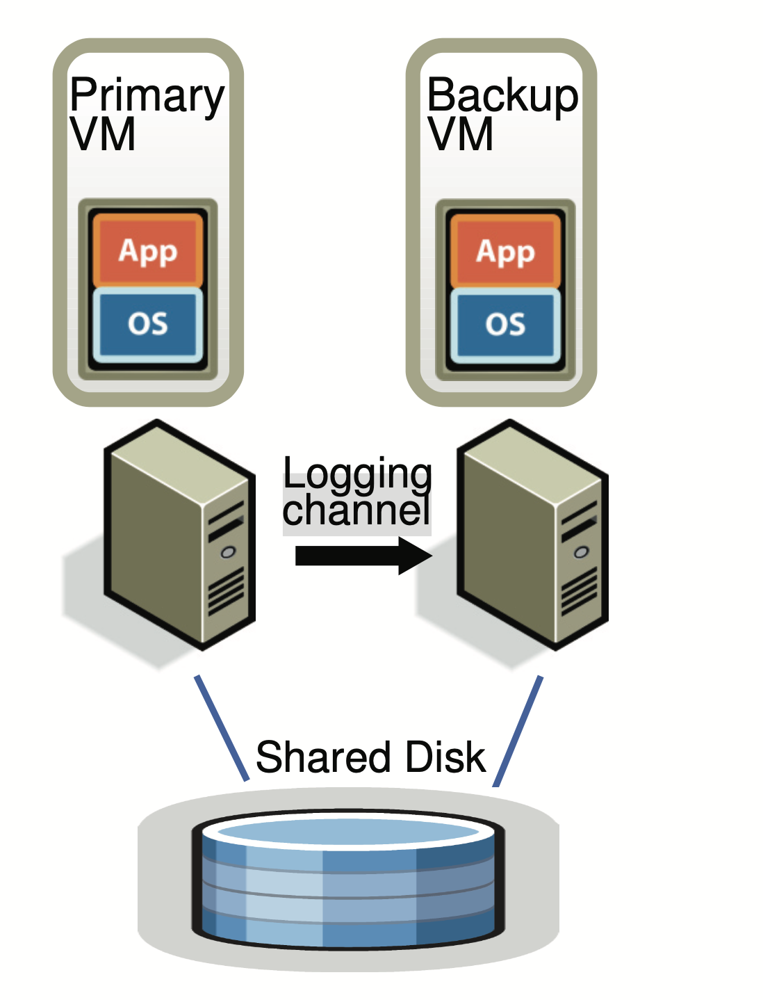
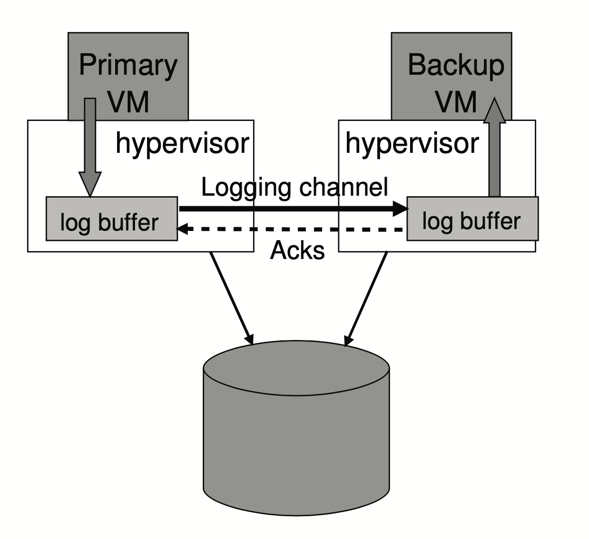
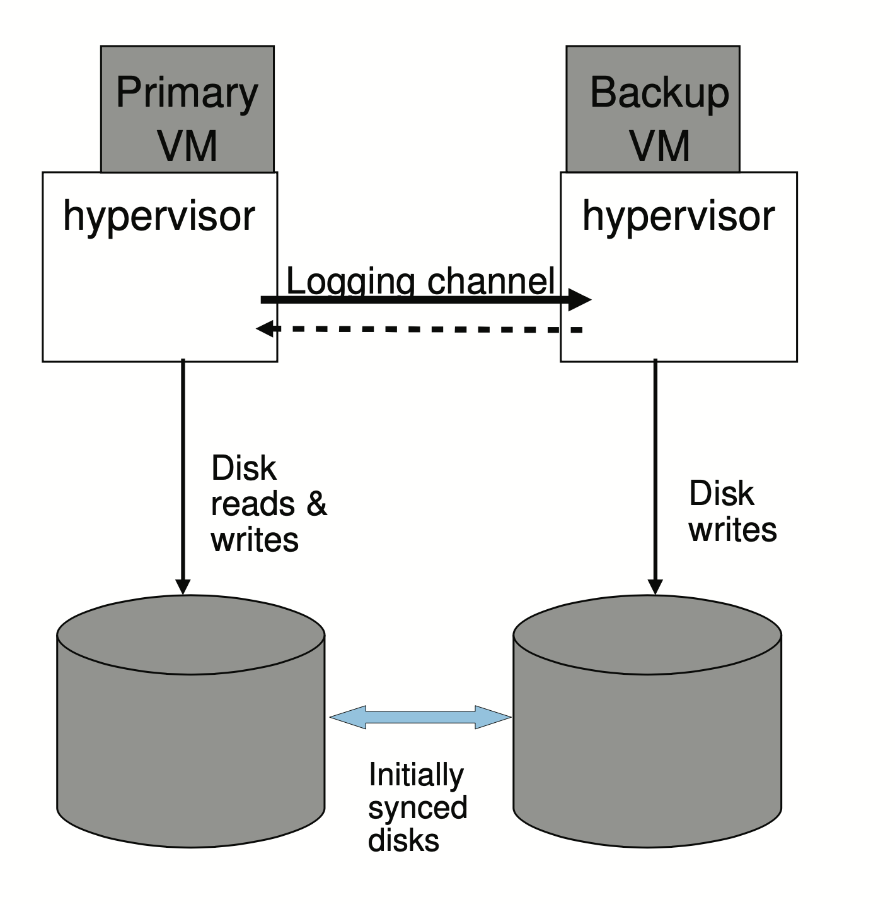

# Fault-Tolerant Virtual Machines

## 简介

我们基于在备份虚拟机上重放的方法，实现了一个用于提供容错虚拟机的企业级别的系统。我们在 VMware vSphere 4.0 上设计了一个完整易用的容错系统，平均只会降低小于 10% 的世纪应用的性能。另外，保证主从服务器运行在[锁步](https://blog.csdn.net/Setul/article/details/104626310)状态下的带宽少于 20 Mbit/s，这样在长距离下容错系统也得以实现。在本文中我们会描述我们的基础设计，讨论额外的设计选项和一些实现细节，并且提供微基准和实际应用的性能结果。

## 1. 介绍

主从备份是一种通用的实现容错系统的方法，当主服务器宕机时备份服务器会马上接管服务。备份服务器会和主服务器的所有状态一致，包括 CPU、内存和 IO 设备，但是在主从服务器之间用于发送这些状态的带宽需求非常大。

另一种对宽带要求比较少的方法是**状态机**。将所有机器当做一个确定的状态机，确保它们的初始状态一致并且接收相同顺序的输入。由于有些服务有一些不确定性的操作，所以还需要记录一下额外的信息来保证主从服务器一直处于同步状态。这些额外的信息相比之前的状态同步（主要是内存的更新）要小得多。

对于物理机器来说实现确定的状态是非常困难的，特别是对于多核机器来说。相反，运行在监控程序上的虚拟机是一个实现状态机非常好的平台。监控程序可以捕获主虚拟机非确定性的操作所需的所有信息，并且把这些信息在副本虚拟机里重放。

VMware vSphere Fault Tolerance (FT) 就是基于状态机重放来实现的。为了提供硬件容错，我们的系统会在系统失败后恢复冗余，通过在本地集群里任意一个可用的机器上启动一个新的备份虚拟机。

## 2. 基本容错设计

​

​ 图1： 基本容错配置

图1展示了我们的容错虚拟机的基本设置。对于一个主虚拟机，提供一个在不同物理机上的备份虚拟机，保证在短时间的延迟内与主虚拟机同步执行相同的操作，我们称这两个虚拟机是处于**虚拟锁步**的状态。

这两个虚拟机的虚拟磁盘实际上是共享的存储。因此对于输入输出主从虚拟机都有权访问。主虚拟机的所有输入会通过**日志通道**发送给副虚拟机。包括可能会产生不确定性的操作的信息也会发送给副虚拟机，这样副虚拟机会一直与主虚拟机保持同步操作。然而副虚拟机的输出都会被监控程序抛弃，只有主虚拟机的输出会被返回给客户端。

我们的系统会通过心跳和监控日志通道的拥堵情况这两种方法来检测主从服务器是否宕机。另外我们必须保证当前只有一台主虚拟机或副本虚拟机接管服务，即使已经发生脑裂（当主从服务器失去连接而导致两个服务器提供不同的服务）的情况。

### 2.1 确定性重放实现

对于虚拟机的冗余，有 3 个问题：

1. 准确捕获所有输入和非确定性的操作所需的信息，来保证副本虚拟机的确定状态运行。
2. 在副本虚拟机上准确执行所有的输入和非确定的操作。
3. 不会降低性能。

另外，在 x86 微处理器上对于一些复杂的操作都会有一些非确定性的副作用。准确捕获这些不确定的副作用并且重放来产生相同的状态也是一个问题。

确定性操作的输入和非确定性的操作所需的信息会被记录到日志文件里。对于非确定性的操作，只需要读取日志文件里的信息进行重放即可产生相同的状态改变和输出。而对于非确定性的事件，比如计时器或 IO 完成中断，这些在事件里发生的指令也会被记录。在重放过程中，这些事件会在指令流里相同的时间点被发送过去。

### 2.2 容错协议

**输出要求：如果备份虚拟机在故障之后替代了主虚拟机，备份虚拟机运行期间要保证外界得到的输出与主虚拟机是完全一致的。**

只有满足了输出要求，外界才不会观测到故障的发生，而这个要求需要延迟外部输出直到备份虚拟机收到足够的信息来重放最近的一个输出操作。一个必要的条件就是备份虚拟机需要收到输出操作之前的所有日志。如果备份虚拟机在输出操作之前上线，一些不确定性的事件（比如定时器中断）会在它运行输出操作之前改变它的运行路径。

输出要求会有如下的规则：

**输出规则：主虚拟机不会将输出发送给外界，直到收到了来自备份虚拟机收到产生输出操作的日志的确认。**

.png>)

​ 图2： 容错协议

图 2 展示了容错协议的要求。从主虚拟机到备份虚拟机之间的箭头表示日志实体的转移，从备份虚拟机到主虚拟机的箭头表示确认收到（ack）。异步的事件，输入和输出操作的信息必须以日志的形式发送给备份虚拟机，并且需要收到确认。如图所示，主虚拟机会等待收到备份虚拟机收到输出操作的日志的确认之后才会输出。就是上面所说的输出规则，这样备份虚拟机就可以保证在主虚拟机最后一个输出之后，替代主虚拟机会保持状态的一致。

不过协议无法保证重复输出，因为备份虚拟机无从知晓主虚拟机在输出之前还是之后崩溃，另外故障发生时发送给主虚拟机的包也会丢失。不过好在网络基础设施、操作系统、应用程序通常都能处理丢包或者重复的情况。

### 2.3 故障检测和响应

如果备份虚拟机有故障，那么主虚拟机会取消记录模式，即停止向日志管道里发送日志。如果主虚拟机故障，备份虚拟机需要重放运行到最后一条日志，然后备份虚拟机停止重放模式开始被提升为主虚拟机，为外界提供服务。VMware 容错也会自动将新的主虚拟机的 mac 地址广播到网络中。另外，新的主虚拟机可能会需要重发一些磁盘 IO。

主虚拟机和备份虚拟机主要通过 udp 心跳包和日志通信来判断对方是否故障。如果心跳或者日志通信停止的时间长达一个特定的超时时间（一般是几秒），那么就表示可能有故障发生。

我们利用共享存储来防止脑裂情况的发生。当一台虚拟机想上线接管服务，它需要在共享存储里运行一个原子的 test-and-set 操作，如果成功了这个虚拟机就被允许上线。否则该虚拟机就会自动停机，其他虚拟机会再重复尝试上线操作。如果一台机器不能访问共享存储，那么它会一直等待直到它能访问。

另外，如果故障发生，容错会自动在其他的机器上启动一台新的备份虚拟机。

## 3. 容错实践

### 3.1 启动与重启容错虚拟机

在启动或者重启备份虚拟机时，需要创建一个和主虚拟机相同状态的备份虚拟机，并且不能打断主虚拟机的运行。我们修改过的 FT VMotion 允许将一个虚拟机的拷贝从一个机器迁移到另一台机器，只需要不到一秒的中断。FT VMotion 还会设置主从虚拟机之间的日志管道，主虚拟机会被设置成日志模式，备份虚拟机则是重放模式。

VMware 容错系统可以在服务故障后几分钟内即可重建虚拟机副本。

### 3.2 管理日志通道

虚拟机监控程序为主从虚拟机提供一个日志的缓冲。主虚拟机会向日志缓冲里创建日志，备份虚拟机则会消费日志（注：有点像 Golang 里的带缓冲的通道）。备份虚拟机会在读取它的日志缓冲后实时发送确认给主虚拟机，这个确认就会根据**输出规则**决定主虚拟机是否延迟输出。过程如图 3 所示。

​ 图 3：容错日志缓冲和通道

当备份虚拟机发现日志缓存里为空时，它会停止运行直到下一条日志到达。当主虚拟机发现日志缓存满了时它也会停止运行直到日志被消费，但是这样会导致服务无响应。

在我们的协议中，在发送日志和收到确认过程中， 会发送额外的信息来确定主从虚拟机之间实时的运行延迟。通常来说运行延迟应该小于 100 ms，如果副本虚拟机开始有明显的运行延迟（比如大于 1 秒），那么容错系统会通知调度器分配少一点的 cpu 给主虚拟机，以此来降低主虚拟机的速度。如果备份虚拟机持续有延迟，主虚拟机被分配的 cpu 也会持续减少。反之，如果备份虚拟机延迟在正常范围内，主虚拟机的 cpu 就会增长，直到备份虚拟机开始有延迟。

### 3.3 容错虚拟机的操作

任何主虚拟机资源的变更（比如 cpu 份额的增加）都应该通过日志通道应用到备份虚拟机。VMotion用来无缝迁移虚拟机，要求在最后一个虚拟机切换的时候挂起所有磁盘 IO。如果最后一个虚拟机是主虚拟机，可以直接等待物理 IO 完成然后挂起磁盘 IO。但是如果是备份虚拟机，它需要通过日志管道告诉主虚拟机挂起磁盘 IO，然后备份虚拟机就会重放主虚拟机的操作来挂起磁盘。

### 3.4 磁盘 IO 的实现问题

1. 磁盘操作是非阻塞的，所以可以并行写入。对于磁盘同一个位置，同时进行磁盘操作可能会引发不确定性。解决方法是当检测到任何 IO 竞争，就会强制这些竞争的操作在主从虚拟机上都进行序列化运行。
2. 磁盘操作与程序应用也可能会产生数据竞争，因为磁盘操作会通过 [DMA](https://zh.wikipedia.org/wiki/%E7%9B%B4%E6%8E%A5%E8%A8%98%E6%86%B6%E9%AB%94%E5%AD%98%E5%8F%96) 直接访问虚拟机的内存。解决方法是使用 _bounce buffers_，bounce buffer 是一个与磁盘操作能访问到的内存一样大小的临时缓冲。磁盘读取数据时，会将数据从内存先复制到缓冲区里，然后再读。写数据时先把数据复制到缓冲区，然后再从缓冲区写到磁盘。
3. 当主虚拟机故障，备份虚拟机替代时，磁盘I/O可能没有完成。解决方案是重新执行在排队的磁盘操作，因为前两个方案已经避免了数据竞争，因此磁盘操作是可以重新执行的，即使其中有些之前已经成功完成（因为它们是[幂等](https://baike.baidu.com/item/%E5%B9%82%E7%AD%89/8600688)的）。

### 3.5 网络 IO 的实现问题

vSphere实现了一些网络方面的优化，例如直接从网络缓冲区取走数据，而不通过陷阱，但是这将带来不确定，因此需要禁用这个优化。另外也做了以下优化：

1. 减少 trap 和 interrupt，虚拟机发送的数据积累到了一定的量，hypervisor 就 trap 一次，将这些数据发送出去，顺便把接收的数据传给虚拟机。简单来说，一堆包一个中断，而不是一个包一个中断。
2. 减少传包的延时，TCP 数据一到即开始处理，省去了 context 切换的开销。

> 虚拟机陷阱：当虚拟机操作系统执行某些特权指令时，要求它们必须运行在裸机上，同时位于privileged mode 或者 kernel mode。这些命令会创造一个陷阱，即进入 hypervisor，然后 hypervisor 仿真虚拟机需要的功能。trap and emulate 就是针对那些，虚拟机里面想要执行的特权指令，但是虚拟机不具有这种特权，hypervisor 就仿真出来执行的结果，让 VM 以为真的在 bare metal 环境下。就是 VM 没有权限执行某些命令，然后 hypervisor 有，就让 hypervisor 执行，然后把结果返回给 VM 。

## 4. 设计中的选择

### 4.1 共享磁盘与非共享磁盘

在我们的默认设计下，主从虚拟机共享同一份虚拟磁盘。虚拟存储的内容在故障发生时一般是正确并且可用的。而且只有主虚拟机能够按照输出规则来对磁盘进行写入。

另外还有一种非共享存储的设计，如图 4 所示。

​ 图 4： 容错系统非共享磁盘配置

两台主机距离远，共享硬盘的方案贵，两台主机不能都访问到共享硬盘，这样只能用非共享存储，主虚拟机的磁盘需要同步保持和备份虚拟机的磁盘内容一致。由于虚拟磁盘可以被看做是虚拟机的内部状态，因此主虚拟机的**磁盘写入不需要延迟写入来满足输出规则**，但是两个磁盘需要在启动容错的时候就进行同步。

在这种设计中无法解决脑裂问题。可以引入能共同访问的第三方服务器作为一个 tiebreaker 来解决（这里没说清楚怎么解决，不是很明白）。

### 4.2 在备份虚拟机上读取磁盘

Backup 的所有输入都通过 Logging Channel 获得的，包括硬盘读取的数据。为了减少网络开销，可以考虑使用 Backup 读取硬盘的方案。 这带来了几个问题：

1. 减慢了 Backup 虚拟机执行的速度。
2. 读取硬盘失败需要处理。Backup 读取失败，需要不断重试直到成功；Primary 读取失败，因为内存里的内容是不确定的并且可能不会在正确读取的时候被记录下来，所以为了保证内容一致，需要将读取失败的内容发给 Backup。
3. Primary 先读后写同一个区域。Backup 接收到日志，可能读取的内容是 Primary 后来写入的内容，这导致了不一致。因此要将 Primary 的写操作延后，直到 Backup 的读操作完成。
