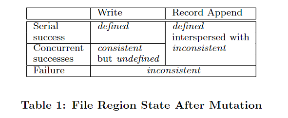
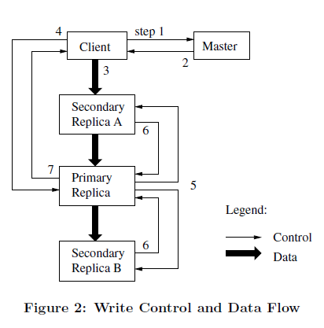

# GFS（The Google File System）

## 1. 简介

首先，组件失效被认为是常态事件，而不是意外事件。

其次，以通常的标准衡量，我们的文件非常巨大。

第三，绝大部分文件的修改是采用在文件尾部追加数据，而不是覆盖原有数据的方式。对文件的随机写入操作在实际中几乎不存在。

第四，应用程序和文件系统API的协同设计提高了整个系统的灵活性。比如，我们放松了对GFS一致性模型的要求，这样就减轻了文件系统对应用程 序的苛刻要求，大大简化了GFS的设计。我们引入了原子性的记录追加操作，从而保证多个客户端能够同时进行追加操作，不需要额外的同步操作来保证数据的一 致性。

## 2.设计概述

### 2.1设计预期

在设计满足我们需求的文件系统时候，我们的设计目标既有机会、又有挑战。之前我们已经提到了一些需要关注的关键点，这里我们将设计的预期目标的细节展开讨论。

* 系统由许多廉价的普通组件组成，组件失效是一种常态。系统必须持续监控自身的状态，它必须将组件失效作为一种常态，能够迅速地侦测、冗余并恢复失效的组件。
* 系统存储一定数量的大文件。我们预期会有几百万文件，文件的大小通常在100MB或者以上。数个GB大小的文件也是普遍存在，并且要能够被有效的管理。系统也必须支持小文件，但是不需要针对小文件做专门的优化。
* 系统的工作负载主要由两种读操作组成：大规模的流式读取和小规模的随机读取。大规模的流式读取通常一次读取数百KB的数据，更常见的是一次读取 1MB甚至更多的数据。来自同一个客户机的连续操作通常是读取同一个文件中连续的一个区域。小规模的随机读取通常是在文件某个随机的位置读取几个KB数 据。如果应用程序对性能非常关注，通常的做法是把小规模的随机读取操作合并并排序，之后按顺序批量读取，这样就避免了在文件中前后来回的移动读取位置。
* 系统的工作负载还包括许多大规模的、顺序的、数据追加方式的写操作。一般情况下，每次写入的数据的大小和大规模读类似。数据一旦被写入后，文件就很少会被修改了。系统支持小规模的随机位置写入操作，但是可能效率不彰。
* 系统必须高效的、行为定义明确的实现多 客户端并行追加数据到同一个文件里的语意。我们的文件通常被用于”生产者-消费者“队列，或者其它多路文件合并操作。通常会有数百个生产者，每个生产者进 程运行在一台机器上，同时对一个文件进行追加操作。使用最小的同步开销来实现的原子的多路追加数据操作是必不可少的。文件可以在稍后读取，或者是消费者在 追加的操作的同时读取文件。
* 高性能的稳定网络带宽远比低延迟重要。我们的目标程序绝大部分要求能够高速率的、大批量的处理数据，极少有程序对单一的读写操作有严格的响应时间要求。

### 2.2 接口

GFS提供了一套类似传统文件系统的API接口函数，虽然并不是严格按照POSIX等标准API的形式实现的。文件以分层目录的形式组织，用路径名来标识。我们支持常用的操作，如创建新文件、删除文件、打开文件、关闭文件、读和写文件。

另外，GFS提供了快照和记录追加操作。快照以很低的成本创建一个文件或者目录树的拷贝。记录追加操作允许多个客户端同时对一个文件进行数据追 加操作，同时保证每个客户端的追加操作都是原子性的。这对于实现多路结果合并，以及”生产者-消费者”队列非常有用，多个客户端可以在不需要额外的同步锁 定的情况下，同时对一个文件追加数据。我们发现这些类型的文件对于构建大型分布应用是非常重要的。快照和记录追加操作将在3.4和3.3节分别讨论。

### 2.3 架构

一个GFS集群包含一个单独的Master节点 \*（alex注：这里的一个单 独的Master节点的含义是GFS系统中只存在一个逻辑上的Master组件。后面我们还会提到Master节点复制，因此，为了理解方便，我们把 Master节点视为一个逻辑上的概念，一个逻辑的Master节点包括两台物理主机，即两台Master服务器）、\*多台 Chunk服务器，并且同时被多个客户端访问，如图1所示。所有的这些机器通常都是普通的Linux机器，运行着用户级别(user-level)的服务 进程。我们可以很容易的把Chunk服务器和客户端都放在同一台机器上，前提是机器资源允许，并且我们能够接受不可靠的应用程序代码带来的稳定性降低的风险。

.png>)

GFS存储的文件都被分割成固定大小的Chunk。在Chunk创建的时候，Master服务器会给每个Chunk分配一个不变的、全球唯一的 64位的Chunk标识。Chunk服务器把Chunk以linux文件的形式保存在本地硬盘上，并且根据指定的Chunk标识和字节范围来读写块数据。

Master节点管理所有的文件系统元数据。这些元数据包括名字空间、访问控制信息、文件和Chunk的映射信息、以及当前Chunk的位置信息。Master节点还管理着系统范围内的活动，

Master节点使用心跳信息周期地和每个Chunk服务器通讯，发送指令到各个Chunk服务器并接收Chunk服务器的状态信息。

### 2.4 单一Master节点

单一的Master节点的策略大大简化了我们的设计。单一的Master节点可以通过全局的信息精确定位Chunk的位置以及进行复制决策。另 外，我们必须减少对Master节点的读写，避免Master节点成为系统的瓶颈。客户端并不通过Master节点读写文件数据。反之，客户端向 Master节点询问它应该联系的Chunk服务器。客户端将这些元数据信息缓存一段时间，后续的操作将直接和Chunk服务器进行数据读写操作。

### 2.5 Chunk尺寸

Chunk的大小是关键的设计参数之一。我们选择了64MB，这个尺寸远远大于一般文件系统的Block size。每个Chunk的副本都以普通Linux文件的形式保存在Chunk服务器上，只有在需要的时候才扩大。惰性空间分配策略避免了因内部碎片造成 的空间浪费，内部碎片或许是对选择这么大的Chunk尺寸最具争议一点。

选择较大的Chunk尺寸有几个重要的优点。首先，它减少了客户端和Master节点通讯的需求，因为只需要一次和Mater节点的通信就可以 获取Chunk的位置信息，之后就可以对同一个Chunk进行多次的读写操作。这种方式对降低我们的工作负载来说效果显著，因为我们的应用程序通常是连续 读写大文件。即使是小规模的随机读取，采用较大的Chunk尺寸也带来明显的好处，客户端可以轻松的缓存一个数TB的工作数据集所有的Chunk位置信 息。其次，采用较大的Chunk尺寸，客户端能够对一个块进行多次操作，这样就可以通过与Chunk服务器保持较长时间的TCP连接来减少网络负载。第 三，选用较大的Chunk尺寸减少了Master节点需要保存的元数据的数量。这就允许我们把元数据全部放在内存中，

另一方面，即使配合惰性空间分配，采用较大的Chunk尺寸也有其缺陷。小文件包含较少的Chunk，甚至只有一个Chunk。当有许多的客户 端对同一个小文件进行多次的访问时，存储这些Chunk的Chunk服务器就会变成热点。在实际应用中，由于我们的程序通常是连续的读取包含多个 Chunk的大文件，热点还不是主要的问题。

然而，当我们第一次把GFS用于批处理队列系统的时候，热点的问题还是产生了：一个可执行文件在GFS上保存为single-chunk文件， 之后这个可执行文件在数百台机器上同时启动。存放这个可执行文件的几个Chunk服务器被数百个客户端的并发请求访问导致系统局部过载。我们通过使用更大的复制参数来保存可执行文件，以及错开批处理队列系统程序的启动时间的方法解决了这个问题。一个可能的长效解决方案是，在这种的情况下，允许客户端从其它客户端读取数据。

### 2.6 元数据

Master服务器 存储3种主要类型的元数据，包括：文件和Chunk的命名空间、文件和Chunk的对应关系、每个Chunk副本的存放地点。

Master服务器不会持久保存Chunk位置信息。Master服务器在启动时，或者有新的Chunk服务器加入时，向各个Chunk服务器轮询它们所存储的Chunk的信息。

这些元数据会保存在 Master 服务器的内存中。

#### 2.6.3 操作日志

操作日志包含了关键的元数据变更历史记录。这对GFS非常重要。这不仅仅是因为操作日志是元数据唯一的持久化存储记录，它也作为判断同步操作顺序的逻辑时间基线

Master服务器在灾难恢复时，通过重演操作日志把文件系统恢复到最近的状态。为了缩短Master启动的时间，我们必须使日志足够小 Master服务器在日志增长到一定量时对系统状态做一次Checkpoint，将所有的状态数据写入一个Checkpoint文件 。 在灾难恢复的时候，Master服务器就通过从磁盘上读取这个Checkpoint文件，以及重演Checkpoint之后的有限个日志文件就能够恢复系统。Checkpoint文件以压缩B-树形势的数据结构存储，可以直接映射到内存，在用于命名空间查询时无需额外的解析。这大大提高了恢复速度，增强了可用性。

Master服务器使用独立的线程切换到新的日志文件和创建新的Checkpoint文件。新的Checkpoint 文件包括切换前所有的修改。对于一个包含数百万个文件的集群，创建一个Checkpoint文件需要1分钟左右的时间。创建完成后，Checkpoint 文件会被写入在本地和远程的硬盘里。

### 2.7 一致性模型

GFS支持一个宽松的一致性模型，这个模型能够很好的支撑我们的高度分布的应用，同时还保持了相对简单且容易实现的优点。

#### 2.7.1 GFS一致性保障机制

文件命名空间的修改（例如，文件创建）是原子性的。它们仅由Master节点的控制：命名空间锁提供了原子性和正确性（4.1章）的保障；Master节点的操作日志定义了这些操作在全局的顺序（2.6.3章）。

当数据变更后，文件区域的状态取决于变更的类型，变更是否成功以及是否是并发进行的。表 1 是对结果的一个概述。

**一致的（Consistent）**：所有的客户端无论从哪个副本读取数据总是看到相同的数据。

**已定义的（defined）**：一致的文件可以被客户端读取全部的变更。

操作影响：

1. 变更成功，且没有受到其他并发写者的影响，那么被影响的区域就是定义良好的（肯定是一致性的）。
2. 并发的成功变更，影响区域是一致的，但不是定义良好的，客户端可能无法看到所有的更改。(**如果变更是针对相同的数据写这样有的变更就会被新的变更所覆盖，这样用户就无法看到最先的变更了，同时发生在跨 chunk 的操作会被拆分成两个操作，这样这个操作的一部分可能会被其他操作覆盖，而另一部分则保留下来，如 3.1 节末尾所述**) ，通常其看到的是多个变更组合以后的结果。
3. 一个失败的变更，会使区域进入非一致的状态（因此也是未定义的状态）：不同的客户端在不同的访问中可能看到不同的数据。我们下面描述下我们的应用程序如何区分定义良好的区域和未定义的区域。应用程序不需要进一步区分未定义区域的各种不同的类型。

数据变更可能是写或者记录 append。写操作会使数据在应用程序指定的偏移位置写入。记录 append 操作会使数据原子性的 append，**如果是并发性的话则至少会被 append 一次**，但是偏移位置是由 GFS 决定的(见 3.3 节，通常的理解可能是在客户端想写入的那个文件的尾部)。偏移位置会被返回给客户端，同时标记包含这条记录的那个定义良好的文件区域的起始位置。

经过了一系列的成功的修改操作之后，GFS确保被修改的文件region是已定义的，并且包含最后一次修改操作写入的数据。

GFS通过以下措施确保上述行为：

* 对Chunk的所有副本的修改操作顺序一致（3.1章）
* 使用Chunk的版本号来检测副本是否因为它所在的Chunk服务器宕机（4.5章）而错过了修改操作而导致其失效。失效的副本不会再进行任何修改操作，Master服务器也不再返回这个Chunk副本的位置信息给客户端。它们会被垃圾收集系统尽快回收。

由于Chunk位置信息会被客户端缓存，所以在信息刷新前，客户端有可能从一个失效的副本读取了数据。在缓存的超时时间和文件下一次被打开的时 间之间存在一个时间窗，文件再次被打开后会清除缓存中与该文件有关的所有Chunk位置信息。而且，由于我们的文件大多数都是只进行追加操作的，所以，一 个失效的副本通常返回一个提前结束的Chunk而不是过期的数据。当一个Reader \*（alex注：本文中将用到两个专有名词，Reader和Writer，分别表示执行GFS读取和写入操作的程序）\*重新尝试并联络Master服务器时，它就会立刻得到最新的Chunk位置信息。

即使在修改操作成功执行很长时间之后，组件的失效也可能损坏或者删除数据。GFS通过Master服务器和所有Chunk服务器的定期“握手” 来找到失效的Chunk服务器，并且使用Checksum来校验数据是否损坏（5.2章）。一旦发现问题，数据要尽快利用有效的副本进行恢复（4.3 章）。只有当一个Chunk的所有副本在GFS检测到错误并采取应对措施之前全部丢失，这个Chunk才会不可逆转的丢失。在一般情况下GFS的反应时间 \*（alex注：指Master节点检测到错误并采取应对措施）\*是几分钟。即使在这种情况下，Chunk也只是不可用了，而不是损坏了：应用程序会收到明确的错误信息而不是损坏的数据。

#### 2.7.2 程序的实现

GFS 应用程序可以通过使用简单的技术来适应这种放宽的一致性模型，这些技术已经为其他目的所需要：依赖于 append 操作而不是 overwrite，检查点保存，写入时自我验证，自我标识记录。

典型应用一：一个写操作者会从头至尾生成一个文件。当写完所有数据后它自动的将文件重命名为一个永久性的名称，或者通过周期性的检查点检查已经有多少数据被成功写入了。检查点可以通过校验和实现。

典型应用二：多个写者同时向一个文件 append，为了归并/生产者消费者队列，记录的 append 的 append-at-least-once 语义保证了每个写者的输出。读取者这样处理偶然的 padding 和重复数据。写者为每条记录准备一些额外信息比如校验和，这样它的合法性就可以验证。如果不能容忍重复的数据（比如他们可以触发非幂等的操作，幂等操作是指无论执行多少次结果都会改变、而非幂等是指结果会改变），可以通过在记录中使用唯一标识符来过滤它们，很多时候都需要这些标识符命名相应的应用程序实体，比如网页文档。这些用于 record 输入输出的功能函数是以库的形式被我们的应用程序共享的，同时应用于 gongle 其他的文件接口实现。所以，相同系列的记录，加上一些罕见的重复，总是直接被分发给记录读取者。

## 3. 系统交互

我们在设计这个系统时，一个重要的原则是**最小化所有操作和Master节点的交互**。带着这样的设计理念，我们现在描述一下客户机、Master服务器和Chunk服务器如何进行交互，以实现数据修改操作、原子的记录追加操作以及快照功能。

### 3.1 租约（lease）和变更顺序

变更是一个会改变Chunk内容或者元数据的操作，比如写入操作或者记录追加操作。变更操作会在Chunk的所有副本上执行。我们使用租约 （lease）机制来保持多个副本间变更顺序的一致性。Master节点为Chunk的一个副本建立一个租约，我们把这个副本叫做主副本 （**Primary Replica**)。主副本对副本的所有更改操作进行序列化。所有的副本都遵从这个序列进行修改操作。因此，修改操作全局的顺序首先由Master节点选择的租约的顺序决定，然后由租约中主Chunk分配的序列号决定。

这里 Master 类似于有一批房子的原房东，由于房子（副本）很多管不过来，找到一个二房东（主副本）和他签订租约，授权他来给租客们（其他副本）安排顺序入住（写入数据）。

设计租约机制的目的是为了最小化Master节点的管理负担。租约的初始超时设置为60秒。不过，只要Chunk被修改了，主副本就可以申请更长的租期，通常会得到Master节点的确认并收到租约延长的时间。这些租约延长请求和批准的信息通常都是附加在Master节点和Chunk服务 器之间的心跳消息中来传递。有时Master节点会试图提前取消租约（例如，Master节点想取消在一个已经被改名的文件上的修改操作）。即使 Master节点和主副本失去联系，它仍然可以安全地在旧的租约到期后和另外一个Chunk副本签订新的租约。

在图2中，我们依据步骤编号，展现写入操作的控制流程。

1. 客户机向Master节点询问哪一个Chunk服务器持有当前的租约，以及其它副本的位置。如果没有一个Chunk持有租约，Master节点就选择其中一个副本建立一个租约（这个步骤在图上没有显示）。
2. Master节点将主副本的标识符以及其它副本（又称为secondary副本、二级副本）的位置返回给客户机。客户机缓存这些数据以便 后续的操作。只有在主副本不可用，或者主Chunk回复信息表明它已不再持有租约的时候，客户机才需要重新跟Master节点联系。
3. 客户机把数据推送到所有的副本上。客户机可以以任意的顺序推送数据。Chunk服务器接收到数据并保存在它的内部LRU缓存中，一直到数据被使 用或者过期交换出去。由于数据流的网络传输负载非常高，通过分离数据流和控制流，我们可以基于网络拓扑情况对数据流进行规划，提高系统性能，而不用去理会哪个Chunk服务器保存了主副本。3.2章节会进一步讨论这点。
4. 当所有的副本都确认接收到了数据，客户机发送写请求到主副本服务器。这个请求标识了早前推送到所有副本的数据。主副本为接收到的所有操作分配连续的序列号，这些操作可能来自不同的客户机，序列号保证了操作顺序执行。它将这些变更根据序列号应用在本地副本上。
5. 主副本把写请求传递到所有的二级副本。每个二级副本依照主副本分配的序列号以相同的顺序执行这些操作。
6. 所有的二级副本回复主副本，它们已经完成了操作。
7. 主副本服务器 回复客户机。任何副本产生的任何错误都会返回给客户机。在出现错误的情况下，写入操作可能在主副本和一些二级副本执行成功。（如果操作在主副本 上失败了，操作就不会被分配序列号，也不会被传递。）客户端的请求被确认为失败，被修改的region处于不一致的状态。我们的客户机代码通过重复执行失 败的操作来处理这样的错误。在从头开始重复执行之前，客户机会先从步骤（3）到步骤（7）做几次尝试。

### 3.2 数据流

为了提高网络效率，我们采取了把数据流和控制流分开的措施。在控制流从客户机到主Chunk、然后再到所有二级副本的同时，数据以管道的方式， 顺序的沿着一个精心选择的Chunk服务器链推送。我们的目标是充分利用每台机器的带宽，避免网络瓶颈和高延时的连接，最小化推送所有数据的延时。

### 3.3 原子的记录追加

GFS提供了一种原子的数据追加操作–记录追加。使用记录追加，**客户机只需要指定要写入的数据**。GFS保证至少有一次原子的写入操作 成功执行（即写入一个顺序的byte流），写入的数据追加到GFS指定的偏移位置上，之后GFS返回这个偏移量给客户机。

客户机把数据推送给文件最后一个Chunk 的所有副本，之后发送请求给主Chunk。主Chunk会检查这次记录追加操作是否会使Chunk超过最大尺寸（64MB）。如果超过了最大尺寸，主 Chunk首先将当前Chunk填充到最大尺寸，之后通知所有二级副本做同样的操作，然后回复客户机要求其对下一个Chunk重新进行记录追加操作。

### 3.4 快照

快照操作几乎可以瞬间完成对一个文件或者目录树（“源”）做一个拷贝，并且几乎不会对正在进行的其它操作造成任何干扰。我们的用户可以使用快照 迅速的创建一个巨大的数据集的分支拷贝（而且经常是递归的拷贝拷贝），或者是在做实验性的数据操作之前，使用快照操作备份当前状态，这样之后就可以轻松的 提交或者回滚到备份时的状态。

当Master节点收到一个快照请求，它首先取消作快照的文件的所有Chunk的租约。这个措施保证 了后续对这些Chunk的写操作都必须与Master交互交互以找到租约持有者。这就给Master节点一个率先创建Chunk的新拷贝的机会。

租约取消或者过期之后，Master节点把这个操作以日志的方式记录到硬盘上。然后，Master节点通过复制源文件或者目录的元数据的方式，把这条日志记录的变化反映到保存在内存的状态中。新创建的快照文件和源文件指向完全相同的Chunk地址。

在快照操作之后，当客户机第一次想写入数据到Chunk C，它首先会发送一个请求到Master节点查询当前的租约持有者。Master节点注意到Chunk C的引用计数超过了1 (意思应该是 Chunk C 刚刚被快照过了）。 Master节点不会马上回复客户机的请求，而是选择一个新的Chunk句柄C'。之后，Master节点要求每个拥有Chunk C当前副本的Chunk服务器创建一个叫做C'的新Chunk。通过在源Chunk所在Chunk服务器上创建新的Chunk，我们确保数据在本地而不是通过网络复制（我们的硬盘比我们的100Mb以太网大约快3倍）。从这点来讲，请求的处理方式和任何其它Chunk没什么不同：Master节点确保新 Chunk C' 的一个副本拥有租约，之后回复客户机，客户机得到回复后就可以正常的写这个Chunk，而不必理会它是从一个已存在的Chunk克隆出来的。

总结一下快照的步骤：

Snapshot的整个流程如下：

1. client向GFS master发送Snapshot请求
2. GFS master收到请求后，会回收所有这次Snapshot涉及到的chunk的租约
3. 当所有回收的租约到期后，GFS master写入一条日志，记录这个信息。然后，GFS会在内存中复制一份snapshot涉及到的metadata。

当snapshot操作完成后，client写snapshot中涉及到的chunk C的流程如下：

1. client向GFS master请求primary chunkserver和其他chunkserver
2. GFS master发现chunk C的引用计数超过1，即 chunk C 被快照引用。它会向所有有chunk C副本的chunkserver发送创建一个chunk C的拷贝请求，记作是chunk C’，这样，把最新数据写入到chunk C’即可。本质上是copy on write。

也就是说当有客户端需要修改 chunk 的数据时，而快照又在同时进行，master 会复制一份新的 chunk 让客户端去写数据。也就是 cow 的思想。 [cow介绍](https://juejin.cn/post/6844903702373859335)

## 4. Master节点的操作

Master节点执行所有的名称空间操作。此外，它还管理着整个系统里所有Chunk的副本：它决定Chunk的存储位置，创建新Chunk和 它的副本，协调各种各样的系统活动以保证Chunk被完全复制，在所有的Chunk服务器之间的进行负载均衡，回收不再使用的存储空间。

### 4.1 名称空间管理和锁

Master节点的很多操作会花费很长的时间：比如，快照操作必须取消Chunk服务器上快照所涉及的所有的Chunk的租约。我们不希望在这 些操作的运行时，延缓了其它的Master节点的操作。因此，我们允许多个操作同时进行，使用名称空间的region上的锁来保证执行的正确顺序。

每个Master节点的操作在开始之前都要获得一系列的锁。通常情况下，如果一个操作涉及/d1/d2/…/dn/leaf，那么操作首先要获 得目录/d1，/d1/d2，…，/d1/d2/…/dn的读锁，以及/d1/d2/…/dn/leaf的读写锁。注意，根据操作的不同，leaf可以是 一个文件，也可以是一个目录。

因为名称空间可能有很多节点，读写锁采用惰性分配策略，在不再使用的时候立刻被删除。同样，锁的获取也要依据一个全局一致的顺序来避免死锁：首先按名称空间的层次排序，在同一个层次内按字典顺序排序。

### 4.2 4.3 副本安置，创建，重新复制，重新负载均衡

如何安置 replicas 的目标是：

* 最大化数据可靠性和可用性
* 最大化网络带宽的利用

**这里的最大化不仅仅是机器间的问题**，还要考虑机架间的问题

在以下 3 种情况下，Master 会进行创建 replicas 的操作：

* 创建了新的 chunk
* 需要重新备份
* 负载均衡

如何选择将 replicas 放置到哪台机器上呢？

* 优先选择磁盘利用率低的 chunkserver，使得较长时间将会平均化 chunkserver 的利用。
* GFS 会限制每个 chunkserver『最近』创建的次数。换句话说，如果一个 chunkserver 近期创建 replicas 的操作比较频繁，就不会优先选择它（因为创建就意味着以后会进行读取，为了防止突然间大量的读取出现在同一台机器上）
* 保证可用性，尽可能跨机架（racks）进行创建操作

当可用的备份低于要求时（GFS 要求为 3 份），master 会对 chunk 进行重新备份，在以下情况有可能需要重新备份：

* chunkserver 不可用了
* 备份损坏了
* 硬盘挂掉了
* 所要求的最低备份数量提高了

当有多个 chunk 需要备份时，GFS 如何决定先备份哪个呢？策略如下：

* 优先选择可用备份少的（仅有一份备份的更加迫切）
* 优先备份最近没有 delete 文件的（for live files）
* 优先备份阻塞了 client 操作的（这样可以最小化对运行中应用的影响）

当 master 决定了备份哪个之后，会把当前可用的 chunk 直接克隆到目标位置（遵循 replicas 放置的类似规则：平均磁盘利用率、防止单一机器高 IO、跨机架）。

周期性的检查副本分布以求重平衡，副本的移动过程中是新建一个新的，放置规则和前述讨论一致。放置了新的必须删除旧的（通常情况下倾向删除自身空白空间低于平均水平的）。

### 4.4 垃圾回收

GFS在文件删除后不会立刻回收可用的物理空间。GFS空间回收采用惰性的策略，只在文件和Chunk级的常规垃圾收集时进行。我们发现这个方法使系统更简单、更可靠。

#### 4.4.1 机制

当一个文件被应用程序删除时，Master节点象对待其它修改操作一样，立刻把删除操作以日志的方式记录下来。但是，Master节点并不马上 回收资源，而是把文件名改为一个包含删除时间戳的、隐藏的名字。当Master节点对文件系统命名空间做常规扫描的时候，它会删除所有三天前的隐藏文件 （这个时间间隔是可以设置的）。直到文件被真正删除，它们仍旧可以用新的特殊的名字读取，也可以通过把隐藏文件改名为正常显示的文件名的方式“反删除”。 当隐藏文件被从名称空间中删除，Master服务器内存中保存的这个文件的相关元数据才会被删除。这也有效的切断了文件和它包含的所有Chunk的连接

在对Chunk名字空间做类似的常规扫描时，Master节点找到孤儿Chunk（不被任何文件包含的Chunk）并删除它们的元数据。 Chunk服务器在和Master节点交互的心跳信息中，报告它拥有的Chunk子集的信息，Master节点回复Chunk服务器哪些Chunk在 Master节点保存的元数据中已经不存在了。Chunk服务器可以任意删除这些Chunk的副本。

#### 4.4.2 讨论

虽然分布式垃圾回收在编程语言领域是一个需要复杂的方案才能解决的难题，但是在GFS系统中是非常简单的。我们可以轻易的得到Chunk的所有 引用：它们都只存储在Master服务器上的文件到块的映射表中。我们也可以很轻易的得到所有Chunk的副本：它们都以Linux文件的形式存储在 Chunk服务器的指定目录下。所有Master节点不能识别的副本都是”垃圾”。

垃圾回收在空间回收方面相比直接删除有几个优势。首先，对于组件失效是常态的大规模分布式系统，垃圾回收方式简单可靠。Chunk可能在某些 Chunk服务器创建成功，某些Chunk服务器上创建失败，失败的副本处于无法被Master节点识别的状态。副本删除消息可能丢失，Master节点 必须重新发送失败的删除消息，包括自身的和Chunk服务器的 _（alex注：自身的指删除metadata的消息）_。 垃圾回收提供了一致的、可靠的清除无用副本的方法。第二，垃圾回收把存储空间的回收操作合并到Master节点规律性的后台活动中，比如，例行扫描和与 Chunk服务器握手等。因此，操作被批量的执行，开销会被分散。另外，垃圾回收在Master节点相对空闲的时候完成。这样Master节点就可以给那 些需要快速反应的客户机请求提供更快捷的响应。第三，延缓存储空间回收为意外的、不可逆转的删除操作提供了安全保障。

根据我们的使用经验，延迟回收空间的主要问题是，延迟回收会阻碍用户调优存储空间的使用，特别是当存储空间比较紧缺的时候。当应用程序重复创建 和删除临时文件时，释放的存储空间不能马上重用。我们通过显式的再次删除一个已经被删除的文件的方式加速空间回收的速度。我们允许用户为命名空间的不同部 分设定不同的复制和回收策略。例如，用户可以指定某些目录树下面的文件不做复制，删除的文件被即时的、不可恢复的从文件系统移除。
