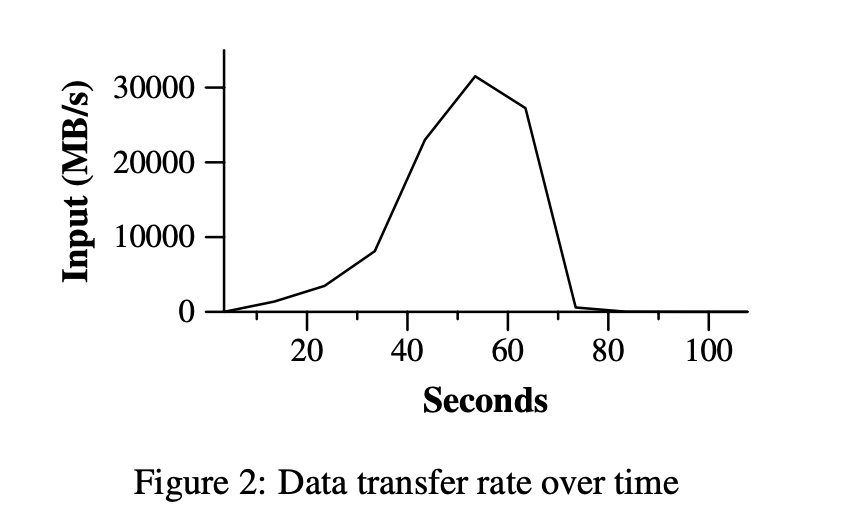

# MapReduce Programming Model

计算模型以一系列的键值对作为输入并产生一系列的键值对作为输出。MapReduce 库的用户以“Map”和”Reduce”两个函数来表达计算。

**Map**，是由用户编写的，取一个输入对，并且产生一系列中间的键值对。MapReduce 库将那些具有相同的中间键I的中间值聚集在一起，然后将它们传递给 Reduce 函数。

**Reduce**，同样是由用户编写的，接收一个中间键I和该键对应的一系列的中间值。Reduce 函数通过将这些值合并来组成一个可能更小的集合（值的集合）。通常每个 Reduce 函数只产生 0 个或 1 个输出值。Reduce 函数一般通过一个迭代器（via an iterator）来获取中间值，从而在中间值的数目远远大于内存容量时，我们也能够处理。

#### Example

下面来考虑这样一个问题：统计大量文档中每一个单词出现的次数。对此，用户需要编写类似于如下的伪代码：

```
　　map(String key, String value):
　　　　// key: document name
　　　　// value: document contents
　　　　for each word w in value:
　　　　　　EmitIntermediate(w, "1");

　　reduce(String key, Iterator values):
　　　　// key: a word
　　　　// values: a list of counts
　　　　int result = 0;
　　　　for each v in values:
　　　　　　result += ParseInt(v);
　　　　Emit(AsString(result));
Copy
```

Map 函数为在每一个单词出现的时候，为它加上一个计数（在这个简单的例子中就是加 1）。Reduce 函数对每个单词（作为中间键值对的键）的所有计数进行叠加。

另外，用户需要用输入输出文件的名字，以及一个可选的 tuning paramete 去 fill in 一个叫 mapreduce specification 的对象。之后，用户调用 MapReduce 函数，将上述定义的对象传递进去。用户的代码将和 MapReduce 库相连（由 C++实现）。Appendix A 中有这个例子所有的代码文档。

```
map     (k1,v1)  ->  list(k2,v2)
reduce  (k2,list(v2)) -> list(v2)
Copy
```

需要注意的是，输入的 key 和 value 与输出的 key 和 value 是不同的类型，而中间的 key 和 value 与输出的 key 和 value 是相同的类型（用 k1 和 k2 表示）。我们的 C++实现都是以字符串的形式和用户代码进行交互的，至于将字符串类型转换成相应合适的类型的工作则由用户代码来完成了。

.png>)

上图 1 展示了在我们的实现中 MapReduce 全部的流程。当用户程序调用 MapReduce 函数时，接下来的动作将按序发生（图 1 中标记的数字与下面的数字是一一对应的）：

1. 用户程序中的 MapReduce 库首先将输入文件划分为M片，每片大小一般在 16MB 到 64MB 之间（由用户通过一个可选的参数指定）。之后，它在集群的很多台机器上都启动了相同的程序拷贝。
2. 其中有一个拷贝程序是特别的——master。剩下的都是 worker，它们接收 master 分配的任务。其中有 M 个 Map 任务和 R 个 Reduce 任务要分配。master 挑选一个空闲的 worker 并且给它分配一个 map 任务或者 reduce 任务。
3. 被分配到 Map 任务的 worker 会去读取相应的输入块的内容。它从输入文件中解析出键值对并且将每个键值对传送给用户定义的 Map 函数。而由 Map 函数产生的中间键值对缓存在内存中。
4. 被缓存的键值对会阶段性地写回本地磁盘，并且被划分函数分割成 R 份。这些缓存对在磁盘上的位置会被回传给 master，master 再负责将这些位置转发给 Reduce worker。
5. 当 Reduce worker 从 master 那里接收到这些位置信息时，它会使用远程过程调用从 Map worker 的本地磁盘中获取缓存的数据。当 Reduce worker 读入全部的中间数据之后，它会根据中间键对它们进行排序，这样所有具有相同键的键值对就都聚集在一起了。排序是必须的，因为会有许多不同的键被映射到同一个 reduce task 中。如果中间数据的数量太大，以至于不能够装入内存的话，还需要另外的排序。
6. Reduce worker 遍历已经排完序的中间数据。每当遇到一个新的中间键，它会将 key 和相应的中间值传递给用户定义的 Reduce 函数。Reduce 函数的输出会被添加到这个 Reduce 部分的输出文件中。
7. 当所有的 Map tasks 和 Reduce tasks 都已经完成的时候，master 将唤醒用户程序。到此为止，用户代码中的 MapReduce 调用返回。

当成功执行完之后，MapReduce 的执行结果被存放在 R 个输出文件中（每个 Reduce task 对应一个，文件名由用户指定）。通常用户并不需要将 R 个输出文件归并成一个。因为它们通常将这些文件作为另一个 MapReduce 调用的输入，或者将它们用于另外一个能够以多个文件作为输入的分布式应用。

（module R 将中间键值对分为 R 份一方面是为了执行 Reduce work 的处理器进行分布式并行计算，另一方面，产生的分布式数据也可以接着用于其他能以多文件为输入的分布式应用。）

#### Master Data Structures

在 master 中保存了许多的数据结构。对于每个 Map task 和 Reduce task，master 都保存了它们的状态（idle，in-progress 或者是 completed）以及 worker 所在机器的标识（对于非 idle 空转状态的 tasks 而言）。

master 相当于是一个管道，通过它 Map task 所产生的中间文件被传递给了 Reduce task。因此，对于每一个已经完成的 Map task，master 会存储由它产生的 R 个中间文件的位置和大小（分配给 R 个 Reduce task 执行，需要远程读取这些数据，所以要记录位置和大小）。当 Map task 完成的时候，master 就会收到位置和大小的更新信息。而这些信息接下来就会逐渐被推送到处于 in-progress 状态的 Reduce task 中。

**Worker Failure**

master 会周期性地 ping 每一个 worker。如果经过了一个特定的时间还未从某一个 worker 上获得响应，那么 master 会将 worker 标记为 failed。所有由该 worker **完成的 Map task** 都被回退为 idle 状态，因此能够被重新调度到其他的 worker 上。同样的，所有 failed worker **正在执行的 Map task 或者 Reduce task** 也会被回退为 idle 状态，并且被重新调度。

**发生故障的机器上已经完成的 Map task 需要重新执行的原因是，它们的输入是保存在本地磁盘的，因此发生故障之后就不能获取了。而已经完成的 Reduce task 并不需要被重新执行，因为它们的输出是存放在全局的文件系统中的。**

当一个 Map task 开始由 worker A 执行，后来又由 worker B 执行（因为 A 故障了）。所有执行 Reduce task 的 worker 都会收到这个重新执行的通知。那些还未从 worker A 中读取数据的 Reduce task 将会从 worker B 中读取数据。

MapReduce 对于大面积的机器故障是非常具有弹性的。例如，在一次 MapReduce 操作中，网络维护造成了集群中八十台机器在几分钟的时间内处于不可达的状态。MapReduce 的 master 只是简单地将不可达的 worker 机器上的工作重新执行了一遍，接着再继续往下执行，最终完成了 MapReduce 的操作。

#### Task Granularity

如上所述，我们将 Map 操作分成 M 份，Reduce 操作分成 R 份。在理想的情况下，M 和 R 的值应该要比集群中 worker machine 的数量多得多。让一个 worker 同时进行许多不同的 task 有利于提高动态的负载均衡，同时在一个 worker 故障的时候能尽快恢复。许多已经完成的 Map task 也能尽快地传播到其他所有的 worker machine 上。

在我们的实现中，M 和 R 的大小是有一个实用范围的。因为我们的 master 需要做O(M+R)个调度决定，并且还要在内存中保存$O(M\_R)$个状态（源自前面所说：**对于每一个已经完成的 Map task，master 会存储由它产生的 R 个中间文件的位置和大小。**）。（但是内存使用的常数还是比较小的，$O(M\_R)$个 Map task/Reduce task 状态对，每个的大小大概在一个字节）

另外，R通常受限于用户，因为每个 Reduce task 的输出都分散在不同的输出文件中。事实上，我们会选择M，使得每个输入文件大概 16MB 到 64MB 的输入文件（因此上文所述的局部性优化会达到最优，减少带宽负担，尽量利用本地存储数据进行 Map task）。而我们会让 R 成为 worker machine 数量的一个较小的倍数。因此，我们通常在进行 MapReduce 操作时，M=200000，R=5000，使用 2000 个 worker machine。

### Refinements（扩展）

#### Partitioning Function

MapReduce 用户决定他们的 Reduce task 或者输出文件的数目 R。通过一个划分函数，根据中间键值将各个 task 的数据进行划分。默认的划分函数是通过哈希（比如，hash(key) mod R）。这通常会产生非常好的较为均衡的划分。但是在其他一些情况下，通过键值的其他函数来划分要更好一些。例如，有的时候输出键值是一些 URL，我们希望同一个 host 的内容能放在同一个输出文件中。为了支持这种情况，MapReduce 库的用户可以提供一个特殊的划分函数。例如，使用“hash(Hostname(urlKey)) mod R”作为划分函数，从而让所有来自于同一个 host 的 URL 的内容都输出到同一个输出文件。

#### Combiner Function

在有些情况下，每个 Map task 都会产生大量的中间键的重复而用户指定的 Reduce 函数是交互和关联的。Section 2.1 中的单词统计就是一个很好的例子。因为单词的出现频率服从于 Zipf 分布，每个 Map Task 都会产生成百上千个这样的记录。所有这些记录都会通过网络被送到一个 Reduce task 中，并且由 Reduce 函数加在一起去产生一个数。我们允许用户使用了可选的 Cominer 函数，用于在网络传输之前部分地进行归并操作。

Combiner 函数在每个执行 Map task 的机器上执行。通常 Combiner 和 Reduce 函数使用的是相同的代码。Reduce 函数和 Combiner 函数**唯一的不同**是 MapReduce 库**如何处理函数的输出**。Reduce 函数的输出写到最终的输出文件中。而 Combiner 函数的输出会被写到一个最终将被送给 Reduce task 的中间文件中（合并后替代原有的中间键值对集合传递给 Reduce Task 机器，这样减少了带宽的占用）。

#### Skipping Bad Records

有时候，如果用户的代码中有 bug 的话，会导致 Map 或者 Reduce 操作在某些记录上崩溃。这些 bug 会导致 MapReduce 操作的正常完成。对于这种情况，通常就是去修 bug。不过有时候这是不可行的，也许 bug 是第三方库造成的，而我们并不能得到它的源代码。而且，有时候我们允许忽略掉一些记录，例如在对一个大数据集做分析的时候。因此我们提供了一种可选的执行模式，当 MapReduce 库检测到一些记录会造成崩溃时，就会主动跳过它们，从而保证正常地运行。

每一个 worker 进程都安装了一个 signal handler 用于捕捉段错误和 bug。在调用用户的 Map 和 Reduce 操作之前，MapReduce 库会将参数的序号保存在一个全局变量中。如果用户代码产生了一个信号，signal handler 就会传输一个参数含有序号的”last gasp”UDP 包给 MapReduce 的 master。当 master 在一个特定的记录中发现了不知一次的错误，这表示在下一次执行相应的 Map 或者 Reduce 操作的时候一个将它跳过。

### Performance

这一章里记录了使用两个程序分别处理 1 T 数据的实验结果及分析。一个程序用来搜索数据里某个三字符模式，另一个用来对数据排序。

这两个程序代表了由用户实际编写的 MapReduce 程序的一个子集，一种是从大数据量里抽出一小部分数据，另一种是将数据从一种形式变换成另一种形式（即排序 shuffle ）。

#### Grep



grep 程序需要扫描 1 T 数据的记录，搜索一个相对罕见的三字符模式（出现了 92337 次）。输入被分成大概 64MB 份（M = 15000），所有的输出文件都存放在一个文件中（R = 1）。

Figure 2 显示了 Computation 随着时间的变化过程。Y 轴代表了输入数据的扫描速度。随着机器逐渐加入 MapReduce 的计算当中，速度越来越快，当有 1764 个 worker 加入时，达到峰值 30GB/s。随着 Map task 的结束，速度开始下降并且在 80s 的时候到达 0。整个 Computation 从开始到结束总共花费了大概 150s。这其中还包括了 1 分钟的启动开销。开销主要来源于将程序分发到 worker machine 中，和 GFS 交互并打开 1000 个输入文件，以及获取局部性优化所需的信息的延时。

#### Sort

.png>)

程序以 TeraSort benchmark 为模型，对 1 T 数据进行排序。

其中图 3 中的 a 表示正常运行过程，左上图表示数据的扫描（输入）速率，在达到峰值 13GB/s 后迅速滑落是因为所有的 map tasks 在 200 秒内就已经完成。可以看到排序的扫描速率明显低于 grep ，这是因为因为对于 sort 操作，花费了一半的事件以及 I/O 带宽用于将中间键值对结果写入本地磁盘，而 grep 操作对应的输出则可以小到忽略不计。

中间左边的图表示从 map tasks 通过网络向 reduce tasks 传输数据的速率。第一个突起表示所有 reduce tasks 运行的第一个批次（R = 1700 nearly all），开始计算后 300 秒左右，第一批次的部分 reduce tasks 完成，我们开始向完成的机器进一步递送剩余 reduce tasks 的数据。

左下的图表示排序好的数据向最终文件写出的速率。从第一批次 reduce tasks 完成到开始写数据有一段时间间隔，这是因为机器忙于对中间数据进行排序。

从上面三张图中可以看出，输入速率明显大于 shuffle 速率和输出速率。这是因为输入是基于本地存储，而又因为网络带宽的限制，以及输出要求两份 replica 的要求，shuffle 速率高于输出速率。我们写成两个副本，因为这是我们的底层文件系统提供的可靠性和可用性机制要求。

#### Effect of Backup Tasks

在图 3（b）中，我们展示了禁止 backup tasks 情况下执行排序操作的结果。流程与图 3（a）很相似，但存在一个相当长的且看不出有明显活动的尾部。960 秒后，除了剩余的 5 个，其余 reduce tasks 均已完成，然而剩余的 stragglers 直到 300 秒后才完成任务，着导致整体耗时 1283 秒，比具备 backup tasks（最终备份处理任务）情况下多耗时 44%。

#### Machine Failures

在图 3（c）中，我们展示了将 1746 台工作机器中的 200 台机器故意宕机几分钟以模拟机器故障情况下排序操作的执行结果，底层的集群立刻重启新的工作进程（因为仅仅是 kill 进程，实际上机器功能良好）。

worker 的 deaths 通过图表中负值输入速率来表示，因为先前一些已完成的 map work 丢失而需要被重新执行（根据先前分析，由于 map task 得到的中间结果存储在本地，宕机后无法正确访问，使得之前的任务需要被重新执行 re-execute）。重执行开始得十分迅速，整体耗时仅仅比正常情况多耗时 5%。
