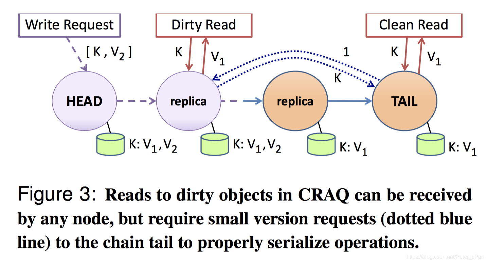

# Object Storage on CRAQ

转载修改自 [【译】Object Storage on CRAQ 上篇](https://blog.csdn.net/Peter\_cPan/article/details/108454742)

附 [CRAQ论文精简总结](https://keys961.github.io/2020/05/03/%E8%AE%BA%E6%96%87%E9%98%85%E8%AF%BB-CRAQ/)

## 摘要

大型存储系统通常会在许多可能出故障的组件上进行数据复制和数据分区，从而保证可靠性和可扩展性。但是许多商业部署系统为了实现更高的可用性和吞吐量，牺牲了强一致性，特别是那些实时交互系统。

本论文介绍了CRAQ的设计、实现和评估。CRAQ是一个挑战上述僵化取舍的分布式对象存储系统。我们的基本方法是对链式复制进行改造，在保证强一致性的同时，大幅提高读取吞吐量。通过在所有对象副本上分配负载，CRAQ可以随链的大小线性扩展，而无需增加一致性协调。同时，为了满足某些应用程序的需求，CRAQ提供了弱一致性保证，这在系统处于高故障时期尤其有用。本文探讨了为跨多个数据中心进行地理复制的CRAQ存储而进行的额外设计和实现，从而提供优化局部性的操作。本文也讨论了多对象原子更新和大对象更新的多播优化。

## 1. 引言

许多在线服务需要基于对象的存储，将数据作为整个单元呈现给应用程序。对象存储支持两个基本原语：_读_（或查询）操作返回以对象名称存储的数据块，_写_（或更新）操作修改单个对象的状态。这一类基于对象的存储由键值数据库（例如BerkeleyDB或Apache的CouchDB）支持，并部署到商业数据中心（例如Amazon的Dynamo，Facebook的Cassandra以及Memcached）。为了在这类系统中实现可靠性、负载平衡和可扩展性，对象命名空间在许多机器上进行了分区，每个数据对象都被复制了几次。

当应用程序有某些特殊需求时，基于对象的系统会比其对应的文件系统更具吸引力。与分层目录结构相反，对象存储更适合于水平命名空间，例如在键值数据库那样。对象存储简化了支持整个对象修改的流程。并且，它们通常只需要推理某个指定对象的修改顺序即可，而不是整个存储系统；为每个对象提供一致性比而不是为所有操作和/或对象，代价要低的多。

在构建作为众多应用程序基础的存储系统时，商业站点将高性能和高可用的需求放在首位。复制数据是为了承受单个节点甚至整个数据中心的故障带来的威胁，无论这个故障是计划内的还是计划外的。确实在新闻媒体中处处可见数据中心离线导致期间整个网站都被关闭了的例子。对可用性和性能的高度关注，导致许多商业系统由于感知成本而牺牲了强一致性语义（例如Google、Amazon、eBay、Facebook等）。

最近，van Renesse 和 Schneider 提出了一种在 fail-stop 服务器上，基于对象存储的链式复制的方法，旨在提供强一致性的同时提高吞吐量。基本方法是将所有存储对象的节点组织在一条链中，其中链的尾节点处理所有读取请求，而链的头节点处理所有写入请求。在客户端收到确认之前，写操作沿链向下传播，因此尾节点可以得到所有对象操作的执行顺序，具有强一致性。该方法没有任何复杂或多轮通信的协议，但是提供了简单、高吞吐量和容易故障恢复的特性。

不幸的是，基础的链复制方法有一些局限性。对一个对象的所有读取都在同一个节点，从而导致潜在的热点问题。虽然可以通过一致性哈希方法或更中心化的目录方法将集群中的节点组织到多个链中，以实现更好的负载均衡，但是如果特定对象访问较少，这些算法仍然可能会负载不平衡，这在实践中是一个真实的问题。当尝试跨多个数据中心构建链式，甚至可能出现更严重的问题，因为所有的读取操作都可以由一个远距离节点（链的尾节点）处理。

本文介绍了CRAQ（Chain Replication with Apportioned Queries）的设计、实现和评估，CRAQ是一个对象存储系统，在保持链式复制的强一致性特性的同时，通过支持**分配查询**为读取操作提供了较低的延迟和较高的吞吐量；分配查询指的是将读取操作分配给链中的所有节点执行，而不是所有操作都由单个主节点处理。本文的主要贡献如下：

1. CRAQ使任何链节点都能在保持强一致性的同时处理读操作，从而支持存储对象在所有节点之间的负载平衡。此外，当大多数工作负载是读取操作时，（例如GFS和Memcached系统中做的假设），CRAQ的性能可以和仅提供最终一致性的系统相媲美。
2. 除了强一致性外，CRAQ的设计还自然支持读操作之间的最终一致性，从而降低写操作期间的等待时间，并在短暂的分区期间降级为只读。CRAQ允许应用程序指定读取操作可接受的最大陈旧度（staleness）。
3. 利用负载均衡的特性，我们介绍了一种广域系统设计，用于在跨地理位置的集群中构建CRAQ链，并保留了强局部性。具体而言，读操作可以由本地集群进行处理，在最坏情况下（高写争用的时候），需要在广域网中传输简短的元数据信息。我们还介绍了使用Zookeeper（一种类似于PAXOS的组成员系统）来管理部署。

最后，我们讨论了CRAQ的其他扩展，包括将微事务集成到多对象原子更新中，以及使用多播来提高大对象更新的写入性能。但是，我们尚未完成这些优化的实现。

CRAQ的初步性能评估显示，与基础的链式复制方法相比，它具有更高的吞吐量，在大多数负载都是读操作的情况下，吞吐量与节点的数量成正比：三节点的链可以提升约200%的吞吐量，七节点的链可以提升约600%的吞吐量。在高写入的情况下，CRAQ在三节点的链中的读取吞吐量仍然比基础的链式复制高出两倍，并且读取延迟较低。我们总结了CRAQ在各种工作负载和故障情况下的性能。最后，我们评估了CRAQ在跨地域复制方面的性能，证明其延迟远低于基础链式复制方法的延迟。

本文的剩余部分安排如下，第2节介绍了基础链式复制与CRAQ协议之前的对比，以及CRAQ的最终一致性支持。第3节介绍了CRAQ在单数据中心和跨数据中心扩展到多条链的方法，以及管理链和节点的组成员服务。第4节涉及到诸如多对象更新和利用多播等扩展。第5节介绍了CRAQ的实现，第6节展示了CRAQ的性能评估，第7节回顾了相关工作，第8节进行总结。

## 2. 基础系统模型

本节介绍了我们基于对象的接口和一致性模型，简要概述了标准的链式复制模型，然后介绍了强一致的CRAQ模型及其变体。

### 2.1 接口和一致性模型

基于对象的存储系统为用户提供了两个简单的原语：

* _**write(objID, V):**_ 写（更新）操作存储与对象标识符 _**objID**_ 关联的值 _**V**_。
* _**V ← read(objID):**_ 读（查询）操作检索与对象标识符 _**objID**_ 关联的值 _**V**_。

我们将讨论关于单个对象的两种主要的一致性类型。

* **强一致性** 我们系统中的强一致性保证对于单个对象的所有的读和写操作均按一定顺序执行，并且对于单个对象的读始终能看到最新的值。
* **最终一致性** 我们系统中的最终一致性意味着对单个对象的写入仍然按一定顺序应用于所有的节点，但是对于不同的节点，最终一致性读可能在一段时间内返回旧数据（即在写入被应用到所有节点之前）。但是，一旦所有的副本接收到写入请求后，读操作将永远不会返回比最近提交的写入版本更旧的版本。实际上，如果客户端保持与一个特定节点的会话（尽管不是与不同的节点的会话），则会看到单调的读一致性（作者注：即对于一个对象的读取将返回相同的先前的值或一个更新的值，但是绝不会返回旧版本的值）。

接下来，我们介绍一下链式复制和 CRAQ 是如何提供强一致性的。

### 2.2 链式复制

链式复制（CR，Chain Replication）是一种在多节点之间复制数据的方法，提供了强一致性的存储接口。节点组成一条长度为 _**C**_ 的\_链\_。链的\_**头节点**_处理来自客户端的所有_**写**_操作。当节点收到写操作的请求时，它会继续传播给链中的下一个节点。一旦写操作请求到达尾节点，该操作就已经被应用到了链中的所有副本中，此时认为该写操作_**已提交**\_。尾节点处理所有的读操作，因此只有已提交的值才会被返回。

.png>)

图1提供了一个长度为四的链的实例。所有读请求的到达和处理都在尾节点。写请求到达链的头部，并向下传播到尾部。当尾节点提交写操作后，向客户端发送回复。CR论文中介绍由尾节点直接向客户端发送消息；但是由于我们使用TCP，因此我们的实现实际由头部节点复用之前与客户端的连接，在收到尾节点的确认后直接进行响应。确认回传在图中用虚线表示。

CR简单的拓扑结构使写操作比其他提供强一致性的协议成本更低。多个并发写入可以在链中进行流水线传输，传输成本平摊在所有节点上。之前工作的模拟结果显示，与主/备复制相比，CR具有更高的吞吐量，同时还能更快、更容易地恢复。

链式复制实现了强一致性：由于所有的读都在尾部进行，并且所有的写入只有当到达尾部后才提交，因此链的尾部可以按序应用所有的操作。然而，这的确要付出一些代价，因为只有一个节点处理读操作，因此降低了读操作的吞吐量，无法随着链的长度增加而进行扩展。但是这是有必要的，因为查询中间节点可能为违反强一致性保证；特别是，在传播过程中，对不同节点的并发读取可能会看到不同的写入值。

尽管CR专注于提供存储服务，但也可以将其查询/更新协议视为复制状态机的接口。尽管本文的剩余部分仅从读/写对象存储接口两个角度考虑问题，但也可以用类似的角度看待CRAQ。

### 2.3 分摊查询的链式复制

当前只读工作负载环境大受欢迎，因此CRAQ试图通过允许链中的任意节点都来处理读操作，同时仍提供强一致性保证，来提高吞吐量。CRAQ主要的扩展如下：

1. CRAQ中的单个节点允许存储对象的多个版本，每个版本都包含一个单调递增的版本号以及一个附加属性：该版本是脏的还是干净的。所有的版本初始化标记为干净。
2. 当节点收到对象的新版本时（通过沿链路向下传播的写操作），该节点将此最新版本附加到该对象的列表中。
   * 如果该节点不是尾节点，则将该版本标记为脏，并将写操作传播到后继节点。
   * 如果该节点是尾节点，则将版本标记为干净，此时我们将对象版本称为\_**已提交**\_。然后，尾节点可以通过在链中反向传播确认来通知所有其他节点此次提交。
3. 当节点接收到某个对象版本的\_确认\_消息时，该节点会将该对象版本标记为干净。然后，该节点就可以删除该对象的所有先前版本。
4. 当节点收到对对象的读取请求时：
   * 如果最新已知的版本是干净的，则节点将返回该值。
   * 如果最新已知的版本是脏的，该节点会与尾节点进行通信，查询尾节点最后提交的版本号。然后节点返回该对象的版本；按照规则，可以确保该节点存储了该版本的对象。我们注意到，尽管尾节点可以在它回复版本请求和中间节点向客户端发送回复之前提交新版本，但是这不违反强一致性的定义，因为读操作从尾节点来说是序列化的。

请注意，如果节点收到写提交的确认后立即删除旧版本，则也可以隐式确定节点上的对象的状态是脏还是干净。也就是说如果节点中的对象只有一个版本，那么该对象是干净的；否则，对象是脏的，必须从尾节点检索正确的版本。

.png>)

图2显示了处于初始干净状态的CRAQ链。每个节点都存储对象的相同副本，因此到达链中任何节点的任何读请求都将返回相同的值。除非收到写请求，否则所有节点都将保持在干净状态。

图3显示了写操作的传播过程（由紫色虚线显示）。头节点收到写入该对象的新版本（V 2）的初始消息，因此头节点的对象状态是脏的。然后，头节点将写消息沿着链向下传播到第二个节点，该节点也将该对象标记为脏（对象 K有多个版本 \[ V 1 , V 2 ] ）。如果一个处于干净状态的节点收到读请求，它们将立即返回该对象的旧版本：这是正确的，因为新版本尚未在尾节点提交新版本。但是，如果两个脏节点中的其中一个收到读请求，它们会向尾节点发送版本查询请求（图中使用蓝色的虚线箭头显示），尾节点将返回被请求对象的已知版本号。然后，脏节点返回与指定版本号相关联的旧对象值（V 1）。因此，即使有多个未完成的写操作在链中传播，链中的所有节点仍将返回同一版本的对象。

当尾节点收到并接受写入请求时，它会在链上发送包含此写入版本号的确认消息。每个前继节点收到确认后，将此版本号标记为干净（可能删除所有较旧的版本）。当其最新的版本状态变成干净后，节点就可以在本地处理读请求了。这种方式利用了写操作是串行传播的事实，因此尾节点总是最后一个收到写入请求的节点。

CRAQ在以下两种场景下吞吐量会比CR有所提升：

* **Read-Mostly Workloads** 该场景下大多数都是读请求，这些读取请求由 _**C − 1**_ 个非尾节点进行处理。因此，在这类场景下吞吐量与链长度 _**C**_ 呈线性关系。
* **Write-Heavy Workloads** 该场景下有许多对非尾节点的大多数读请求数据为脏，因此需要对尾节点进行版本查询。但是，我们认为这些版本查询比
* 完整读取更轻量，允许尾节点在它饱和之前以更高的速率处理它们。这使得总的读取吞吐量仍高于CR。

第六节中的性能数据可以支持以上两个主张，即使对于小对象也是如此。对于持续写请求繁重的较长链，即使我们不评估这种优化，也可以想象通过使尾部结点仅处理版本查询而不是处理所有的读请求的方式，可以优化读取吞吐量。

### 2.4 CRAQ上的一致性模型

某些应用程序或许可以以较弱的一致性保证来运行，并且它们可能会试图避免版本查询的性能开销（根据3.3节，在广域部署中是很重要的），或者它们可能希望当系统无法提供强一致性时继续运行（例如在分区期间）。为了支持这类需求的变化，CRAQ同时支持三种不同的一致性模型。读取操作使用哪一类一致性模型是可选的。

* **强一致性**（默认）上面的模型中描述了强一致性。所有对象读取都与最后一次提交的写入一致。
* **最终一致性** 允许对链中的节点的读操作返回已知的最新对象版本。因此，另一个点的后续读取操作可能返回比先前返回的对象更旧的版本。因此，尽管对单个链节点的读取操作的确在本地，但它不满足单调读一致性。
* **最大范围不一致的最终一致性** 允许读操作在写操作提交前将存储的新对象返回，但只允许在某些条件下这样做。施加的条件可以基于时间或是基于绝对版本号。在该模型中，保证读操作返回的值具有最大的不一致性周期。如果链仍然是可用的，这种不一致性实际上是因为返回的版本比上次提交的版本新（注：请求在链的前面部分）。如果系统被分区，并且节点无法参与写入，那么版本可能比当前提交的版本旧（注: 请求在原链分区后的后面部分）。

### 2.5 CRAQ中的故障恢复

由于CRAQ的基本结构与CR相似，因此CRAQ使用相同的技术进行故障恢复。每个链节点需要知道它的前继节点和后继节点，以及链的头部和尾部。当头部节点故障了，它的后继节点将接任新的链的头部。同样，当尾节点出现故障时，它的前继节点也会接任成为新的尾节点。需要加入到链中间的节点要像双链表一样插入到两个节点之间。处理系统故障的正确性证明与CR相似；由于篇幅所限，这里不展开说明。第5节介绍了CRAQ中故障恢复的细节以及协作服务的集成。特别是CRAQ允许节点加入到链中的任何位置（而不是仅在尾部），以及在恢复过程中正确处理故障的选择都需要详细介绍。

## 3. CRAQ的扩展

在本节中，我们讨论应用程序如何在单数据中心以及跨多数据中心的条件下，设计CRAQ中链的布局方案。然后，我们讨论如何使用协作服务来存储链的元信息和组成员身份信息。

### 3.1 链布局策略

使用分布式存储服务的应用程序的要求可能会有所不同。一些常见的情况如下：

* 对对象的大部分或全部的写入操作可能源自单个数据中心
* 一些对象可能只存放在一个数据中心的某些节点中
* 热点对象可能需要大量复制，而非热点对象可能较少

CRAQ提供了灵活的链配置策略，通过使用对象的两级命名结构来满足这些变化的需求。对象的标识符包括\_链标识符\_和\_键标识符\_。链标识符决定CRAQ中的哪些节点将存储该链中的所有键，而键标识符为每条链提供唯一命名。我们介绍了多种满足应用程序定制化需求的方法：

* **隐式数据中心和全局链长度：**

_{num\_datacenters，chain\_size}_

在这个方法中，定义了存储 该链 的数据中心的数量，但未明确定义存储在哪个数据中心。为了明确具体哪个数据中心存储了链，使用一致性哈希结合唯一的数据中心标识符来确定。

**显式数据中心和全局链长度：**

_{chain\_size, dc1, dc2, ... , dcN}_

该方法中每个数据中心使用同样的链长度在数据中心中存储副本。链的头节点位于数据中心 dc1 中，链的尾节点位于数据中心 dcN 中，链基于数据中心列表进行排序。为了确定数据中心中的哪些节点存储分配给链的对象，对链标识符做一致性哈希。每个数据中心 dci 都有一个连接到数据中心尾节点 dci-1 的节点和一个连接到数据中心头节点 dci+1 的节点。另一个额外的功能是允许 chain\_size 为 0，表示该链使用每个数据中心内的所有节点。

**显式数据中心和不同链长度**

_{dc1, chain\_size, ... , dcN, chain\_sizeN}_

这里每个数据中心的链长度是独立的。这允许链负载均衡是非均匀的。每个数据中心的链节点的选择方式与之前的方式相同，并且 chain\_size 也可以设置为0。

在上述方法2和方法3中，dc1 可以设置为**主数据中心**。如果一个数据中心是链的主数据中心，那么对于链的写入将仅在短暂故障期间被该数据中心接受。否则，如果 dc1 与链的其他节点断开连接，则 dc2 可能会成为新的头节点，并接管写操作，直到 dc1 恢复在线。如果未设置主节点，写操作将仅在包含全局链中大多数节点的分区中继续进行。否则，如第2.4节中定义的那样，对于最大范围不一致的读取操作，该分区会变成只读。

CRAQ可以轻松支持其他更复杂的链配置方法。例如可能需要指定一个显式备份数据中心，仅当另一个数据挂了的时候开始加入链中。还可以设置一组数据中心（例如东海岸数据中心），其中的任意一个都可以填充到上述方法2的有序列表中。为简便起见，我们不再详细介绍更复杂的方法。

可以写入单个链的键标识符的数量没有限制，这样可以根据应用需求对链进行灵活的配置。

### 3.2 单个数据中心中的CRAQ

在最初的链式复制工作中，已经研究了如何在多个数据中心分布多个链。在CRAQ的当前实现中，我们使用一致性哈希将链放置在数据中心内，将潜在的链标识符映射到头节点上。这类似于基于数据中心的对象存储。GFS采用并在CR中推广的另一种方式是在分配和存储随机链成员时，使用成员管理服务作为目录服务，即每个链可以包含一些随机服务器的集合。这种方式提高了并行系统恢复的能力。但是，这是以增加集中度为代价的。CRAQ可以轻松的使用这种设计，但是它将需要在协作服务中存储更多的元信息。

### 3.3 跨多个数据中心的CRAQ

当链延伸到广域网时，CRAQ能够从任何节点进行读取的能力可以降低它的延迟：客户端在选择节点时具有灵活性，它们可以选择物理距离较近的节点（或者轻负载的节点）。只要链的状态是干净的，那么节点可以直接返回本地副本的值，而不用发送任何广域请求。而在传统的CR中，所有读取都需要由可能距离较远的尾节点处理。实际上，由于对象可能处于不同的位置，因此多种设计可能会基于数据中心在链中选择头结点和/或尾节点。实际上雅虎的新分布式数据库PNUTS就是受其数据中心中的高写入局部性的影响而进行设计的。

也就是说应用程序可能会进一步优化广域网下链的选择，从而最大程度地减少写入延迟，降低网络成本。当然，在所有节点集合中使用一致性哈希这种朴素的方式来构建链可能会导致链的前继和后继是随机的，前继和后继可能距离很远。此外，一条链可能会多次跨入和跨出一个数据中心。而通过我们的链优化，应用程序可以通过谨慎选择组成链的数据中心的顺序来最小化写延迟，并且可以确保一条链只单向跨越数据中心的网络边界一次。

即使使用优化后的链，随着越来越多的数据中心被添加到链中，广域网中的链的写操作延迟也会增加。尽管与以并行方式分发写操作的主/备方法相比，这种方式显著地增加了延迟，但是它允许将写操作在链中流水线进行，这极大的提高了写操作的吞吐量。

### 3.4 ZooKeeper 协作服务

众所周知，为分布式应用程序构建一个容错的协作服务很容易出错。CRAQ的早期版本包含一个非常简单、集中控制的协作服务，用于维护成员管理。后来，我们选择利用Zookeeper为CRAQ提供一种健壮的、分布式的、高性能的方式来管理组成员，并提供一种简单的方式来存储链的元数据。通过Zookeeper，当组内添加节点或删除节点时，CRAQ节点一定会收到通知。同样当节点关注的元数据发送变化时，该节点也可以收到通知。

Zookeeper为客户端提供类似于文件系统的分层命名空间。文件系统存储在内存中，并且在日志中为每个Zookeeper实例进行备份，文件系统状态会在多个Zookeeper节点之间进行复制，从而提高可靠性和可扩展性。为了达成一致，Zookeeper使用类似两阶段提交的原子广播协议。经过优化后，Zookeeper能够为大量读的小型工作负载提供出色的性能，因为它可以直接在内存中响应大部分的服务请求。

与传统的文件系统命名空间类似，Zookeeper客户端可以罗列目录的内容、读取文件、写入文件以及在文件或目录被修改或删除时收到通知。Zookeeper的原始操作允许客户端实现许多更高级别的语义，例如组成员、领导选举、事件通知、锁和队列。

跨多数据中心进行管理成员和链的元信息的确带来了一些挑战。实际上，Zookeeper并未针对在多数据中心环境中运行进行优化：将多个Zookeeper节点放在单个数据中心，可以提高Zookeeper在该数据中心的读取可扩展性，但是在广域网下的性能会受损。因为原始实现并不知道数据中心的拓扑和层次结构，所以Zookeeper节点之间进行消息交换会通过广域网进行传输。尽管如此，我们当前的实现仍然确保了CRAQ节点总是能收到本地Zookeeper节点的通知，并且与它们相关的关于链和节点列表的消息也会进行通知。我们在第5.1节使用Zookeeper进行了扩展。

为了消除Zookeeper在跨数据中心时产生的流量冗余，可以构建一个Zookeeper实例的层次结构：每个数据中心可以拥有自己本地的Zookeeper实例（由多个节点组成），并拥有一个全局Zookeeper实例的代表（可以通过本地实例的领导选举选出）。然后独立的功能可以协调两者之间的数据共享。一种替代设计是修改Zookeeper本身，就像CRAQ一样让节点知道网络拓扑结构。我们尚未重复研究这两种方法，将其留给以后的工作。

## 4. 扩展

本节讨论对CRAQ的一些其他扩展，包括微事务功能、使用多播优化写操作。我们目前正在实现这些扩展。

### 4.1 CRAQ上的微事务

在一些应用程序中，对于对象存储中的整个对象的读/写接口可能会受限。例如BitTorrent或其他目录服务可能需要支持列表的添加或删除。分析服务可能需要存储计数器。或者应用程序可能希望提供对某些对象的条件访问。这些需求都不是仅仅提供纯粹的对象存储接口就可以满足的，但是CRAQ提供了支持事务操作的关键扩展。

#### 4.1.1 单键操作

单键操作很容易实现，CRAQ已经支持以下操作：

* **前置/追加：** 将数据添加到当前对象值的开头或结尾。
* **增加/减小：** 在键的对象上增加或减少，以整数形式表示。
* **测试并设置：** 仅在键的当前版本号等于操作中执行的版本号时，才更新键的对象。

对于前置/追加和增加/减小操作，存储键对象的链的头节点可以简单地将操作应用于对象的最新版本，即使最新的版本是不干净的，然后在链中向后传播替换写操作。此外，如果这些操作很频繁，则头节点可以缓存请求然后批量更新。如果使用传统的两阶段提交协议，实现这些功能付出的代价会很高。

对于测试并设置操作，链的头节点检查其最近提交的版本号是否等于操作中执行的版本号，如果没有该对象最近未提交的版本，头节点接受该操作并在链中传播更新。如果有未完成的写操作，则拒绝该操作，并且如果连续被拒绝，客户端需要考虑降低请求速度。还有另一种方案，头节点可以通过禁止写入直到对象干净为止并重新检查最新的版本号来锁定对象，但是由于未提交的写入被中止是非常少见的，以及锁定对象会显著影响性能，因此我们选择不采用该方案。

测试并设置操作也可以设计为接受值而不是版本号，但是当存在未提交的版本时，会引入额外的复杂性。如果头节点与对象的最新提交版本（通过与尾节点通信）比较发现不同，则当前进行中的任何写入都将被拒绝。而如果头节点与最新未提交版本比较，就违反了一致性保证。为了实现一致性，头节点将需要通过禁止写入直到对象干净为止来暂时地锁住对象。这不会违反一致性保证，并确保不会丢失任何更新，但是会显著影响写入性能。

#### 4.1.2 单链操作

Sinfonia最近提出的“微事务”提供了一种具有吸引力方法，它能够较为轻量地在单个链的多个键上执行事务。微事务由比较、读取和写入集合定义；Sinfonia提出了一种跨越多个内存节点的线性地址空间。比较集测试指定地址位置的值，如果它们与提供的值匹配，则执行读取和写入操作。Sinfonia提出的微事务使用乐观的两阶段提交协议，专为较低的写争用的情况而设计。准备消息尝试在指定的内存地址上获取锁。如果所有的地址都被锁了，则协议提交；否则，参与者释放所有的锁并稍后重试。

CRAQ的链拓扑结构对于支持类似微事务有特殊的优势，因为应用程序可以指定多个对象存储在同一条链上，从而保持了局部性。共享同一个\_chainid\_的对象被分配在同一个链头节点上，由于只有一个头节点，因此可以避免在一次通信中发生两阶段提交。CRAQ的独特之处在于，在涉及单个链的微事务中就可以仅使用头节点来接受访问，因为头节点控制对链所有键的写访问。唯一的缺点就是如果头节点需要等待事务中的所有节点变干净（如4.1.1节所述），那么写吞吐量会收到影响。但是这个问题在Sinfonia中更为严重，因为它需要等待跨多个节点的键解锁。同样，在CRAQ中从故障恢复也很容易。

#### 4.1.3 多链操作

即使在多对象更新涉及到多个链时，乐观两阶段提交协议也仅需使用链头节点来实现，而不是所有涉及的节点。链头节点可以锁住任何微事务中涉及的键，直到事务完全提交为止。

当然，应用程序写进程在使用昂贵的锁和微事务时需要小心：由于写同一个对象无法再流水线化执行（链式复制极其重要的优势），CRAQ的写吞吐量会被降低。

### 4.2 多播降低写入延迟

CRAQ使用广播协议提升写性能，尤其是大对象、长链的写。

每条链会创建一个广播组（因为链成员是稳定的）：

* 数据中心内部：使用网络层广播协议
* 跨数据中心：使用应用层广播协议
* 广播不需要有序和可靠

有了广播组后：

* 复制不需要串行沿链传播，而是广播到整个链
* 只有元数据才需要沿链传播，保证所有副本被其它节点
* 若节点没收到广播消息，它会从前驱节点拉数据（收到提交消息后，传播提交消息前）
* 尾节点也广播`ACK`消息给前面的节点，若前面的没收到，则会在下一次读时询问尾节点，从而让数据`clean`
