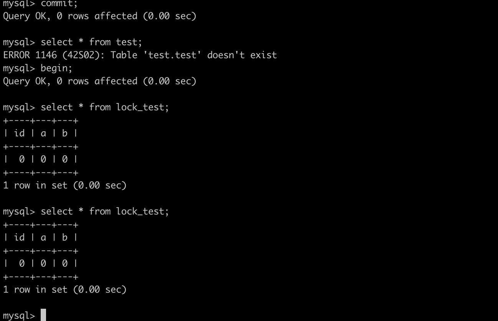
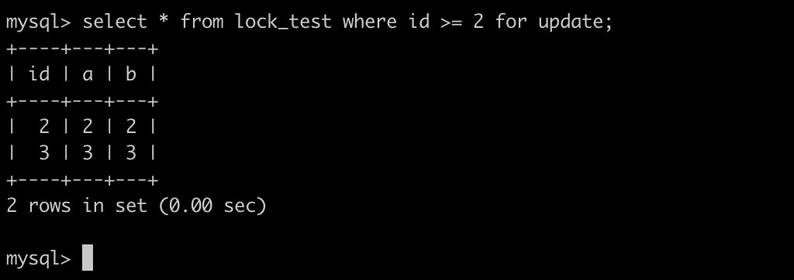

# 幻读问题

幻读问题可以用串行化隔离级别来解决，但是在 RR 隔离级别下，网上说可以通过 MVCC+Next-Key lock 来解决，是真的吗？我们来看看。

## 快照读和当前读

### 快照读

即前面提到的 ReadView，快照读就是**普通的 select 查询**，比如 `select * from test;` 其实就是基于 MVCC 来查询快照的版本。对于幻读，做两个测试：

测试例子 1：

有一个 test 表开始只有 1 条数据，两个事务同时开启，事务 1 执行 `select * from test;` 查询出 1 条数据。事务 2 执行 `insert into test values(...)`，事务 1 再进行查询，还是 1 条数据。事务 2 接着 commit ，事务 1 进行查询，依旧是 1 条数据。事务 1 commit 之后再查询，就是 2 条数据了。

上面的例子因为是在默认的 RR 级别下生效的，因为 RR 级别下只会在第一次读取数据的时候创建一次 ReadView，之后就重复利用这个，这样看上去就解决了不可重复读和幻读的问题。

（如果是在 RC 隔离级别下，因为每次查询都重新生成一个Read View，也就是查询的都是最新的快照数据，所以会可能每次查询到不一样的数据，从而造成不可重复读。）

那么 RR 级别下的快照读真的解决了幻读的问题了吗？再来测试一下：

测试例子 2：

还是只有 1 条数据的 test 表，事务 1 先查询，事务 2 insert 1 条数据，此时事务 1 再查询还是 1 条数据：

事务 1：

事务 2 ：

.png>)

此时看起来没有发生幻读的问题，接着事务 2 **先提交**，事务 1 更新 id = 1 的数据，再查询：

.png>)

这个时候就发生幻读的问题了。

由这个例子说明，**一旦事务 A 的修改操作覆盖到了其他事务插入的“幻行”，那么在下次 select 的时候，也会把这行数据一起查出来**。(注意这个例子，事务 2 需要**先提交**，然后事务 1 才能更新 id 为 1 的数据，不然事务 1 的更新会卡住，因为 id = 1 的数据被事务 2 锁了。)

在 MySQL 官方文档里有这么一句：

数据库状态的快照适用于事务中的 select 语句，而不一定是用于所有的 DML 语句。如果插入或修改某些行，然后提交改事务， 则从另一个并发 REPEATABLE READ 事务发出的 delete 或 update 语句可能会影响那些刚刚提交的行，即使该事务无法查询他们。如果事务更新或删除由不同事务提交的行，**则这些更改对当前事务变得可见**。

但是注意，在测试例子 2 里，事务 1 执行了一个 update ，也就是此时触发了**当前读**，既然触发了当前读，那么读的数据当然是最新的数据，所以事务 1 的数据更新成了最新数据，出现了其他行。

所以 MVCC 并没有完美解决幻读的问题，在 RR 级别下如果**只有快照读**不会有幻读现象，但是如果一个事务**既有快照读也有当前读**，那么 MVCC就解决不了幻读问题。

### 当前读

读取的是记录数据的**最新版本**，并且当前读返回的记录都会加上锁，保证其他事务不会再并发的修改这条记录。

以下操作都是当前读：

`select ... lock in share mode`、`select ... for update` 、`insert`、`update`、`delete`。

当前读就是通过 next-key lock 来解决幻读的问题。

测试例子：

事务 1 执行加锁的一条查询语句：

此时事务 2 执行插入语句会一直阻塞：

.png>)

直到事务 1 提交之后事务 2 才能正常插入。这样也就避免了幻读的问题。next-key lock 加速范围可以查看后文。

## 总结

在 RR 隔离级别下，如果一个事务从头到尾就只有快照读，那么 MVCC 解决了幻读的问题。如果一个事务从头到尾只有当前读，那么MVCC 通过 next-key lock 也解决了幻读问题。但是如果一个事务既有快照读也有当前读，那么MVCC就解决不了幻读问题。

本文参考

[拿捏！隔离级别、幻读、Gap Lock、Next-Key Lock](https://segmentfault.com/a/1190000040558973)

[面试被反问，RR级别下能解决幻读问题那为什么不叫幻读级别？](https://www.codenong.com/cs107121470/)

[关于幻读，可重复读的真实用例是什么？](https://www.zhihu.com/question/47007926)
