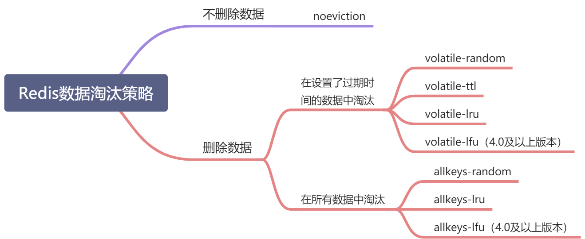

# 数据淘汰策略/过期策略

## 数据淘汰策略

### 配置 redis 内存大小

1.  配置文件 redis.conf 配置：

    ```yaml
    //设置Redis最大占用内存大小为100M
    maxmemory 100mb
    ```
2.  命令配置：

    ```shell
    //设置Redis最大占用内存大小为100M
    127.0.0.1:6379> config set maxmemory 100mb
    //获取设置的Redis能使用的最大内存大小
    127.0.0.1:6379> config get maxmemory
    ```

> 如果不设置最大内存大小或者设置最大内存大小为0，在64位操作系统下不限制内存大小，在32位操作系统下最多使用3GB内存

### 淘汰策略

当 redis 配置的内存用完了之后，会启用以下策略之一：

.png>)

> 当使用**volatile-lru**、**volatile-random**、**volatile-ttl**这三种策略时，如果没有key可以被淘汰，则和**noeviction**一样返回错误



### 如何获取及设置内存淘汰策略

获取当前内存淘汰策略：

```shell
127.0.0.1:6379> config get maxmemory-policy
```

通过配置文件设置淘汰策略（修改redis.conf文件）：

```
maxmemory-policy allkeys-lru
```

通过命令修改淘汰策略：

```shell
127.0.0.1:6379> config set maxmemory-policy allkeys-lru
```

### LRU 算法

**LRU(Least Recently Used)**，即最近最少使用，是一种缓存置换算法。在使用内存作为缓存的时候，缓存的大小一般是固定的。当缓存被占满，这个时候继续往缓存里面添加数据，就需要淘汰一部分老的数据，释放内存空间用来存储新的数据。这个时候就可以使用LRU算法了。其核心思想是：如果一个数据在最近一段时间没有被用到，那么将来被使用到的可能性也很小，所以就可以被淘汰掉。

#### 近似LRU算法

Redis使用的是近似LRU算法，它跟常规的LRU算法还不太一样。近似LRU算法通过随机采样法淘汰数据，每次随机出5（默认）个key，从里面淘汰掉最近最少使用的key。

> 可以通过maxmemory-samples参数修改采样数量： 例：maxmemory-samples 10 maxmenory-samples配置的越大，淘汰的结果越接近于严格的LRU算法

Redis为了实现近似LRU算法，给每个key增加了一个额外增加了一个24bit的字段，用来存储该key最后一次被访问的时间。

#### Redis3.0对近似LRU的优化

Redis3.0对近似LRU算法进行了一些优化。新算法会维护一个候选池（大小为16），池中的数据根据访问时间进行排序，第一次随机选取的key都会放入池中，随后每次随机选取的key只有在访问时间小于池中最小的时间才会放入池中，直到候选池被放满。当放满后，如果有新的key需要放入，则将池中最后访问时间最大（最近被访问）的移除。

当需要淘汰的时候，则直接从池中选取最近访问时间最小（最久没被访问）的key淘汰掉就行。

#### **Redis为什么不使用原生LRU算法？**

* 原生LRU算法需要 双向链表 来管理数据，需要**额外内存**；
* 数据访问时涉及**数据移动，有性能损耗**；
* Redis现有**数据结构需要改造**；

### LFU算法

LFU算法是Redis4.0里面新加的一种淘汰策略。它的全称是**Least Frequently Used**，它的核心思想是根据key的最近被访问的频率进行淘汰，很少被访问的优先被淘汰，被访问的多的则被留下来。

LFU算法能更好的表示一个key被访问的热度。假如你使用的是LRU算法，一个key很久没有被访问到，只刚刚是偶尔被访问了一次，那么它就被认为是热点数据，不会被淘汰，而有些key将来是很有可能被访问到的则被淘汰了。如果使用LFU算法则不会出现这种情况，因为使用一次并不会使一个key成为热点数据。

LFU一共有两种策略：

* volatile-lfu：在设置了过期时间的key中使用LFU算法淘汰key
* allkeys-lfu：在所有的key中使用LFU算法淘汰数据

更详细原理参考 [玩转Redis-8种数据淘汰策略及近似LRU、LFU原理](https://blog.csdn.net/u010887744/article/details/110357096?spm=1001.2014.3001.5501)

## 过期策略

Redis的过期策略就是指当Redis中缓存的key过期了，Redis如何处理。

过期策略通常有以下三种：

* **定时过期**：每个设置过期时间的key都需要创建一个定时器，到过期时间就会立即清除。该策略可以立即清除过期的数据，对内存很友好；但是会占用大量的CPU资源去处理过期的数据，从而影响缓存的响应时间和吞吐量。
* **惰性过期**：只有当访问一个key时，才会判断该key是否已过期，过期则清除。该策略可以最大化地节省CPU资源，却对内存非常不友好。极端情况可能出现大量的过期key没有再次被访问，从而不会被清除，占用大量内存。
* **定期过期**：每隔一定的时间，会扫描一定数量的数据库的expires字典中一定数量的key，并清除其中已过期的key。该策略是前两者的一个折中方案。通过调整定时扫描的时间间隔和每次扫描的限定耗时，可以在不同情况下使得CPU和内存资源达到最优的平衡效果。 (expires字典会保存所有设置了过期时间的key的过期时间数据，其中，key是指向键空间中的某个键的指针，value是该键的毫秒精度的UNIX时间戳表示的过期时间。键空间是指该Redis集群中保存的所有键。)

Redis中同时使用了惰性过期和定期过期两种过期策略。

**过期策略与内存淘汰策略的区别：**

Redis的内存淘汰策略的选取并不会影响过期的key的处理。内存淘汰策略用于处理内存不足时的需要申请额外空间的数据；过期策略用于处理过期的缓存数据。

**RDB和AOF对过期键的策略：**

* ​ 执行SAVE或者BGSAVE命令创建出的RDB文件，程序会对数据库中的过期键检查，已过期的键不会保存在RDB文件中。
* ​ 载入RDB文件时，程序同样会对RDB文件中的键进行检查，过期的键会被忽略。
* ​ 如果数据库的键已过期，但还没被惰性/定期删除，AOF文件不会因为这个过期键产生任何影响。当过期的键被删除了以后，会追加一条DEL命令来显示记录该键被删除了
* ​ 重写AOF文件时，程序会对RDB文件中的键进行检查，过期的键会被忽略。
