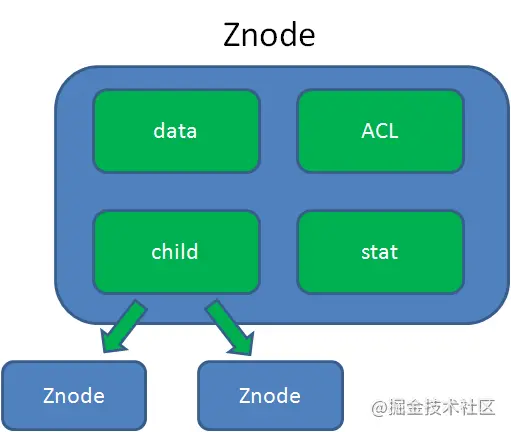
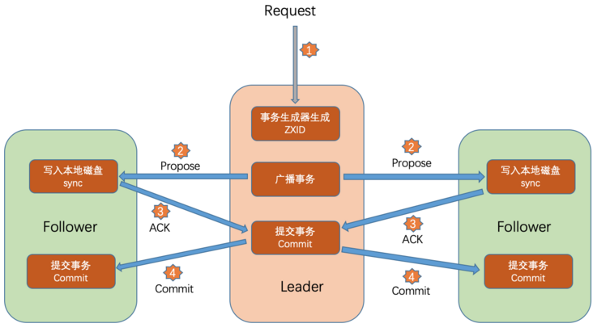

# Zookeeper 基础

以下内容整理自 [漫画：什么是ZooKeeper？](https://juejin.cn/post/6844903608685707271)

## 数据模型

.png>)

Znode的引用方式是**路径引用**，类似于文件路径：

/ 动物 / 仓鼠

### Znode

#### 数据结构

**data：**

Znode存储的数据信息。可以通过 get 来获取 znode 的 data。

**ACL：**

记录Znode的访问权限，即哪些人或哪些IP可以访问本节点。

**stat：**

包含Znode的各种元数据，比如事务ID、版本号、时间戳、大小等等。

**child：**

当前节点的子节点引用，类似于二叉树的左孩子右孩子。

Znode并不是用来存储大规模业务数据，而是用于存储少量的状态和配置信息，**每个节点的数据最大不能超过1MB**。

## Zookeeper 操作

**create** 创建节点

**delete** 删除节点

**exists** 判断节点是否存在

**getData** 获得一个节点的数据

**setData** 设置一个节点的数据

**getChildren** 获取节点下的所有子节点

exists，getData，getChildren属于读操作。Zookeeper客户端在请求读操作的时候，可以选择是否设置**Watch**。

如果设置了 Watch，当该 znode 节点发生改变，也就是调用了create，delete，setData方法的时候，请求 Watch 的客户端会接收到**异步通知**。

过程：

1.客户端调用 getData 方法，watch 参数是 true。服务端接到请求，返回节点数据，并且在对应的哈希表里插入被 Watch 的 Znode 路径，以及 Watcher 列表。

2.当被 Watch 的 Znode 已删除，服务端会查找哈希表，找到该 Znode 对应的所有 Watcher，异步通知客户端，并且删除哈希表中对应的 Key-Value。

#### ACL

Zookeeper采用ACL（AccessControlLists）策略来进行权限控制，类似于 UNIX 文件系统的权限控制。每个 znode 被创建时都会带有一个 ACL 列表，用于决定谁可以对它执行何种操作。Zookeeper 定义了如下5种权限。

CREATE: 表示有权限创建一个子节点。

READ: 表示可以 getData 或者 getChildren。

WRITE: 表示可以 setData。

DELETE: 表示可以 delete 子节点。

ADMIN: 表示可以通过 setACL 设置 znode 权限。

## Zookeeper 一致性

### 集群

.png>)

在更新数据时，首先更新到主节点（这里的节点是指服务器，不是Znode），再同步到从节点。

在读取数据时，直接读取任意从节点。

### Zookeeper 节点

#### 类型

1. 持久节点（PERSISTENT）
2. 持久的连续节点（PERSISTENT\_SEQUENTIAL）
3. 临时节点（EPHEMERAL）
4. 临时的连续节点（EPHEMERAL\_SEQUENTIAL）

其中 3、4 在客户端会话结束后节点就会被删除。一旦节点被标记上 **SEQUENTIAL** 这个属性，那么在这个节点被创建的时候，Zookeeper 会自动在其节点名后面追加上一个整型数字，这个整型数字是一个由父节点维护的自增数字。

#### 角色

有三种角色：Leader、Follower、Observer。

Leader 既可以为客户端提供写服务又能提供读服务。除了 Leader 外，Follower 和 Observer 都只能提供读服务。Follower 和 Observer 唯一的区别在于 Observer 机器不参与 Leader 的选举过程，也不参与写操作的“过半写成功”（即参与事务请求 Proposal 的投票）策略，因此 Observer 机器可以在不影响写性能的情况下提升集群的读性能。

.png>)

另外，Zookeeper 允许用户在指定节点上注册一些 **Watcher（事件监听器）**，一般是client，watch监控了服务端的某些节点的数据/目录变化，发生变化的时候会通知watcher。当client过多，会出现广播风暴，过多的广播消息会阻塞网络。

#### 状态

**Looking** ：节点正处于选举状态，不对外提供服务，直至选主结束。

**Following** ：Follower 节点（从节点）所处状态，接受主节点的更新并写入本地日志。

**Leading** ：Leader节点（主节点）所处状态，接受客户端更新，写入本地日志并复制到从节点。

### Zab 协议

**ZAB（Zookeeper Atomic Broadcast）协议是为分布式协调服务ZooKeeper专门设计的一种支持崩溃恢复**的**原子广播协议**。ZAB 协议需要保证如果一个状态的变更被处理了，那么所有其依赖的状态变更都已经被提前处理了。也就是需要顺序执行。

ZAB 协议包括两种基本模式：**崩溃恢复**和**消息广播（或原子广播）**。

在进入**崩溃恢复**模式时 Zookeeper 集群会进行 Leader 选举，一般有以下情况会发生选举：

* 刚启动时。服务器启动时期会进行 Leader 选举。
* Leader 异常。当服务器运行期 Leader 服务器的出现网络中断、崩溃退出、重启等异常情况。
* 多数 Follower 异常。当集群中半数的服务器与该 Leader 服务器无法通信时，进入崩溃恢复模式，开始 Leader 选举。

选举出 Leader 服务器后，会进入**消息广播**模式，开始接收处理客户端的请求。

#### Proposal

Leader 服务器将客户端事务请求转化成一个事务 Proposal（提议），并将该 Proposal 分发给集群中所有的 Follower 服务器。其实就是一个事务。

#### ZXID

Leader 服务器在接收到事务请求后，会为每个事务请求生成对应的 Proposal 来进行广播，并且为这个事务 Proposal 分配一个全局单调递增的唯一 ID ，我们称之为事务 ID（即 ZXID）。（即一个 proposal 对应一个 zxid。）

ZXID 可以分为两个部分：

* 高 32 位是： epoch（纪元），代表着任期，每当选举产生一个新的 Leader 服务器时就会取出其本地日志中最大的 ZXID ，解析出 epoch（纪元）值操作加 1 作为新的 epoch ，并将低 32 位 counter 置零。
* 低 32 位是： counter（计数器），它是一个简单的单调递增的计数器，针对客户端的每个事务请求都会进行加 1 操作；

其实 epoch 就和 raft 协议中的 term 概念是一样的，每次新的 Leader 都会将“任期” + 1。这样老的 Leader 就算宕机后恢复回来也不会和新的 Leader 抢位置。

最大 ZXID 也就是节点本地的最新事务编号。

#### **myid**

每个ZooKeeper服务器，都需要在数据文件夹下创建一个名为 myid 的文件，该文件包含整个 ZooKeeper 集群唯一的ID（整数）。例如，某 ZooKeeper 集群包含三台服务器，hostname 分别为 zoo1、zoo2 和 zoo3，其 myid 分别为 1、2 和 3，则在配置文件中其 ID 与hostname 必须一一对应，如下所示。在该配置文件中，server. 后面的数据即为 myid

server.1= zoo1:2888:3888

server.2 = zoo2:2888:3888

server.3 = zoo3:2888:3888

#### 消息广播

注意：

* ZAB 协议简化了二阶段提交模型，在超过半数的 Follower 服务器已经反馈 ACK 之后就开始提交事务 Prososal 了，无需等待所有服务器响应。超过半数的服务器是原始配置中配置机器数目的 1/2，不是存活机器数目的 1/2。
* Leader 服务器会为每个 Follower 服务器都各自分配一个单独的队列，然后将需要广播的事务 Proposal 依次放入这些队列中去，并根据 FIFO 策略进行消息的发送。

#### 崩溃恢复

**一旦 Leader 服务器出现崩溃或者由于网络原因导致 Leader 服务器失去了与过半 Follower 的联系，那么就会进入崩溃恢复模式。**

一旦崩溃发生，Zab 协议需要满足：

* 已经**提交**的事务要保留，最终会被所有服务器都提交。
* 只在 Leader 服务器上**提出但没有提交**的事务，要丢弃

为了满足以上的条件，选举时只需要将集群中 **ZXID 最大**的节点选举为 Leader 就行了。因为 ZXID 由 Leader 节点生成，有新写入事件时，Leader 生成新 ZXID 并随提案一起广播，每个结点本地都保存了当前最近一次事务的 ZXID，ZXID 是递增的，所以谁的 ZXID 越大，就表示谁的数据是最新的。

选举过程（更详细的过程请看下一篇）：

1. 此时集群中的节点都处于 Looking 状态。它们会各自向其他节点发起投票，投票当中包含自己的服务器 ID (myid) 和最新事务 ID（ZXID）。
2. 接下来，节点会用自身的 ZXID 和从其他节点接收到的 ZXID 做比较，如果发现别人家的 ZXID 比自己大，也就是数据比自己新，那么就重新发起投票，投票给目前已知最大的 ZXID 所属节点。
3. 每次投票后，服务器都会统计投票数量，判断是否有某个节点得到半数以上的投票。如果存在这样的节点，该节点将会成为准Leader，状态变为 Leading。其他节点的状态变为 Following。

选举完成后会开始同步日志，只有当半数 Follower 同步成功，这个准 Leader 才能成为正式的 Leader。
